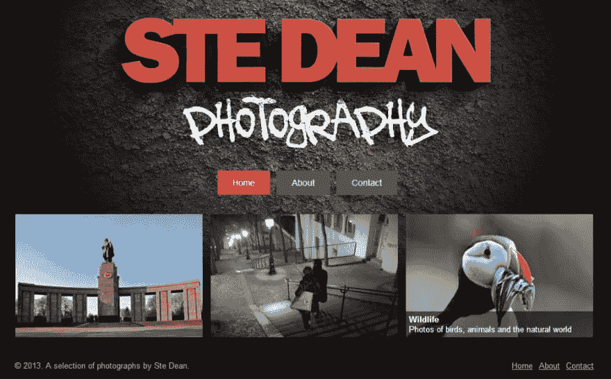

# 第一次真正使用 uShowcase

> 原文:[https://dev . to/adamkdean/first-time-actual-use-ushowcase-g28](https://dev.to/adamkdean/first-time-actually-using-ushowcase-g28)

所以今天是我第一次真正使用我自己的项目，uShowcase，来制作一个图片库。在接下来的几个月里，我有几个图片库网站要做，这给了我一个很好的借口去深入了解 Umbraco。我学到了一些东西，其中最主要的是:永远使用你自己的项目。

当我做这个网站的时候，我需要一个易于使用的认证系统，因为微软的系统很烂，而且很笨重。我想出了简单易用的 ASP.NET/MVC 认证库 [EasyAuth](http://www.adamkdean.co.uk/blog/tagged/34/easyauth) 。当我设计它时，它看起来很棒，想法很好，*所有的测试都通过了*。但当我开始使用它时，我发现了它缺乏的功能，我希望它能做的事情，它需要的东西。直到你使用你的产品时，你才看到这些，通常那时已经太晚了。

我的第一个 Umbraco 项目是一个简单的照片库初学者工具包，通过使用这个工具，我首先意识到默认模板很差劲。它不是一个真正的摄影风格的网站。它要求你修改它，使它成为一个摄影外观的网站，这是不是真的公平，当它应该是一个初学者包。

我还了解到翁布拉克摇滚。我使用过的内容管理系统多到我都不记得了。我做的网站多得都数不清了。但是使用 Umbraco 是我经历过的最好的体验之一。虽然我很喜欢你用 PHP/LAMP 或 C#/ASP 从头开始制作网站时得到的控制。与使用 Umbraco 相比，这需要很长时间。我想我再也不用编写后端管理门户了！(是啊，没错...)

所以谢谢温布拉克，你让我快乐，不那么匆忙。感谢过去的我，为我节省了时间，创造了我们的展示柜。我会在接下来的几周内更新它，给 Umbraco 软件包系统推出一个更好的版本。

[T2】](https://res.cloudinary.com/practicaldev/image/fetch/s--UCyC5Mbn--/c_limit%2Cf_auto%2Cfl_progressive%2Cq_auto%2Cw_880/http://i.imgur.com/I0qmh6u.jpg)

(我真希望你能用打印屏幕捕捉你的光标，顺便说一下，它在野生动物缩略图的上方！)