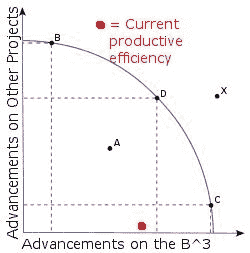
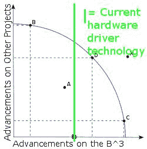
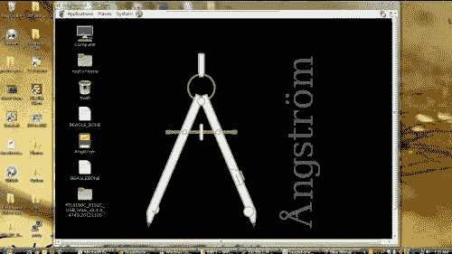
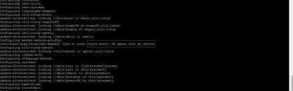
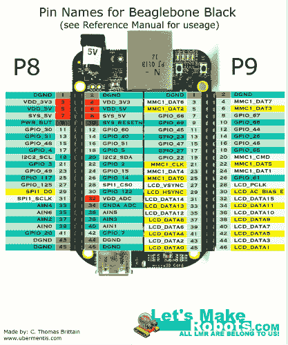
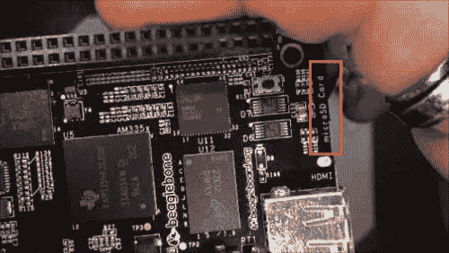
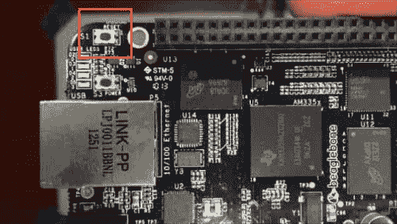
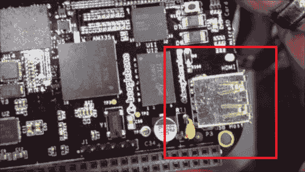
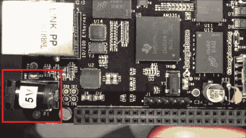

# 比格犬骨黑

> 原文:# t0]https://dev . to/ladvien/beagle bone-black-4njl

[https://www.youtube.com/embed/99WxBqoRHk0](https://www.youtube.com/embed/99WxBqoRHk0)

[https://www.youtube.com/embed/pdXAGdvuocI](https://www.youtube.com/embed/pdXAGdvuocI)

[https://www.youtube.com/embed/99WxBqoRHk0](https://www.youtube.com/embed/99WxBqoRHk0)

8/25/13:

这个家伙在 Arch Linux 上的 rtl8192 和 Chronodot (DS3231) RTC 上做了一些非常漂亮的演示。虽然我没有尝试他的指示(在这个板上烧坏了)，但我相信他的指示将在 B^3.上使用 Arch Linux 与 rtl8192 建立可靠的 WiFi 连接

*   [采用 Arch Linux 的 RTL 8192](http://blog.lemoneerlabs.com/post/The-fruits-of-my-labor)
*   时间点(易贝: [DS3231](http://www.ebay.com/itm/Mini-RTCpro-DS3231-High-Precision-Clock-Module-Temperature-Measure-Arduino-/390645038556?pt=LH_DefaultDomain_0&hash=item5af4423ddc) )

此外，当我得到的能量，在这一页底部的引脚有一两个错误。正如扎伊斯指出的那样。

编辑:好的。在我进一步研究之前，不要使用引脚排列。在模式 7 中，我得到了关于针脚的冲突信息。参考手册陈述了一件事，但其他来源也同意我的观点。我猜 Zaius 是对的。版本问题。当我得到它排序，我会更新。

7/3/13:

还不多，还在做稳定的 wifi。我想不妨分享一下我的工作日志；尽管这很尴尬。

如果人群中有一些 Linux 智者(尤其是了解 Arch Linux 的人)，你介意看看我的工作流程吗？我已经让 wifi 模块工作了，尽管它不像我希望的那样稳定。

[http://cthomasbrittain . WordPress . com/2013/07/03/installing-8192 Cu-module-on-the-B3-running-arch-Linux/](http://cthomasbrittain.wordpress.com/2013/07/03/installing-8192cu-module-on-the-b3-running-arch-linux/)

6/22/13

哇哦。对不起，自从我更新这个帖子已经一个多月了。

我没有放弃 BBB 作为机器人平台；我意识到我对 Linux 还不够了解，无法在嵌入式设备上对其进行调整(至少是缺乏社区支持的设备)。我花了一个月的时间阅读 Linux，试图理解它(并修复我们所有的坏车)。

我在微软长大，上个月所有家用电脑都切换到了双启动 Ubuntu 12.04 和 Microsoft x。router 也将很快切换到 OpenWRT。

回到 BBB 让我抓狂的 Realtek WiFi 加密狗已经被[这些家伙](https://groups.google.com/d/msg/beagleboard/lKjxmSaxR1I/UfE-iQWuPmMJ)解决了。我还没有时间尝试他们的演练，但它是在议程上。

*   演练设置 [rtl8192cu](http://www.codealpha.net/864/how-to-set-up-a-rtl8192cu-on-the-beaglebone-black-bbb/) 驱动

我还没有找到一个 Arch Linux 映像文件，所以我想我应该做一个并发布给任何需要它的人。

 【拱 Linux 为小猎犬骨黑- 6-20-13】

如果有人真的下载了这张图片，你会确认它对你有用吗？

有点跑题，我不确定还有没有人用 iDevices 但我确实遇到了这个我非常喜欢的应用程序。

[ServerAuditor](https://itunes.apple.com/us/app/server-auditor-ssh-client/id549039908?mt=8)

它可以让你从 iPhone 或 iPad X 通过隧道(SSH)进入你的 Linux 设备。我喜欢这个有两个原因:我可以在和家人一起看电影的时候关注一个程序是如何在 Raspberry Pi 上编译的，我喜欢在封闭系统上运行 Linux 的感觉。我明白这是假的，但这仍然令人欣慰。

我希望一切都好。

5/20/13

嗯，我想我可以用经济学的术语来描述这一点。这是我意识到我的生产效率受到限制的地方，这是由于当前技术的无能。

**图 1**

[T2】](https://res.cloudinary.com/practicaldev/image/fetch/s--O02jHZJx--/c_limit%2Cf_auto%2Cfl_progressive%2Cq_auto%2Cw_880/https://ladvien.cimg/Production_Possibilities_Frontier_Curve_svg.jpg)

本质上，这个图表表明我无法达到我想要的生产效率(让 B^3 完成我想要的技巧)。真的，我在 C 点会很开心(尽管 D 点可能对我和我的家人更好)。问题是技术限制限制了我到达曲线上的 C 点。这让我心烦意乱。起初，我认为这完全是由于我的无能(部分是真的)，但还有另一个障碍，一个看似隐藏的障碍。

当前的 Beaglebone 驱动程序技术是这一生产力点的隐藏障碍。

我读过 TinHead 给出的关于像对待电脑一样对待嵌入式设备的警告。但是，如果它们没有一些非常规的功能，那么它们与真正快速的微控制器有什么区别呢？不。我正在努力获得一些基本的个人电脑功能。

举个例子，

1.  WiFi 功能。
2.  易于访问图形界面(注意，我不是在说 GUI)。
3.  能够利用高级编程语言(Python、C++等)。

真的，就是这样。几个允许快速原型开发的特性，同时又能享受开放软件的强大功能。

对我来说，如果这三个特征都实现了，那么我觉得这个设备就完整了。不过，我应该声明，我已经意识到这三个特性并不简单。

那么，比格骨黑在哪里？不在那里。

一些不支持的东西将需要我到达 C 点(图 1)。

1.  **能够插入廉价、低功耗的 WiFi 加密狗，并在一小时内投入使用**。实话实说吧。90%的人会选择便宜。它允许我们用预算做更多的事情。因此，如果嵌入式设备无论如何都可以利用廉价的外设，那么让我们专注于实现它。 [1](https://groups.google.com/d/msg/beagleboard/AvVtq2uOxlc/XBrq5ZS4ygwJ)
2.  **软件方面更好的电源管理**。当峰值超过 500 毫安时，一些发行版会在启动时关闭主板。设计师的建议？在板子竖起来之前，不要插任何东西。听起来不错，对吧？嗯，别忘了 USB、microSD 或 HDMI 上没有热插拔功能。驱动程序还没写。我很肯定这是由于驱动程序，因为我已经通读了 BBB 数据表，电源硬件似乎健全。
3.  **能够调整 HDMI 输出**。在某一点上，我有一点，我试图启动 Arch Linux，但我无法通过 SSH 进入。所以，我把它插到我唯一的 HDMI 显示器上，并试图调整 ssh.config 文件。问题？由于过度扫描，我看不到注释掉了什么。我在董事会设计师们休息的谷歌小组中挖掘；你猜怎么着？目前没有调整视频输出的方法。 [2](https://groups.google.com/forum/#!starred/beagleboard/noddoRqaG5g)

因此，我的结论(尽管，我的精神错乱正在加剧)，是:

**图 2**

[T2】](https://res.cloudinary.com/practicaldev/image/fetch/s--fkMfJe-t--/c_limit%2Cf_auto%2Cfl_progressive%2Cq_auto%2Cw_880/https://ladvien.cimg/Hardware_Driver_limitations.jpg)

所有这些都是为了说，我的妻子已经拿走了我的黑色比格犬骨，直到绿线移动得更远。

是的，我是被小猫鞭打了，但是她说，“你这样做是为了放松，而不是做第二份工作。我宁愿你在其他项目上工作一段时间。”嘿，结婚是唯一让我保持理智的事。嗯，她和你们(还有女孩，如果 Max 没有赶走她们的话:P)。

5/16/13:

我终于在我拿到 Pi 的地方拿到了黑骨头。在这里，老骨头正在运行一个**更新的** [Angstrom](http://beagleboard.org/latest-) (4gb)构建，使用 [WiFi 加密狗](http://www.fasttech.com/products/0/10000380/1054503-edup-ep-n8508-nano-150mbps-80211n-wireless-n-usb-w)，并连接到一个 1A 壁式电源插座(连接到 microUSB 而不是 barrel-jack)。当我今天下班的时候，我会试着为 good 'ole Angstrom 完成一个“盒子到无线”的演练。

(问题，还有人觉得在嵌入式世界里有一个[梅森的](http://en.wikipedia.org/wiki/Free_mason)阴谋吗？)

[T2】](https://res.cloudinary.com/practicaldev/image/fetch/s--aAgpu5u1--/c_limit%2Cf_auto%2Cfl_progressive%2Cq_auto%2Cw_880/https://ladvien.cimg/Angstrom_VNC_Style.jpg)

我想我已经接近理解 TinHead 的帖子了:不要像对待 PC 一样对待嵌入式设备？我不知道。

5/15/13

我可以通过添加 realtek8192 内核来启动我的 WiFi 加密狗。不知道我做了什么，但它的工作。因此，一旦我可以得到一些可重复的步骤，我会张贴一个演练设置的 Beaglebone 黑色的腻子，VNC，和 WiFi 加密狗。

2013 年 14 月 5 日:b

让 RealVNC 去接 Angstrom。正在安装无线加密狗。

2013 年 14 月 5 日

我添加了一些 Bonescript GPIO 演练的链接(PWM、模拟、闪烁)。

2013 年 12 月 5 日 b

我已经创建了一个模式 7 引脚排列的视觉指南(添加如下)。

2013 年 12 月 5 日

我很沮丧。所以，在周二我的 8gb microSD 上市之前，我将暂时停止在主板上的工作。在那一点上，我将 **[用它来刷新我的 eMMC 引导分区](http://circuitco.com/support/index.php?title=Updating_The_Software)** 并开始工作两个不同的项目:让 Arch Linux 进展顺利，让步并更新& &升级我的 Angstrom。两者都有，我会尽量写上去的。

Jerz，或者任何有 BBB 的人，如果你有任何要补充的，如果你不介意给我发电子邮件，我会更新这个帖子。

希望每个人都有一个愉快的母亲节。

2013 年 11 月 5 日:c

我可以鼓励那些还没有点 B^3:的人等一下吗？

有几个激烈的问题正在硬件-软件层面上解决。在那之前，我觉得你会和我一样沮丧。Bdk6 的双关语说明了一切:**这个董事会是个婊子。**

**部分更新:**

*   Angstrom 附带的包管理器实际上已经坏了一段时间，没有人愿意向社区提及它。取而代之的是很多标题为“为什么 opkg 不行？”现在，我相信它会工作，如果你运行更新和升级，当然，要做到这一点，你必须有一个 SD 卡，因为它将大于 2gb。
*   我安装了 Arch Linux，很简单(它需要 eMMC 和 SD)。
*   我丢失了适用于我的 eMMC 的启动文件。(尝试 Arch Linux 时)。
*   似乎没有一种简单的方法可以让 eMMC 重回股票市场(我必须等待一张更大的牌)。
*   我见过的唯一酷的东西之一是单线电脑。
*   开发人员压力很大。我一点也看不到坚实的支持。并且已经看起来像是开发者和开放社区之间的“我们对他们”
*   我累了。谁来接手？

2013 年 11 月 5 日 b

因此，我尝试使用 Angstrom 的[包管理器](http://www.linuxtogo.org/gowiki/AngstromManual#InstallingSoftwareandPackageManagement)(再次)设置我的 WiFi 加密狗。我发现我尝试用他们的包管理器安装的所有东西都会返回一个错误。我读了，我相信问题是必须运行下面的代码来让 Angstrom stock package manager 获得想要的包。

opkg update * *opkg upgrade **

我查过了，你猜怎么着？eMMC 没有足够的空间来保存更新。狗娘养的。

[T2】](https://res.cloudinary.com/practicaldev/image/fetch/s--shRr8WCi--/c_limit%2Cf_auto%2Cfl_progressive%2Cq_auto%2Cw_880/https://ladvien.cimg/Upgrading_Angstrom_2.jpg)

可悲的是，我用的是旧手机的 microSD 卡，只有 2gb。我的 8gb 已订购。

在我看来，这让**比格犬骨黑和树莓皮**处于同一水平；就是它必须有 SD 卡才可以用(大于 2gb 的卡)。如果有人找到了在 B^3 上安装东西而不更新它的方法，让我知道，我会纠正这个批评。

2013 年 11 月 5 日

写了一份[指南把埃修复到 eMMC](http://letsmakerobots.com/node/37106) 。

5/10/13

当我试图在 Beagle 上安装 Arch Linux 时，我搞砸了 eMMC 分区。

2013 年 5 月 9 日:哦，亲爱的上帝。是真的。缺乏社区支持会扼杀比格骨。

我花了将近 9 个小时在 MicroSD 上安装操作系统。

明天晚上休息一下，我会写下来的。

Beaglebone Black 上的 Ubuntu:

[T2】](https://res.cloudinary.com/practicaldev/image/fetch/s--cDyw5IyZ--/c_limit%2Cf_auto%2Cfl_progressive%2Cq_auto%2Cw_880/https://ladvien.cimg/IMG_0048.jpg)

5/6/13

我得到了我的比格犬骨黑色(BBB，B^3)在今天。我想我会分享我的拆箱和一般的想法。

请不要把这当成琼斯先生在星期天的驾车旅行，相反，我想为这里的每一个机器人制造者提供触觉信息。简而言之，如果 BBB 变成小猎犬 sh，我不想让每个人都浪费 45 美元...，嗯，你懂了。

(嘿，Raspbery Pi 双关语可以填满一个图书馆，我不能做一个 BBB 双关语。嘘。)

**BBB 开发组:**

[https://groups.google.com/forum/?fromgroups=#！类别/猎兔犬板/猎兔犬骨-黑色](https://groups.google.com/forum/?fromgroups=#!categories/beagleboard/beaglebone-black)

这是查找特定问题信息的好地方。

**比格伯恩黑色教育材料**(又名，浴室读物):

B^3 手册:

[http://circuitco.com/support/index.php?title = beagleboneblek # Hardware _ Files](http://circuitco.com/support/index.php?title=BeagleBoneBlack#Hardware_Files)

原始 Beaglebone 教程

(这些是[杰兹](http://letsmakerobots.com/user/18705)T3【找到的**，谢谢先生)。**

[http://www.youtube.com/playlist?list=PLF4A1A7E09E5E260A](http://www.youtube.com/playlist?list=PLF4A1A7E09E5E260A)

硬件接口:

[http://www.nathandumont.com/node/250](http://www.nathandumont.com/node/250)

**机器人支持 B^3:**

这是由[维舒](http://letsmakerobots.com/user/17771)发现的，

"[BBB 的机器人操作软件](http://letsmakerobots.com/links/goto/37129/412/links_weblink)"

找 Vishu 或者 MaxHirez 解释一下；我还在努力让灯光闪烁:(

**RPi 与 BBB 讨论:**

[http://www.element14.com/community/thread/23575?tstart=0](http://www.element14.com/community/thread/23575?tstart=0)

http://www.raspberrypi.org/phpBB3/viewtopic.php?t=41489 T2 p = 336995

* *比格骨引脚排列:**

JerZ 试图向我解释 B^3 大头针有几种模式(他在上面运行 Hello World，我敢肯定他现在正在运行 Blink ),不管怎样，我想我会尝试在 B^3.上创建一个机器人建筑

**请记住，这些是引脚名称-** 您必须查阅参考手册的 69-73 页，以了解它们的使用方法。虽然，几乎每一个引脚都可以使用，不管它的预期功能。它们的功能由软件定义，每个引脚有 8 种模式(0-7)。

[http://circuitco.com/support/index.php?title = beagleboneblek # Hardware _ Files](http://circuitco.com/support/index.php?title=BeagleBoneBlack#Hardware_Files)

例如，如果你的机器人是一个四轴飞行器:你找到一个用于 Linux 和**的[实时内核，你可能会将引脚设置为模式 7，将非必要引脚转换为 GPIO(即牺牲 HDMI、eMMC 等)。GPIO 线路)。](https://rt.wiki.kernel.org/index.php/Main_Page)**

**[JerZ](http://letsmakerobots.com/user/18705) 也发现了这个地点:**

[http://blog . pignology . net/2013/05/getting-UART 2-devttyo 1-working-on . html](http://blog.pignology.net/2013/05/getting-uart2-devttyo1-working-on.html)

这似乎是访问多路复用引脚的一个很好的指南(还没有看完)。

我发现这个机器人小组通过 Bonescript 的方式把一些使用 GPIOs 的演练放在一起。

1.  **[闪烁一个 Led](http://www.phys-x.org/rbots/index.php?option=com_content&view=article&id=104:lesson-1-beaglebone-black-blink-led&catid=46:beaglebone-black&Itemid=81)**
2.  **[模拟](http://www.phys-x.org/rbots/index.php?option=com_content&view=article&catid=46%3Abeaglebone-black&id=105%3Alesson-2-beaglebone-black-read-analog-&Itemid=81)**
3.  **[PWM](http://www.phys-x.org/rbots/index.php?option=com_content&view=article&id=106:lesson-3-beaglebone-black-pwm&catid=46:beaglebone-black&Itemid=81)**

如果有其他人在关注这个，请仔细检查我，如果需要的话我会改正。

[T2】](https://res.cloudinary.com/practicaldev/image/fetch/s--jvrVk2x6--/c_limit%2Cf_auto%2Cfl_progressive%2Cq_auto%2Cw_880/https://ladvien.cimg/B_3PinOut3.png)

**比格犬骨黑和树莓皮:**

这些是我注意到的比格犬骨黑和树莓皮之间的一些差异。

| 估计的升级 Rpi 或 BBB | 估计的添加难度 |
| --- | --- |
| 实时时钟 | **1** |
| $ [2.30](http://www.fasttech.com/products/0/10000007/1012004-tiny-i2c-rtc-ds1307-at24c32-real-time-clock-shield) | 中等 |
| 处理器速度 | **1GHZ** |
| $ [4.76](http://www.ebay.com/itm/Brushless-DC-Cooling-Fan-5-Blade-5V-12V-0-1A-25mm-x25mmx10mm-2510s-2-PIN-/250942547846?pt=LH_DefaultDomain_0&hash=item3a6d576786) | 中等 |
| 电源开关 | **1** |
| $ [0.83](http://www.pi-supply.com/buy-it-now/) | 容易的 |
| 复位开关 | **1** |
| $0.83 | 容易的 |
| 启动开关 | **1** |
| $0.83 | 容易的 |
| GPIO | **65** |
| $ [8.85](http://adafruit.com/products/732) | 中等 |
| 闪存 | **2GB** |
| $ [5.66](http://www.fasttech.com/products/0/10004411/1336900-ld-microsd-memory-card-2gb) | 容易的 |
| micross _ 占地面积更小) | **1** |
| $ [4.35](http://www.fasttech.com/products/0/10001230/1131403-sd-to-microsd-card-adapter-for-the-raspberry-pi) | 容易的 |
| 串行端口 | **4** |
| $1.50 | 困难的 |
| 桶形插孔和 MicroUSB 电源 | 是 |
| $ [2.95](https://www.sparkfun.com/products/8734) | 容易的 |
| 最高屏幕分辨率 | **1280 x 1024** |
| **~** | **~** |
| 峰值功率要求 | 460 毫安 |
| ~ | ~ |
| 向 USB 提供电流 | **500 毫安** |
| $ [5.50](http://letsmakerobots.com/node/36923) | 困难的 |
| USB 主机(BBB 或 Rpi 使用的设备) | **1** |
| $ [1.87](http://www.ebay.com) | 容易的 |
| USB 客户端(让 BBB 或 Rpi 成为设备) | one |
| ~ | ~ |
| GPIO 的塑料接头 | Sixty-five |
| $ [1.95](http://www.adafruit.com/products/1112) | 容易的 |
| usb 电缆 | 1 个(迷你 USB) |
| $ [1.07](http://www.fasttech.com/products/0/10000090/1013401-usb-am-to-mini-usb-male-adapter-cable-75cm) | 容易的 |

**硬件:**

一句话的第一印象:硬件看起来不错。

几件事让它脱颖而出:

*   它用的是 Micro SD 卡，而不是 SD。这允许在不使用 [Adafruit 适配器](http://www.adafruit.com/products/966)的情况下实现更小的整体尺寸。

[T2】](https://res.cloudinary.com/practicaldev/image/fetch/s--WnLvt_zZ--/c_limit%2Cf_auto%2Cfl_progressive%2Cq_auto%2Cw_880/https://ladvien.cimg/MicroSD2.png)

*   它有三个战术开关:(1)电源，(2)，复位，和(3)一个神秘的开关。我希望第三个是软件可及的。内置电源开关是真正的赢家。这意味着你可以告诉[这个家伙](http://www.pi-supply.com/buy-it-now/)保留他的 15 和他的闭源设计。

[T2】](https://res.cloudinary.com/practicaldev/image/fetch/s--ZGx0qdrU--/c_limit%2Cf_auto%2Cfl_progressive%2Cq_auto%2Cw_880/https://ladvien.cimg/Reset_Switch_2.png)

*   它有一个 USB 集线器。这是我的第二大担忧(仅次于社区支持)，那就是必须依赖 USB 集线器来连接设备。是的，我知道 IC、试验板和对硬件 IO 的访问将允许定制 [USB](http://www.atmel.com//doc8445.pdf) 设备。但是有时候你不想即插即用吗？(是的，我知道我很懒。)

[T2】](https://res.cloudinary.com/practicaldev/image/fetch/s--Ch10yOu1--/c_limit%2Cf_auto%2Cfl_progressive%2Cq_auto%2Cw_880/https://ladvien.cimg/One_USB_2.png)

*   它有一个桶形插孔，而不是一个微型 USB 电源。我不知道你怎么想，但我宁愿有微型 USB，因为我有很多这样的东西，而桶插孔，我不确定。也许在腐烂的头骨下？

[T2】](https://res.cloudinary.com/practicaldev/image/fetch/s--KakZpCO1--/c_limit%2Cf_auto%2Cfl_progressive%2Cq_auto%2Cw_880/https://ladvien.cimg/5v_Barrel_Jack2.png)

*   是[开放硬件](http://circuitco.com/support/index.php?title=BeagleBoneBlack#Revision_A4)。RPi 声称是为了“教育目的”，尽管看起来教育仅限于软件。当然，这是基于尚未看到 Raspberry Pi 芯片原理图的假设。

*   是 TI。他们对我很好。(我可能有一叠来自他们的 IC 样片...也许吧。)

如果每个人都同意我发布这个帖子，我明天会试着做一个首次启动视频，然后继续，直到我把这个 BBB 建成一个机器人。

希望你们都好:)

*   **Bdk6**
*   RPI: 5
*   BBB: 14

*   Maxhirez

*   RPI:1

*   BBB: 2

*   拉德维恩:

*   RPI:

*   BBB:1