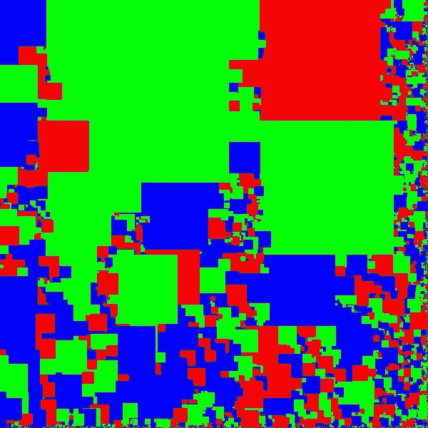
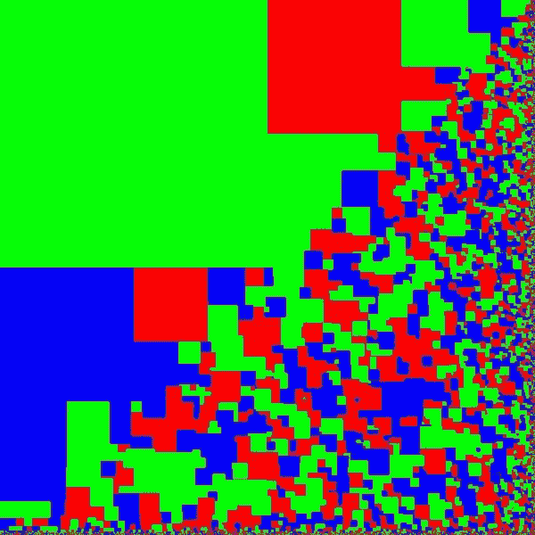
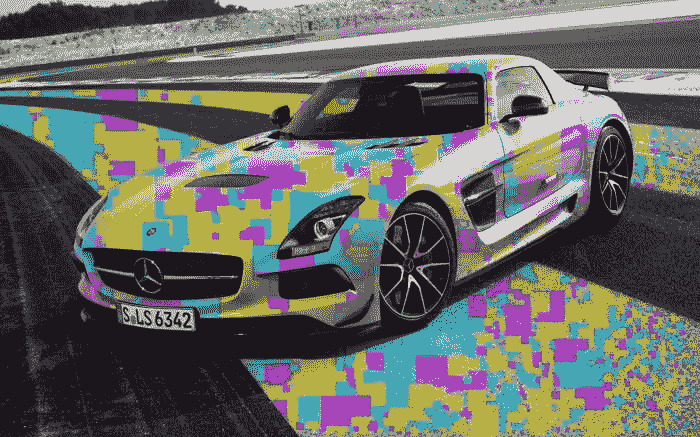

# 影像实验#8

> 原文:[https://dev.to/senior_sigan/imagemagick-8-1gd3](https://dev.to/senior_sigan/imagemagick-8-1gd3)

嗨！今天我们上了砖课。我希望 m$oft 不要因为我使用了矩形就来找我。那么，如果我们把矩阵分成许多任意形状的子矩阵会怎么样？如果我们做了手术呢？所以我在这里写了一个算法，大概很钝，因为 1900*1200 的图片它处理了十几秒钟，在这个子台上搅动通道。别担心，我会把这个想法写下来，会很好玩的。

# t0t 1 矩阵的生成

子矩阵有 2 种——蓝色绿色和红色。尺寸被选择为随机数。

[T2】](https://res.cloudinary.com/practicaldev/image/fetch/s--Nm9b5dAD--/c_limit%2Cf_auto%2Cfl_progressive%2Cq_auto%2Cw_880/https://dev-to-uploads.s3.amazonaws.com/i/daegq1c3dbdvhgupp8y3.jpeg)

*儿基会儿基会儿基会儿基会儿基会儿基会儿基会儿基会儿基会儿基会儿基会儿基会儿基会儿基会儿基会儿基会儿基会儿基会儿基会儿基会儿基会儿基会儿基会儿基会儿基会儿基会儿基会儿基会儿基会儿基会儿基会儿基会儿基会儿基会儿基会( 近东救济工程处我的

[T2】](https://res.cloudinary.com/practicaldev/image/fetch/s--pGYamnLH--/c_limit%2Cf_auto%2Cfl_progressive%2Cq_auto%2Cw_880/https://dev-to-uploads.s3.amazonaws.com/i/g3il2xvxdvl1hbqfntk9.jpeg)

现在，在子阵中随机搅拌。普通兰特产生的结果不是很胶粘。

[T2】](https://res.cloudinary.com/practicaldev/image/fetch/s--RVl5PHv5--/c_limit%2Cf_auto%2Cfl_progressive%2Cq_auto%2Cw_880/https://dev-to-uploads.s3.amazonaws.com/i/pdr32slb9rdg286vfi8u.jpeg)

第一个房间很大。FIX IT！！！！T0 是一样的。我们需要 true_random。在此选择具有一些三角洲的平均正方形尺寸。就这样给机器喷漆。这我懂艺术。

[T2】](https://res.cloudinary.com/practicaldev/image/fetch/s--fenrDdAV--/c_limit%2Cf_auto%2Cfl_progressive%2Cq_auto%2Cw_880/https://dev-to-uploads.s3.amazonaws.com/i/0o59xkji5ryopzodz2t1.jpeg)

现在重新校准。

[T2】](https://res.cloudinary.com/practicaldev/image/fetch/s--_iX0ss-F--/c_limit%2Cf_auto%2Cfl_progressive%2Cq_auto%2Cw_880/https://dev-to-uploads.s3.amazonaws.com/i/r06gl4lyb2iufc2ltwur.jpeg)

> 你现在被英特尔塞进去了，他们有这种风格的所有广告)

# t0t 1 混合图片

没时间解释了，长方形抓住了世界... ...

[T2】](https://res.cloudinary.com/practicaldev/image/fetch/s--aMDzrmYj--/c_limit%2Cf_auto%2Cfl_progressive%2Cq_auto%2Cw_880/https://dev-to-uploads.s3.amazonaws.com/i/swc95wnehq27ectw3t0c.jpeg)

由于胎记相加，误差没有增加 T_T。

# t 0t 1 源

[https://github.com/senior-sigan/magick/blob/master/brick.h](https://github.com/senior-sigan/magick/blob/master/brick.h)