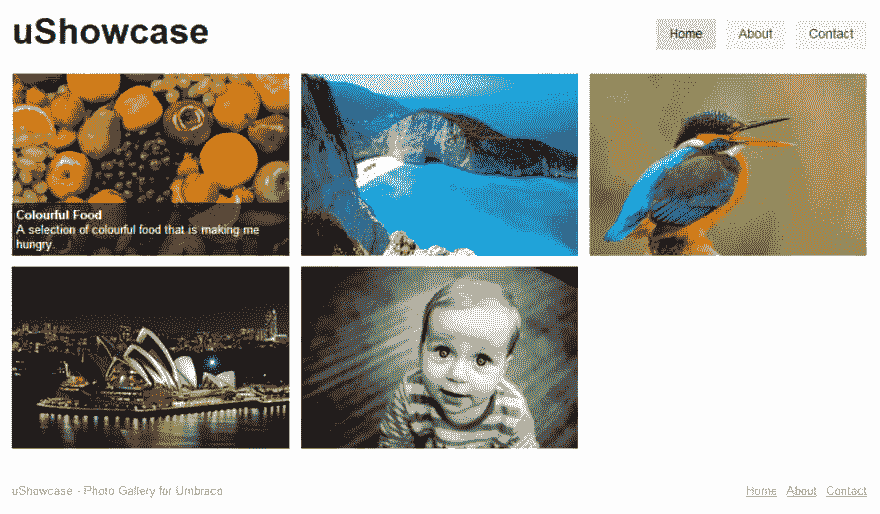

# uShowcase - Umbraco 照片库

> 原文:[https://dev . to/adamkdean/ushowcase-um braco-photo-gallery-4jp 1](https://dev.to/adamkdean/ushowcase-umbraco-photo-gallery-4jp1)

所以今天我发布了我的第一个 Umbraco 项目，一个简单且易于修改的图片库初学者工具包。

我计划做几个画廊网站；一张给我自己，几张给我认识的一些摄影师。我认为最好的办法是为自己创造一个初学者工具包，然后自然地把它放回大自然。

我将发布项目描述的摘录(如果我可以补充的话，使用 Umbraco 网站很难格式化)。

[T2】](https://res.cloudinary.com/practicaldev/image/fetch/s--oZt8fmDG--/c_limit%2Cf_auto%2Cfl_progressive%2Cq_auto%2Cw_880/http://i.imgur.com/uxkoEfc.png)

# uShowcase

uShowcase 是 Umbraco 的照片库。

它有一个非常简单的模板，很容易修改，但也可以立即使用。

## 特性:

*   多个画廊
*   富文本页面文档
*   超级容易修改模板

## 使用 uShowcase

使用 uShowcase:在 home 下，有一个 Galleries 页面。这不会显示在导航中。在图库中创建`Gallery`页面，在`Gallery`页面中创建`Photo`页面。模板使用 bootstrap，但是 uShowcase 照片网格系统不使用，所以你不需要*让*使用 Bootstrap。

## 要求

*需要 ImageGen 版本 2.5.7 才能运行:* 

1.0.1 版仅在 Umbraco v6.0.3 上进行过测试，请记住这一点。

**Umbraco 项目:**【http://our.umbraco.org/projects/starter-kits/ushowcase】

**GitHub 资源库:**[http://github.com/Imdsm/uShowcase](http://github.com/Imdsm/uShowcase)