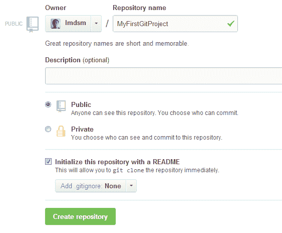
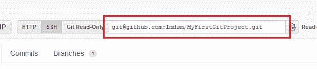

# Git for Windows 入门

> 原文:[https://dev . to/adamkdean/getting-started-with-git-for-windows-g41](https://dev.to/adamkdean/getting-started-with-git-for-windows-g41)

继我的[为 Windows 安装 Git](https://dev.to/adamkdean/installing-git-for-windows-2l4b)帖子之后，今天我们将学习如何开始使用我们的第一个存储库。这仅仅涵盖了基础知识，还有很多东西要学，但是你还不需要知道这些东西。

# 创建回购

我们需要做的第一件事是去 [GitHub](http://github.com/) 并登录。在那里，我们想要创建一个新的存储库，你可以通过点击右上角的小本子和加号图标来完成。

对于存储库名称，让我们使用`MyFirstGitProject`。暂时将描述留空，并确保回购是公开的。最后，勾选`Initialize this repository with a README`选项，点击`Create repository`。

[T2】](https://res.cloudinary.com/practicaldev/image/fetch/s--JwfK9RkS--/c_limit%2Cf_auto%2Cfl_progressive%2Cq_auto%2Cw_880/http://i.imgur.com/375YdrZ.png)

# 克隆回购

非常好。现在，我们已经建立了一个存储库，并准备就绪。我们需要做的下一件事是在我们的本地机器上`clone`它。为此，我们需要记下可以在 repo 页面上找到的 SSH 克隆 url。

[T2】](https://res.cloudinary.com/practicaldev/image/fetch/s--8c5M-n-C--/c_limit%2Cf_auto%2Cfl_progressive%2Cq_auto%2Cw_880/http://i.imgur.com/NpDLs6v.png)

如果你还没有安装 Git for Windows，请先阅读[安装 Git for Windows](https://dev.to/adamkdean/installing-git-for-windows-2l4b) 文章，然后再回到本教程。

如果您准备好继续，请打开 Git Bash。我喜欢把我的回复放在一个目录里，`C:\GitHub\`，所以现在让我们试试。注意:Git Bash 使用 Linux 风格的文件路径，所以我们在使用它时必须记住这一点。使用`cd`命令将目录更改为 C:

```
cd /c 
```

<svg width="20px" height="20px" viewBox="0 0 24 24" class="highlight-action crayons-icon highlight-action--fullscreen-on"><title>Enter fullscreen mode</title></svg> <svg width="20px" height="20px" viewBox="0 0 24 24" class="highlight-action crayons-icon highlight-action--fullscreen-off"><title>Exit fullscreen mode</title></svg>

现在让我们使用`mkdir`命令创建一个名为 GitHub 的目录:

```
mkdir GitHub 
```

<svg width="20px" height="20px" viewBox="0 0 24 24" class="highlight-action crayons-icon highlight-action--fullscreen-on"><title>Enter fullscreen mode</title></svg> <svg width="20px" height="20px" viewBox="0 0 24 24" class="highlight-action crayons-icon highlight-action--fullscreen-off"><title>Exit fullscreen mode</title></svg>

现在让我们移动到那个目录，再次使用`cd`命令:

```
cd GitHub 
```

<svg width="20px" height="20px" viewBox="0 0 24 24" class="highlight-action crayons-icon highlight-action--fullscreen-on"><title>Enter fullscreen mode</title></svg> <svg width="20px" height="20px" viewBox="0 0 24 24" class="highlight-action crayons-icon highlight-action--fullscreen-off"><title>Exit fullscreen mode</title></svg>

非常好。现在让我们克隆存储库。记住之前的 SSH 克隆 url，现在我们需要使用它。请务必使用您的用户名，而不是我的:

```
git clone git@github.com:YourUsername/MyFirstGitProject.git 
```

<svg width="20px" height="20px" viewBox="0 0 24 24" class="highlight-action crayons-icon highlight-action--fullscreen-on"><title>Enter fullscreen mode</title></svg> <svg width="20px" height="20px" viewBox="0 0 24 24" class="highlight-action crayons-icon highlight-action--fullscreen-off"><title>Exit fullscreen mode</title></svg>

当询问您是否要继续连接时，输入`yes`。输入您的密码并按回车键。现在 Git Bash 将为 repo 创建一个目录，并为您下载所有最新的文件。如果您在 Windows 资源管理器中打开该目录，您将看到所有内容都已创建，我们准备添加文件。

# 向回购添加文件

让我们创建一个新文件，命名为`MyFirstGitProject.cs`。我将使用`C#`,因为它是我选择的语言，但是您可以使用任何您想要的语言。GitHub 不歧视。进入`MyFirstGitProject.cs`放一些代码:

```
public class MyFirstGitProject
{
    public MyFirstGitProject()
    {
        // todo: some code here
    }
} 
```

<svg width="20px" height="20px" viewBox="0 0 24 24" class="highlight-action crayons-icon highlight-action--fullscreen-on"><title>Enter fullscreen mode</title></svg> <svg width="20px" height="20px" viewBox="0 0 24 24" class="highlight-action crayons-icon highlight-action--fullscreen-off"><title>Exit fullscreen mode</title></svg>

保存文件并转到 Git Bash 窗口。我们现在将这个文件添加到存储库中。尽管我们在目录中创建了文件，但它实际上还不是回购的一部分。我们必须告诉 Git 跟踪该文件，我们通过将该文件`add`发送给 repo 来实现这一点。

您可以单独添加文件，如下所示:

```
git add MyFirstGitProject.cs 
```

<svg width="20px" height="20px" viewBox="0 0 24 24" class="highlight-action crayons-icon highlight-action--fullscreen-on"><title>Enter fullscreen mode</title></svg> <svg width="20px" height="20px" viewBox="0 0 24 24" class="highlight-action crayons-icon highlight-action--fullscreen-off"><title>Exit fullscreen mode</title></svg>

但是，当你有更多的文件，或者你想检查改变的文件，它更容易只是添加和更新所有文件一次。为此，您只需键入:

```
git add -A 
```

<svg width="20px" height="20px" viewBox="0 0 24 24" class="highlight-action crayons-icon highlight-action--fullscreen-on"><title>Enter fullscreen mode</title></svg> <svg width="20px" height="20px" viewBox="0 0 24 24" class="highlight-action crayons-icon highlight-action--fullscreen-off"><title>Exit fullscreen mode</title></svg>

现在就做。不过要确保你是第一个。完成后，让我们检查一下文件是否被添加了。我们要检查一下`status`。

```
git status 
```

<svg width="20px" height="20px" viewBox="0 0 24 24" class="highlight-action crayons-icon highlight-action--fullscreen-on"><title>Enter fullscreen mode</title></svg> <svg width="20px" height="20px" viewBox="0 0 24 24" class="highlight-action crayons-icon highlight-action--fullscreen-off"><title>Exit fullscreen mode</title></svg>

您应该看到找到了一个新文件:MyFirstGitProject.cs！这很好，我们已经将文件添加到 git 中，但是我们还没有真正提交它。Git 的工作方式是，每次你想签入更改，你添加你已经更改的文件，然后你`commit`它们，通常带有一条消息。在实践中学习更容易，所以让我们提交您最近的更改。

```
git commit -m "Added example code" 
```

<svg width="20px" height="20px" viewBox="0 0 24 24" class="highlight-action crayons-icon highlight-action--fullscreen-on"><title>Enter fullscreen mode</title></svg> <svg width="20px" height="20px" viewBox="0 0 24 24" class="highlight-action crayons-icon highlight-action--fullscreen-off"><title>Exit fullscreen mode</title></svg>

在这里，我们告诉 git 提交对本地库**的所有更改，并添加一条带有`-m`标记的消息。确保你的信息使用引号。如果一切正常，它应该告诉你已经添加了一个有 7 个插入(行)的文件。**

# 将变更推送到网上回购

到目前为止，我们一直在本地工作，因为我们*克隆了*我们的在线知识库。但是现在我们想向全世界展示我们对 GitHub 的改变。这实际上很容易，但是首先你必须理解 Git 是如何工作的。

一个 Git 存储库可以有多个分支，每个分支可以有一组不同的代码。想象一下，有一个工作正常的`release`分支代码，和一个有点问题的`development`分支代码，因为你正在处理它。你将对你的开发分支进行变更，然后当一切顺利时，将变更提交给你的发布，或者通常所说的`master`分支。

我们不打算制作任何分支，所以我们正在制作默认的`master`分支。当我们推送我们的更改时，我们选择将更改推送至的位置(远程服务器)和分支(在我们的例子中是主服务器)。当我们克隆我们的 repo 时，Git 为我们设置了远程服务器，它被称为`origin`。

推送的语法如下所示:

```
git push [remote] [local] 
```

<svg width="20px" height="20px" viewBox="0 0 24 24" class="highlight-action crayons-icon highlight-action--fullscreen-on"><title>Enter fullscreen mode</title></svg> <svg width="20px" height="20px" viewBox="0 0 24 24" class="highlight-action crayons-icon highlight-action--fullscreen-off"><title>Exit fullscreen mode</title></svg>

所以让我们试一试，在 Git Bash 中，键入以下内容:

```
git push origin master 
```

<svg width="20px" height="20px" viewBox="0 0 24 24" class="highlight-action crayons-icon highlight-action--fullscreen-on"><title>Enter fullscreen mode</title></svg> <svg width="20px" height="20px" viewBox="0 0 24 24" class="highlight-action crayons-icon highlight-action--fullscreen-off"><title>Exit fullscreen mode</title></svg>

输入你的密码，按回车键，一旦完成，回到你的 GitHub 页面，看看是否有变化。他们应该是。您刚刚将您的第一个代码推送到 GitHub。很棒的东西。

# 从网上回购中拉式变更

但是，如果您在另一台计算机上工作，并且已经进行了更改，现在您的代码已经过时了，该怎么办呢？嗯，要更新你的回购协议，你需要`pull`的变化。这几乎与 push 命令相同:

```
git pull [remote] [local] 
```

<svg width="20px" height="20px" viewBox="0 0 24 24" class="highlight-action crayons-icon highlight-action--fullscreen-on"><title>Enter fullscreen mode</title></svg> <svg width="20px" height="20px" viewBox="0 0 24 24" class="highlight-action crayons-icon highlight-action--fullscreen-off"><title>Exit fullscreen mode</title></svg>

所以让我们试一试，在 Git Bash 中，键入以下内容:

```
git pull origin master 
```

<svg width="20px" height="20px" viewBox="0 0 24 24" class="highlight-action crayons-icon highlight-action--fullscreen-on"><title>Enter fullscreen mode</title></svg> <svg width="20px" height="20px" viewBox="0 0 24 24" class="highlight-action crayons-icon highlight-action--fullscreen-off"><title>Exit fullscreen mode</title></svg>

它应该告诉你你已经是最新的了，但是如果你不是，那将会把你所做的所有更改都拉进你的本地存储库中。

# 重述

```
# clone a repo
git clone git@github.com:YourUsername/MyFirstGitProject.git

# add all new/changed files
git add -A

# commit the changes
git commit -m "Message here"

# check the status of git
git status

# push the changes to GitHub
git push origin master

# pull changes from GitHub
git pull origin master 
```

<svg width="20px" height="20px" viewBox="0 0 24 24" class="highlight-action crayons-icon highlight-action--fullscreen-on"><title>Enter fullscreen mode</title></svg> <svg width="20px" height="20px" viewBox="0 0 24 24" class="highlight-action crayons-icon highlight-action--fullscreen-off"><title>Exit fullscreen mode</title></svg>

一个人的一般工作流程是制作回购、克隆、处理文件、添加文件、提交文件。准备好了就推他们去 GitHub。如果你只是一个人在一台电脑上做一个项目，你很少需要改变。

注意:您可以多次提交，而无需将更改推送到 GitHub。人们通常会对他们所做的每一种改变做出承诺。增加了一个功能？承诺吧。修了个大的？承诺吧。如果您发现自己在提交消息中写了一个段落，那么您没有足够地分割提交。

如果你对此感到困惑，欢迎发表评论或前往 [StackOverflow](http://www.stackoverflow.com/) 。