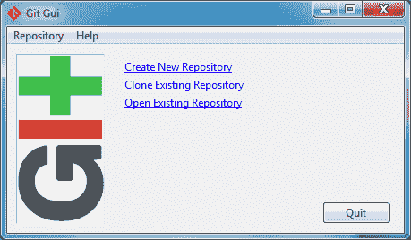
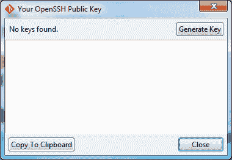
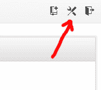
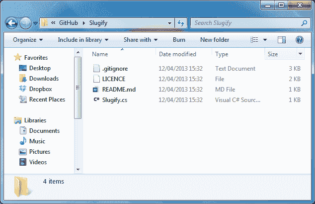

# 为 Windows 安装 Git

> 原文：<https://dev.to/adamkdean/installing-git-for-windows-2l4b>

在 windows 上使用 Git 最简单的方法是下载并安装用于 Windows 的 *Git。您可以在这里找到可供下载的最新版本: [Git for Windows](http://code.google.com/p/msysgit/downloads/list?q=full+installer+official+git) 。*

对于本文，我将使用`Git-1.8.1.2-preview20130201.exe`。

下载完成后，运行它，同意安全问题，并选择所有默认选项进行安装。现在你的桌面上应该有一个 *Git Bash* 的快捷方式。

设置 Git 最简单的方法是使用 Git GUI。在你的开始菜单中找到并运行它。

[T2】](https://res.cloudinary.com/practicaldev/image/fetch/s--qQYuQfD2--/c_limit%2Cf_auto%2Cfl_progressive%2Cq_auto%2Cw_880/http://i.imgur.com/uwAkZLA.png)

现在转到`Help`，然后是`Show SSH Key`。您应该看到这个窗口:

[T2】](https://res.cloudinary.com/practicaldev/image/fetch/s--wnWm8tR7--/c_limit%2Cf_auto%2Cfl_progressive%2Cq_auto%2Cw_880/http://i.imgur.com/QweECTb.png)

点击`Generate Key`并输入密码。请确保您记住了这一点，您将在每次从 GitHub 推/拉更改时使用它。这很重要。

现在进入你的 [GitHub](http://github.com/) 账户。如果你没有，就做一个，你会需要的。登录后，进入您的`Account settings`:

[T2】](https://res.cloudinary.com/practicaldev/image/fetch/s--2RanHZXH--/c_limit%2Cf_auto%2Cfl_progressive%2Cq_auto%2Cw_880/http://i.imgur.com/8a4pGFt.png)

接下来，点击`SSH Keys`选项卡。

[T2】](https://res.cloudinary.com/practicaldev/image/fetch/s--ZNX0WDPO--/c_limit%2Cf_auto%2Cfl_progressive%2Cq_auto%2Cw_880/http://i.imgur.com/zR2wp9Y.png)

一旦你完成了，点击`Add SSH Key`并粘贴你之前在 Git GUI 中生成的大块文本。给它起个好记的名字，比如 *HomePC* 或者 *WorkPC* ，点击`Add key`。

你现在可以关闭`Git GUI`了。

# 设置 Git 配置文件

我们现在要配置我们的 Git 概要文件。打开`Git Bash`并输入以下内容，确保输入您自己的详细信息:

```
git config --global user.name "Firstname Lastname"
git config --global user.email "your_email@youremail.com" 
```

Enter fullscreen mode Exit fullscreen mode

就这样了。

# 克隆一个回购

现在让我们克隆一个回购来测试它。我发现最好用一个目录存放我所有的 GitHub 库。你可以随意把它们放在你喜欢的地方，但为此我们将使用`C:\GitHub\`。

Git Bash 使用 Linux 风格的文件路径，所以我们在使用它时必须记住这一点。使用`cd`命令将目录更改为 C:

```
cd /c 
```

Enter fullscreen mode Exit fullscreen mode

现在让我们使用`mkdir`命令创建一个名为 GitHub 的目录:

```
mkdir GitHub 
```

Enter fullscreen mode Exit fullscreen mode

现在让我们移动到那个目录，再次使用`cd`命令:

```
cd GitHub 
```

Enter fullscreen mode Exit fullscreen mode

非常好。现在让我们克隆一个存储库。我将提供我的一个较小的回购，但你可以随意使用任何你喜欢的。在 Git Bash 中，克隆 repo，如下所示:

```
git clone git://github.com/Imdsm/Slugify.git 
```

Enter fullscreen mode Exit fullscreen mode

Git Bash 现在将为 repo 创建一个目录，并为您下载所有最新的文件。如果您在 Windows 资源管理器中打开该目录，您会看到一切都运行良好:

[T2】](https://res.cloudinary.com/practicaldev/image/fetch/s--nerGu-sE--/c_limit%2Cf_auto%2Cfl_progressive%2Cq_auto%2Cw_880/http://i.imgur.com/H3x0E1w.png)

现在你知道了。Git for Windows。

<sub>延伸阅读:

[新来的饭桶？在 GitHub.com](https://github.com/blog/120-new-to-git) [Git(软件)](http://en.wikipedia.org/wiki/Git_(software))在 Wikipedia.org

[Git 给初学者:权威实用指南](http://stackoverflow.com/questions/315911/git-for-beginners-the-definitive-practical-guide)在 Stackoverflow.com</sub>