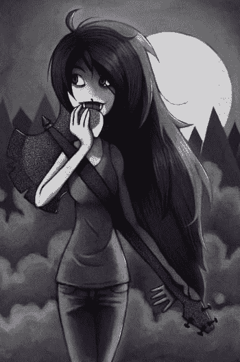
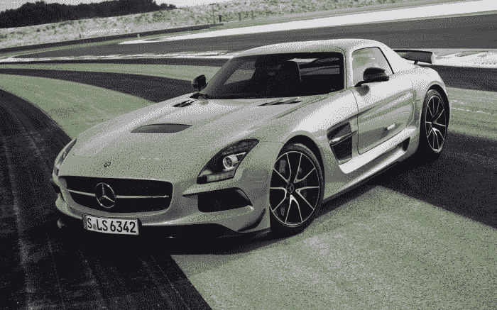
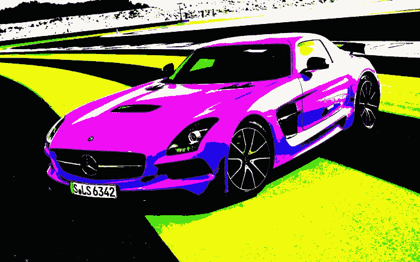
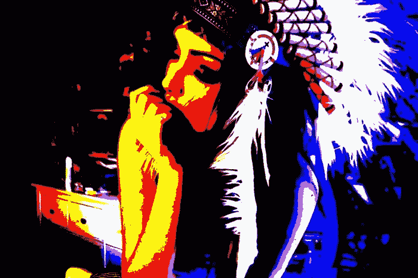

# 影像学实验#3

> 原文:[https://dev.to/senior_sigan/imagemagick-3-1h2](https://dev.to/senior_sigan/imagemagick-3-1h2)

没时间解释了-20 分钟后开始训练。只要再来一份。现在，我进行了频道的随机搅拌。

我们乘 3 路 RGB。在本公开的实施方案中，在本公开的实施方案中，在本公开的实施方案中，在本公开的实施方案中，具有一个实施方案。t 10t 11 = t 12t 13t 6，t 14t 15t 16。t 18】 【t 21T27 号 t 29】 = 【t 30 号 T31 号 T32 号 T33 每一次转换均按 T41、T42、T43、T45、T46、T47 的相等概率进行选择即均匀的离散分布。图片有望几乎变成单色。事实就是如此。

[T2】](https://res.cloudinary.com/practicaldev/image/fetch/s--pl5CPxAr--/c_limit%2Cf_auto%2Cfl_progressive%2Cq_auto%2Cw_880/https://dev-to-uploads.s3.amazonaws.com/i/mvhog1p7ji8o5405se7z.jpeg)

[T2】](https://res.cloudinary.com/practicaldev/image/fetch/s--ZiXGAFxX--/c_limit%2Cf_auto%2Cfl_progressive%2Cq_auto%2Cw_880/https://dev-to-uploads.s3.amazonaws.com/i/uc1hy1u30ivo9z3i1jhe.jpeg)

# t0t 1 多路转换

下一个转换是取通道亮度，如果大于亮度的一半，则使其最大化，否则最小化。我忘了这个效果叫什么了，谁知道照片肖普说。

通道增益。只得到 8 种颜色——《红绿蓝花》。

[T2】](https://res.cloudinary.com/practicaldev/image/fetch/s--y5SrEnCI--/c_limit%2Cf_auto%2Cfl_progressive%2Cq_auto%2Cw_880/https://dev-to-uploads.s3.amazonaws.com/i/mcu487go6pep9wfagsox.jpeg)

她又不走运了。但总有一天，我会找到让图片变得费神的效果。

[T2】](https://res.cloudinary.com/practicaldev/image/fetch/s---qYsud1S--/c_limit%2Cf_auto%2Cfl_progressive%2Cq_auto%2Cw_880/https://dev-to-uploads.s3.amazonaws.com/i/91qkynvbr9uh1jbyh0ow.jpeg)

# t0t 1 源。

[https://gist.github.com/senior-sigan/5301188](https://gist.github.com/senior-sigan/5301188)