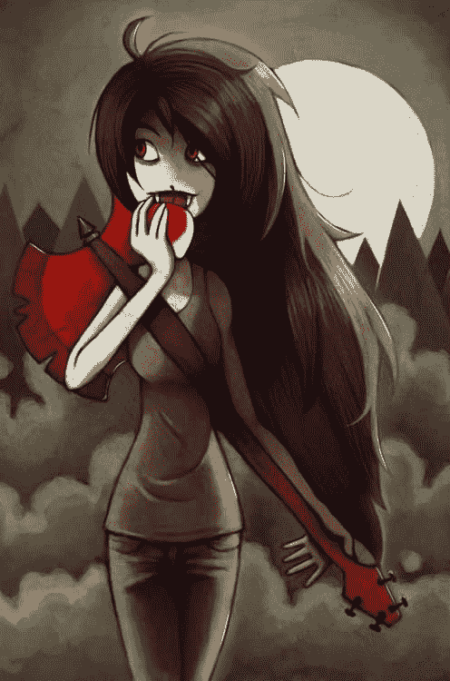
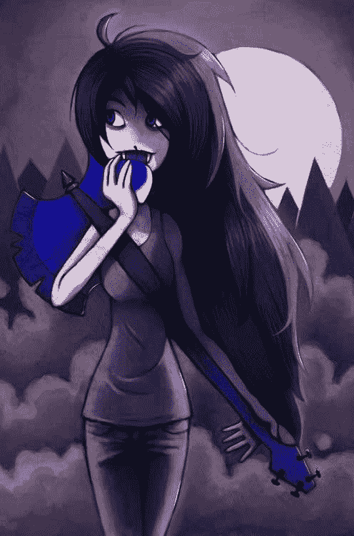
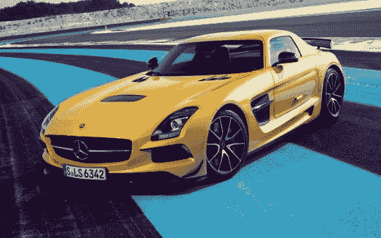
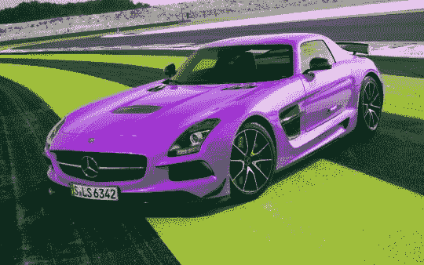
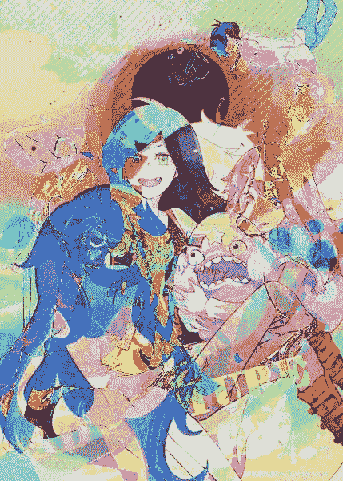
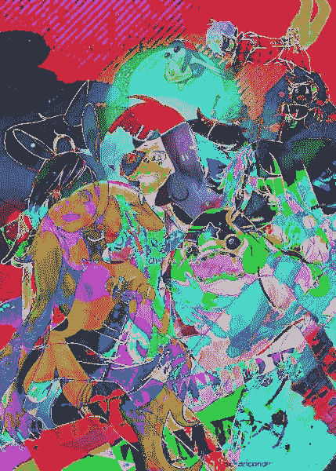
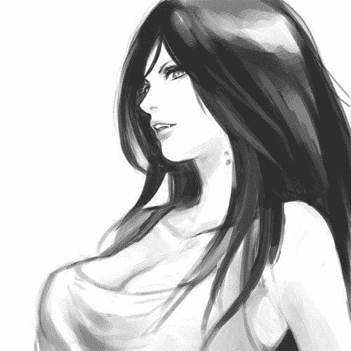
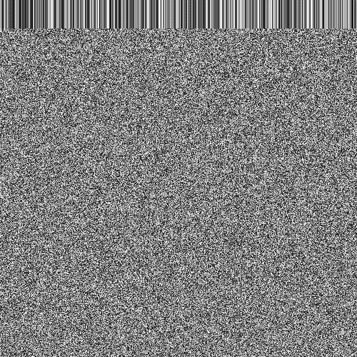

# 影像学实验#1

> 原文:[https://dev.to/senior_sigan/imagemagic-1-ah5](https://dev.to/senior_sigan/imagemagic-1-ah5)

你们好。星期五晚了，至少 4 月 1 日。前几天，我有一个奇怪的想法，就是增加图片。好吧，作为矩阵，你知道。所以今天晚上，我不得不赶紧去研究一下 si 的 ImageMagick 库。

# t0t 1 更换位置。

所以。从简单开始-切换 RGB 位置，例如 BRG 或其他位置。这看起来很不错(是的，大概 10 年前在照相馆就是这样)。T0，我们去找马赛林

[T2】](https://res.cloudinary.com/practicaldev/image/fetch/s--pLZLDtb8--/c_limit%2Cf_auto%2Cfl_progressive%2Cq_auto%2Cw_880/https://dev-to-uploads.s3.amazonaws.com/i/c1cv9n3srwxx7kr1r6nm.jpg)

收到蓝色的马赛琳。雅雅

[T2】](https://res.cloudinary.com/practicaldev/image/fetch/s--ZkviRsb3--/c_limit%2Cf_auto%2Cfl_progressive%2Cq_auto%2Cw_880/https://dev-to-uploads.s3.amazonaws.com/i/4gio3ung8j96d4wg9xui.jpg)

黄色的胶粘独轮车。我们得重新粉刷。

[T2】](https://res.cloudinary.com/practicaldev/image/fetch/s--7nDCHA78--/c_limit%2Cf_auto%2Cfl_progressive%2Cq_auto%2Cw_880/https://dev-to-uploads.s3.amazonaws.com/i/6kcmzkfuyndwy4o997fx.jpg)

比以前更酷了。

[T2】](https://res.cloudinary.com/practicaldev/image/fetch/s--idSJBLfc--/c_limit%2Cf_auto%2Cfl_progressive%2Cq_auto%2Cw_880/https://dev-to-uploads.s3.amazonaws.com/i/q0426ldnmz5d609cndga.jpg)

# 异或

接下来。根据朋友的要求布满了 XOR。但这一点一点也不有趣。

[T2】](https://res.cloudinary.com/practicaldev/image/fetch/s--chPgm9Kl--/c_limit%2Cf_auto%2Cfl_progressive%2Cq_auto%2Cw_880/https://dev-to-uploads.s3.amazonaws.com/i/zhla5l9d0jkblq3xvdbf.jpg)

**异或**

[T2】](https://res.cloudinary.com/practicaldev/image/fetch/s--8-_YFPuG--/c_limit%2Cf_auto%2Cfl_progressive%2Cq_auto%2Cw_880/https://dev-to-uploads.s3.amazonaws.com/i/izwpqkylp48v7gxcjq83.jpg)

在 XOR 后收到。

[T2】](https://res.cloudinary.com/practicaldev/image/fetch/s--46f3PG56--/c_limit%2Cf_auto%2Cfl_progressive%2Cq_auto%2Cw_880/https://dev-to-uploads.s3.amazonaws.com/i/svw576nz25jfn00ors49.jpg)

显然，这只是画的叠加。嗯，那么有点物质。

# t0t 1 减。

我在 XOR 之后想——如果减去颜色呢？还真的。

[T2】](https://res.cloudinary.com/practicaldev/image/fetch/s--qXc_ItVX--/c_limit%2Cf_auto%2Cfl_progressive%2Cq_auto%2Cw_880/https://dev-to-uploads.s3.amazonaws.com/i/wcqhllaxij6piwi1dh5i.jpg)

# T0 乘以 T1。

是的，是的。通过快速编写矩阵的逐行乘法，将图片加到了自己身上。期望已经实现。成功了，了不起。

为了简单起见，请拿一张方块图。并乘以你自己。

[T2】](https://res.cloudinary.com/practicaldev/image/fetch/s--F0aieHEg--/c_limit%2Cf_auto%2Cfl_progressive%2Cq_auto%2Cw_880/https://dev-to-uploads.s3.amazonaws.com/i/epqlanhlsug9eezb91d0.jpg)

图片乘以自己的结果。他妈的太棒了。我很久没见过这样的颜色和形状游戏了。图片顶部多优雅地在 barcod 下面乱涂乱画。啊。

[T2】](https://res.cloudinary.com/practicaldev/image/fetch/s--zbv1QG84--/c_limit%2Cf_auto%2Cfl_progressive%2Cq_auto%2Cw_880/https://dev-to-uploads.s3.amazonaws.com/i/sfnfj9pu5jpyt60r808s.jpg)

# t0t 1 源。

还有那些想测试我的代码的人。要我退出编程，请参阅以下文件:t0 https://gist . github . com/senior-sigan/5285689