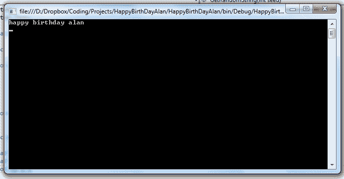

# 生日快乐-程序员风格。

> 原文:[https://dev . to/adamkdean/happy-birthday-programmer-style-4c GM](https://dev.to/adamkdean/happy-birthday-programmer-style-4cgm)

今天我决定祝我的好朋友 [@Farkie](https://twitter.com/Farkie) 生日快乐:程序员风格。

为你干杯，老豆。

```
using System;
using System.Text;

public class HappyBirthday
{
    public static void Main(string[] args)
    {
        Console.WriteLine("{0} {1}{2} {3}",
            GetRandomString(-1045111850),
            GetRandomString(554696058),
            GetRandomString(99640),
            GetRandomString(-2146856402));

        Console.ReadKey();
    }

    public static string GetRandomString(int seed)
    {
        var rnd = new Random(seed);
        var sb = new StringBuilder();
        for (; ; )
        {
            int c = rnd.Next(0, 27);
            if (c == 0) break;
            sb.Append((char)(96 + c));
        }
        return sb.ToString();
    }
} 
```

<svg width="20px" height="20px" viewBox="0 0 24 24" class="highlight-action crayons-icon highlight-action--fullscreen-on"><title>Enter fullscreen mode</title></svg> <svg width="20px" height="20px" viewBox="0 0 24 24" class="highlight-action crayons-icon highlight-action--fullscreen-off"><title>Exit fullscreen mode</title></svg>

而且，因为你可能懒得编译它，我也为你做了。

[T2】](https://res.cloudinary.com/practicaldev/image/fetch/s--1STAQo0---/c_limit%2Cf_auto%2Cfl_progressive%2Cq_auto%2Cw_880/http://i.imgur.com/wg2sI1q.png)