# 亨特·S·汤普森板- Arduino 超级迷你

> 原文：<https://dev.to/ladvien/the-hunter-s-thompson-board-arduino-mega-mini-9p3>

[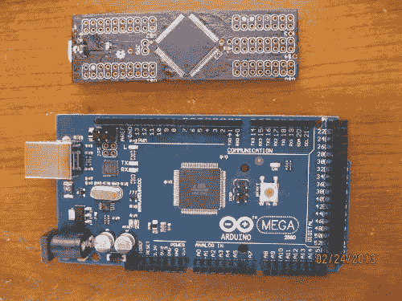T2】](https://res.cloudinary.com/practicaldev/image/fetch/s--6CmAvCRk--/c_limit%2Cf_auto%2Cfl_progressive%2Cq_auto%2Cw_880/https://ladvien.cimg/IMG_0494.jpg)

六个月前，我买了我的第一台 Arduino。在小屋买的。我从未接触过电子产品，但我不得不更换电脑上的一个瞬时开关，还想要更多。我很快意识到开放的硬件社区。

一个月后，我读到了关于在家自制 PCB 的文章。几天后我制作了我的第一个本垒板。这是一个电机驱动板，嗯，它是一个混合的成功。绝对不是一个旁观者([http://wp.me/p37cuD-3q](http://wp.me/p37cuD-3q))。但是我被迷住了。我想做一些更复杂的东西。我曾经听过的一个关于亨特·S·汤普森的故事激励了我。据说他经常临摹伟大的加斯比的作品，因为他“想感受如此伟大的文字的音乐。”这是一个释义，但唯一的原因是我不想重读 1972 年竞选活动中*恐惧和厌恶的序言(一次就够了，谢谢)*。_ 尽管如此，逻辑似乎是合理的。于是，我想到了如何应用到电子学中。

后来，我偶然看到了 Ada 女士关于向芯片制造商索取[样品的文章，于是我很快订购了一打 IC；我不知道他们中的任何一个，但是他们的名字听起来很酷。两周后，我拿到了各种随机的筹码。我想了想该拿他们怎么办；当我看到我订购的一个芯片时:](http://www.ladyada.net/library/procure/samples.html) [Atmega 2560-16UA](http://www.atmel.comhttps://ladvien.cimg/doc2549.pdf) 。那是一个漂亮的小 [TFQP-100 pin 芯片](http://www.chipsetc.com/uploads/1/2/4/4/1244189/3559664.jpg?531)，嗯，25 美分硬币大小。我的心在打转。"这是最大的坏蛋阿杜伊诺的心脏."

我赶紧拉起 Arduino.cc 下载 Eagle 的 [Arduino Mega](http://arduino.cc/en/uploads/Main/arduino-mega2560_R3-reference-design.zip) 的 PCB 布局图。这是我遇到的第一个障碍，嗯，所有的铜板，蚀刻剂和组件。即使我有主芯片，也要花很多钱来完成 Arduino Mega 板。如果可以的话，那就是*。我从未真正蚀刻过双面电路板。到目前为止，我只蚀刻了一面，而且不是很好。*

因此，我继续挖掘 Atmega 2560-16UA 的其他布局，这些布局可以用作 Arduino 板。就在那时，我发现了这个设计天才:

[http://jkdevices.com/arduino-megamini](http://jkdevices.com/arduino-megamini)

我很快注意到他提供了他的设计作为开放硬件。对我来说，这块板很神奇。它是 3 英寸乘 1 英寸，与 Arduino Mega 完全一样。所以，我决定，不管是在地狱还是在安迪·迪克，我都要做这块板。

我不知道，没有安迪·迪克，但另一个肯定在我前面。

**1。棋盘**

我开始谷歌搜索任何我能找到的关于蚀刻自制板的信息(我会在底部提供我的相当全面的链接列表)。在尝试了所有不同的方法后，我发现结合 MG 化学的平版印刷法可能是我最好的选择。我开始收集我需要的一切。

[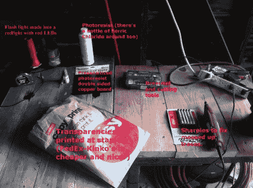T2】](https://res.cloudinary.com/practicaldev/image/fetch/s--P3CfuT2u--/c_limit%2Cf_auto%2Cfl_progressive%2Cq_auto%2Cw_880/https://ladvien.cimg/Making_Mega_Mini.jpg)

[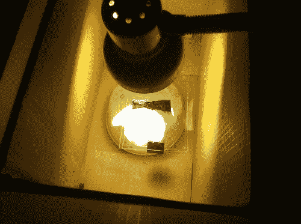T2】](https://res.cloudinary.com/practicaldev/image/fetch/s--n1xaw1nL--/c_limit%2Cf_auto%2Cfl_progressive%2Cq_auto%2Cw_880/https://ladvien.cimg/Making_Mega_Mini__15_.jpg)

这不会成为自制 PCB 的指南，原因有三:(1)我从来不想谈论它，(2)其他人已经做得比我好得多，(3)有更好更便宜的方法。跟着我，有一个令人兴奋的成本分析来了。

尝试蚀刻超小型车的材料成本:

*   预敏化双面铜板:0.99 美元
*   氯化铁:0.99 美元
*   阳性显影剂:0.20 美元
*   透明胶片:0.46 美元

每次尝试蚀刻一个巨型迷你的总费用: **$2.65**

[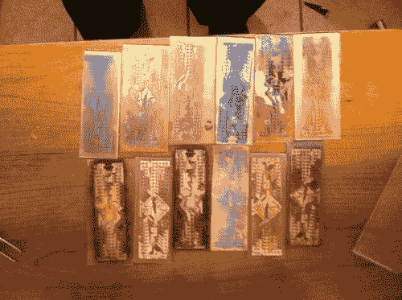](https://res.cloudinary.com/practicaldev/image/fetch/s--Sbkxqv_a--/c_limit%2Cf_auto%2Cfl_progressive%2Cq_auto%2Cw_880/https://ladvien.cimg/Making_Mega_Mini__25_.jpg) 
我经过 16 次尝试才得出这些数字。我在美国各地给我的材料定价，包括运费，切割许多木板，然后平均成本，得出最终数字。每次尝试，2.65 美元是我能做到的最好的。我的问题是多重的。首先，我不知道我在做什么。我明白这种情况会发生:原型比生产单元更昂贵。第二，我选了一块有点像小狗妈妈的板子来蚀刻。这些痕迹最常见的是 8 密耳，所以，我花了大约 14 次尝试才知道如何蚀刻这样小的痕迹。但是第 15 次和第 16 次尝试向我揭示了一个我根本无法克服的障碍。我一直依赖 FedEx-Kinkos 和 Staples 打印我的幻灯片，我发现它们的打印尺寸不对。  我了解到在 Eagle 中，你可以通过改变打印尺寸的“比例”来弥补这一点，遗憾的是，它只允许你将单位改变到百分之一位。任何千分之一都会四舍五入。我的 MegaMini PCB 需要在 1.025 左右。当然，这将四舍五入到 1.02。**吸**

不打算撒谎。我很沮丧。我在蚀刻上投入了大量的时间、金钱和热情。

我把项目搁置了一段时间。我开始研究我的机器人。然后，当我在看其他人在 LMR 上做的所有整洁的小事情时，我注意到了一个关于奥什帕克的评论。不久前，我曾短暂地考虑过 BatchPCB，但在我了解到它的价格并试图让 Eagle 无错误地生成 Gerber 文件后，我放弃了。但是，我很无聊，想去看看奥什帕克。我很高兴看到我可以直接上传 Eagle 文件。一旦我上传了板，我又沮丧了，它将是 10.80 美元-哦，等等，那是三块板。嗯，那是每块 3.60 美元。现在，这还不算太糟。所以我派人去找了三人组。

两周后，这些神奇的紫色小板子出现了。

[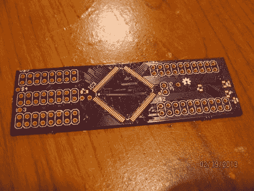T2】](https://res.cloudinary.com/practicaldev/image/fetch/s--IZ15bjXd--/c_limit%2Cf_auto%2Cfl_progressive%2Cq_auto%2Cw_880/https://ladvien.cimg/Making_Mega_Mini__47_.jpg)

OSHPark 委员会的费用: **$3.60**

有几件事引起了我的注意

1.  电路板上已经有过孔(该电路板有大约 60 多个微孔)。
2.  已经上漆了。
3.  这些洞已经被钻好了。

我开始考虑在蚀刻我自己的木板和把它们送到 OSHPark 之间的权衡。我觉得我唯一失去的就是销声匿迹。我最初喜欢完全在家里制作的东西。然而，我突然想到，即使我在家蚀刻我的电路板，我仍然在购买集成电路。把我放到网上。所以，实际上并没有什么损失。

当然，还有时间交易。我把蚀刻一块木板的时间缩短到一个小时左右。然而，这不包括钻孔、上漆、增加过孔等。此外，有一个美德的教训在我身上悄然发生:电子学需要毅力 ***和*** 耐心。此外，我注意到我最好的想法是在我等待零件的时候产生的。我的脑海里会闪过我已经做了什么，然后我可以做不同的事情。因此，等待董事会的 15 天并没有困扰我。我不认为这是浪费时间。

至于价格取舍。我只计算了家里蚀刻板直接使用的材料。我没有包括碎末、用过的记号笔、轻拍、强力胶等。我也没有包括家庭生产所需的资本。钻头、钻床、灯、CFL 灯泡等。在家里，光是钻孔就被认为是蚀刻板的一大缺点。我已经花了 30 美元买了一台二手钻床(好价钱，我已经用它做了很多其他事情)。但是需要的小零件很贵而且容易损坏。我要说的是，我学会了通过把我的板子绑在一块木头上来减少碎片。当板子倾斜并把钻头夹住时，它们就断了。

我的结论: **OSHPark 很牛逼。**

**2。填充**

[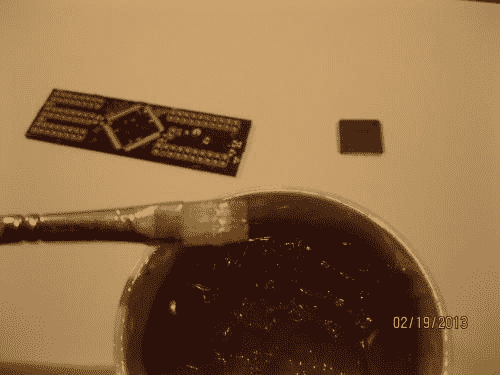T2】](https://res.cloudinary.com/practicaldev/image/fetch/s--MDux4LdF--/c_limit%2Cf_auto%2Cfl_progressive%2Cq_auto%2Cw_880/https://ladvien.cimg/Making_Mega_Mini__49_.jpg)

事实上，把棋子放到棋盘上是最简单的一步。我已经预料到这将是最困难的，因此，我已经投入了我的学习时间来学习如何焊接优良的 SMD。我马上知道，我将无法使用我的 7 美元小屋铁在这个董事会。我和妻子每月给自己 100 美元的娱乐费，所以我花了一个月的时间买了一辆来自易贝的 Hakko FX-888。我还买了一个 [T18 CF1 尖](http://www.ebay.com/itm/380320904716?ssPageName=STRK:MEWNX:IT&_trksid=p3984.m1439.l2649)。**我喜欢这种铁。**结实而俏皮的蓝色。我觉得很专业。

我在某处读到过，组装 SMD 时，应该从最大的元件开始，然后再往下组装最小的元件。我就是这么做的。我开始试着把 Atmega 芯片固定在焊盘上。最后，我用了拖尖法，用了大量的助焊剂。

[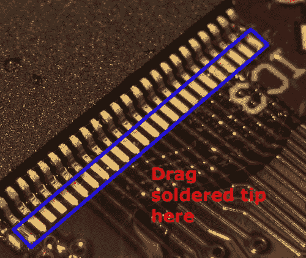T2】](https://res.cloudinary.com/practicaldev/image/fetch/s--86Oy_IE3--/c_limit%2Cf_auto%2Cfl_progressive%2Cq_auto%2Cw_880/https://ladvien.cimg/Making_Mega_Mini__50_2_0.jpg)

我还买了一个这样的胸针，这样我就可以检查我所有的胸针。我讨厌它的样子，但它救了我很多次，我不在乎。

我把冲浪板放在我的助手手上，过了大约 45 分钟。我学会了如何用一点焊料钉在角落里，然后使用拖放的方法。我相信 0.022 英寸焊料是这里的关键。这使我能够更好地控制连接焊盘所需的少量焊料。我注意到一件事，当使用拖拽方法时，将焊料放在你的尖端，只接触焊盘的边缘，而不是引脚的腿。只要你的烙铁足够热，基于[弯月面效应](http://www-math.mit.edu/~dhu/Climberweb/climberweb.html)，焊料会自己流到焊盘上。

一旦我把 Atmega 放好，只花了 20 分钟就把所有其他的部分都放到了板上。没有值得一提的障碍。调压器上的散热块有点棘手。但我最后把焊料放在焊盘上，让我的烙铁尖留在里面，我用镊子把调节器的背面向下压在上面，然后把我的烙铁尖滑出来。不漂亮，但很有效。

[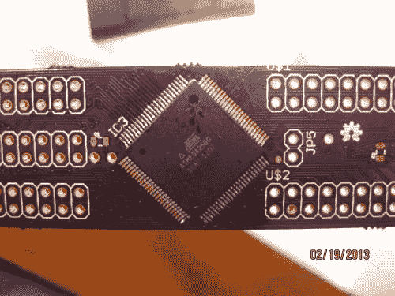](https://res.cloudinary.com/practicaldev/image/fetch/s--N-0fUT2Y--/c_limit%2Cf_auto%2Cfl_progressive%2Cq_auto%2Cw_880/https://ladvien.cimg/Making_Mega_Mini__58_.jpg)[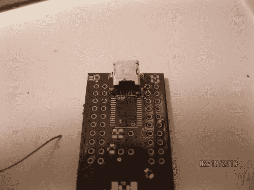](https://res.cloudinary.com/practicaldev/image/fetch/s--m0zma76Q--/c_limit%2Cf_auto%2Cfl_progressive%2Cq_auto%2Cw_880/https://ladvien.cimg/Making_Mega_Mini__81_.jpg)[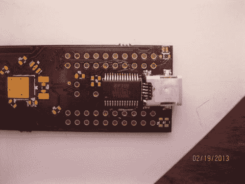](https://res.cloudinary.com/practicaldev/image/fetch/s--bqqyQTCg--/c_limit%2Cf_auto%2Cfl_progressive%2Cq_auto%2Cw_880/https://ladvien.cimg/Making_Mega_Mini__82_.jpg)

[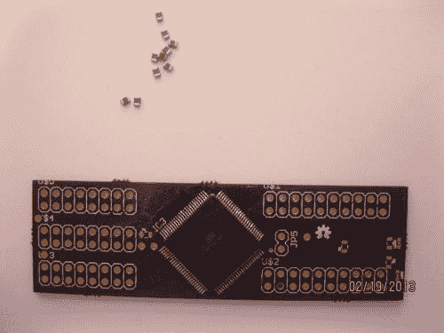 ](https://res.cloudinary.com/practicaldev/image/fetch/s--PmL4czNA--/c_limit%2Cf_auto%2Cfl_progressive%2Cq_auto%2Cw_880/https://ladvien.cimg/Making_Mega_Mini__61_.jpg) [ 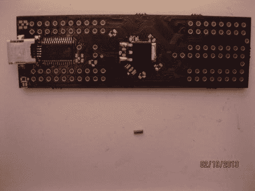](https://res.cloudinary.com/practicaldev/image/fetch/s--bn2SzceM--/c_limit%2Cf_auto%2Cfl_progressive%2Cq_auto%2Cw_880/https://ladvien.cimg/Making_Mega_Mini__86_.jpg)

Mega Mini 的完整零件清单如下:

1.  16mhz 贴片谐振器(Digikey 490-1198-1-ND):**$ 0.48**
2.  USB 串行 UART 28 SSOP(Digikey 768-1007-1-ND):**$ 4.50**
3.  迷你 USB 2.0(Digikey h 2959 CT-ND):**$ 1.38**
4.  atmega 2560-16UA:**$ 12.38-17.00**
5.  8 个 100nf - 0805 电容器:**$ 0.08**
6.  2 个 10uf - 0805 电容器:**$ 0.02**
7.  1 个 10k 电阻器: **$.01**
8.  4 个未知电阻(我用了 100k，我相信):**$ 0.04**
9.  5V 电压调节器 LDO(Digikey NCP 1117 dt 50 rkgosct-ND):**$ 0.49**
10.  OSHPark board: **$3.20** ( [)。Brd 文件](https://github.com/jkdevices/MegaMini/tree/master/r3)
11.  2 个 0603 发光二极管
12.  **总计:22.80 美元**

**3。对其编程**

最后一块焊接！现在我要做的就是插上电源，然后它就工作了，对吗？

我跑到电脑前，插上我的主板。听到“嘟嘟”一声，我兴奋极了 USB 连接声音，然后这在我的屏幕上弹出。

[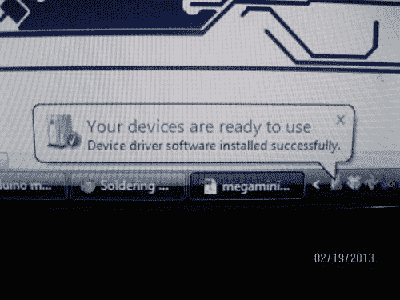T2】](https://res.cloudinary.com/practicaldev/image/fetch/s--hLNgtHLl--/c_limit%2Cf_auto%2Cfl_progressive%2Cq_auto%2Cw_880/https://ladvien.cimg/Making_Mega_Mini__90_.jpg)

“您的设备可以使用了”

那是我的屁股！

这是我第二个地狱的开始。我买了我的 AVR ISP MKII 来做编程。经过大约 20 分钟的引脚排列，我完成了接口设置。

[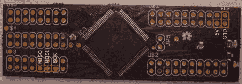T2】](https://res.cloudinary.com/practicaldev/image/fetch/s--QxNmQdBJ--/c_limit%2Cf_auto%2Cfl_progressive%2Cq_auto%2Cw_880/https://ladvien.cimg/Making_Mega_Mini__63_2.jpg)

[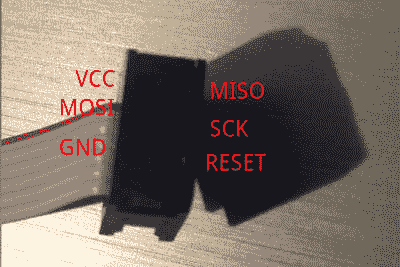T2】](https://res.cloudinary.com/practicaldev/image/fetch/s--cHjy6L9u--/c_limit%2Cf_auto%2Cfl_progressive%2Cq_auto%2Cw_880/https://ladvien.cimg/avrispmkii-pin-out.png)

[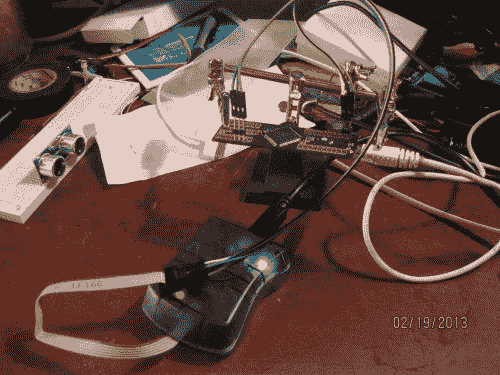](https://res.cloudinary.com/practicaldev/image/fetch/s--tGewHW3o--/c_limit%2Cf_auto%2Cfl_progressive%2Cq_auto%2Cw_880/https://ladvien.cimg/Making_Mega_Mini__95_.jpg) 既然已经接上了。我调出了我的 Atmel Studio 6。我切换到“设备程序员”选择我的程序员，然后我选择我的芯片为“Atmega 2560”(这涵盖了 2560 的所有变种)。然后，我点击了设备签名下的“读取”。它回答说那里什么也没有。我读了一下电压，它是 5.1v，没问题。然后我拿过黑板，用我那副难看的眼镜擦黑板，看看我犯了什么错误。我应该提到的一件事:**我不得不猜测电路板上的几个电阻**。设计者没有把他们的价值写在图表上。所以，我确信那就是它。然后我低头看着夹在板上的我的援助之手——我想，“啊。我在想，不帮忙的那只手上是不是有什么东西短路了。”移动了手。再次点击“阅读”。你猜怎么着？如果你买了一个金属的帮手，确保它没有做空你的主板。我的签名是。现在，我只需要想出如何编程。我跑遍了 Arduino.cc、AVRfreaks 和 Lady Ada 的论坛，寻找如何对 Atmega 2560 进行编程。我找到了几个帖子，但似乎每个人都对编程 Atmega 328 DIP 包更感兴趣。Pfft。

因此，出于缺乏耐心，我犯了一个错误，我会穿提醒我三思而后行。* *我弄乱了保险丝。* *请注意，我是根据 Arduino.cc 上一个相当有见识的帖子做的。然而，它砖化了我的主板。

一些小狗的妈妈！

但丁有他的地狱和炼狱；我有蚀刻 8 密耳和 Atmel 保险丝。

我去睡觉了。起床了。上班去了。帮助一些无家可归的人。试着不去想我犯的大错。但是当我回到家的时候，我知道我必须做什么。最初，我从 Atmel 获得了两个 Atmega 2560-16UA 芯片样品。我需要做第二块板。这一次，棋盘花了我大约 25 分钟。但我没有跑过去试图用砖头砸它。我等待着。我把它插上电源，并对自己发誓，在我成为保险丝、锁位以及 Atmel 放入这么棒的小芯片中的任何愚蠢的东西的专家之前，不要试图给它编程。

所以我读书。阅读。

你猜怎么着？我还是一样迷茫。

但我确实学到了一些东西:

1.  Atmel Studio 驱动和 AVRDude 驱动互相讨厌。他们就像凯普莱特和蒙太古。
2.  熔丝以十六进制编写，定义芯片的外部和内部质量。例如它是否具有外部时钟，或者是否运行在内部 8mhz 上。
3.  没有人真的会乱用 TFQP-100 芯片，因此，我发现很少有人处于我的位置。
4.  Arduino 的 IDE 在烧录引导程序时会自动设置保险丝。Atmel Studio 让您手动设置它们。
5.  Coursera 即将推出这个课程:[硬件/软件接口](https://www.coursera.org/course/hwswinterface)。

最后，我用美国方式解决了我的问题！直觉和运气。

我注意到我可以使用 Atmel Studio 将 Arduino Atmega 2560 引导程序写入主板。但由于驱动程序冲突，我无法使用 Arduino 的 IDE 编写它。我试过家里的电脑。我注意到 Arduino IDE 看起来像是在写引导程序，但是橙色灯却一直亮着(这意味着它在“编程”)。然后，在我尝试用 Arduino IDE 在运行 Linux 的车库电脑上对它进行编程后，我注意到了一些奇怪的事情。当我在 Atmel studio 中打开电路板的保险丝页面时，保险丝已经发生了变化。它击中了我...也许 Arduino IDE 成功地编写了熔丝，但没有成功地编写引导程序...哦等等！我可以从 Atmel studio 写 bootloader。我跑回运行 studio 的电脑，插上板卡，上传 bootloader。我祈祷了一下，插上了超级迷你。我调出了 Arduino IDE 并选择了正确的 COM。我点击了“上传”

[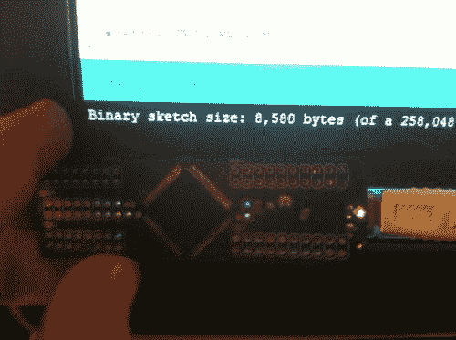T2】](https://res.cloudinary.com/practicaldev/image/fetch/s--RWiWFrAb--/c_limit%2Cf_auto%2Cfl_progressive%2Cq_auto%2Cw_880/https://ladvien.cimg/Making_Mega_Mini__104_.jpg)

素描上传了。我会哭，但我不想短板，或者，矢野，似乎软弱和没有男子气概。

我很快上传了我的机器人草图，然后跑去喝了一杯。

吸取的教训:

*   蚀刻小于 10 密耳的电路板并非不可能。但是，如果把时间和失败的尝试都计算在内，这就不划算了。
*   对于双面电路板，光刻是分辨率最高的最简单方法。
*   OSHPark 是获得高质量电路板的一种非常简单和廉价的方法(钻孔和通孔运行！).
*   激情、坚持和耐心是自制电子产品的优点。
*   AVR ISP MKII 冲突的 Atmel Studio 和 AVRDude 驱动程序。
*   Atmel 芯片保险丝不是玩具。
*   不要试图同时使用放大镜和焊料。相信我，你会烫着头发的。
*   学习伟大事物的一个很好的方法是认识到别人的伟大，模仿它，然后把它变成你自己的。我已经看到我将如何改变超级迷你，以满足我的需求。我真的不喜欢电路板上的 FTDI 芯片。对我来说没什么意义。它们是 4.5 美元。我宁愿把串行器放在电缆上。因为我已经开始熟悉这块板的布局，我知道我可以重新设计它，去掉 usb 连接器和 FTDI(每块板节省 5 美元)。
*   如果你计划制作少于 7 块左右的板子，自己制作是不划算的。JKDevices 的售价是 45 美元，根据我的计算，盈亏平衡点是 6.43 美元(见下图)。我希望这不会让任何人气馁。价格只是看待它的一种方式。我无法给我在这个过程中学到的一切定价。

未来计划:

1.  为 Mega Mini 做一个电机护罩。
2.  包括 M3(超级迷你摩托盾牌)和超级迷你到我的机器人。我相信这会大大减少我的机器人的体积。
3.  返工超级迷你设计，并删除 FTDI 和 USB 位。这将使主板的总成本降低 5.88 美元，使生产一个主板的价格降至 16.92 美元。不算太寒酸。
4.  调查 f .斯科特·菲茨杰拉德对电子学的看法。

**盈亏平衡分析:**

[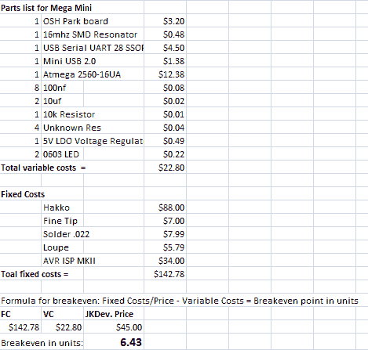T2】](https://res.cloudinary.com/practicaldev/image/fetch/s--OuNzXyZ2--/c_limit%2Cf_auto%2Cfl_progressive%2Cq_auto%2Cw_880/https://ladvien.cimg/Break_Even_Analysis_of_MegaMini_2.png)

自制多氯联苯的链接:

*   [http://www.artemlive.com/cgi-bin/news?c=v&id = 750](http://www.artemlive.com/cgi-bin/news?c=v&id=750)
*   [http://www.artemlive.com/cgi-bin/news?c=v&id = 751](http://www.artemlive.com/cgi-bin/news?c=v&id=751)
*   [http://en.electroni-city.com/](http://en.electroni-city.com/)
*   [http://www.youtube.com/watch?feature=endscreen&NR = 1&v = p2kFazl-aEE](http://www.youtube.com/watch?feature=endscreen&NR=1&v=p2kFazl-aEE)(ok 光刻入门)。
*   [http://www.aplomb.nl/TechStuff/PCB_s/UVsource_PCB.html](http://www.aplomb.nl/TechStuff/PCB_s/UVsource_PCB.html)
*   [http://sfprime.net/pcb-etching/index.htm](http://sfprime.net/pcb-etching/index.htm)
*   [http://www.jameco.com/Jameco/PressRoom/makeoneetch.html](http://www.jameco.com/Jameco/PressRoom/makeoneetch.html)(最佳光刻入门)
*   [http://www . youritronics . com/DIY-printed-circuit-board-using-photo-etching-method/](http://www.youritronics.com/diy-printed-circuit-board-using-photo-etching-method/)
*   [http://www.youtube.com/watch?v=8HJrzaW5B3g](http://www.youtube.com/watch?v=8HJrzaW5B3g)
*   http://quinndunki.com/blondihacks/?p=835(这里的信息很简洁，我认为除了利莫尔之外，唯一一位做这些报道的女士)
*   [http://SpikenzieLabs . com/SpikenzieLabs/Double _ Sided _ PCB . html](http://spikenzielabs.com/SpikenzieLabs/Double_Sided_PCB.html)

我能找到的最便宜的微型钻头:

*   [https://www.drillbitcity.com/catalogue/10_piece.asp](https://www.drillbitcity.com/catalogue/10_piece.asp)

焊接 SMD 的链接:

*   [http://store . curious inventor . com/guides/Surface _ Mount _ Soldering/](http://store.curiousinventor.com/guides/Surface_Mount_Soldering/)(我的最爱，剩下的就问谷歌奶奶吧；有很多好的)。