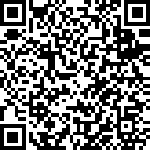

# 如何使用 jQuery 生成二维码

> 原文:[https://dev . to/moreonfew/how-to-generate-QR code-using-jquery-3p 85](https://dev.to/moreonfew/how-to-generate-qr-code-using-jquery-3p85)

**QR 码**或**快速响应码**是一种方形矩阵条形码，其中包含编码数据。QR 码也可以使用 JavaScript 或 jquery 生成**，在本文中，我们将集中讨论如何使用 jQuery 生成 QR 码。二维码最近变得非常普遍，尤其是在平板电脑和带摄像头的智能手机等便携式设备中。这使得在一个小的盒式条形码中存储不同类型的信息变得很容易。我通常在二维码中存储了网址的产品上找到它，只要我扫描它，我的智能手机就会向我显示其中编码的网址，还会向我显示一个按钮，让我转到嵌入的 URL。它也可以在一些身份证上找到，数据以不同的格式存储，如 XML 或文本等。基本上，二维码已经变得非常方便，在网络上变得非常普遍。**

 **随着二维码在网络上的传播，许多客户要求在网站上显示二维码，以便用户可以打印二维码，在他们的设备上扫描二维码，或者将其保存为图像以供将来参考。随着这一进步，每个人都有一个普遍的问题是“我们如何动态生成二维码？”嗯，有不同的方法，但我们将研究如何使用 jQuery 生成 QR 码。

> 你知道吗？
> 
> “QR Code”一词是 [DENSO WAVE](http://www.qrcode.com/en/faqpatent.html) 在日本、美国、澳大利亚和欧洲注册的商标。

## 使用 jQuery 生成二维码

嗯，jQuery 没有内置的方法来做这件事，但是 Jerome Etienne 写了一个 jQuery [插件](https://github.com/jeromeetienne/jquery-qrcode)，它实际上是由 Kazuhiko Arase(他用不同的编程语言写的)写的[库](https://kazuhikoarase.github.io/qrcode-generator/)的包装。两者都是在麻省理工学院的许可下发布的。

### 使用 jQuery 生成二维码的步骤

以下是使用 jQuery 生成 QR 码的步骤。根据您开发页面的方式，您可能需要在页面上包含不同的插件。然而，概念是相同的。

#### 第一步。

首先，您必须下载 jQuery 核心文件。你可以从 jQuery 的官方网站上找到答案。

运筹学

你也可以链接到 google 或任何其他 [jQuery CDN](https://jquery.com/download/#using-jquery-with-a-cdn) 上的 jQuery 文件[。如果您在项目中使用 npm 来管理包，那么您可能希望使用 npm](https://developers.google.com/speed/libraries/devguide#jquery) 来[安装最新的 jquery 包。](https://www.moreonfew.com/how-to-install-specific-version-of-npm-package/)

#### 第二步。

其次，从 [GIT Hub 页面](https://github.com/jeromeetienne/jquery-qrcode)下载并包含 [jquery.qrcode.min.js](https://github.com/jeromeetienne/jquery-qrcode/blob/master/jquery.qrcode.min.js) 文件。

现在你的代码可能看起来像下面这样:

```
<script src="https://ajax.googleapis.com/ajax/libs/jquery/3.6.0/jquery.min.js"></script> 
<script type="text/javascript" src="jquery.qrcode.min.js"></script> 
```

<svg width="20px" height="20px" viewBox="0 0 24 24" class="highlight-action crayons-icon highlight-action--fullscreen-on"><title>Enter fullscreen mode</title></svg> <svg width="20px" height="20px" viewBox="0 0 24 24" class="highlight-action crayons-icon highlight-action--fullscreen-off"><title>Exit fullscreen mode</title></svg>

#### 第三步。

第三，创建一个 DOM 元素，如 DIV 或 span 等，用作生成的 QR 码的容器。我们将在示例中使用一个 DIV。

```
<div id="qrcodeholder"> </div> 
```

<svg width="20px" height="20px" viewBox="0 0 24 24" class="highlight-action crayons-icon highlight-action--fullscreen-on"><title>Enter fullscreen mode</title></svg> <svg width="20px" height="20px" viewBox="0 0 24 24" class="highlight-action crayons-icon highlight-action--fullscreen-off"><title>Exit fullscreen mode</title></svg>

#### 第四步。

最后，调用 qrcode 插件函数，将参数和数据编码到 QR Code 中。

jQuery qrcode 插件的参数包括要编码的文本或数据、生成的 QR 码的宽度和高度以及呈现模式。**渲染**参数有两个值，即“画布”和“表格”。表值可用于不支持 HTML5 画布的浏览器。

```
//Put this code in your js file or wrap it within the <script></script> tags
//Wrap it within $(document).ready() to invoke the function after DOM loads.

$(document).ready(function(){

$('#qrcodeholder').qrcode({
        text    : "https://moreonfew.com/generate-qr-code-using-jquery",
        render  : "canvas", // 'canvas' or 'table'. Default value is 'canvas'
        background : "#ffffff",
        foreground : "#000000",
        width : 150,
        height: 150
    });

}); 
```

<svg width="20px" height="20px" viewBox="0 0 24 24" class="highlight-action crayons-icon highlight-action--fullscreen-on"><title>Enter fullscreen mode</title></svg> <svg width="20px" height="20px" viewBox="0 0 24 24" class="highlight-action crayons-icon highlight-action--fullscreen-off"><title>Exit fullscreen mode</title></svg>

上述代码生成以下二维码:

[](https://res.cloudinary.com/practicaldev/image/fetch/s--3_JSMDor--/c_limit%2Cf_auto%2Cfl_progressive%2Cq_auto%2Cw_880/https://i0.wp.com/www.moreonfew.com/wp-content/uploads/2013/01/QR-Code-Generated-using-jQuery.png%3Fw%3D1440%26ssl%3D1) 
*使用 jQuery 生成的二维码*

用 jQuery 生成二维码不是很容易吗？同样，您也可以使用 JavaScript 生成 QR 码。找到你可以使用的合适的插件。然而，请检查你正在使用的插件是否由它的作者维护和更新。希望你喜欢这篇文章。也请像我们一样关注脸书。你也可以在[推特](https://twitter.com/moreonfew)上关注我们，获取有趣的提示和技巧。如果你喜欢这篇文章，请和你的朋友分享。分享你的想法。

帖子[如何使用 jQuery](https://www.moreonfew.com/generate-qr-code-using-jquery/) 生成二维码最早出现在 [MoreOnFew](https://www.moreonfew.com) 上。**