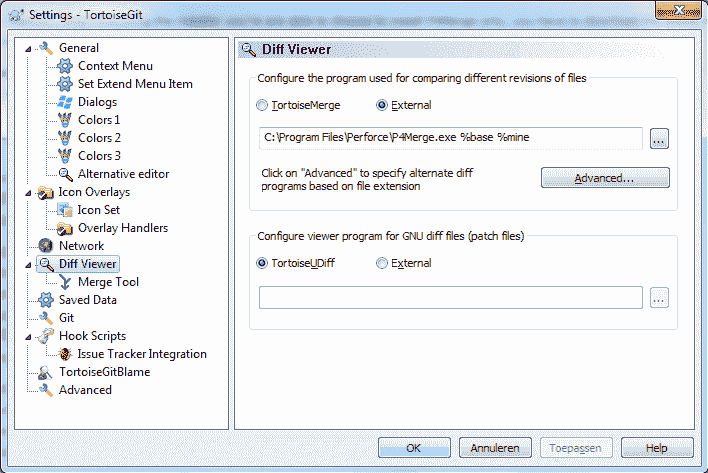
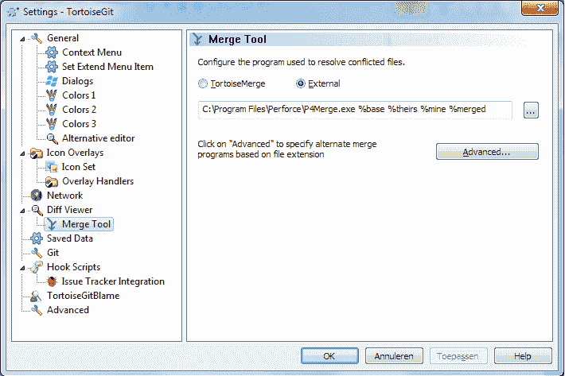

# 使用 P4Merge 和 TortoiseGit

> 原文:[https://dev . to/robinvanderknaap/using-P4 merge-with-tortoisegit-29cj](https://dev.to/robinvanderknaap/using-p4merge-with-tortoisegit-29cj)

我目前工作的团队使用 [Perforce](http://www.perforce.com/products/perforce) 作为他们的版本系统。我个人更喜欢 Git 而不是 Perforce，但是 Perforce 有一个很棒的合并/区分工具，叫做 [P4Merge](http://www.perforce.com/product/components/perforce_visual_merge_and_diff_tools) 。幸运的是，你可以单独安装 P4Merge，而不需要系统的其他部分。在使用 Git 时，我主要使用 Bash 和 TortoiseGit，本文演示了如何将 P4Merge 与 TortoiseGit 集成。

### 安装 P4Merge

P4Merge 包含在 P4 安装程序中，当执行安装程序时，你只能安装 P4Merge，但是你必须下载整个安装程序。按照以下步骤安装 P4Merge:

*   前往[http://www.perforce.com/downloads/complete_list](http://www.perforce.com/downloads/complete_list)
*   单击“按平台浏览”选项卡
*   选择了一个平台
*   选择了一个操作系统
*   下载 P4Merge
*   运行安装程序，只选择 P4Merge 进行安装

### 用 TortoiseGit 设置比较查看器

按照以下步骤将 P4Merge 设置为 TortoiseGit 的默认比较查看器:

*   从 Windows 开始菜单打开 TortoiseGit->设置
*   从设置树中选择“比较查看器”
*   选择使用外部工具而不是 TortoiseMerge
*   指定以下路径和参数:C:\ Program Files \ Perforce \ P4 merge . exe % base % mine

[T2】](https://res.cloudinary.com/practicaldev/image/fetch/s--c8d0CpJo--/c_limit%2Cf_auto%2Cfl_progressive%2Cq_auto%2Cw_880/https://cdn-images-1.medium.com/max/708/0%2AEevNzqzh5PvfQCca.png)

### 用 TortoiseGit 设置合并工具

按照以下步骤将 P4Merge 设置为 TortoiseGit 的默认合并工具:

*   从 Windows 开始菜单打开 TortoiseGit->设置
*   从设置树中选择“比较查看器”下的“合并工具”
*   选择使用外部工具而不是 TortoiseMerge
*   指定以下路径和参数:C:\ Program Files \ Perforce \ P4 merge . exe % base % theirs % mine % merged

[T2】](https://res.cloudinary.com/practicaldev/image/fetch/s--xG1dONUR--/c_limit%2Cf_auto%2Cfl_progressive%2Cq_auto%2Cw_880/https://cdn-images-1.medium.com/max/710/0%2AUEGdgw3zMsxDdaYC.png)

### 设置 Bash

StackOverflow 上的 [this](http://stackoverflow.com/a/2235841/426840) 回答解释了 Bash 中的 P4Merge 与 GIT 的集成。