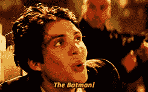

# 石头、布、剪刀的乐趣

> 原文:[https://dev.to/sdball/fun-with-rock-paper-scissors-2j5d](https://dev.to/sdball/fun-with-rock-paper-scissors-2j5d)

James Edward Gray II 的 Ruby 测验#16 实现了石头、剪子、布游戏类，以便在由给定游戏类管理的游戏场上进行竞争。今天，我们为了一点编码的乐趣而重温这个测验。我们将实现一些简单的播放器，然后继续学习一些基本的元编程技术，并编写可以互相操纵或操纵游戏本身的播放器。

如果你想跟上:

```
$ git clone git://github.com/sdball/ruby_quiz.git

$ cd ruby_quiz/16

# play the "always rock" player against the "always scissors" player
$ ruby -I . rock_paper_scissors.rb players/always_rock.rb players/always_scissors.rb
AlwaysRock vs. AlwaysScissors
  AlwaysRock: 1000
  AlwaysScissors: 0
  AlwaysRock Wins 
```

<svg width="20px" height="20px" viewBox="0 0 24 24" class="highlight-action crayons-icon highlight-action--fullscreen-on"><title>Enter fullscreen mode</title></svg> <svg width="20px" height="20px" viewBox="0 0 24 24" class="highlight-action crayons-icon highlight-action--fullscreen-off"><title>Exit fullscreen mode</title></svg>

## 简单玩家

没错。这是一个非常简单的玩家类的样子。

```
# Michael Bluth
class AlwaysRock < Player
  def choose
    :rock
  end
end 
```

<svg width="20px" height="20px" viewBox="0 0 24 24" class="highlight-action crayons-icon highlight-action--fullscreen-on"><title>Enter fullscreen mode</title></svg> <svg width="20px" height="20px" viewBox="0 0 24 24" class="highlight-action crayons-icon highlight-action--fullscreen-off"><title>Exit fullscreen mode</title></svg>

`rock_paper_scissors.rb`文件定义了一个`Player`类，一个`Game`类，并提供了运行竞赛的脚本。我们自己的自定义播放器类必须从给定的播放器类继承，并实现一个返回`:rock`、`:paper`或`:scissors`的`choose`方法。我们的玩家可以选择实现一个`result`方法，作为游戏的回调，让我们的玩家看到他们游戏的结果。如果我们的玩家有一个`initialize`方法，它会被对手的类名调用。

所以，回到总是选择摇滚的迈克尔·布鲁斯(或者可怜的可预测的巴特)。他的`choose`方法返回符号`:rock`。简单。让我们写一个玩家来打败他。也容易。

```
# GOB
class AlwaysPaper < Player
  def choose
    :paper
  end
end 
```

<svg width="20px" height="20px" viewBox="0 0 24 24" class="highlight-action crayons-icon highlight-action--fullscreen-on"><title>Enter fullscreen mode</title></svg> <svg width="20px" height="20px" viewBox="0 0 24 24" class="highlight-action crayons-icon highlight-action--fullscreen-off"><title>Exit fullscreen mode</title></svg>

GOB 会 100%击败 Michael Bluth。

```
$ ruby -I . rock_paper_scissors.rb players/always_rock.rb players/always_paper.rb
AlwaysRock vs. AlwaysPaper
  AlwaysRock: 0
  AlwaysPaper: 1000
  AlwaysPaper Wins 
```

<svg width="20px" height="20px" viewBox="0 0 24 24" class="highlight-action crayons-icon highlight-action--fullscreen-on"><title>Enter fullscreen mode</title></svg> <svg width="20px" height="20px" viewBox="0 0 24 24" class="highlight-action crayons-icon highlight-action--fullscreen-off"><title>Exit fullscreen mode</title></svg>

好了，现在让我们写一个玩家来打败他们两个。一贯如此。

## 无功而返

```
class Reactive < Player
  MOVE_THAT_BEATS = {
    rock: :paper,
    paper: :scissors,
    scissors: :rock
  }

  def choose
    @my_move || :paper
  end

  def result(my_move, opponent_move, outcome)
    @my_move = MOVE_THAT_BEATS[opponent_move]
  end
end 
```

<svg width="20px" height="20px" viewBox="0 0 24 24" class="highlight-action crayons-icon highlight-action--fullscreen-on"><title>Enter fullscreen mode</title></svg> <svg width="20px" height="20px" viewBox="0 0 24 24" class="highlight-action crayons-icon highlight-action--fullscreen-off"><title>Exit fullscreen mode</title></svg>

这个播放器有点意思，但仍然很简单。反应有一个常数`MOVE_THAT_BEATS`，它将移动映射到将击败它们的移动。然后 Reactive 使用这些知识来下一步棋，击败对手的最后一步棋(或最初的`:paper`)。这种策略在对付总是做同样动作的玩家时会非常有效。

```
$ ruby -I . rock_paper_scissors.rb players/always_rock.rb players/always_paper.rb players/reactive.rb
AlwaysRock vs. Reactive
  AlwaysRock: 0
  Reactive: 1000
  Reactive Wins
AlwaysPaper vs. Reactive
  AlwaysPaper: 0.5
  Reactive: 999.5
  Reactive Wins 
```

<svg width="20px" height="20px" viewBox="0 0 24 24" class="highlight-action crayons-icon highlight-action--fullscreen-on"><title>Enter fullscreen mode</title></svg> <svg width="20px" height="20px" viewBox="0 0 24 24" class="highlight-action crayons-icon highlight-action--fullscreen-off"><title>Exit fullscreen mode</title></svg>

是的，总是岩石输掉每一场比赛，因为反应从开始玩纸。纸得到了一个平局，然后失去了每一场比赛。

现在，让我们写一个能击败所有玩家的玩家。

## 随机玩家

理论上来说，剪刀石头布的最佳策略是完全随机。对于计算机来说，这是一个非常简单的策略(尽管对于人类来说非常困难)，所以接下来让我们编写代码。

```
class RandomPlayer < Player
  def choose
    [:rock, :paper, :scissors].shuffle.first
  end
end 
```

<svg width="20px" height="20px" viewBox="0 0 24 24" class="highlight-action crayons-icon highlight-action--fullscreen-on"><title>Enter fullscreen mode</title></svg> <svg width="20px" height="20px" viewBox="0 0 24 24" class="highlight-action crayons-icon highlight-action--fullscreen-off"><title>Exit fullscreen mode</title></svg>

这很简单。让我们随机与目前为止的一些玩家进行较量。

```
$ ruby -I . rock_paper_scissors.rb players/always_rock.rb players/random.rb
# out of 10 runs, Random won 8 games

$ ruby -I . rock_paper_scissors.rb players/reactive.rb players/random.rb
# out of 10 runs, Random won 8 games 
```

<svg width="20px" height="20px" viewBox="0 0 24 24" class="highlight-action crayons-icon highlight-action--fullscreen-on"><title>Enter fullscreen mode</title></svg> <svg width="20px" height="20px" viewBox="0 0 24 24" class="highlight-action crayons-icon highlight-action--fullscreen-off"><title>Exit fullscreen mode</title></svg>

有趣，但不那么有趣。我们写一个玩家观察他们的对手并建立一个击败他们的策略怎么样？这个播放器会比我们之前写的更复杂一些。

## 图案匹配玩家

计划是:建立一个模式记忆，包括玩家的棋步，对手的棋步，以及对手在这些条件下的下一步棋步。每次移动后:

*   还记得刚刚玩过的招式吗
*   记录*前*局的棋步和对手的棋步
*   使用游戏模式记录来确定对手下一步可能的行动，并采取击败它的行动

这个模式集将允许我们进行观察，例如“最近十次我玩石头，我的对手玩纸，我的对手的下一步是剪刀”或“最近 97 次我玩石头，我的对手玩剪刀，我的对手在 96%的时间里玩剪刀”。

```
class PatternMatching < Player
  MOVE_THAT_BEATS = {
    rock: :paper,
    paper: :scissors,
    scissors: :rock
  }
  def initialize(opponent)
    @first_game = true
    @patterns = {
      rock: {},
      paper: {},
      scissors: {}
    }
  end

  def choose
    @my_move || :rock
  end

  def result(mine, theirs, outcome)
    store_moves(mine, theirs)
    plan_next_move
    @first_game = false
  end

  private
  def store_moves(mine, theirs)
    unless @first_game
      store_pattern(mine, theirs)
    end
    @my_last_move = mine
    @their_last_move = theirs
  end

  def store_pattern(mine, theirs)
    if @patterns[@my_last_move][@their_last_move]
      @patterns[@my_last_move][@their_last_move] << theirs
    else
      @patterns[@my_last_move][@their_last_move] = [theirs]
    end
  end

  def plan_next_move
    @my_move = MOVE_THAT_BEATS[their_likely_next_move] || :rock
  end

  def their_likely_next_move
    their_moves = @patterns[@my_last_move][@their_last_move]
    return [:rock, :paper, :scissors].shuffle.first if their_moves.nil?
    count = Hash.new(0)
    their_moves.each do |move|
      count[move] += 1
    end
    count.sort_by {|key, value| value}.last.first
  end
end 
```

<svg width="20px" height="20px" viewBox="0 0 24 24" class="highlight-action crayons-icon highlight-action--fullscreen-on"><title>Enter fullscreen mode</title></svg> <svg width="20px" height="20px" viewBox="0 0 24 24" class="highlight-action crayons-icon highlight-action--fullscreen-off"><title>Exit fullscreen mode</title></svg>

这个玩家看起来很复杂，但唯一棘手的逻辑是围绕着整个“这是不是第一场比赛？”我对自己在这里的解决方式不太满意，但它完成了任务。

`store_pattern`和`their_likely_next_move`是两个关键方法。移动模式存储为嵌套散列:

```
[my move][opponent move] => [array of observed moves]

[:rock][:paper] => [
  :scissors,
  :paper,
  :scissors,
  :scissors,
  :scissors,
  :paper
] 
```

<svg width="20px" height="20px" viewBox="0 0 24 24" class="highlight-action crayons-icon highlight-action--fullscreen-on"><title>Enter fullscreen mode</title></svg> <svg width="20px" height="20px" viewBox="0 0 24 24" class="highlight-action crayons-icon highlight-action--fullscreen-off"><title>Exit fullscreen mode</title></svg>

`their_likely_next_move`方法查看模式，并统计到目前为止看到的数据。如果还没有数据，它会随机猜测。

让我们看看我们的模式匹配器进展如何！

```
$ ruby -I . rock_paper_scissors.rb players/always_rock.rb players/pattern_matching.rb
AlwaysRock vs. PatternMatching
  AlwaysRock: 1.0
  PatternMatching: 999.0
  PatternMatching Wins 
```

<svg width="20px" height="20px" viewBox="0 0 24 24" class="highlight-action crayons-icon highlight-action--fullscreen-on"><title>Enter fullscreen mode</title></svg> <svg width="20px" height="20px" viewBox="0 0 24 24" class="highlight-action crayons-icon highlight-action--fullscreen-off"><title>Exit fullscreen mode</title></svg>

还不错！我们的模式匹配器正确地确定了 Always Rock 使用的简单模式。

```
$ ruby -I . rock_paper_scissors.rb players/reactive.rb players/pattern_matching.rb
Reactive vs. PatternMatching
  Reactive: 3.5
  PatternMatching: 996.5
  PatternMatching Wins 
```

<svg width="20px" height="20px" viewBox="0 0 24 24" class="highlight-action crayons-icon highlight-action--fullscreen-on"><title>Enter fullscreen mode</title></svg> <svg width="20px" height="20px" viewBox="0 0 24 24" class="highlight-action crayons-icon highlight-action--fullscreen-off"><title>Exit fullscreen mode</title></svg>

嘭！我们的模式匹配器很容易计算出我们的简单反应型玩家可能会做什么。现在是真正的挑战。

```
$ ruby -I . rock_paper_scissors.rb players/random.rb players/pattern_matching.rb
RandomPlayer vs. PatternMatching
  RandomPlayer: 491.0
  PatternMatching: 509.0
  PatternMatching Wins

$ ruby -I . rock_paper_scissors.rb players/random.rb players/pattern_matching.rb
RandomPlayer vs. PatternMatching
  RandomPlayer: 518.5
  PatternMatching: 481.5
  RandomPlayer Wins

# it goes back and forth 
```

<svg width="20px" height="20px" viewBox="0 0 24 24" class="highlight-action crayons-icon highlight-action--fullscreen-on"><title>Enter fullscreen mode</title></svg> <svg width="20px" height="20px" viewBox="0 0 24 24" class="highlight-action crayons-icon highlight-action--fullscreen-off"><title>Exit fullscreen mode</title></svg>

因此`PatternMatching`在与`RandomPlayer`的比赛中表现良好，但无法持续获胜。让我们制造一个能始终如一地彻底击败`RandomPlayer`的玩家。让我们制作一个*欺骗*的玩家。

## 骗子

```
class Cheater < Player
  def initialize(opponent)
    Kernel.const_get(opponent).class_eval('def choose; :scissors; end')
  end

  def choose
    :rock
  end
end 
```

<svg width="20px" height="20px" viewBox="0 0 24 24" class="highlight-action crayons-icon highlight-action--fullscreen-on"><title>Enter fullscreen mode</title></svg> <svg width="20px" height="20px" viewBox="0 0 24 24" class="highlight-action crayons-icon highlight-action--fullscreen-off"><title>Exit fullscreen mode</title></svg>

Mwahaha！骗子利用到目前为止未使用的游戏功能得到对手的名字。利用这一点和一些红宝石魔术骗子催眠它的对手总是玩剪刀。

有用吗？绝对的。

```
$ ruby -I . rock_paper_scissors.rb players/always_rock.rb players/cheater.rb
AlwaysRock vs. Cheater
  AlwaysRock: 0
  Cheater: 1000
  Cheater Wins

$ ruby -I . rock_paper_scissors.rb players/reactive.rb players/cheater.rb
Reactive vs. Cheater
  Reactive: 0
  Cheater: 1000
  Cheater Wins

$ ruby -I . rock_paper_scissors.rb players/pattern_matching.rb players/cheater.rb
PatternMatching vs. Cheater
  PatternMatching: 0
  Cheater: 1000
  Cheater Wins

$ ruby -I . rock_paper_scissors.rb players/random.rb players/cheater.rb
RandomPlayer vs. Cheater
  RandomPlayer: 0
  Cheater: 1000
  Cheater Wins 
```

<svg width="20px" height="20px" viewBox="0 0 24 24" class="highlight-action crayons-icon highlight-action--fullscreen-on"><title>Enter fullscreen mode</title></svg> <svg width="20px" height="20px" viewBox="0 0 24 24" class="highlight-action crayons-icon highlight-action--fullscreen-off"><title>Exit fullscreen mode</title></svg>

这是怎么回事？为了回答这个问题，让我们深入到`irb`

```
$ irb -I .
1.9.3p0 :001 > require 'rock_paper_scissors'
 => true
1.9.3p0 :002 > require 'players/always_rock'
 => true 
```

<svg width="20px" height="20px" viewBox="0 0 24 24" class="highlight-action crayons-icon highlight-action--fullscreen-on"><title>Enter fullscreen mode</title></svg> <svg width="20px" height="20px" viewBox="0 0 24 24" class="highlight-action crayons-icon highlight-action--fullscreen-off"><title>Exit fullscreen mode</title></svg>

好的，我们在 irb 中，我们已经有了我们的游戏和一个玩家。让我们看看骗子在做什么。

```
Kernel.const_get(opponent).class_eval('def choose; :scissors; end')

1.9.3p0 :003 > Kernel.const_get('AlwaysRock')
 => AlwaysRock
1.9.3p0 :004 > Kernel.const_get('AlwaysRock').class
 => Class 
```

<svg width="20px" height="20px" viewBox="0 0 24 24" class="highlight-action crayons-icon highlight-action--fullscreen-on"><title>Enter fullscreen mode</title></svg> <svg width="20px" height="20px" viewBox="0 0 24 24" class="highlight-action crayons-icon highlight-action--fullscreen-off"><title>Exit fullscreen mode</title></svg>

检查模块中具有给定名称的常数。因为一个类被定义为一个常量，并且`Kernel`覆盖了每个类，我们可以让`Kernel`为我们找到对手的类。这就是我们正在做的。

基本上`Kernel.const_get('AlwaysRock')`是将字符串“AlwaysRock”转换成常量的一种简单方法。

现在`class_eval`。这个方法对一个类说，“评估这个字符串，就像它是你的代码的一部分一样。”

```
1.9.3p0 :005 > String.class_eval('def magic; "magic!"; end')
 => nil
1.9.3p0 :006 > "hi".magic
 => "magic!" 
```

<svg width="20px" height="20px" viewBox="0 0 24 24" class="highlight-action crayons-icon highlight-action--fullscreen-on"><title>Enter fullscreen mode</title></svg> <svg width="20px" height="20px" viewBox="0 0 24 24" class="highlight-action crayons-icon highlight-action--fullscreen-off"><title>Exit fullscreen mode</title></svg>

把这些放在一起，我们的骗子:

1.  获取对手名字的字符串，并将其转换为常量以获取对手的职业。
2.  用它控制的新`choose`方法改写它的对手。
3.  击败对手修改选择方法。

```
1.9.3p0 :007 > AlwaysRock.new('Cheater').choose
 => :rock
1.9.3p0 :008 > Kernel.const_get('AlwaysRock').class_eval('def choose; :scissors; end')
=> nil
1.9.3p0 :009 > AlwaysRock.new('Cheater').choose
=> :scissors 
```

<svg width="20px" height="20px" viewBox="0 0 24 24" class="highlight-action crayons-icon highlight-action--fullscreen-on"><title>Enter fullscreen mode</title></svg> <svg width="20px" height="20px" viewBox="0 0 24 24" class="highlight-action crayons-icon highlight-action--fullscreen-off"><title>Exit fullscreen mode</title></svg>

阴险！更糟糕的是，如果你和两个以上的玩家进行比赛，骗子会永久地改变对手，让他们总是使用他们重新定义的选择方法。

让我们公平竞争，迫使作弊者公平竞争。

## 公平竞争的领域

LevelPlayingField 通过强烈抵制骗子的催眠术来避免被骗子操纵。作弊者通过修改对手的职业来工作，所以 LevelPlayingField 没有由它的职业定义的选择方法。LevelPlayingField 在初始化时定义了自己的 choose 方法。

```
class LevelPlayingField < Player
  def initialize(opponent)
    # prevent cheater from winning by waiting to pick a strategy
    self.class.class_eval do
      def choose
        [:rock, :paper, :scissors].shuffle.first
      end
    end
  end
end 
```

<svg width="20px" height="20px" viewBox="0 0 24 24" class="highlight-action crayons-icon highlight-action--fullscreen-on"><title>Enter fullscreen mode</title></svg> <svg width="20px" height="20px" viewBox="0 0 24 24" class="highlight-action crayons-icon highlight-action--fullscreen-off"><title>Exit fullscreen mode</title></svg>

是的，没错。LevelPlayingField 使用了与作弊者相同的技巧，但在自己的代码上试图保护自己的策略逻辑。

```
1.9.3p0 :010 > require 'players/level_playing_field'
 => true
1.9.3p0 :011 > LevelPlayingField.new('Cheater').choose
=> :paper
1.9.3p0 :012 > Kernel.const_get('LevelPlayingField').class_eval('def choose; :scissors; end')
=> nil
1.9.3p0 :011 > LevelPlayingField.new('Cheater').choose
=> :rock # LevelPlayingField is random so you actually might see :scissors here

$ ruby -I . rock_paper_scissors.rb players/cheater.rb players/level_playing_field.rb
Cheater vs. LevelPlayingField
  Cheater: 496.5
  LevelPlayingField: 503.5
  LevelPlayingField Wins 
```

<svg width="20px" height="20px" viewBox="0 0 24 24" class="highlight-action crayons-icon highlight-action--fullscreen-on"><title>Enter fullscreen mode</title></svg> <svg width="20px" height="20px" viewBox="0 0 24 24" class="highlight-action crayons-icon highlight-action--fullscreen-off"><title>Exit fullscreen mode</title></svg>

现在这个工作了，但是有一个缺陷。我们的 LevelPlayingField 玩家只有在骗子之后初始化*时才成功。* 

```
$ ruby -I . rock_paper_scissors.rb players/level_playing_field.rb players/cheater.rb
LevelPlayingField vs. Cheater
  LevelPlayingField: 0
  Cheater: 1000
  Cheater Wins 
```

<svg width="20px" height="20px" viewBox="0 0 24 24" class="highlight-action crayons-icon highlight-action--fullscreen-on"><title>Enter fullscreen mode</title></svg> <svg width="20px" height="20px" viewBox="0 0 24 24" class="highlight-action crayons-icon highlight-action--fullscreen-off"><title>Exit fullscreen mode</title></svg>

如果作弊者在 LevelPlayingField 完成了尝试隔离其选择方法的戏法后进场，那么作弊者仍然会覆盖 LevelPlayingField 的选择方法。这是一个非常难以战胜的策略。我们用来巧妙地向骗子隐藏我们的选择方法的任何诡计最终都可以被骗子提供的新的`choose`方法绕过。

即使我们写了一个移除骗子作弊能力的播放器，如果骗子先被加载，那么它就赢了。

```
class LevelPlayingField < Player
  def initialize(opponent)
    # rewrite class_eval to prevent cheating
    Module.class_eval('def class_eval(obj) end')
  end
  def choose
    [:rock, :paper, :scissors].shuffle.first
  end
end 
```

<svg width="20px" height="20px" viewBox="0 0 24 24" class="highlight-action crayons-icon highlight-action--fullscreen-on"><title>Enter fullscreen mode</title></svg> <svg width="20px" height="20px" viewBox="0 0 24 24" class="highlight-action crayons-icon highlight-action--fullscreen-off"><title>Exit fullscreen mode</title></svg>

所以让我们引进一个总是赢的玩家。一个胜过骗子的玩家。修改游戏本身的玩家。 [](https://res.cloudinary.com/practicaldev/image/fetch/s--qnlb5SDV--/c_limit%2Cf_auto%2Cfl_progressive%2Cq_auto%2Cw_880/https://blotcdn.com/blog_a48c2be3d1364623b1c4d68dc80015b4/_image_cache/e9dbc072-3bbe-42ec-b70c-1c626e56d6a3.png) 那个小兵！

## 小兵

```
class Batman < Player
  def initialize(opponent)
    Game.class_eval do
      def play( match )
        match.times do
          next win @player1, :rock, :scissors if @player1.instance_of? Batman
          next win @player2, :rock, :scissors if @player2.instance_of? Batman
        end
      end
    end
  end
end 
```

<svg width="20px" height="20px" viewBox="0 0 24 24" class="highlight-action crayons-icon highlight-action--fullscreen-on"><title>Enter fullscreen mode</title></svg> <svg width="20px" height="20px" viewBox="0 0 24 24" class="highlight-action crayons-icon highlight-action--fullscreen-off"><title>Exit fullscreen mode</title></svg>

蝙蝠侠的游戏策略是进入游戏类本身，并确保无论玩什么他都是赢家。不仅如此，蝙蝠侠完全改变了所有其他玩家比赛的游戏。他们都被记录为平局，因为只有蝙蝠侠能赢。

```
$ ruby -I . rock_paper_scissors.rb players/cheater.rb players/batman.rb
Cheater vs. Batman
  Cheater: 0
  Batman: 1000
  Batman Wins

$ ruby -I . rock_paper_scissors.rb players/batman.rb players/cheater.rb
Batman vs. Cheater
  Batman: 1000
  Cheater: 0
  Batman Wins

$ ruby -I . rock_paper_scissors.rb players/batman.rb players/reactive.rb
Batman vs. Reactive
  Batman: 1000
  Reactive: 0
  Batman Wins 
```

<svg width="20px" height="20px" viewBox="0 0 24 24" class="highlight-action crayons-icon highlight-action--fullscreen-on"><title>Enter fullscreen mode</title></svg> <svg width="20px" height="20px" viewBox="0 0 24 24" class="highlight-action crayons-icon highlight-action--fullscreen-off"><title>Exit fullscreen mode</title></svg>

天哪，这让你几乎为蝙蝠侠的对手感到难过。