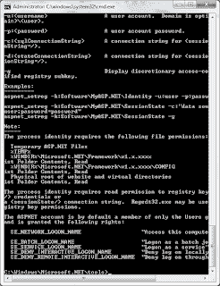
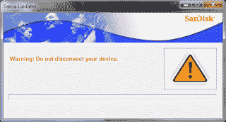

# 不要让你的用户无所适从

> 原文：<https://dev.to/briannipper/dont-leave-your-users-hanging-2cmb>

|  |
|命令提示符可以显示正在执行的操作|

如果你创建软件，你能为用户创造的最糟糕的体验之一就是“挂起”对话框。最近我得到了一个有点旧的 MP3 播放器；具体来说，这是一个闪迪 Sansa Express 2GB。该设备本身可以与大多数不是 iPod 的 MP3 播放器配对。一个有趣的特点是，你可以从收音机里录音，碰巧上周末我需要从一个调频电台录制一些音频，这个电台在我参加的一个集会上播放。跳到有趣的一点，我发现自己试图安装新的固件，使它能够列出从录音创建的 WAV 文件。在安装一些东西来安装其他东西(你能说是 inception)之后，我发现自己处于一种沮丧的状态，因为它“看起来”好像固件更新进行得很好；然而，指示进度的对话框已经“似乎”停滞了相当一段时间。因此，正如任何理性的人都会做的那样，我忽略了屏幕上告诉我不要在更新时移除设备的所有警告，我将电源线从插头上拔下，重新开始，在打开和关闭我的计算机至少两次之后，正如任何优秀的技术人员都会告诉你的那样，在你采取任何行动之后，这是非常重要的。在尝试以“简单”的方式(使用供应商的其他软件)安装固件后，我再次“卡住”并放弃了。此时，我相信我可以通过“手动”安装固件来解决这个问题。

|  |
| Sansa 更新程序对话框没有任何进展(在哦这么多方面)

Sansa Express-SanDisk(c)2006-2008 |

在跳过提取各种 ZIP 文件和安装不同驱动程序的看似随机的步骤，并确保我在插入设备时按住“音量降低按钮”(又名-)后，我设法回到了之前困扰我的同一个安装屏幕。哦，在这个过程中的某个地方，我必须格式化驱动器才能继续，所以我丢失了我最初试图使用的文件。

在完成各个步骤时，我意识到我可能仅仅因为不耐烦而给自己带来了很大的挫败感，但这真的是我的错吗？嗯，在某种程度上是的，毕竟耐心是一种美德。然而，我倾向于认为大部分的责任在于软件开发人员，他们创造了这样一个没有信息的更新过程。如果这只是一个通过 dos 的命令对话框，他们只是列出了每个受影响的文件或可能采取的行动列表，我可能会更有耐心。现在公平地说，这是一个简单的固件更新，用于一个看似简单的 MP3 播放器，所以确保进度条准确捕捉安装进度的想法可能是较低的优先级，但如果没有任何移动，没有闪烁的指示表明某些事情仍在发生，很容易期望用户会放弃原因并转向更闪亮的东西。

所以不要让你的用户无所适从。让他们有能力窥视正在发生的事情，并告诉他们在响应方面会有什么期待。

**更新**:写完这篇文章 10 分钟后，我发现了一些额外的信息，概述了固件更新的潜在问题是它必须使用 windows XP 机器来完成。幸运的是，我有一台旧的笔记本电脑，装有传统的操作系统(以及各种版本的 Ubuntu ),所以我可以让一切正常工作并更新固件，我确实丢失了一段没有备份的录音，但这就是生活。