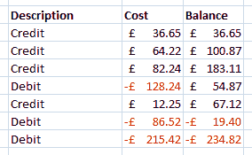

# Excel 公式-好货币！

> 原文：<https://dev.to/adamkdean/excel-formula-nice-currency-51e>

我讨厌在 Excel 中我的货币要么被很好地隔开，要么在负数时显示为红色。有货币，它有漂亮的颜色，对负片来说，这很好。但是会计格式有很好的间距，英镑符号在左边。

现在我可以两者兼得了！

`_-£* #,##0.00;[Red]-£* #,##0.00`

呜！

[T2】](https://res.cloudinary.com/practicaldev/image/fetch/s--5vn7d2QY--/c_limit%2Cf_auto%2Cfl_progressive%2Cq_auto%2Cw_880/http://i.imgur.com/rQhkRyW.png)