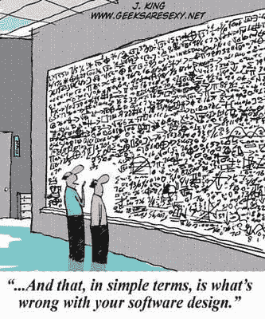

# 软件设计原则

> 原文:[https://dev . to/robinvanderknaap/software-design-principles-2c0j](https://dev.to/robinvanderknaap/software-design-principles-2c0j)

> “编写有效的代码是一回事。写出好的代码是另一回事”

我个人的网络盗版目标之一是捕获、共享和增强网络盗版的现有技术知识和技能。在此框架中，我将定期撰写一篇阐述软件开发过程一个或多个方面的文章。本文概述了软件设计原则，这些原则已成为多年来的行业标准，应由每个程序员都熟悉和应用。

[T2】](https://res.cloudinary.com/practicaldev/image/fetch/s--VOMJbddI--/c_limit%2Cf_auto%2Cfl_progressive%2Cq_auto%2Cw_880/https://cdn-images-1.medium.com/max/333/0%2A2kZi3d9RsrZ-QEeU.jpeg)

### 都是关于适应性的

撰写良好的软体不仅能满足目前的需求，还能满足未来的需求。因此，重要的是，开发人员必须设计程式码，以便于稍后修改。

在应用程序设计过程中，应用程序的可适应性和可维护性也是开发人员的主要质量特性。如果应用程序只是简单的自定义，其他所有功能都可以在以后进行自定义。经常有人认为，需求的变化是编写不良的软件的原因，所有的更改都会使代码变得无法管理。这是不正确的。开发人员必须确保其软件能够抵御自定义和扩展。因此，实际上，只发现了写得不好的软件及其作者的不同要求。

### 症状不良的设计

写得不好的软件是抵抗变化的坏文件。罗伯特·c。Martin (2000)的设计不良:符合指定要求的软件只具有以下一种或多种症状:

*   **刚性**任何变化都会对系统的其他部分造成太大的调整。
*   **脆性**进行调整时，系统的其他部分会发生意外故障。
*   **移动性**难以在另一个应用程序中重复使用代码，因为与当前应用程序存在太多依赖关系。
*   **粘度**在软件中构建绕道比在软件中实际解决问题更容易。

### 高内聚，低耦合

轻松客制化软体的最佳策略，是将系统分为独立元件、高协调度和松散耦合。

协调会表示一个组件的不同功能相互关联的程度。愈协调愈好。在实践中，这意味着使用高度专门化的类，方法通常很少。随着类别功能的增加，其他类别的相依性也会增加，这是软体中的调整。耦合表示不同组件之间的相依性。依赖越少越好。这使代码更易于维护、更易于阅读、更易于测试，并降低了系统的脆弱程度和复杂性。

### 分离顾虑

分簇(SoC)技术(由 Edsger W 引入。Dijkstra，1974)是一个有助于实现松散耦合和高协调的原则。应用 SoC 意味着将一个系统划分为尽可能少的重叠部分，每个部分都有自己的责任。

SoC 通过模块化设置代码、调整模块(封装)的内部操作以及仅通过公共接口进行通信来具体实现。如此一来，模组的内部运作可能会发生变更，而不需变更其他模组，因为介面会保持不变。

在实践中，您可以看到 SoC 的应用程序无处不在，在程序语言中，程序和函数用于分离系统的各个方面，而在面向对象的语言中则使用类。像 MVC 这样的体系结构通过将系统划分为多个逻辑层来实现 SoC，每个层都有自己的预定义职责。

### 面向对象编程

面向对象的编程语言为开发人员提供了将系统划分为大量独立组件(对象)所需的工具和技术。多年来，在 OOP 领域建立了许多业界标准，这些标准通常适用于任何面向对象的编程语言。

我先讨论 OOP 的基本原理，然后讨论一些更为高级的原理，这些原理属于 Robert C 绑定的 s . o . I . d .原则的范畴。马丁，马丁。

### 基础 OOP 原则

OOP 领域的七项标准工作是《四行》(g of)的“设计模式:元素或面向对象的巨型软件”。GoF 将面向对象的设计汇总如下:

你必须找到相关的对象，以正确的粒度将它们分解成类，定义类接口和继承层次，并在它们之间建立关键关系。你的设计应该针对当前的问题，但也要足够通用，以解决未来的问题和需求。

通常，通过跟踪要求和/或用例来识别独立的命名空间和动词。独立的命名空间通常表示对象或对象的属性；动词通常是对象的方法。例如:

**用户**需要在**邮件列表**中增加一个新的**模板用户**

 ***对象**:用户、收件人、邮件列表

T4【方法】T5:收件人

识别物件时，重要的是，物件代表单一程序。过程是对象之间的交互。因此，OOP 与程序设计语言的本质不同。

GoF 提出了两个基本原则:

*   编程到接口，而不是实现
*   优先选择对象组合而不是类继承

第一个原则是使用介面让不同的物件互相通讯。如前所述，使用接口可减少对象之间的连接，从而增强了对未来修改的抵御能力。

下面的代码显示了与类记录器高度关联的类:*