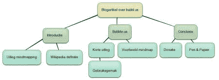

# 思维导图 met Bubbl.us

> 原文:[https://dev . to/robinvanderknaap/mind mapping-met-bubbl-us-4 bed](https://dev.to/robinvanderknaap/mindmapping-met-bubbl-us-4bed)

在“T0”生活包装上，我在几周前第一次遇到“思维导图”这个词。心智映射是一种映射特定主题的思想和/或想法的方法

> 思维导图是一种图表，用于表示单词、想法、任务或其他与中心关键词或想法相关的项目。思维导图用于生成、可视化、构建和分类想法，并作为学习、组织、解决问题、决策和写作的辅助工具。
> 
> [*维基思维导图*](http://en.wikipedia.org/wiki/Mindmapping)

我对这个方法很感兴趣，因为我花了很长时间寻找一种方法来快速捕捉、整理和查找某些主题的思想。您可以创建一个 mindmap 文件夹的主题有很多:新软件产品的设计、报价、房子的设计或博客文章的想法。基本上，你能想到的一切。

在搜寻之后，我找到了一些工具来帮助你制作这些心智地图。重要的标准是思维导图的创建既快速又简单，你在头脑风暴中，你不希望你的时间和精力被浪费在一个应用上。一个工具偷走了我的心:bubbl.us

bubbl.us 是一个使用 Adobe Flash 功能的 web 应用程序，它很容易使用，您可以立即开始创建一个 minds 文件夹。从一个气球开始，按 enter 键和 tab 键分别创建 childs 和 siblings。你需要建立一个帐户来储存你的大脑皮层。总成本:勉强。

[T2】](https://res.cloudinary.com/practicaldev/image/fetch/s--HuCS1hRI--/c_limit%2Cf_auto%2Cfl_progressive%2Cq_auto%2Cw_880/https://cdn-images-1.medium.com/max/450/0%2A0jvn7z_TO-Di4w8u.jpg)

bubbl.us 是一个 web 应用程序，它的优势是您可以随时随地使用它(当然前提是您有互联网连接)。你以前所有的灵魂伴侣都在云里等着你。此外，还可以与他人共享某些思想地图，这允许进行在线头脑风暴！

我用 bubbl.us 在过去的几个星期里做了一些项目来改变我的想法。到目前为止，对我来说，这是一种快速捕获和整理思想的有效方法。有趣的是你很快就能把所有的想法都扼杀在萌芽状态。它在整个项目中提供了很好的持久性，新的观点和见解也很快得到了应用和记录。

bubbl.us 是完全免费的，所以当你真的要使用这个工具的时候，别忘了捐一点钱来表达你的感激之情。使用 Paypal 可以很容易地做到这一点。

顺便说一句，纸和笔也是心智文件夹的好工具：(请注意)