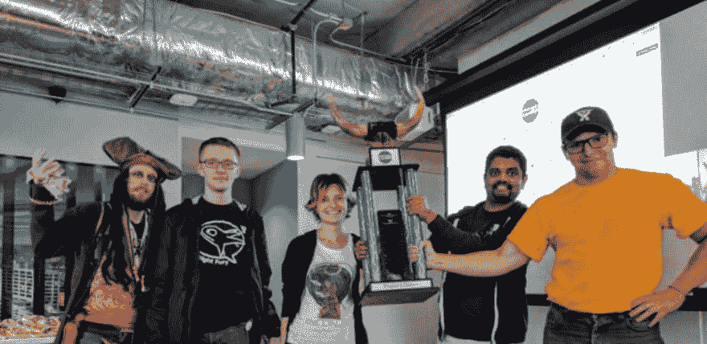
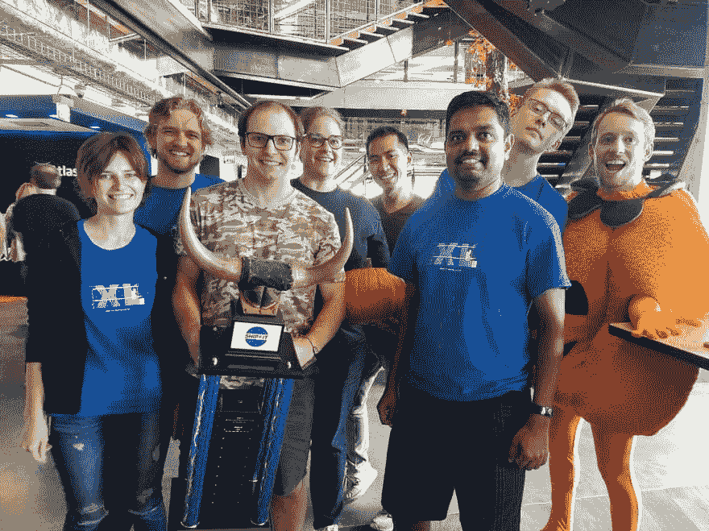

# 2017 年技术成就

> 原文：<https://dev.to/backendandbbq/2017-tech-accomplishments-3n33>

*最初发表于我的博客:* [你所需要的只是后端](http://allyouneedisbackend.com/blog/2018/01/01/2017-tech-accomplishments/)。

[T2】](https://res.cloudinary.com/practicaldev/image/fetch/s--_k1vmESd--/c_limit%2Cf_auto%2Cfl_progressive%2Cq_auto%2Cw_880/https://thepracticaldev.s3.amazonaws.com/i/jc8090vevzf186iua539.png)

评估成就能激励我，给新的成就带来新鲜空气。我相信这是设定目标的必要练习。

我很荣幸成为 2017 年 [Atlassian Stride](http://stride.com) 团队的一员。为公司工作极大地加速了职业发展。

在我的假期中，我分析了去年真正努力的工作(我职业生涯中最难的)，以列出亮点。

## 名单

*   我们的产品 Atlassian Stride 发布了！这已经不是秘密了。您可以申请[提前获取计划](https://signup.stride.com/)并使用。我们将邀请 Hipchat 云客户升级到[Stride](https://www.stride.com/help-center/upgrade-guide)。

*   **我成为了一个地理分布后端团队的技术领导**；Atlassian Stride 产品的一部分。过渡发生在 2016 年 11 月，但第一个项目是由我们的团队(称为 **Stride Transformers** )在 2017 年 2 月交付的。我想，当服务开始在生产环境中服务于真实的人的需求时，我终于理解了新的角色。

*   包括我在内，Stride 变形金刚工程团队从 4 人发展到 8 人。让所有有才华、有激情的人朝着共同的产品目标前进是成功之路的关键。以下是我们作为一个团队交付的一些物品的清单:

    *   我们构建了异步 Python 框架来包装现有的代码库，并在同一领域的其他项目中重用它。节省了我们很多时间，减少了错误、枯燥的任务，还招募了其他团队的成员加入我们，学习框架:)。通过使用该框架，我们为另外 10 个相关项目创建了大约 40 个 Python 服务。所有的基础设施都被定义为代码，并用 CloudFormation 模板进行描述。
    *   我们构建了一个 Python 库，可以生成...其他异步 Python 库 -其他团队内部 API 的客户端。从那以后，兼容性的改变不再是一场噩梦。对我们来说，更新代码库很便宜。
    *   **使用上面提到的工具，我们成功地从头开始构建软件**，交付预定的项目，并将它们投入生产。在生产中启用服务的“亲密感觉”令人难忘。
    *   除了计划中的工作，我们还享受了一些书呆子的乐趣。我们的团队在 2017 年 6 月和 2017 年 9 月连续两次赢得了 [Atlassian ShipIt](https://www.atlassian.com/company/shipit) (季度黑客马拉松)。在奥斯汀的位置和人民的选择提名(其他亚特兰大人投票支持项目)。我了解到，在 24 小时内就可以制作出适用于暂存环境的软件。最重要的是——为第一个项目构建的服务被产品化了，相应地进行了改进，并且已经在生产中运行了。谈到最新的 ShipIt 项目——它入选了 Stride 奖。期待解决这个问题并交付给我们的客户。

[T2】](https://res.cloudinary.com/practicaldev/image/fetch/s--PQChgNhC--/c_limit%2Cf_auto%2Cfl_progressive%2Cq_auto%2Cw_880/http://d1vt1c82ljabfd.cloudfront.nimg/shipit1.png)

[T2】](https://res.cloudinary.com/practicaldev/image/fetch/s--4qz1E-_8--/c_limit%2Cf_auto%2Cfl_progressive%2Cq_auto%2Cw_880/http://d1vt1c82ljabfd.cloudfront.nimg/shipit2.jpg)

*   我认为我学会了如何以正确的方式进行跨团队协作。我很高兴在软件工程领域，你可以吸引全世界的人才。今年，我与位于德克萨斯州、乌克兰、澳大利亚和加利福尼亚州的团队合作。我喜欢你第一次见到和你一起工作了几个月的人的那一刻。去吃午饭:)

*   我略微提高了我的演讲技巧，并为奥斯汀 Python Meetup 做了两次公开演讲。此外，我还在全公司范围内介绍了我们开发的技术，以及针对不同阶段里程碑的十几个演示。可以找到公开讲座的幻灯片:

    *   [如何不用担心，用 Python 3 开始一个项目](/talks/#austin-python-meetup-2017-2)
    *   Pythons 3.5 和 3.6 有什么新功能？

*   **开始了[你所需要的是后台](http://AllYouNeedIsBackend.com)博客**并发表了 9 篇文章。他们中的一些人出现在 HackerNews 上，并连续几天排名前五。我发现分享我的想法对保持知识有序非常有用。

*   **完成 15 门技术在线课程**。主要是在 Amazon Web Services、分布式系统和各种数据存储上:Kafka、Cassandra、Hadoop、Riak 和 CouchDB。

*   **最后，我的 2017 年技术堆栈:**

    *   [Python](https://www.python.org/) ，而且只是 Python 3
    *   [Asyncio](https://docs.python.org/3/library/asyncio.html) 、 [aiohttp](https://aiohttp.readthedocs.io) 和其他 [aio-libs](https://github.com/aio-libs)
    *   [MySQL](https://www.mysql.com/) 、[【弹性搜索】](https://www.elastic.co/products/elasticsearch)、[重定向](https://redis.io/)
    *   亚马逊 Web 服务: [EC2](https://aws.amazon.com/ec2/) ， [S3](https://aws.amazon.com/s3/) ， [SQS](https://aws.amazon.com/sqs/) ， [RDS](https://aws.amazon.com/rds/) ，[elastic cache](https://aws.amazon.com/elasticache/)， [CloudFormation](https://aws.amazon.com/cloudformation/) ， [CloudWatch](https://aws.amazon.com/cloudwatch/)
    *   监控: [Datadog](https://www.datadoghq.com/) ，[elastic search/Logstash/Kibana](https://www.elastic.co/products)， [ElastAlert](https://elastalert.readthedocs.io) ， [Splunk](https://www.splunk.com/)
    *   亚特兰蒂斯工具:[大步](https://www.stride.com/)、[吉拉](https://www.atlassian.com/software/jira)、[斗笠](https://www.atlassian.com/software/bitbucket)、[竹](https://www.atlassian.com/software/bamboo)、[合流](https://www.atlassian.com/software/confluence)和[特雷罗](https://www.atlassian.com/software/trello)

写清单很棒，我真的很享受。我非常感谢 Atlassian 公司和 Stride 组织给了我这个成长的机会。实现所有的目标很难，但我们正在做正确的事情。

我的妻子 Tania 在我与悉尼团队(我们*比他们*早 8 个小时)开会的时候，以及在那之后与我在乌克兰的队友(德克萨斯比他们晚 *8 个小时)的早期合作中表现出了极大的耐心。*

我写了一份 2018 年的技术目标清单，但将在一年后与你分享。我们将看到随着时间的推移会取得什么样的成就。

另外，我还因为吃烧烤和 TexMex 胖了 20 磅。会努力在下一年收获更多。