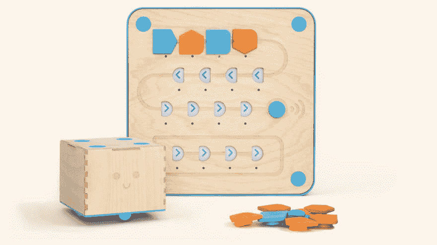
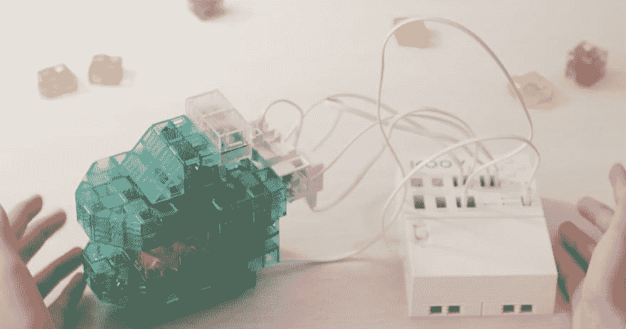
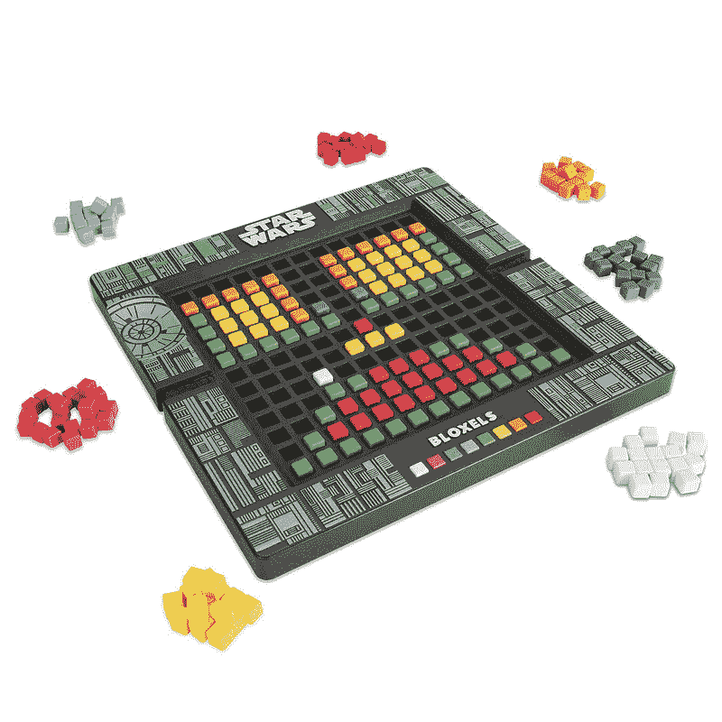
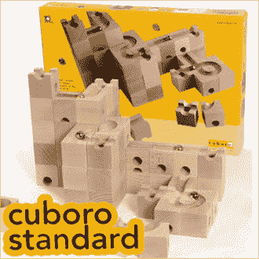

# 4 选择“益智玩具”培养创造能力

> 原文：<https://dev.to/leen/4-choices-of-educational-toys-to-acquire-the-ability-to-create-6dc>

我收集了一个玩具，孩子们可以记住创意。

## 1。[立方托](https://www.primotoys.com/)

 
Cubetto 是一个英国出生的玩具，它“不用数字屏幕”就能提高编程能力。

## 2。[库夫](https://www.sony.com/koov)

## 3\. [BLOXELS](http://home.bloxelsbuilder.com/)

 
你不再需要理解花哨的代码和拥有超级昂贵的电脑程序来制作电子游戏。所有需要的是你的 Bloxels 游戏板，一些积木和一个移动设备，当然，你的想象力，以消除猜测建立自己的视频游戏！

## 4。[库博罗](https://cuboro.ch/en/Info/Sales/USA)

 
也是一个滚球的玩法，但也是一个“在脑子里画球场的图纸，组织起来，塑造出来”的游戏。
当然，当孩子们习惯于玩耍时，你会无意识地这样做，而不是有意识地这样做。