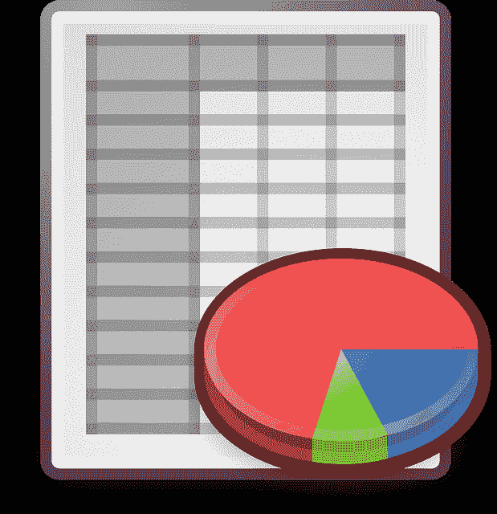

# 用 Python 编写 5 个有趣的任务

> 原文：<https://dev.to/scriptingwithpy/5-tasks-that-would-be-fun-to-script-with-python-bi9>

[T2】](https://res.cloudinary.com/practicaldev/image/fetch/s--XiUzNLqd--/c_limit%2Cf_auto%2Cfl_progressive%2Cq_auto%2Cw_880/https://images.unsplash.com/photo-1500110192037-6857e4903521%3Fixlib%3Drb-0.3.5%26q%3D80%26fm%3Djpg%26crop%3Dentropy%26cs%3Dtinysrgb%26w%3D1080%26fit%3Dmax%26s%3D8d76f6a03a0419817f5044064879a6a3)

这听起来很老套，但是对于脚本任务来说，天空才是真正的极限。看着电脑为你做一些无聊耗时的任务的感觉棒极了。坐下来，看着它走。

下面列出了 10 个有趣的任务，编写脚本和/或自动化都很有趣。我最终会对每一个都写详细的帖子。

## 观察网页的变化

 你是否曾想知道新产品何时发布，价格何时变动，或者最新一集《公园与娱乐》何时发布？为什么要自己努力去做呢？写一个脚本来下载你选择的网页，观察一些值的变化，出现，消失，等等。当它改变时，采取一些行动。

## 下载一张随机图片并设置为桌面背景图片

 

找到一个存放图片的网站(比如 Flickr、imgur、Google Photos 等)。写一个脚本来随机下载一个，并将其设置为您的桌面背景图片。

## 从网站下载最新消息，通过电子邮件发送

 

许多服务都会向您发送有关其最新更新的通知。您可以创建自己的脚本来下载这些内容，并通过电子邮件发送给您。

## 创建列出您所有照片的 CSV

<small>Photo by[Smart](https://unsplash.com/@smartphotocourses?utm_source=ghost&utm_medium=referral&utm_campaign=api-credit)/[Unsplash](https://unsplash.com/?utm_source=ghost&utm_medium=referral&utm_campaign=api-credit)</small>

获取您在 Flickr、Google Photos 等中的照片列表 *<在此填写服务名称>* 。如果他们有 API，那太好了。如果没有，你可以刮网站。

## 对 CSV 或 Excel 文件进行批量更改

 

您可以对保存为逗号分隔值(CSV)或 Excel 文件的数据进行各种操作。CSV 文件只是文本，但是编辑起来很棘手。Excel 文档通常不仅仅是文本，但有时并非如此。你可以在 Libre Office、OpenOffice、Numbers、Google Sheets 或 Microsoft Excel 等电子表格程序中打开它，然后手动进行修改，但这不是我们在这里做的。自动执行该任务！用你的时间做些更好的事情。

将会有很多关于[ScriptingWithPython.com](http://ScriptingWithPython.com/tags/csv-excel)的文章，这些文章将 CSV 或 Excel 文件作为一些脚本或自动化任务的基础。

# 玩得开心

这个故事的寓意是有无穷无尽的方法来编写脚本和自动化任务。玩得开心！富有成效。

我推荐订阅我的[简讯](http://scriptingwithpython.com/subscribe)。当有新帖子发布时，您会收到更新。