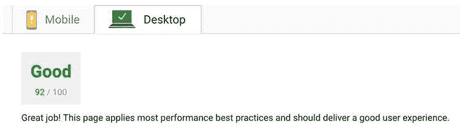
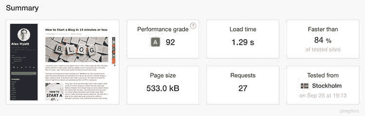

# 加快 WordPress 和提高 Google 排名的 6 个步骤

> 原文：<https://dev.to/alexhyettdev/6-steps-to-speed-up-wordpress-and-improve-google-rankings-2jma>

人们认为谷歌是一个神秘的组织，它有一个神秘的算法来搜索网络并给你你需要的答案。事实上，谷歌的算法并没有那么难破解。至少它的意图不是。我将在以后的文章中详细介绍谷歌如何对网站进行排名，现在我将重点关注一个方面，页面速度。

谷歌的唯一目标是找到最能回答你的查询的网站。谷歌会追踪你点击了哪些结果，你在网站上呆了多长时间，以及你是否觉得这个网站非常有趣，以至于你会留下来。结果是谷歌产品的输出，因此糟糕的结果让谷歌看起来很糟糕。

因此，如果你的网站需要很长时间来加载，访问者会厌倦等待，并尝试另一个链接。结果是你的网站排名下降，因为谷歌不想向用户显示速度慢的页面。

你可以写出世界上最好的内容，但是如果你的页面只花了 10 秒钟就加载完毕，没有人会去读它。

如果你已经关注了我关于如何开博客的帖子，或者已经有了一个 WordPress 博客，请继续阅读，我将向你展示如何加快 WordPress 的速度，让谷歌和你的访问者开心。

现在，在我们开始我们的优化探索之前，我们需要先做一件事，进行测量。和所有的性能优化一样，如果你不去衡量，你就不知道你所做的是否有效。

## 第一步:取一个基准

有很多网站可以让你对自己的网站进行基准测试。但是我们今天要用 2 个。

### 谷歌页面速度洞察

就排名而言，如果谷歌认为你的网站足够快，那可能就行了。去 PageSpeed 网站看看你的网站做得怎么样了。经过这些优化后，现在这是我的了:

[T2】](///static/4989720ab80ca2518af494001c9660d4/acb04/Google-Page-Speed-Results.jpg)

不错，但仍有改进的余地。具有讽刺意味的是，他们建议我改进的一件事是他们自己的谷歌分析脚本！

### Pingdom 网站速度测试

如果您已经发现了优化错误，那么请前往 Pingdom 测试。这些人会给你一个更详细的概述是什么减缓了你的网站。

下面是我在进行这些优化后的想法:

[T2】](///static/dd95a72af94461dce93031369ac4fefe/acb04/Pingdom-Speed-Results-1.jpg)

## 第二步:搞定大件

您的网站运行缓慢的原因只有几个。要么你试图下载非常大的东西，要么你试图下载很多东西。

所以让我们先关注大的东西，图像、视频和音乐。如果你的首页有一个 2 MB 的图片，对于大多数用户来说，它的加载速度会非常慢。有很多 WordPress 插件可以让我们轻松做到这一点。

### 图像

目前我个人最喜欢的是擎天柱。当你上传图片到 WordPress 时，它会压缩你的图片，这意味着你可以专注于写博客，而不用担心压缩你自己的图片。它还允许你批量压缩图像。

Optimus 是我发现的唯一一个压缩图片足以通过谷歌页面速度测试的插件。谷歌实际上会给你一些压缩图像，你可以在擎天柱不够好的情况下使用。

### 音乐和视频

如果你加载网站时有音乐播放，只要停下来，问题就解决了。除非你是 Spotify 或音乐流媒体网站，否则你的访问者不会想在你的网站上听你最喜欢的歌曲。

和音乐一样，视频应该只在用户希望的时候加载，不应该影响你的内容。我们将在这篇文章的后面更详细地讨论这个问题。

## 第三步:固定小东西

在解决了一些让你的网站变慢的大问题后，我们需要看看所有这些小问题。访问者浏览器的每个 HTTP 请求都会降低你网站的速度。目的是尽可能减少请求的数量。

你安装的每个插件都可能有自己的 CSS 和 Javascript，当你的网站加载时，它们也会被加载。所有这些加起来，在您知道之前，您已经有了一个简单的 web 页面，它发出 40 个请求来加载页面。

幸运的是，我们可以使用更多的 WordPress 插件来解决这个问题。

### 缩小并合并 CSS 和 Javascript

第一个是[自动优化](https://en-gb.wordpress.org/plugins/autoptimize/)，我用它来缩小和合并我所有的 CSS 和 JavaScript。当你缩小一个 CSS 或 JavaScript 文件时，它会修改文件，使它们占用尽可能少的空间。这包括移除注释、移除空白、缩短 JavaScript 变量以及将所有内容移动到一行。

这都是自动完成的，在这个过程的最后，你的网站上应该只有一个 CSS 文件和一个 JS 文件(不包括外部链接)。

### 缓存

WordPress 是一个 PHP 和 MySQL 应用程序。你写的每一篇文章都存储在数据库中，当用户访问你的网站时，就可以检索到。然而，一旦你写了一个帖子，你多久会回来改一次？可能不经常，如果有的话。这使得它非常适合缓存。直到你写了一个新的帖子或有人评论你的整个网站可以被缓存。服务器提供静态 HTML 文件比从数据库中检索数据要快得多。

还有另一个出色的插件叫做 [W3 总缓存](https://en-gb.wordpress.org/plugins/w3-total-cache/)。这将缓存您网站上的页面，并提供其他有用的优化。

## 第四步:你的内容位于哪里？

所以现在，如果您重新运行 PageSpeed/Pingdom 测试，您应该会得到比以前更好的结果。下一步是解决服务器加载时间问题。从你的网站下载数据需要多长时间很大程度上取决于你的用户在哪里。如果你的网站托管在英国，但是你的用户在印度，那么这个页面会比你所经历的时间稍微长一点。实际上，您可以使用 Pingdom 测试并更改位置，看看位置有什么不同。为了解决这个问题，我们需要在多个国家托管我们的内容。那么，我们如何在不设置昂贵的多区域服务器的情况下做到这一点呢？

### 内容分发网络(CDN)

这就是内容交付网络的作用。它们将获取你现在的静态文件(见上面的 W3 总缓存),并在世界各地的多台服务器上托管它们。然后，它们位于您的用户和您的网站之间，并根据您用户的位置从最近的可用服务器托管文件。

我用 Cloudflare 做这个，因为他们也免费提供 SSL，这是影响谷歌页面排名的另一个因素。

Cloudflare 只能在您的网站是自托管的情况下使用，因为您需要访问您的域名服务器设置。如果你对域名设置有所了解，这个过程相当简单。我不打算在这里包括细节，因为它在域名注册商之间变化很大。一般流程如下:

注册一个 CloudFlare 帐户并输入您的域名。CloudFlare 将下载您当前的名称服务器设置，并将其服务器指向它。登录到您的域注册商，将您的名称服务器指向 Cloudflare，而不是您的托管名称服务器。享受免费的 SSL 和全球内容交付！你也可以安装一个 CloudFlare WordPress 插件来管理你的网站设置。一旦完成以上步骤，你应该会在考试中获得很高的分数。

### 第五步:上图折叠内容

你可能在 Pingdom 上，尤其是在 Google PageSpeed 上看到过关于优化“折叠以上”内容的内容，并想知道这是怎么回事。

在折叠内容的上面是你的网站上的内容，在用户滚动之前出现。如果“文件夹上方”的所有内容都加载得很快，那么用户会认为你的网站加载得很快，即使向下滚动几个滚轮的内容仍然在加载，因为他们看不到这些内容。

不幸的是，我还没有找到一个折叠内容插件可以为你自动完成这项工作。如果你知道你在做什么，你会想要使用折叠优化插件上面的[。](https://en-gb.wordpress.org/plugins/above-the-fold-optimization/)

目标很简单，渲染网站顶部所需的任何 CSS 都应该包含在 HTML 中，而不需要下载 CSS 文件。这就是所谓的临界 CSS。文件夹优化插件上面的[有一个选项可以将你的关键 CSS 插入到你的网站中，但是你需要知道那是什么。](https://en-gb.wordpress.org/plugins/above-the-fold-optimization/)

Andy Osmani 写了一些 JavaScript 代码来从你的网页中提取关键的 CSS。如果你想自动化这个过程，也有一些 Gulp 插件可以做到这一点。

如果我设法找到一个好的方法让这个工作，我会写另一篇博文。

理想情况下，我们会更进一步，只在用户看到内容之前加载内容。然而，在现实中，这可能是矫枉过正，除非有一些页面速度的要求，你需要坚持。

这很重要的一个领域是视频。除非用户真的有兴趣观看，否则你不会想在你的页面上加载视频。幸运的是，如果你要嵌入来自外部资源的视频，比如 YouTube 或 Vimeo，它们的嵌入代码会为你处理这些。

## 第六步:加速移动页面(AMP)

最后一步是为您的移动用户提供最快的体验。你的网站应该为所有用户做很好的优化，但是为了给你的手机用户最好的体验，他们需要一个量身定制的网站。

谷歌提出了一项倡议来解决这个问题，简称为加速移动页面或 AMP。你可能在手机上遇到过这种情况。你被带到一个与你的网站相似的网页，但是地址栏中的地址仍然是 Google。

本质上来说，这只是你的网站的缩小版，对于移动用户来说加载速度会更快。谷歌将缓存这些页面，这就是为什么它们看起来像来自谷歌。

那么你如何实现 AMP，你猜对了，又是一个插件。您可以将[放大器用于 WP](https://en-gb.wordpress.org/plugins/accelerated-mobile-pages/)

## 结论

在实现了上述技术之后，你应该会发现你现在获得了 90%的 Google PageSpeed 和 Pingdom 评分。如果你想从谷歌获得梦寐以求的 100 分，你需要像步骤 5 中提到的那样考虑内联你的关键 CSS。

如果这有用或者你知道其他一些有用的 WordPress 插件，请在下面留下评论。