# 7 本教我如何编码的书

> 原文：<https://dev.to/fenbf/7-books-that-taught-me-how-to-code>

[T2】](http://www.bfilipek.com/2016/07/7-books.html)

正如你可能在我最近的文章- [没有谷歌的编码](https://dev.to/fenbf/coding-without-google) -中读到的，我已经开始主要从书本上学习编程。一开始，我把它们从头到尾读了一遍(假设我能理解它们！)并重现了例子。那是一段美好的时光！在这篇文章中，我想分享我的重要书籍清单，这些书籍教会了我知识的基础。也许你在学习过程中分享过类似的头衔？

这篇文章最初发表在我的博客: [Bartek 的编码博客:7 本教我如何编码的书](http://www.bfilipek.com/2016/07/7-books.html)

## 1。C++在 24 小时内

 [Sams**24 小时自学 c++**(第 5 版)第 5 版](http://amzn.to/241LLsC) 

我在当地书店的书架上见过那本书很多次。一天，在和我的朋友讨论后，我们买下了这本书。一本给三个小孩的书。我不知道什么时候轮到我了，但最终，这本书是我的，我的朋友们把他们的“股份”卖给了我。

[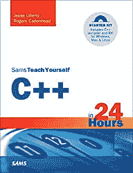 ](http://www.amazon.com/Sams-Teach-Yourself-Hours-5th/dp/0672333317/ref=as_li_ss_il?ie=UTF8&linkCode=li3&tag=bfilipek-20&linkId=ed614f7d0b4511f1127a588ff5607fec) 

太迷人了！我可以输入一些基本的命令(当然是用 C++了！)，创建函数和类，并将消息输出到控制台。类似的事情可能会写在任何第一本编程书上。尽管如此,《24 小时 C++版》是以这样一种方式编写的，一个新手不会被抛弃，可以理解大部分内容，并最终随着学习而进步。

每一课都做得很好，一步一步地你可以掌握 C++的大部分基本概念。在第 19 章(在第 19 个小时是正确的)有一个链表的主题。所描述的问题不仅是 C++的事情，而且也是数据结构和算法的一个领域。这一章很难读完。最后，我设法理解了列表，我为自己感到骄傲！

我发现这本书现在有点过时了。第五版是 2011 年的，不涵盖 C++11/14。也许一个新的版本正在编写中。如果出现这种情况，我会向任何 C++初学者强烈推荐它。

你知道吗？

结果是，买了这本书的三个孩子中，有两个成为了程序员:)

## 2。C++中的算法

[**《c++**中的算法》，第 1-4 部分，作者罗伯特·塞奇威克](https://www.amazon.com/Algorithms-Parts-1-4-Fundamentals-Structure/dp/0201350882/ref=as_li_ss_tl?ie=UTF8&linkCode=ll1&tag=bfilipek-20&linkId=dc9d79b0739ff046c18b1380c9a014eb)

这次，那本书是我自己买的！典型的书籍价格在 30 英镑到 30 英镑之间..40 波兰兹罗提。但是算法的价格是 80 英镑的两倍...90z。那可是一大笔钱！我花了很多时间思考这本书是否真的适合我，也许太超前了...最后，我买了。我很高兴我做到了！

[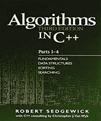 ](https://www.amazon.com/Algorithms-Parts-1-4-Fundamentals-Structure/dp/0201350882/ref=as_li_ss_il?ie=UTF8&linkCode=li3&tag=bfilipek-20&linkId=e21569ac79ed302fa416ce1ff6e9ddb7) 

老实说，我很害怕我不能理解第一章的介绍。例如，他们使用了“连通性”和联合查找算法。但是从第二章开始，事情变得好了很多。慢慢地，我明白了核心算法是如何工作的。

我喜欢代码不像 Cormen 那样是伪代码，而是 C++代码。你可以复制并粘贴它，看看它是如何执行的。这对学习至关重要。

一章接一章，我对算法和数据结构有了基本的了解。我经常翻阅那本书。我也在考虑买最新版本的...但很遗憾，被改写成了 Java。

## 3。OpenGL Superbible

[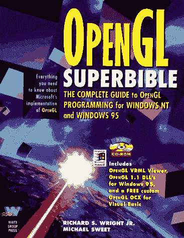T2】](https://res.cloudinary.com/practicaldev/image/fetch/s--rObH0qKb--/c_limit%2Cf_auto%2Cfl_progressive%2Cq_auto%2Cw_880/http://www.openglsuperbible.com/wp-content/uploads/2013/08/first_edition_cover.jpg)

封面来自[openglsuperbible.com/previous-editions/](http://www.openglsuperbible.com/previous-editions/)

你可以在我的博客 这里阅读《T0】 **这本书最新(第 7)版的书评。**

在创建了一些基本的文本/控制台程序后，我转向了图形编程。这一选择的灵感主要来自 Borland BGI 图形和快板库。我知道 OpenGL 在当时是个大东西(现在仍然是！)所以我觉得这是一个提高自己图形学知识的好方法。

大概，这本书很优秀我就不用提了吧。甚至第一版都是！和当时的大多数书一样，有一张 CD，这样你就可以看到所有的例子了！我想知道我是否还有那张 CD。这些年来，随着新版本的出现，CD 从书中移除，示例被转移到网站下载选项，书籍内容的质量越来越好。

我跟随超级无敌系列。今天我拿到了三本书:第一版、第四版和第七版。每个版本都很快赶上了当前版本的 OpenGL。你可以看到 OpenGL 是如何进步的:从固定的流水线到简单的顶点/片段着色器，再到现在完全的“GPU 端”编程风格。如果我说这本书是学习 OpenGL 的标准书籍，也许我不会撒谎。有 OpenGL 编程指南，但大多数人喜欢 Suberbible，我可以想象。

## 4。游戏编程宝石系列

[亚马逊上的游戏编程宝石](https://www.amazon.com/Game-Programming-Gems-CD/dp/1584500492/ref=as_li_ss_tl?ie=UTF8&qid=1467749265&sr=8-1&keywords=game+programming+gems&linkCode=ll1&tag=bfilipek-20&linkId=d822ba35f39b627a095789459359dad0)

本站编辑- [马克·德劳拉-宝石系列](http://www.satori.org/game-programming-gems/)

[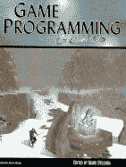 ](https://www.amazon.com/Game-Programming-Gems-CD/dp/1584500492/ref=as_li_ss_il?ie=UTF8&qid=1467749265&sr=8-1&keywords=game+programming+gems&linkCode=li3&tag=bfilipek-20&linkId=99966728847594849c6a697115038274) 

[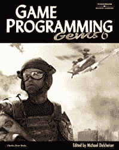 ](https://www.amazon.com/Game-Programming-Gems-CD-ROM-Development/dp/1584504501/ref=as_li_ss_il?ie=UTF8&dpID=51fOuGVli3L&dpSrc=sims&preST=_AC_UL320_SR256,320_&psc=1&refRID=RBZJF36MH56D1Q525Q72&linkCode=li3&tag=bfilipek-20&linkId=e292152d472300138cfe1987a1d7c0ec) 

[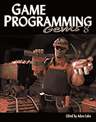 ](https://www.amazon.com/Game-Programming-Gems-Adam-Lake/dp/1584507020/ref=as_li_ss_il?ie=UTF8&qid=1467749265&sr=8-2&keywords=game+programming+gems&linkCode=li3&tag=bfilipek-20&linkId=460231b5dbb2930f5d5ad6453bfc5604) 

游戏编程宝石对我来说是另一个步骤。我对图形有所了解，但现在我对游戏引擎感兴趣了。我可以写一个图形演示，但我很好奇如何制作一个优秀的图形引擎。宝石是一系列相关的文章。我喜欢那样。你可以选择一个主题，然后专注于它。他们按逻辑顺序分组，分系统。

在我的一些例子中，我使用了本系列第二卷中描述的“并行传输框架”。使用这种技术，我可以沿着样条线挤出 2d 形状。这是一个很酷的方式做任何种类的绳子或蠕虫。也许这将是一个单独的帖子的好话题。

我有四册:第一、二、三、六册。

## 5。3D 游戏编程大师的技巧

[3D 游戏编程大师的技巧——高级 3D 图形和光栅化](https://www.amazon.com/Tricks-Programming-Gurus-Advanced-Graphics-Rasterization/dp/0672318350/ref=as_li_ss_tl?s=books&ie=UTF8&qid=1467783246&sr=1-2&keywords=game%20programming%20gurus&linkCode=ll1&tag=bfilipek-20&linkId=b048a29fae27789c7eb2e6a634b000b6)作者[安德烈·拉莫特](https://en.wikipedia.org/wiki/Andr%C3%A9_LaMothe)

[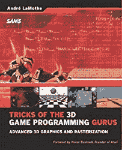 ](https://www.amazon.com/Tricks-Programming-Gurus-Advanced-Graphics-Rasterization/dp/0672318350/ref=as_li_ss_il?s=books&ie=UTF8&qid=1467783246&sr=1-2&keywords=game+programming+gurus&linkCode=li3&tag=bfilipek-20&linkId=eb57712358e71c6c0e4db1f2d48401a8) 

这本书非常容易让人上瘾！我买它是为了从头开始创建我的软件渲染器和引擎。安德里亚·拉莫特创作了一本奇妙的书，书中的一切都是从微小的细节开始描述的。当我用 OpenGL 写代码时，我有点像上面的那个层次。我可以让我的三角形有纹理，但是我不知道纹理背后的代码。或者更简单的事情:如何渲染线框立方体？在 OpenGL 中非常容易，但是你知道这种场景背后的代码是什么吗？

老实说，我没有足够的毅力来完成这本书。我听了差不多一半。所以我的“神奇”引擎只能渲染线框物体。然后我停止了实现，再次进入 OpenGL(在那个“更高”的层次上也有很多东西要学)。尽管如此，我还是试着阅读这本书，理解纹理、采样、剪裁和其他覆盖效果背后的想法。

一些样本截图([见此处](http://www.prweb.com/releases/2003/10/prweb84570.htm))

[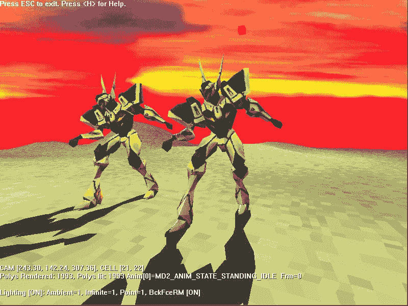T2】](https://res.cloudinary.com/practicaldev/image/fetch/s--XYyQZ8t_--/c_limit%2Cf_auto%2Cfl_progressive%2Cq_auto%2Cw_880/http://ww1.prweb.com/prfiles/2003/10/13/84570/t3dIIfig15_14a.jpg)

[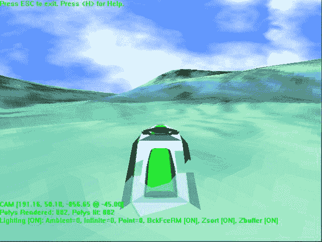T2】](https://res.cloudinary.com/practicaldev/image/fetch/s--KMbhTDNE--/c_limit%2Cf_auto%2Cfl_progressive%2Cq_auto%2Cw_880/http://ww1.prweb.com/prfiles/2003/10/13/84570/t3diifig12_15.jpg)

这本书的伟大之处在于它仍然有效！当然，我们的渲染引擎非常非常强大，不过，通过这本书，你可以学习如何编码三重缓冲或 mipmaps。这些知识将会持续很多年。

## 6。代码完成

代码完成:软件构造实用手册，第二版，作者史蒂夫·麦康奈尔

[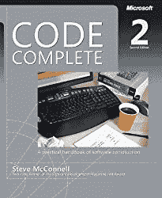 ](https://www.amazon.com/Code-Complete-Practical-Handbook-Construction/dp/0735619670/ref=as_li_ss_il?s=books&ie=UTF8&qid=1467783814&sr=1-1&keywords=code+complete&linkCode=li3&tag=bfilipek-20&linkId=c777c8e8f5ef4566b46c2bd7e525f817) 

当我买 Code Complete 的时候，我正在学习/大学(第三或第四年)，所以我需要一些有价值的东西来告诉我什么是软件开发。这本书在 IT 界很受尊重，所以我知道我需要它。

它涵盖了制作优秀软件的许多不同方面。它描述了一个好的编码风格，如何调试应用程序，甚至如何作为一个程序员应用敏捷和提高。很多领域，但结构非常好。

这些年来，我多次回到这本书上。总有你可以学习或回忆的东西。

## 7。热情的程序员

[热情的程序员:在软件开发中创造非凡的职业生涯](https://www.amazon.com/Passionate-Programmer-Remarkable-Development-Pragmatic-ebook/dp/B00AYQNR5U/ref=as_li_ss_tl?_encoding=UTF8&qid=1467784049&sr=1-3&linkCode=ll1&tag=bfilipek-20&linkId=f24767839f728c861b03573207fa5481)作者[查德·福勒](http://chadfowler.com/)

[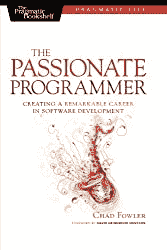 ](https://www.amazon.com/Passionate-Programmer-Remarkable-Development-Pragmatic-ebook/dp/B00AYQNR5U/ref=as_li_ss_il?_encoding=UTF8&qid=1467784049&sr=1-3&linkCode=li3&tag=bfilipek-20&linkId=c68a03dc0e288cfed00ce46eb71903b9) 

编程很有趣；我有了第一次职业经历。但是我注意到了另外一面:如何成为一名伟大的程序员！不仅仅是编码，还有你对任务和人的态度。这本书以一种鼓舞人心的方式展示了提高自己的可能性。

在我的博客上阅读我的评论[。](http://www.bfilipek.com/2013/12/the-passionate-programmer.html)

## 其他值得一提的:

我只选择了七本书，但我忍不住提到了其他一些书名。

### 更多 OpenGL 编程

[更多 OpenGL 游戏编程](https://www.amazon.com/More-OpenGL-Game-Programming-Astle/dp/1592008305/ref=as_li_ss_tl?s=books&ie=UTF8&qid=1467784700&sr=1-1&keywords=more+opengl+programming&linkCode=ll1&tag=bfilipek-20&linkId=9eb76c62e055ce59c3138bd54ed2897c)，大卫·阿斯特勒编辑。

这本书是在阅读了 OpenGL Superbible 和其他初学者级别的书籍后又进了一步。它给出了很多有趣的文章，值得实现，是高级图形编程的必备。

### ShaderX 系列

《ShaderX6:高级渲染技术》，Wolfgang Engel 编辑

多亏了这个系列的第六卷，我才能够完成我的硕士论文！有一个单独的部分是关于阴影的，所以我用它来做我的工作。

该系列继续，但有一个不同的名字:GPU Pro 系列。

### 软技能

软技能:软件开发人员的生活手册作者约翰·桑梅兹([simpleprogrammer.com](https://simpleprogrammer.com/))

John Sonmez 在激励人们(尤其是程序员)如何变得更好方面做得非常好。他的软技能书涉及了职业发展、动机、学习、博客的许多方面。这是一本热情的程序员书的很好的补充。如果你感兴趣的话，我已经为这本书做了评论。

## 总结

抱歉又是一个怀旧的帖子:)名单编了好多周，终于可以发布了。当然，我没有包括学习中要求的所有数学、物理、逻辑书籍。我只列出了流行的 IT 书籍。

你最喜欢的书是什么？第一本教你如何编码的书是什么？

## 更多来自作者

Bartek 最近出版了一本书-[《C++ 17 详解》](https://leanpub.com/cpp17indetail?utm_source=devto&utm_campaign=7books)可从@Leanpub 获得-与其阅读论文和 c++规范草案，不如用这本书以高效实用的方式学习新标准。