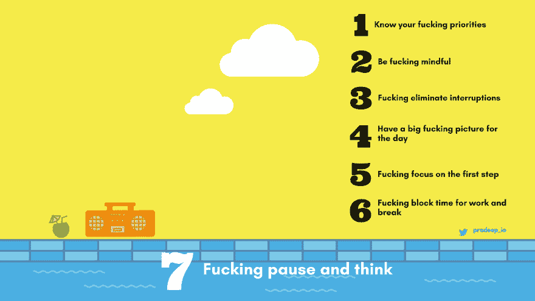

# 开发人员完成工作的 7 条该死的规则

> 原文：<https://dev.to/pradeep_io/7-fucking-rules-for-developers-to-get-shit-done>

> 我痴迷于提高效率，并且相信每个人都应该如此

想想你通常在 5 天内完成的工作量，如果你能在 3 天内完成同样的工作会怎么样。质量更好，没有压力。我做过这个，你也可以。这是我观察到的，我们很多人都会同意，我们满怀热情地开始一个项目，但慢慢地我们失去了动力，我们把事情留到最后一刻，最终我们错过了最后期限。
经过多次失败、挫折，放弃智能手机 6 个多月。我能够微调我的生产力。你不必经历我经历过的训练。我总结了我们都应该遵守的简单规则。这将极大地改变我们的成就。

> 每个人都有同样的 24 小时，关键在于你如何利用它们。

7 条该死的规则

1.  如果这是你的工作时间，把这篇文章添加到你的“必读清单”中，然后马上离开这篇文章。有很多重要和必要的事情你必须去做，但你一次只能做一件事，应该是哪一件，如果你想，你完全有能力做出正确的选择。

2.  他妈的要注意:要注意你在“当下”所做的事情。这说起来容易做起来难，只有实践才能帮上忙。要知道你会在某个时间点失去动力和冲劲，你需要准备好面对那些时刻。会有这样的时刻，短暂地休息一下，无休止地滚动脸书可能会感到满意和无害，过一段时间后，你甚至不会意识到你已经浪费了多少时间。永远他妈的注意你现在在做什么。深呼吸，活在当下。

3.  **他妈的消除干扰:**在工作时间屏蔽一切可能的干扰和分心。电话、新闻、fb、twitter、电子邮件、同事、博客、reddit、产品搜索、游戏以及一切可能吸引你注意力的东西，哪怕只是一小会儿。坦然面对错过的恐惧。

4.  对这一天有一个他妈的大图:对你今天要实现的目标有一个概览。计划外的事情会找上门来，不要着急，要如水。当我们把一颗鹅卵石扔进水中，它会受到干扰，但很容易又恢复自然平静。

5.  专注于第一步:不要害怕铺天盖地的长长的待办事项清单。决定你的近期目标和完成它的期限。

6.  **他妈的划分工作和休息时间:**把你的时间划分为工作时间和休息时间。一般来说，每工作 25 分钟后休息 5 分钟可以激发你的创造力(被称为番茄工作法)，你可以找出什么最适合你，如果是 1 小时的工作，然后休息 10 分钟，那么就这样做。但不要长时间连续工作。起初，放下工作休息一会儿似乎没有必要，但事实并非如此。当你陷入困境时，计划外的休息似乎是必要的，但事实并非如此。像修道士一样专注，完全准备好完成任务。

7.  他妈的停下来想一想:即使尽了最大努力，你也会错过一些截止日期。现在是时候停下来，客观地思考一会儿了。为什么要花时间？2.你能通过给一些额外的时间很快完成它吗？3.你能继续下一个任务而不完成这个任务并再次把它添加到待办事项列表中吗？4.为了完成这项任务，你需要做额外的事情吗？例如，学习一个新概念，研究或实验。你能为此单独分配时间吗？5.你不是因为想让它变得完美才前进的吗？这种完美主义能等吗？

有些人可能会认为这篇文章没有什么新内容，有些人可能会被这些信息淹没。这不是知道的问题，而是实际去做，坚持不懈地去做。如果我能做到，我相信，你也能做到。记住规则就行了。

[T2】](https://res.cloudinary.com/practicaldev/image/fetch/s--4dsEWQ0h--/c_limit%2Cf_auto%2Cfl_progressive%2Cq_auto%2Cw_880/http://img.pixady.com/2017/09/978016_7productivitytulesv3.jpg)

> 当我们开心的时候，比如看电影，开派对等等。我们通过关灯、播放音乐和许多其他事情来创造一个刺激的环境。我们不会为工作付出类似的努力，而这正是我们大部分时间所做的。总有做得更好的余地。

你可以在推特上找到我。
更新:我管理着一个名为 [Invide](https://www.invidelabs.com/developer.html) 的对远程工作充满热情的顶级开发者群体。一定要去看看，如果你想加入，使用推荐代码:“ThePracticalDev”来加速策展过程。这是 100%免费的，但筛选需要一些时间来保持标准。