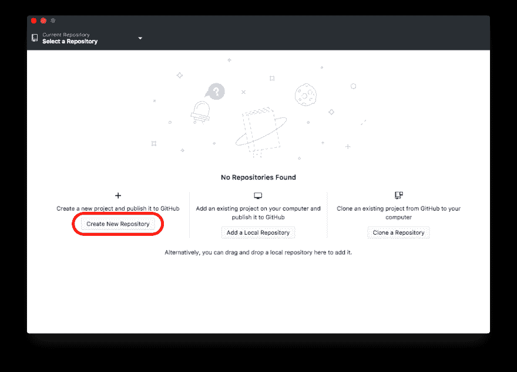
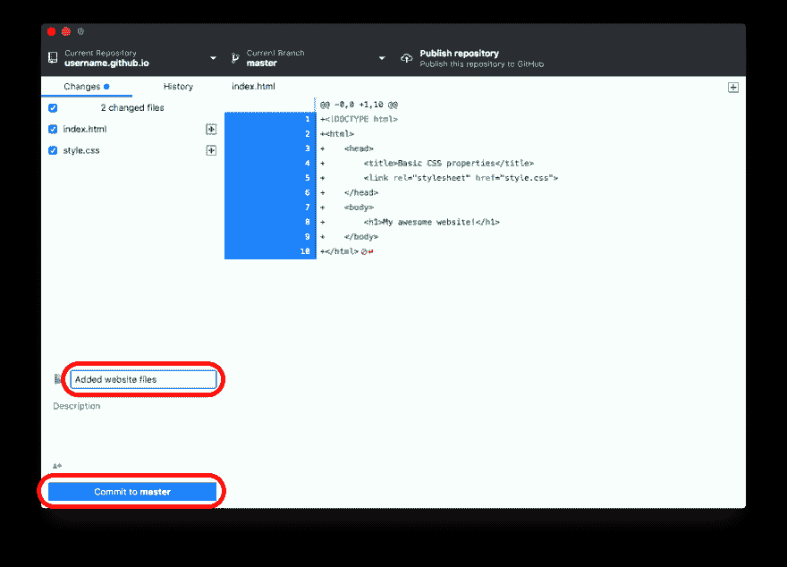
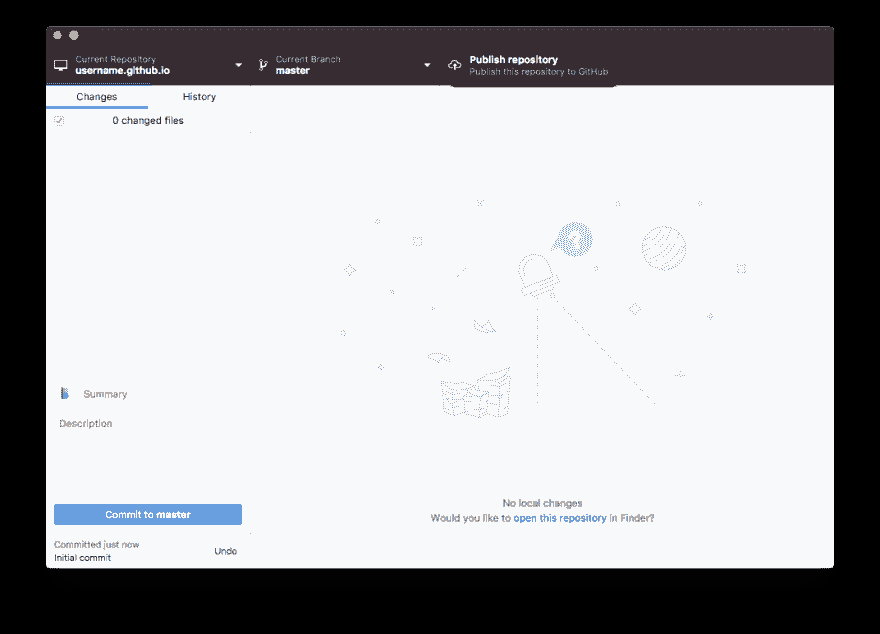
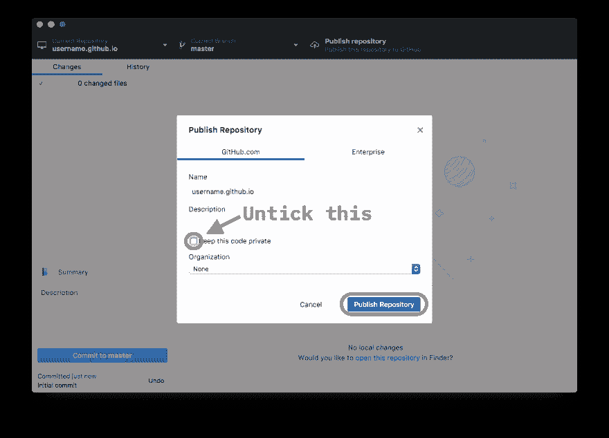
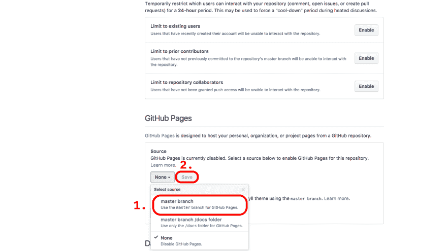
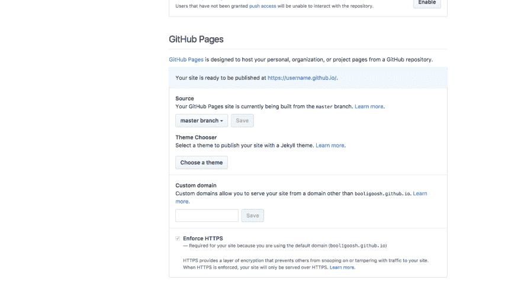
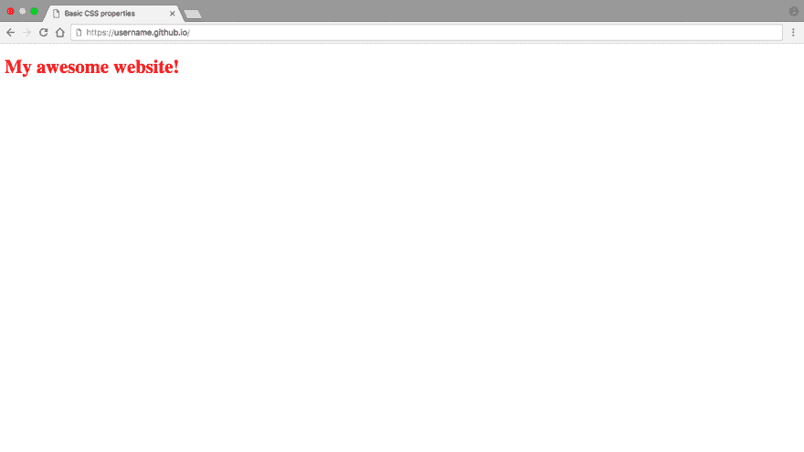
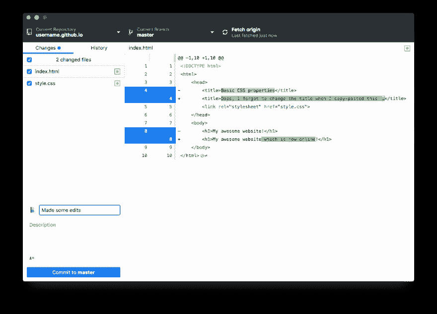
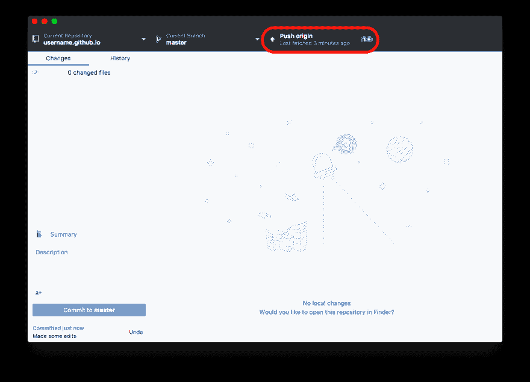
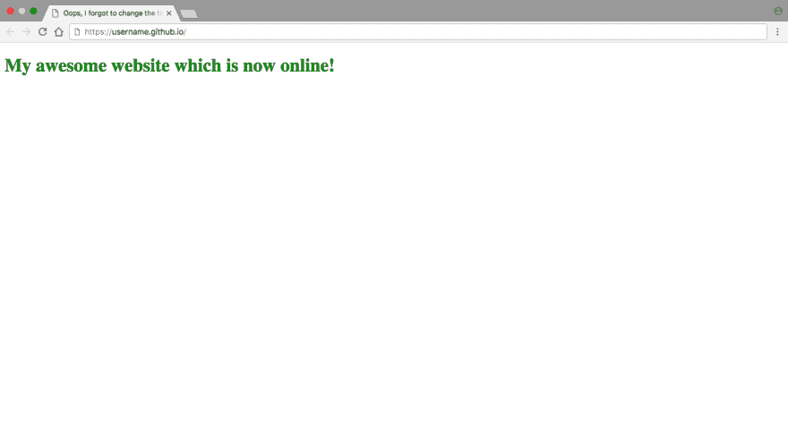

# 使用 GitHub 页面让您的网站在线的初学者指南

> 原文：<https://dev.to/codetheweb/a-beginners-guide-to-getting-your-website-online-with-github-pages-12fg>

[T2】](https://res.cloudinary.com/practicaldev/image/fetch/s--2iAwgGv4--/c_limit%2Cf_auto%2Cfl_progressive%2Cq_auto%2Cw_880/https://codetheweb.blog/assets/img/posts/github-pages-free-hosting/cover.png)

你有一个很棒的网站最终准备好与世界分享了吗？你终于准备好停止在本地服务器上运行它或在浏览器中打开你的文件，并准备好将它发布到强大的互联网上了吗？

我知道我曾经处于这种情况。从一个在你电脑上运行的东西变成一个互联网上任何人都可以访问的东西是非常令人生畏的。

在以前的文章中，我写了更多关于互联网如何工作的内容，但是我将简要地回顾一下你的网站如何吸引人们。

首先，你的网站需要在某个地方被托管。这意味着需要有一台计算机，当人们加载网站时，它会将 HTML 文件发送给他们。这就是通常所说的服务器，但是任何计算机都可以使用(互联网只是一个巨大的计算机网络)。

然而，由于多种原因，托管一个网站是非常可怕的。首先，你必须让服务器全天候运行并连接到互联网。这意味着，要么你必须在地下室安装一台大型服务器，要么永远不要关掉电脑。正因为如此，将您的计算机用作服务器不是一个实际的想法(除非您有一台从不使用的旧计算机)。

这不是唯一的问题。即使你真的买了一台服务器，你也必须不断地维护它，并确保它有足够的处理能力为你的网站服务。听说过谷歌的数据中心吗？这里有一张图片:

[T2】](https://res.cloudinary.com/practicaldev/image/fetch/s--_vLTYoAu--/c_limit%2Cf_auto%2Cfl_progressive%2Cq_auto%2Cw_880/https://codetheweb.blog/assets/img/posts/github-pages-free-hosting/google-data-center.jpg)

> 图片来源:[谷歌](https://www.google.com/about/datacenters/gallery/#/aimg/35)

看到架子上的那些东西了吗？都是服务器。谷歌需要这么多服务器(他们在世界各地都有这样的中心),因为访问谷歌的人太多了。

很明显，你的用户不会像谷歌一样多，但我的观点是，越多的人浏览你的网站，你的服务器就需要越好。此外，糟糕的服务器会让你的页面加载非常慢。

托管自己的网站的最后也是最可怕的问题是安全性。你必须将你的服务器连接到你的 Wi-Fi 路由器，这意味着世界上任何地方的人都可以访问你的家庭网络。虽然有安全措施，但它确实让你很容易受到黑客攻击。

## 另类？

由于所有这些复杂因素，人们通常不会自己托管他们的网站，而是付费托管。这意味着你付费把你的 HTML 文件放在世界上某个地方的服务器上，在一个类似上面的数据中心，他们会为你照顾和维护服务器。

根据服务器的速度和功能，这可能每月花费 4 美元到 100 美元不等。(根据这张[伟大的信息图](https://www.whoishostingthis.com/blog/2014/07/29/website-cost/))

好吧，所以如果你想的话，你可以以相对便宜的价格获得主机服务，但是，为什么要为你不需要的东西付费呢？

## *自由*另类？

 
我来给你介绍一个叫 [GitHub Pages](https://pages.github.com/) 的东西。

GitHub Pages 100%免费托管您的网站*。唯一的缺点是，其他人可以查看您网站上的所有文件，尽管这通常是一件好事。这意味着任何访问你在 GitHub 上的页面的人都可以看到制作你的网站的工作。事实上，雇主甚至经常根据他们在 GitHub 上的项目来选择人(不要担心，如果你觉得他们不是你最好的作品，你可以随时删除他们)。*

 *> **注:**我知道这听起来像是有人付钱让我推广 GitHub 什么的，但我真的不是。我真的很喜欢使用 GitHub 页面，我认为你也应该这样做😉

在本教程中，我将向您展示如何在 GitHub 页面上托管您的站点，并将 GitHub 同步到您的计算机，以便您可以轻松地进行编辑！

请注意，本教程假设您已经有一个包含网站的文件夹。如果没有，创建一个新文件夹，添加基本的`index.html`和`style.css`文件。

## 入门

首先，你需要在 Github.com 注册一个账户。你回来的时候我会在这里！

接下来，你需要在你的电脑上安装[GitHub Desktop](https://desktop.github.com/)——我也给你一点时间来完成这个(不完全是，我不是在你读这篇文章的时候写的😜)

安装 GitHub Desktop 后，登录您的帐户([，详见此处的](https://help.github.com/desktop/guides/getting-started-with-github-desktop/authenticating-to-github/))。首先，您需要创建您的存储库。存储库是储存网站所有文件的地方，类似于电脑上包含网站的文件夹。

每个存储库都有一个托管站点的 URL。有两种类型的存储库:用户存储库和项目存储库。

对于本例，假设您的用户名是“example”。您的用户存储库将在`example.github.io`托管。现在让我们假设你做了一个随机数生成器，并把这个库叫做`randomnumber`——那么它将被托管在`example.github.io/randomnumber`。

在这种情况下，假设我们已经编写了主网站的代码——所以我们希望它成为我们的用户网站。这意味着我们需要将我们的存储库命名为`example.github.io`，而不是像`randomnumber`这样的名称。例如，我的 GitHub 库名是`booligoosh.github.io`。

## 创建存储库

好了，现在让我们创建我们的存储库！单击左侧选项(创建新存储库):

[T2】](https://res.cloudinary.com/practicaldev/image/fetch/s--f1UMVdqo--/c_limit%2Cf_auto%2Cfl_progressive%2Cq_auto%2Cw_880/https://codetheweb.blog/assets/img/posts/github-pages-free-hosting/gh-desktop-create-new-repo-button.png)

当你点击它时，会出现一个对话。输入您的储存库名称(`whateveryourusernameis.github.io`)并选择储存库文件夹在电脑上的保存位置。保留所有其他选项，然后单击“创建存储库”:

[T2】](https://res.cloudinary.com/practicaldev/image/fetch/s--L27DSCAb--/c_limit%2Cf_auto%2Cfl_progressive%2Cq_auto%2Cw_880/https://codetheweb.blog/assets/img/posts/github-pages-free-hosting/gh-desktop-create-new-repo-dialogue.png)

## 添加您的代码

现在，是时候添加我们的代码了！将你所有的网站文件移动到你电脑上的存储库文件夹中，然后回到 GitHub 桌面——它现在应该看起来像这样:

[T2】](https://res.cloudinary.com/practicaldev/image/fetch/s--YUXuAWb0--/c_limit%2Cf_auto%2Cfl_progressive%2Cq_auto%2Cw_880/https://codetheweb.blog/assets/img/posts/github-pages-free-hosting/gh-desktop-commit-1.png)

填写总结，说明你做了什么，然后点击“提交给主人”。这只是“将我的更改保存到存储库”的技术术语。

## 发布到 GitHub

接下来，点击右上角的“发布存储库”——这将把你的代码发送到 GitHub 服务器托管！

[T2】](https://res.cloudinary.com/practicaldev/image/fetch/s--pJlc4hCk--/c_limit%2Cf_auto%2Cfl_progressive%2Cq_auto%2Cw_880/https://codetheweb.blog/assets/img/posts/github-pages-free-hosting/gh-desktop-publish-repo-button.png)

让所有字段保持原样，但是**取消勾选“保持此代码私有”**(您需要为此付费)。单击“发布存储库”:

[T2】](https://res.cloudinary.com/practicaldev/image/fetch/s--UoWP_OKL--/c_limit%2Cf_auto%2Cfl_progressive%2Cq_auto%2Cw_880/https://codetheweb.blog/assets/img/posts/github-pages-free-hosting/gh-desktop-publish-repo-dialogue.png)

接下来，我们需要为我们的网站配置设置托管！进入`github.com/yourusername/yourusername.github.io`(如`github.com/Booligoosh/booligoosh.github.io`)，点击“设置”选项卡。

向下滚动到显示 GitHub 页面的地方，然后点击下拉菜单。选择“主支行”，然后点击“保存”。

[T2】](https://res.cloudinary.com/practicaldev/image/fetch/s--3wSM0QRp--/c_limit%2Cf_auto%2Cfl_progressive%2Cq_auto%2Cw_880/https://codetheweb.blog/assets/img/posts/github-pages-free-hosting/gh-pages-settings.png)

耶！现在点击链接带你去你的新网站！

[T2】](https://res.cloudinary.com/practicaldev/image/fetch/s--7JJm2UYA--/c_limit%2Cf_auto%2Cfl_progressive%2Cq_auto%2Cw_880/https://codetheweb.blog/assets/img/posts/github-pages-free-hosting/gh-pages-settings-link.png)

你现在有一个网站！

[T2】](https://res.cloudinary.com/practicaldev/image/fetch/s--iGzk7GYP--/c_limit%2Cf_auto%2Cfl_progressive%2Cq_auto%2Cw_880/https://codetheweb.blog/assets/img/posts/github-pages-free-hosting/site-1.png)

## 做出改变

我们快完成了！最后要做的事情是从我们的电脑上对我们的网站进行更改！首先，以某种方式稍微修改你的代码。

现在，回到 GitHub 桌面——它甚至会向你显示你所修改内容的摘要！填写您的提交摘要并点击提交按钮！

[T2】](https://res.cloudinary.com/practicaldev/image/fetch/s--qtGqvclu--/c_limit%2Cf_auto%2Cfl_progressive%2Cq_auto%2Cw_880/https://codetheweb.blog/assets/img/posts/github-pages-free-hosting/gh-desktop-commit-2.png)

现在，点击右上角的“推原点”(以前是发布按钮的位置)。这只是“将我的更改上传到 GitHub 的服务器”的技术术语。

[T2】](https://res.cloudinary.com/practicaldev/image/fetch/s--GZQGWnui--/c_limit%2Cf_auto%2Cfl_progressive%2Cq_auto%2Cw_880/https://codetheweb.blog/assets/img/posts/github-pages-free-hosting/gh-desktop-push-origin.png)

现在，等几分钟。时间可能会有所不同，但通常您的网站可能需要大约 5 分钟来更新(保持重新加载页面进行检查)。最终，更改将会加载！

[T2】](https://res.cloudinary.com/practicaldev/image/fetch/s--jR1O4tWI--/c_limit%2Cf_auto%2Cfl_progressive%2Cq_auto%2Cw_880/https://codetheweb.blog/assets/img/posts/github-pages-free-hosting/site-2.png)

## 结论

我希望你今天学到了很多！你现在知道如何把你的网站从你电脑上的文件变成一个真正的互联网网站了！我的目标是教像你这样正在学习 web 开发的人如何做，如果你支持我的使命，不管是通过[分享这个](https://codetheweb.blog/2018/02/04/github-pages-free-hosting/#share)还是[注册我的简讯](https://codetheweb.blog/newsletter)，我都会非常感激。(你会在收件箱里收到新文章！🎉)

下周我将讨论如何使用 GitHub pages 在自定义域名上托管你的网站(所以你的网站可以不在`username.github.io`而是在`example.com`或`example.io`或`example.blog`)。你*做*必须为域名支付(小额)费用，但这样你仍然可以获得免费托管！[敬请期待:)](https://codetheweb.blog/newsletter)

哦！如果你有任何反馈，需要任何帮助或者只是想说声你好，请在下面的[评论中提出。别忘了](https://codetheweb.blog/2018/02/04/github-pages-free-hosting/#disqus_thread)[分享](https://codetheweb.blog/2018/02/04/github-pages-free-hosting/#share)，[订阅](https://codetheweb.blog/newsletter)，我们下期再见！

> ### 想要更多这样的帖子？[注册我的简讯](https://codetheweb.blog/newsletter/)。
> 
> 我一直在努力学习这些教程，但是到目前为止还没有赚到任何钱，所以如果你注册的话，我会非常感激；)

这篇文章最初发表在 [Code The Web](https://codetheweb.blog) 上，这是一个有趣且易于理解的博客，帮助你学习 Web 开发🚀
学:[HTML](https://codetheweb.blog/learn/html/)|[CSS](https://codetheweb.blog/learn/css/)|[JavaScript](https://codetheweb.blog/learn/javascript/)*