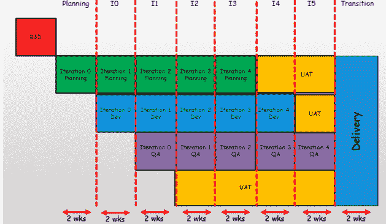

# 比交错迭代交付更好的方法

> 原文：<https://dev.to/nkdagility/a-better-way-than-staggered-iterations-for-delivery-2maf>

对于交付来说，有一种比交错迭代更好的方法可以让你保持敏捷。交错迭代导致更多的技术债务和更低质量的软件。

## TL；DR；

交错迭代的预期结果将是返工和技术债务的增加。如果你从一个 4 年的迭代过程转移到一个 4 个月的过程，你会看到它的价值，但是你的过程将是不透明的，并且只会降低你交付工作软件的能力。

是的，你的周期时间会减少，但你可以做得更好。将软件运输的所有需求转移到 Sprint 中。如果你需要测试，那么它需要在 Sprint 内部。一般规则是:

> 如果你需要在 Sprint 之外验证一些东西；用户验收、安全审计、监管审批；然后，您需要确保通过外部验证所需的所有工作都在 Sprint 内部完成，不需要开发团队做更多的工作。
> 
> –[马丁·辛舍尔伍德](https://nkdagility.com/company/about-martin-hinshelwood/)

例如，这意味着如果你有 6 周的动物试验，然后有 6 周的人体试验来验证你的起搏器固件是好的，你不能在每 2 周的冲刺中发生这些事情。相反，专注于你能做些什么来让这些事情过去。如果他们没有通过，那么做一个完整的路线原因分析，并把新的信息带到你的 Sprint 回顾会上，确保你把措施落实到位，以确保它不会再次发生。

## 一种比交错迭代更好的交付方式

我看到许多试图提高敏捷性的公司陷入了过去基于技能的人为孤岛。他们认为，通过创建一个用于规划、开发和测试的时间盒，我们可以更接近敏捷性，并摆脱我们的传统模型。不幸的是，实际结果是推崇传统的分阶段模型，并在通往敏捷性的道路上侧身而行，而不是向前。在许多情况下，这可能是一个重大的倒退，需要许多痛苦的岁月来纠正。

 

图:交付的交错迭代示例

我听过这叫多事。Water-Scrum-fall 或者可能是 Scrummerfall，但是不管你怎么称呼它，事实是这只是小瀑布，在上面的例子中，一点也不小。当组织被告知“做敏捷”时，他们通常会做出这样的反应，最终他们会发现如何不真正改变，做他们一直在做的事情。

这不是一个专业 Scrum 团队的行为，最好的情况下是业余爱好者，最坏的情况下是牛仔。

## 交错迭代交货问题

在上图中，我们从开始到交付有 18 周的周期。在构思和交付之间有超过 4 个月的时间，滞后 2 个月，甚至在所有后续反馈的滞后 2 个月之后才得到反馈。更糟糕的是，这是最昂贵的一种反馈，因为编码和测试团队已经从得到反馈的事情上转移了，并且反馈的结果实现起来会更昂贵。更糟糕的是，如果 QA 发现需要修复的东西，我们不仅最大化了修复的成本，还最大化了修复的平均时间，因为开发人员已经离开了。他们如何处理这些反馈？它是如何优先排序的？他们是立即放弃正在做的事情，修复上一个迭代，还是等到交付了这个迭代之后？如果他们在屏蔽 QA 呢？在他们报告问题的迭代结束后，QA 会一直坐在那里直到迭代结束吗？

## 交错迭代交付的解决方案

我们需要培养团队而不是个人，并让这些团队负责工作软件的交付。为了实现这一点，我们需要跨职能团队将想法转化为工作软件。我们需要经常这样做。

*   **跨职能团队**——我们需要让开发团队中的每个人都参与进来，将待定项转化为可工作的软件。如果你是一名房地产开发商，你会有机会接触到细木工、水管工、泥水匠和电工。您将创建一个足以完成现场日常工作的个人团队，并在需要时有专家在场。对于开发团队来说，这是相同的过程。您应该拥有每个团队所需的所有技能，以便在每次迭代中将预测待定项转化为工作软件。让专家来处理那些棘手的事情，但是要尽量减少你对他们的依赖。
*   **异步开发**–理想情况下，您希望完成每个待办事项所需的所有规程一起工作来交付软件。这不仅仅是学科之间的交接，而是朝着每个人都在任何时间点工作的方向发展。这是一个很难实现的目标，但团队有责任找出如何实现；[为了实现异步开发，你需要一个现代的源代码控制系统](https://dev.to/mrhinsh/getting-started-with-a-modern-source-control-system-and-devops-13og-temp-slug-4418693)。
*   **测试优先**——测试优先是指不做任何工作，除非有一个可测量的测试可以引出这项工作。根据验收标准创建测试将确保您的团队正在工作并理解下一个最相关的工作，并且您已经构建了客户想要的东西。此外，在编写代码之前创建单元测试将确保您的编码人员正在处理最相关的问题，并且他们完成的每一行代码都完全符合他们的预期。这样做的长期好处是，我们现在有了一个可执行的规范，如果未来的更改破坏了现有的功能，它将导致错误。[如果你没有先使用 test，那你就错了。](https://dev.to/mrhinsh/you-are-doing-it-wrong-if-you-are-not-using-test-first-4pc8-temp-slug-8256556)
*   **每次迭代的工作软件**–如果你不在每次迭代结束时创建工作软件，你就无法知道真正需要做什么来创建工作增量。如果您在考虑创建一个工作增量之前做了四次两周的迭代，那么您需要完成多少工作(真正的重新工作)才能真正完成？真正具有可运输的质量？如果你在每次迭代结束时都没有工作软件，你就要确保你的业务不能带外运行，不管它多么想带外运行；[专业的 Scrum 团队构建有效的软件](https://dev.to/mrhinsh/professional-scrum-teams-build-software-that-works-4aie-temp-slug-8239734)。
*   **质量保证不需要测试**——如果你认为所有的测试都是作为 sprint 的一部分来完成的，那么作为 QA 阶段的一部分，唯一需要做的就是审查测试结果和覆盖率，并确定这些结果和覆盖率的充分性。如果你花了超过四个小时来保证两周的开发，那么我认为开发团队的工作是不够的。

这些事情都会有所帮助，如果你一起做，你的价值交付和质量会随着时间的推移而提高。确保你专注于自动化所有的事情，从软件工程师签入代码的那一刻，到[持续交付到生产](https://nkdagility.com/continuous-deliver-sprint/)。在这个时代，无论你身处哪个市场，敏捷性都会给你带来竞争优势，任何手工操作都是一种风险。

一个比交错迭代交付更好的方法的帖子首先出现在 T2 的马丁·辛舍尔伍德-裸体敏捷有限公司。