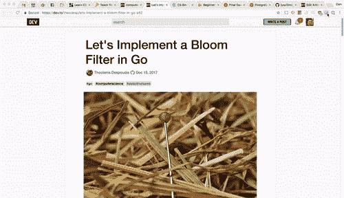
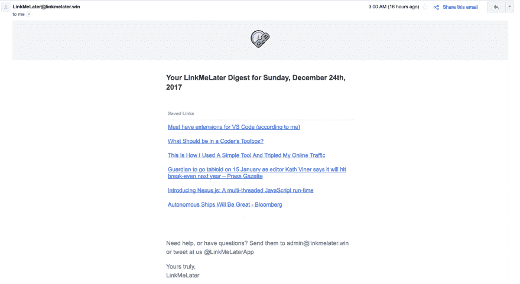
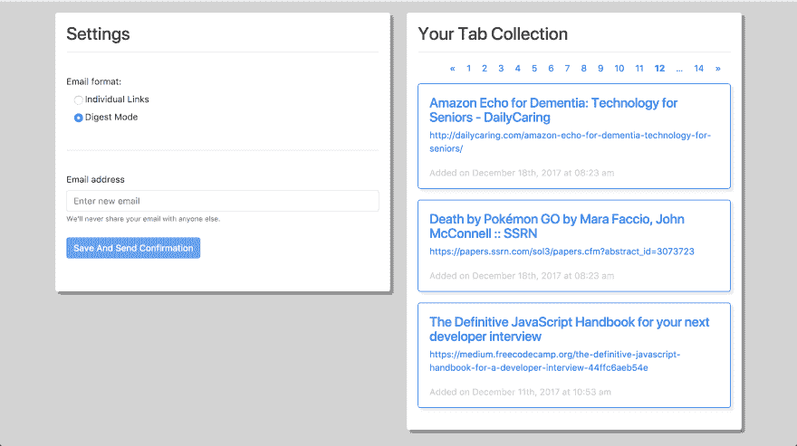

# 号召测试人员:如果你囤积标签或者想更好地管理你的阅读清单，我需要你的帮助

> 原文：<https://dev.to/dangolant/a-call-for-testers-if-you-hoard-tabs-or-want-to-manage-your-reading-list-better-i-need-your-help-2fao>

实用的开发者，

我在非常需要的时候给你写信。用今天互联网的说法来说，我已经*做了一件*的事情，并且可能平生第一次“*船*说的事情。不幸的是，我有一个自己无法解决的问题。*我需要测试员*

<figure>

[T2】](https://res.cloudinary.com/practicaldev/image/fetch/s--zZGSvHK5--/c_limit%2Cf_auto%2Cfl_progressive%2Cq_66%2Cw_880/https://thepracticaldev.s3.amazonaws.com/i/c0i58wsqkcvnhi24v9m7.gif)

<figcaption>People of dev.to, lend me your strength</figcaption>

</figure>

为了给出背景，我不得不坦白一些事情:我是一个 tab 囤积者。或者至少我曾经是，直到我建立了 [LinkMeLater](https://www.linkmelater.win) 。几个月前，我的朋友贾里德提出了一个奇怪的特殊行为，他注意到一些人表现出:通过电子邮件发送自己的链接供以后使用。我提到我实际上也是这样做的，我会经常在一个窗口中浏览我的 40 多个打开的标签，关闭我不再需要的标签，并通过电子邮件给自己发送我想在以后返回的文章或视频。他认为整个过程真的不应该存在，因为有大量的工具用于阅读列表管理、标签管理和链接共享。

在交谈过程中，我注意到所有这些服务之间的关键相似之处是，他们希望你采用新的，有时是陌生的行为，充其量只是边际回报。记住按下口袋按钮，然后记得阅读你的口袋收藏(即使他们提醒你)，比仅仅通过电子邮件发给你自己，并且一旦你有时间检查你正在看的任何东西就清空你的收件箱要难得多。

<figure>

考虑到这一点，我建立了 [LinkMeLater](https://www.linkmelater.win) 。 [LinkMeLater](https://www.linkmelater.win) Chrome 扩展做了一些非常简单的事情:它保存你当前正在看的标签，并关闭它(如果你在它的设置中配置了它的话)。

<figcaption>Really looking forward to [Theofanis Despoudis'](https://dev.to/theodesp) post on Bloom Filters in Go</figcaption>

</figure>

然后， [LinkMeLater](https://www.linkmelater.win) 服务会选择一天前保存的任何链接，并随机决定是否发送给你。这些半日制电子邮件要么以当天一系列单独电子邮件的形式出现，要么以包含所有电子邮件的单一摘要电子邮件的形式出现。

<figure>

[T2】](https://res.cloudinary.com/practicaldev/image/fetch/s--nTphbTNc--/c_limit%2Cf_auto%2Cfl_progressive%2Cq_auto%2Cw_880/https://thepracticaldev.s3.amazonaws.com/i/xwbv3a78e70l7gmbbm68.png)

<figcaption>Here's what my digest looked like a couple of days ago</figcaption>

</figure>

<figure>

您还可以通过导航到您的仪表板来查看您存储的所有链接，以防您意识到您想要在链接到达您的收件箱之前共享它。
[T3】](https://res.cloudinary.com/practicaldev/image/fetch/s--oIfEWzQR--/c_limit%2Cf_auto%2Cfl_progressive%2Cq_auto%2Cw_880/https://thepracticaldev.s3.amazonaws.com/i/tw6zfryr5gqaptfhx9to.png)

<figcaption>I have 41 links in my reading list, I may ***still*** have a problem</figcaption>

</figure>

这是我的问题:我很乐意向更多的观众推出这个，但我只设法让 3 个朋友来测试这个。我不确定我接下来应该添加什么，或者哪里需要改进。这款工具符合我的需求，但我希望继续为之努力。我目前的路线图包括每周/每月/用户预定的电子邮件(相对于半日)，用户控制的链接选择概率，以及额外的交付媒体，如短信，但优先考虑这些事情意味着找出潜在用户最想要的。

如果 [LinkMeLater](https://www.linkmelater.win) 听起来对你有用，我希望这个伟大社区的成员能检查一下并给我反馈。要设置它，只需在网站上注册，并下载主页上链接的 chrome 扩展。感谢阅读，我希望能收到你们的来信😃。

编辑:感谢读者的一些评论，我试着把 LML 移植到火狐上，现在可以在 https://addons.mozilla.org/en-US/firefox/addon/linkmelater/获得了😃。