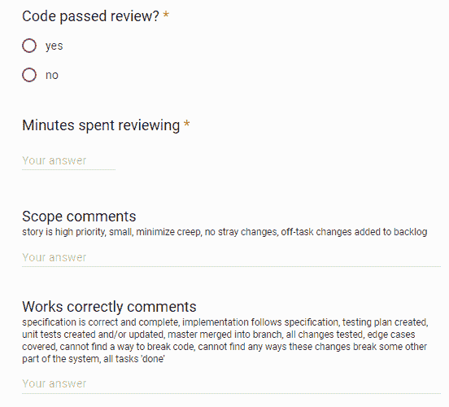

# 代码审查清单可以防止愚蠢的错误

> 原文：<https://dev.to/bosepchuk/a-code-review-checklist-prevents-stupid-mistakes-o6>

我的团队使用代码审查清单来防止愚蠢的错误给我们带来问题和浪费时间。在这篇文章中，我想分享我们决定实施代码审查清单的原因，我们的清单上有什么，我们如何创建、使用和改进我们的清单，以及它如何提高我们的效率。

### 为什么要创建代码评审清单？

我的团队的使命是[提高我们的效率](https://smallbusinessprogramming.com/increase-your-effectiveness/)。我们遵循[约束理论](https://smallbusinessprogramming.com/theory-of-constraints-10x-programmers/)模型，在该模型中，我们确定我们的约束并找到克服它的方法。

当我们查看 sprint 板上的故事流时，我们立即将注意力集中在我们的审查过程上，这是我们的瓶颈。通常情况下，故事以我们的“重新开放”状态(失败的代码审查)而不是“完成”状态结束。当我们追踪为什么我们的故事没有通过代码审查时，我们发现了与代码本身质量相关的各种原因。但是我们惊讶地发现我们经常犯愚蠢的错误。例子包括忘记运行单元测试或者遗漏一个需求。事实上，“愚蠢的错误”导致了我们绝大多数失败的代码审查。

但是当我们错过了一个步骤或者执行了一个无效的代码审查时，我们偶尔也会以产品中的缺陷而告终。跟老板说因为把简单的东西搞砸了就把网站撤了，真的很尴尬。

几年前，我读过*清单宣言:如何把事情做好* (Atul Gawande)，并立即意识到这将是一个使用清单的绝佳机会。

### 代码评审清单的好处

清单是确保你涵盖复杂任务中所有步骤的好方法，比如代码审查。不需要记住要找什么*和*检查代码，你只需要检查代码并相信清单可以确保你覆盖所有的要点。只要您实际使用您的代码审查清单(并且该清单结构良好)，您应该能够发现绝大多数愚蠢的错误。

### 我们的代码审查清单上有什么？

我们的代码审查清单已经随着时间的推移而发展。这是我的个人版本现在的样子。

> DO-确认
> 
> 代码审查清单:
> 
> 1.  范围 -故事是高优先级的，小的，最小化蔓延，没有偏离任务的变更，任务外的变更被添加到待办事项中
> 2.  **工作正常** -规格说明正确且完整，实现遵循规格说明，创建了测试计划，创建和/或更新了单元测试，**主测试合并到分支，测试了所有变更**，覆盖了边缘案例，找不到破解代码的方法，找不到这些变更破解系统其他部分的任何方法，所有任务“完成”，零已知缺陷
> 3.  **防御性** -验证公共方法的所有输入，如果使用不正确，会严重失败，检查所有返回代码，安全性
> 4.  **易于阅读和理解**——适当的抽象和问题分解、最小的接口暴露、信息隐藏、命令查询原则、良好的命名、有意义的文档和注释、完全重构(使用现有代码的判断)
> 5.  **样式和布局** -所有检查通过，代码格式化程序运行，无异味代码样式，线路长度，样式符合项目指南
> 6.  **最后的考虑** -你完全理解代码以及你所做的改变和它的影响...**牢不可破，实际上已经完成，将通过代码审查，会让你自豪地在公共场合向其他程序员展示你的更改**，易于审查，正确的分支，没有杂散代码，架构更改记录在案，主合并到分支，单元测试通过，手动测试计划完成并执行，所有更改提交并推送，拉式请求创建并审查，吉拉更新

我的团队的官方清单不包括第 6 步。这是我个人对我认为在代码评审的最后要检查的事情的提醒。

有些人可能会说我们的清单包含了太多的细节。这可能是一个合理的抱怨。然而，这是我们团队开发的清单，对我们很有用。

### 我们如何创建代码审查清单

我们通过查看代码评审过程中的步骤以及在获取通过评审的拉请求时遇到的问题，创建了我们的清单。然后，我们将所有这些细节收集到一个初始的代码审查清单中。我们花了几周时间组织和完善了我们的初始清单。

一旦我们对代码审查清单感到满意，我们就把它转换成一个 Google 表单。我们还包括了一些额外的字段，用于我们想要获取的关于代码评审的数据，例如:

*   作者和审阅者的姓名
*   代码审查花了多长时间
*   结果(通过/失败)

这些字段很重要，因为它们给了我们监控代码审查改进计划的成功所需的反馈。

下面是谷歌表单的样子:

### 我们如何使用代码审查清单

拉请求的作者使用代码审查清单对他的代码进行自我审查。他纠正他发现的任何问题，然后发布他的拉动式请求以供审查。

审查者使用 Google 表单版本的清单来指导审查并获取结果摘要。我们通常在两分钟内完成谷歌表单。我们在 BitBucket 中为作者附上了关于代码本身的具体而详细的反馈。

Google 表单将我们的代码审查结果存储在一个 Google 电子表格中。作为回顾会议的一部分，我们每两周查看一次数据，在回顾会议上，我们评估代码审查过程的有效性，并查看它如何随着时间的推移而变化。

**我们发现自我评估和同行评估一样重要**。令人惊讶的是，当你从细节中退一步，将你的代码放在一个清单上时，你会发现很多问题。我们的清单特别擅长捕捉我们忘记做的事情。例如，每个人偶尔都会忘记实现一个需求。如果没有清单来提醒我们，我们很难发现拉取请求中缺少了什么。

### 我们如何改进代码审查清单

我们的代码审查清单是一个活的文档。我们会定期检查，并根据需要添加或删除问题。我们也鼓励程序员保留他们自己版本的代码审查清单。个性化的清单包含只对写清单的人重要的提醒(就像第 6 部分是为我准备的-见上文)。

### 结果

我们对代码审查清单的结果非常满意。我们已经大大减少了因为愚蠢的原因而失败的代码审查的数量。每一次失败的代码审查都会花费我们大量的时间。由于愚蠢的原因而失败的代码审查——比如遗漏的需求——是一种非常容易预防的浪费形式。此外，我们更快地进行代码审查，并且该过程更加一致，因为我们使用了一个清单。我们已经显著提高了我们的效率。

我们还使用我们的代码审查清单来识别自动化机会。当我们第一次开始做代码评审时，我们在代码格式、样式、命名、方法复杂性等方面有很多问题..我们很快意识到这些问题耗费了我们大量的时间，它们值得标准化/自动化。所以我们配置了代码格式化工具和各种静态分析器。它们就在我们的 IDE 中自动运行。自动化这些步骤极大地提高了我们的效率——非常出色。

这些天我们的清单向我们展示了手工测试过程的高成本。因此，在我们认为有健康的投资回报的情况下，我们在测试自动化方面投入了更多的努力。

### 进一步阅读

对于想开始使用清单的程序员来说，有大量的资源。但我在这里只提几个:

*   书:*清单宣言:如何把事情做好*(阿图尔·加万德)
*   Atul Gawande 的文章:[清单](https://www.newyorker.com/magazine/2007/12/10/the-checklist)
*   书:*代码完成* (Steve McConnell)包含了许多各种软件工程活动的清单
*   文章:[为什么你需要一份清单:清单宣言的实用要点](http://www.marketade.com/2011/07/12/why-you-need-a-checklist-practical-takeaways-from-the-checklist-manifesto/)
*   文章: [11 个行之有效的同行代码评审实践](https://www.ibm.com/developerworks/rational/library/11-proven-practices-for-peer-review/)

### 包装完毕

清单是提高代码评审效率的一种行之有效的方法。我们大概花了十几个小时来建立和运行我们的代码审查清单的初始版本。小额投资每天都给我们带来红利。

你使用代码审查清单吗？请在评论中分享你的想法。