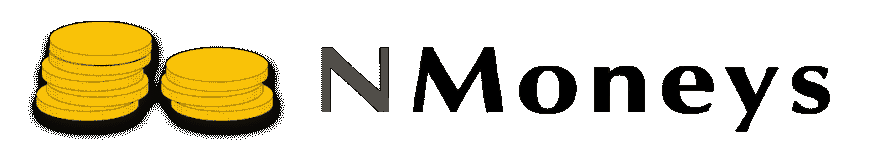

# 中的货币值对象实现。网

> 原文：<https://dev.to/dgg/a-money-value-object-implementation-in-net>

[T2】](https://res.cloudinary.com/practicaldev/image/fetch/s--qWr79OD8--/c_limit%2Cf_auto%2Cfl_progressive%2Cq_auto%2Cw_880/https://thepracticaldev.s3.amazonaws.com/i/l2xgj1nktxkkb011u3x1.jpg)

让我们通过打破标题来揭开众所周知的猫皮

# 一个货币价值对象

在这种情况下,“货币”是指一种数量，它代表一种被接受的货币的支付手段。也就是说，货币数量由在给定货币环境中有意义的“数量”组成。买车时，去掉“五美元”这个数字，说你有“美元”并不会让你走得太远。同样，在申报你的财富时，除去货币和数字本身没有什么意义。

根据[马丁·福勒](https://martinfowler.com/aboutMe.html)(高度推荐的[企业应用架构模式](https://martinfowler.com/books/eaa.html)的作者)，一个[价值对象](https://martinfowler.com/eaaCatalog/valueObject.html)是:

> 一个简单的小对象，它的相等性不是基于身份

也就是说如果两个值对象的值相等，那么它们就是相等的。

因此，货币值对象是一种小型(很可能是不可变的)类型，它通过指定货币数量及其货币来表示货币数量，并允许实例之间进行有意义的正确操作。

## 我们为什么需要一个货币价值对象在。网？

简短的回答是*，因为没有*。

患有原始痴迷症的人可能会使用原始数字进行格式化。不幸的是，这种能力与有趣和复杂的东西，如语言、文化、地区、日历，...
使用原始的数字原语并依赖文化背景可能会导致危险的误解:这个数字是以美元、欧元表示的，还是某个随机的国王手臂的长度？这就排除了这样一个事实，即两个数字之间完全有效的运算，例如求和，在两个货币量之间可能完全不正确，如果它们碰巧是不同的货币。

我们可以用数字、格式提供者和良好的命名来规范我们的方式，但事实是，我们最好将货币规则和操作封装在货币类型中。

## 标准化的需要

货币和国家是一个敏感的话题，为了就什么是什么达成一致，国际标准化组织提供了一份当前被接受的货币及其字母和数字代码的清单。

该列表是活动的，新的货币进入列表，旧的、废弃的货币出现并且名称改变。尽管微软做出了努力，但在 ISO 目前接受的标准和。NET 框架，框架版本和补丁有时落后于当前的标准。

一个专注的、较小的库比一个较大的框架更容易保持最新。

# 金钱来拯救

出于上述原因， [NMoneys](https://github.com/dgg/nmoneys) 的存在是为了:提供遵循 ISO 4217 标准的货币价值对象开源实现。

这个项目是一个有着丰富经验的项目，我希望它能得到更多的曝光，帮助更多的人。

[T2】](https://res.cloudinary.com/practicaldev/image/fetch/s--BXvDNc0B--/c_limit%2Cf_auto%2Cfl_progressive%2Cq_auto%2Cw_880/https://raw.githubusercontent.com/dgg/nmoneys/wiki/NMoneys_long.png)

访问[项目站点](https://github.com/dgg/nmoneys)，阅读[文档](https://github.com/dgg/nmoneys/wiki)，通过 [NuGet](https://www.nuget.org/packages/NMoneys) 和 [contribute](https://github.com/dgg/nmoneys/wiki/Contribute) 获得它的二进制文件，如果你喜欢的话。

你可以关注我的个人[博客](https://dgondotnet.blogspot.dk/)了解[的更新和新发布的](https://dgondotnet.blogspot.dk/search/label/NMoneys)。

负责任地享受；-)