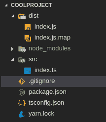
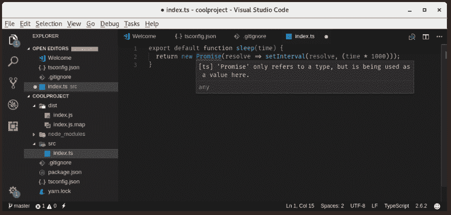
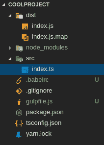

# 一个不错的类型脚本构建链

> 原文：<https://dev.to/hjfitz/a-nice-typescript-buildchain-4c82>

您想在 TypeScript 中创建一些很棒的东西，所以您设置了一个很好的小目录结构:

[T2】](https://res.cloudinary.com/practicaldev/image/fetch/s--8apBq_vm--/c_limit%2Cf_auto%2Cfl_progressive%2Cq_auto%2Cw_880/https://thepracticaldev.s3.amazonaws.com/i/n7fg9d06avscgdmky8ow.png)

您希望支持 node 的旧版本，因此您相应地设置了您的 typescript 编译器:

```
{  "compilerOptions":  {  "target":  "es5",  "sourceMap":  true,  "outDir":  "dist",  "moduleResolution":  "node"  },  "exclude":  [  "node_modules"  ],  "files":  [  "src/index.ts"  ]  } 
```

Enter fullscreen mode Exit fullscreen mode

但是等等！

[T2】](https://res.cloudinary.com/practicaldev/image/fetch/s--sak0-Uxs--/c_limit%2Cf_auto%2Cfl_progressive%2Cq_auto%2Cw_880/https://thepracticaldev.s3.amazonaws.com/i/688qlffher0prdnmopmo.png)

你说我不能用承诺是什么意思？我不想进口塑料填充物，那会污染我的好身体！如果我切换到 ES6，我会得到 ESM 导入语句。我不能在 node 中使用这些！

# 进入大口和通天塔

有更好的方法。我们可以用吞咽。它是一个任务运行程序。它运行任务。

```
yarn add --dev gulp gulp-babel gulp-jsdoc3 gulp-sourcemaps gulp-typescript babel-preset-env 
```

Enter fullscreen mode Exit fullscreen mode

*注:可以用`npm install --save-dev`* 代替`yarn add --dev`

现在我们有了 Gulp，我们可以从 TypeScript 获取 ES6 输出，并使用`babel-preset-env`将它填充到我们想要支持的任何版本。

**这是你可能正在寻找的部分:**

为此，我们需要设置两个文件:`gulpfile.js`和`.babelrc`。我们也会修改我们的`tsconfig.json`。

```
// gulpfile.js
const gulp = require('gulp');
const babel = require('gulp-babel');
const sourcemaps = require('gulp-sourcemaps');
const ts = require('gulp-typescript');

const tsProj = ts.createProject('tsconfig.json');

gulp.task('build', () => {
  gulp.src('src/**/*.ts')
    .pipe(sourcemaps.init())
    .pipe(tsProj())
    .pipe(babel())
    .pipe(sourcemaps.write('.'))
    .pipe(gulp.dest('dist'));
});

gulp.task('default', ['build']); 
```

Enter fullscreen mode Exit fullscreen mode

```
//  .babelrc  {  "presets":  [  ["babel-preset-env",  {  "targets":  {  "node":  "6.10"  }  }]  ]  } 
```

Enter fullscreen mode Exit fullscreen mode

```
//  tsconfig.json  {  "compilerOptions":  {  "target":  "es6",  "allowSyntheticDefaultImports":  true,  "sourceMap":  true,  "outDir":  "dist",  "moduleResolution":  "node"  },  "exclude":  [  "node_modules"  ],  "files":  [  "lib/index.ts"  ]  } 
```

Enter fullscreen mode Exit fullscreen mode

我们最终的目录结构是:

[T2】](https://res.cloudinary.com/practicaldev/image/fetch/s--1DyEcdOQ--/c_limit%2Cf_auto%2Cfl_progressive%2Cq_auto%2Cw_880/https://thepracticaldev.s3.amazonaws.com/i/ctz98wqy60tp9vf6xmx9.png)

要构建，我们只需运行:`npx gulp`，它运行 Gulp。

# 一种解释

如果你在谷歌上搜索如何做到这一点的解决方案，并且你有其他东西要修复，这部分不适合你。如果你想明白我们刚刚做了什么，继续听我说。

## 大口

我们使用 Gulp 作为我们构建的核心。它是一个任务运行程序，这意味着我们可以让它做各种各样的事情。编译 SASS，创建 JSDoc，甚至编译 TypeScript。

我们的 Gulp‘build’命令执行以下操作:

*   获取我们所有的打字稿文件:`gulp.src('src/**/*.ts')`
*   开始一个 source map(VS 代码调试的理想选择):`.pipe(sourcemaps.init())`
*   编译类型脚本(使用我们之前定义的 ts config):`.pipe(tsProj())`
*   通过巴别塔传递编译好的代码:`.pipe(babel())`
*   完成我们的源地图:`.pipe(sourcemaps.write('.'))`
*   伸出‘dist/’中的输出:`.pipe(gulp.dest('dist'));`

## 通天塔

我们使用`.pipe(babel())`在 Babel 中运行我们的代码。巴别塔多菲尔。如果没有参数被传递，它就寻找`.babelrc`。

我们的`.babelrc`使用了`babel-preset-env`，一个相当新的巴别塔预设。这太棒了——您只需向 polyfill*提供一个版本。更多关于预设环境[这里](https://babeljs.io/docs/plugins/preset-env/)。

* poly fill 或 polyfiller 是一段代码(或插件),它提供了开发人员希望浏览器(解读器)本身提供的技术- [source](https://remysharp.com/2010/10/08/what-is-a-polyfill)

## npx

npx 是一个强大的工具，本质上可以让你从你的`node_modules/`运行程序。用 eslint 试试吧！`yarn add eslint && npx eslint --init`。如果你不想让二进制文件永久安装在你的系统上，有时会容易些。

我希望这是一些信息！今天第一次安装这个装置简直是一次冒险！