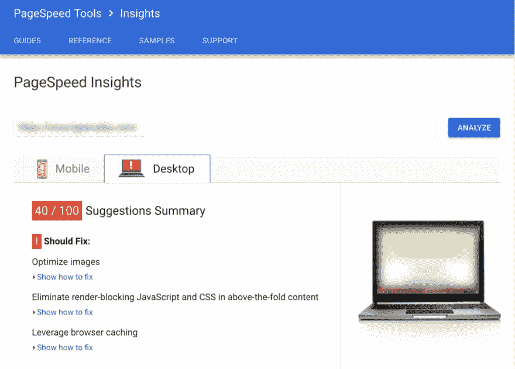

# 一个漂亮的网站还不够

> 原文：<https://dev.to/gaijinity/a-pretty-website-isn-t-enough-731>

# 一个漂亮的网站是不够的

### 当你创建了一个精美、设计良好、符合规格的网站时，你的工作还没有完成。这才刚刚开始

安德鲁·韦尔奇

[T2】](https://res.cloudinary.com/practicaldev/image/fetch/s--XQ5dzd2v--/c_limit%2Cf_auto%2Cfl_progressive%2Cq_auto%2Cw_880/https://nystudio107-ems2qegf7x6qiqq.netdna-ssl.com/img/blog/_1200x675_crop_center-center_82_line/beauty.jpg)

所以你已经设计了一个漂亮的、功能齐全的网站，而且你已经找到了它的最后一点。你的客户对它的外观很满意，所以你准备发货了，对吗？差远了。

我不知道有多少次，我从一家专业文件代理处为一个知名品牌浏览了一个非常好的新网站，结果却被发现了。就像一些见过香肠是如何制作的人一样，我不再以同样的方式看待事物。

<aside>I’m ruined, because I look at how a site was put togeth­er, as well as the per­for­mance char­ac­ter­is­tics of the web­site, not just the beau­ti­ful design and user experience.</aside>

这是我最近在推特上看到的一个网站；这根本不是 cher ry-pick。我会看到这样的东西，然后在内心死去。我有一个合理的想法，客户为这个网站付了多少钱，这让我畏缩:

[T2】](https://res.cloudinary.com/practicaldev/image/fetch/s--Szxlsejr--/c_limit%2Cf_auto%2Cfl_progressive%2Cq_auto%2Cw_880/https://nystudio107-ems2qegf7x6qiqq.netdna-ssl.com/img/blog/_1200x861_crop_center-center_100_line/beauty_gpsi.png)

网站设计和 UX 是伟大的；但是性能却不是这样(他们可以根据 Craft CMS 文章中的[创建优化的图像来定义 Ben fit)。这告诉我要么:](https://dev.to/gaijinity/creating-optimized-images-in-craft-cms-2hc5-temp-slug-2354251)

1.  开发者不知道如何为 mant 建立一个网站
2.  没有评估网站性能的质量保证过程
3.  为 mant 建立一个网站的计划没有成功
4.  开发人员知道如何为 mant 建立一个个人网站，但他们就是不在乎

我将在这篇文章中尝试解决这四个问题。是的，另外一个可能的原因是他们已经没有时间了；但这通常是一个过程的结果。首先，无论如何，让我们深入了解许多阿根传统的思维定势。

## 一切都在于视角

了解传统的阿根血统是有帮助的。他们的起源是营销和印刷领域，所以他们的重点是信息和设计。他们认为网站是如何被组装起来的是事后的想法；设计视觉、品牌和 UX 的“真正工作”已经完成。

想想一个网站是如何建立起来的，类似于他们思考当他们的广告被发送到出版社时会发生的机械印刷过程。当然，他们会做一个质量保证审查，以确保*看起来像*他们的原始设计，但也仅此而已。

这太不可思议了。创建一个网站并不像从印刷机上撕下一页纸那样是一个简单的机械过程。你不是在建立一个静态的东西，它只需要有视觉吸引力和信息。

<aside>When you’re build­ing a web­site, you’re actu­al­ly build­ing a very spe­cial­ized, cus­tom soft­ware app. Unlike print or video ads, you need to be con­cerned with acces­si­bil­i­ty, per­for­mance, and user experience.</aside>

阿根的传统企业已经不情愿地——至少部分地——加入了软件开发公司。就像许多偶然发生而非有意安排的事情一样，他们中的大多数人不明白这个行业是如何运作的，甚至不知道他们是这个行业的一员。通常“数字团队”被认为是构建设计的装配线工人。

虽然我非常欣赏精美的设计和准确的营销信息，但它们只是网站建设的一部分。重要的是，你要学会如何将可用性测试、质量保证和性能优化融入到你的工作流程和建议中。

这些是软件工程的标志。这就是你们真正在做的事情，伙计们。

<aside>A web­site is emphat­i­cal­ly not just a ​“dig­i­tal brochure.” Stop think­ing of it that way.</aside>

## 为什么有关系？

技术人员称你正在建立的网站名称为 mat ter，因为最终人们会使用你的网站。人们不喜欢等待。

想想 gro cery 商店自助结账队伍的崛起。人们愿意为杂货店做这些工作，如果这意味着他们能更快结账的话。如果你仔细想想，这是非常值得注意的，并且提供了一个令人信服的证据，证明人们就是不喜欢等待。

[T2】](https://res.cloudinary.com/practicaldev/image/fetch/s--lpk6pUD0--/c_limit%2Cf_auto%2Cfl_progressive%2Cq_auto%2Cw_880/https://nystudio107-ems2qegf7x6qiqq.netdna-ssl.com/img/blog/_1200x675_crop_center-center_82_line/checkout-line.jpg)

研究表明，32%的消费者会在一到五秒内开始放弃慢速网站。随着页面尺寸的减小和速度的提高，跳出率可以[提高 30%](https://www.digitalrealty.com/blog/the-cost-of-latency/) 。[页面加载时间延迟一秒](https://blog.kissmetrics.com/loading-time/?wide=1)会导致页面访问量减少 11%,客户满意度下降 16%,转化率损失 7%。

所有这些都不应该被认为是惊人的。数字世界导致了对选择的探索。当一个人在手机上搜索一家餐馆，同时匆忙进入一家优步餐厅时，很可能他们会点击后面的按钮，然后继续搜索下一个结果，如果它加载缓慢的话。

这就是为什么谷歌把页面速度作为搜索引擎结果页面(SERP)的排名指标。查看[现代搜索引擎优化:蛇油与物质](https://nystudio107.com/blog/modern-seo-snake-oil-vs-substance)文章，了解更多关于搜索引擎优化的含义。

谷歌的目标不仅仅是返回被搜索的文学作品的搜索结果，它还返回人们想要的东西。人们想要一个响应迅速的网站，尤其是在手机上。

移动设备不仅速度慢，屏幕小，而且数据互联网连接的延迟高。它们也用于现实世界中等待和耐心是不可取的情况。鉴于许多网站的大部分流量都来自移动设备，如果忽略它们，后果自负。

## 这要从求婚说起

那么我们该怎么做呢？第一步是将性能优化和 QA *构建到您的网站 props*中。这是高技术，有价值的工作，你应该得到报酬。作为一名专业人士，你的职责是向你的客户介绍性能的重要性，以及性能对他们的影响、用户体验和品牌声誉意味着什么。

我首先查看客户的谷歌分析，并向客户展示他们从移动设备接收的流量。然后我查看不同页面的跳出率，看看加载时间和跳出率之间是否有关联。然后，我以清晰、准确的方式向客户展示这一点。

我发现一个有用的文件是[对移动速度的需求](https://docs.google.com/viewerng/viewer?url=https://storage.googleapis.com/doubleclick-prod/documents/The_Need_for_Mobile_Speed_-_FINAL.pdf)，来自谷歌自己(谷歌拥有 Dou bleClick)。一旦你说服了他们，下一步就是在他们当前的网站上记录他们的基准，并在你完成工作后向他们展示同样的基准。

<aside>Impress upon them that best look­ing design & wit­ti­est mar­ket­ing mes­sage mean absolute­ly noth­ing if the user nev­er sees it. The slow­er your web­site is, the more like­ly it is the user will not wait for it to load.</aside>

当你向客户展示谷歌说他们有一个好的网站时，他们可能不理解你所做的所有技术，但他们肯定会理解他们所知道和信任的品牌的积极评价。当你在[谷歌页面速度洞察](https://developers.google.com/speed/pagespeed/insights/)上从`40/100`到`92/100`访问他们的网站时，这是他们可以搜索到的显著进步。这让豆子计数员很开心。

另一个要记住的关键事情是，许多在公司有权力的人都是聪明、有竞争力的人。他们渴望成功，喜欢有一种方法来衡量他们相对于他们的竞争对手做得如何。这就是为什么我也建议做比较分析，向他们展示谷歌是如何说他们的网站不仅与他们的对手网站相关，还与他们的竞争对手 T2 相关。

向他们展示一个来自谷歌的老鼠当然很好；但是向他们展示他们的电脑 Bob 的硬件是如何在街上只得到`45/100`的，你将真正击中他们大脑的恳求中心。

如果他们计划通过营销广告来推广他们的网站，这也意味着他们营销广告的有效性与网站提供的性能和体验直接相关。

<aside>Dump­ing a pile of mon­ey into pro­mot­ing a web­site that isn’t per­for­mant is like run­ning a mas­sive pro­mo­tion for a restau­rant that has only one serv­er attend­ing to all of the tables. No mat­ter how tasty the food is, some peo­ple are going to be turned off.</aside>

在说服客户之前，你可能还需要向项目经理、设计团队、文案撰写人、质量保证人员和其他人做这些内部推介。真正的进步往往需要统一战线。如果你是一名自由职业者，那么，带自己出去喝杯啤酒，聊聊天。

所以，好吧，我们得到了这份工作，我们的团队支持我们，我们把客户卖给了曼斯。我们怎么做呢？

## 客观测试是关键

创建一个适合 mant 网站的方法是通过测试。您测试，然后根据测试结果修改网站，并在一个连续的反馈循环中重新测试。有许多测试可以帮助我们以决定性的、客观的方式评估我们的工作。当你仔细想想的时候，你会发现这实际上是一种狂热。没有客观的测试来告诉一个作家他的故事有多好，或者一个画家他们的个性有多好。

<aside>It’s impor­tant to under­stand that we’re not just try­ing to do well on the tests to get a good score. We’re try­ing to do well on the tests because they give us mean­ing­ful, action­able feed­back on how to improve our websites.</aside>

作为工作流程的一部分，我工作的每一个网站都要接受持续的测试。当网站“完成”时，我并不只是事后才运行测试，因为通常在那个时候，当你看到发布截止日期时，你所能做的就是耸耸肩。

对于 mant 来说，网站是从高效的工作流程中诞生的。我可以查看各种网页测试结果，并且通过查看结果就可以很好地了解网站是如何构建的。为了建立高性能的网站，你可能需要学习新的流程、新的工具，并重新思考你的工作流程。

然而，这既是一个技能问题，也是一个思维问题。技术总是不可避免地向未来发展。今天的最佳实践不会是几年后，甚至是明年的最佳实践。如果你不跟上，其他人会跟上，受欢迎的技能不是商品。

<aside>Addi­tion­al­ly, once per­for­mance is part of your work­flow, it isn’t any hard­er to pro­duce per­for­mant sites. It’s just what you do.</aside>

所以，不多说了，这里是我使用的测试，以及我使用它们的目的。测试之间有一些重叠，这很好，但是理解每个工具测试的内容很重要。

*   [Google Light house](https://developers.google.com/web/tools/lighthouse/)——这是一个将多个性能、[专业 WebApp](https://nystudio107.com/blog/service-workers-and-offline-browsing) 和访问能力测试整合到一个工具中的工具。你可以下载 Chrome 扩展，或者它也内置在 Chrome 60 或更高版本中。
*   谷歌页面速度洞察(Google Page Speed Insights)——这主要是衡量浏览器的速度，也就是说，网页是如何被传送到客户端浏览器的，以及它到达浏览器需要多长时间。
*   [谷歌手机交友网站测试](https://testmysite.thinkwithgoogle.com/) —测试你网站的手机交友度，以及网站的手机性能。它也创建了一些非常客户端友好的结果页面。
*   Web PageTest(网页测试) —这对于测量第一个字节的时间(TTFB)、网站开始运行前需要多长时间非常有帮助，而 water fall 视图向您显示资源是如何交付的。事实上，您可以选择运行测试的设备、浏览器和位置，这使得它非常有价值。
*   [GTMetrix](https://gtmetrix.com/) —这些测试主要有助于确保您已经完成服务器端设置。它也测试其他东西，但是对我来说最有价值的是它运行的服务器端检查。
*   W3C 标记价值服务 —如果我们的标记无效，它在各种浏览器中运行时可能会出现问题，这也可能使 Goog Bot 等公司无法很好地解析和索引您的站点。
*   [结构化数据测试工具](https://search.google.com/structured-data/testing-tool/u/0/) —帮助我验证网站上所有 JSON-LD 结构化数据的完整性和正确性。
*   [Ping dom](https://tools.pingdom.com/) —另一个测试工具，允许您选择多个位置进行测试，并为我们提供了一个很好的列表，列出了我们可以从性能角度改进的地方。
*   安全负责人 —从安全角度来看，我们已经正确地设置了我们的负责人，以防范 XSS 袭击等。 [report-uri](https://report-uri.io/home/tools) 也用于构建这些。
*   推特卡验证员 —确保我们的推特卡设置正确，并让我们对最终用户看到的推特卡有一个很好的预览。
*   Facebook Open Graph Debug ger—val 在我们的网站上公布了 Open Graph 元测试的日期，并让我们预览了这些数据在脸书上共享时的样子。
*   [WooRank](https://www.woorank.com/) —这是一个*付费的* SEO 服务，我用它来监控网站 SEO 的效率，以及持续监控。对于选择加入的客户，我要求他们每月发送一份附有分析的 ly WooRank 报告。
*   [SSL 服务器测试](https://www.ssllabs.com/ssltest/) —确保您的 SSL 证书设置正确，不会受到已知攻击媒介的攻击。
*   [http/ 2 测试](https://tools.keycdn.com/http2-test) —验证您的服务器在支持`ALPN`的情况下能够正常运行`http2`。

如果这看起来是一个很长的列表，它是。但是把它们作为你的开发和质量保证过程的一部分并不需要太多的工作。

嗯，当然。我能听到你说。*但并不是每个项目都有这类事情的萌芽。*的确如此。但是你不想做那些有用的吗？你会成为你所做的。

## 吃我自己的狗粮

您现在浏览的网站遵循了这些测试推荐的最佳实践。希望你注意到这个网站为你加载得很快，也许这甚至让你微笑。

但不要相信我的话；请随意通过上面列出的测试运行这个网站。虽然不会尽善尽美，但这不是重点。关键是测试被用作开发过程的一个迭代部分，并被适当地执行。

如果你通过[谷歌页面速度洞察](https://developers.google.com/speed/pagespeed/insights/?url=https%3A%2F%2Fnystudio107.com%2Fblog)运行[博客索引页面](https://dev.to/blog)，你会发现它的得分很高:

[T2】](https://res.cloudinary.com/practicaldev/image/fetch/s--umYEk8JV--/c_limit%2Cf_auto%2Cfl_progressive%2Cq_auto%2Cw_880/https://nystudio107-ems2qegf7x6qiqq.netdna-ssl.com/img/blog/_768x700_crop_center-center_100_line/pagespeed_insights.png)

文章页面做得不太好，因为我正在使用的[Dis quests](https://disqus.com/)commenting 系统添加了一些评分的 JavaScripts，但它仍然处于 90 年代中期，这很好。每个博客条目都有[谷歌版本](https://dev.to/gaijinity/google-amp-should-you-care-3din-temp-slug-933989)，这样当它们出现在谷歌搜索引擎上时，人们就会知道他们得到了一个快速网页。

在以后的文章中，我将向您展示如何做到这一点的具体细节。在那之前……当你建立网站时，试着坚持营员的座右铭:

<aside>Leave things a lit­tle bit bet­ter than how you found them.</aside>

这会让你和你的客户都成为快乐的小营员。

## 进一步阅读

如果你想获得新文章的通知，请在 Twitter 上关注[纽约时报 107](https://twitter.com/nystudio107) 。

版权所有 2020 nystudio107。由 nystudio107 设计