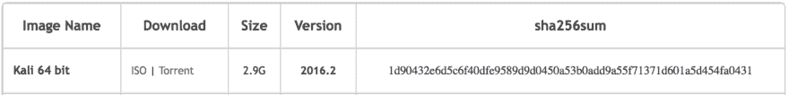

# 快速介绍:哈希

> 原文：<https://dev.to/aunyks/a-quick-introduction-hashing>

## 什么事？

哈希是一种确定两个数据块是否相等的方法。加密哈希函数为任何数据集生成唯一的字符串。这些数据的例子可以是文件、字符串、流和任何其他可以用二进制格式表示的项目。

您可能在一些您喜欢的工具、包或库的下载页面上看到过散列字符串。例如，Kali Linux [的每个版本](https://www.kali.org/downloads)都有一个。但这是为什么呢？

这是为了确保他们服务器上的原始文件与您下载的文件相同。例如，Kali ISO 的 [SHA-256](https://en.wikipedia.org/wiki/SHA-2) 散列如下。

[T2】](https://res.cloudinary.com/practicaldev/image/fetch/s--XXg8CLIK--/c_limit%2Cf_auto%2Cfl_progressive%2Cq_auto%2Cw_880/https://cdn-images-1.medium.com/max/1600/1%2ACv3S8G0KnPtladCwLgEHcg.png)

如果您下载文件，您应该散列您的本地副本。如果产生的哈希与他们网站上的哈希相同，您可以放心，文件在下载过程中没有被篡改，并且您拥有相同的正确文件。

## 等待...但是你怎么散列东西呢？

[T2】](https://i.giphy.com/media/RFYMmNb3j60BG/giphy.gif)

问得好。来点技术！顺便说一下，我假设你已经安装了 Python 2。

**1-** 让我们导入我们需要的库。

```
import hashlib as hash 
```

Enter fullscreen mode Exit fullscreen mode

现在让我们选择我们的散列算法。*想了解更多关于他们差异的信息，[看看这个](https://security.stackexchange.com/a/30209)。*

```
sha = hash.sha256() 
```

Enter fullscreen mode Exit fullscreen mode

我们基本上设置好了，现在我们将继续测试字符串上的函数。

```
# Insert the string we want to hash sha.update('Hello World!')
# Print the hexadecimal format of the binary hash we just created print sha.hexdigest()
""" 4d3cf15aa67c88742e63918825f3c80f203f2bd59f399c81be4705a095c9fa0e """ 
```

Enter fullscreen mode Exit fullscreen mode

太棒了，还有字符串“Hello World！”的阿沙-256 哈希。现在我们将证明相似数据的散列是不同的。

```
# Note the missing '!' sha.update('Hello World')
print sha.hexdigest()
""" a591a6d40bf420404a011733cfb7b190d62c65bf0bcda32b57b277d9ad9f146e """ 
```

Enter fullscreen mode Exit fullscreen mode

完全不一样。

**4-** 现在我们知道我们的函数工作了，让我们在一个文件上试试

```
# WARNING: Do NOT do this with large files.
# For large files, see the snippet here -> https://gist.github.com/aunyks/042c2798383f016939c40aa1be4f4aaf with open('kali.iso', 'rb') as kali_file:
  file_buffer = kali_file.read()
  sha.update(file_buffer)
  print sha.hexdigest()
""" 1d90432e6d5c6f40dfe9589d9d0450a53b0add9a55f71371d601a5d454fa0431 """ 
```

Enter fullscreen mode Exit fullscreen mode

我们走吧。你现在已经对哈希有了很好的了解。所以，去吧。去吧！保护你的数据的完整性和散列所有的东西！

[](https://i.giphy.com/media/xT0BKCQJDzoTaeQyA0/giphy.gif) 
还有，请关注我的 [Twitter](https://twitter.com/aunyks) 和 [Github](https://github.com/aunyks) 。