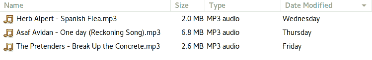

# 简单的问题

> 原文：<https://dev.to/dmerejkowsky/a-simple-problem-5f99>

*原载于[我的博客](https://dmerej.info/blog/post/a-simple-problem/)*

比方说，在你的工作中，你每天 10 点都有每日例会。

为了避免单调，您决定每次播放不同的歌曲来表示会议开始。

让我们假设以下情况:

*   你的音乐收藏整理得很整齐，所有的文件名看起来都像`<author> -.mp3`
*   这些文件可以很容易地从网络浏览器中找到并下载。

您希望:

1.  确保同一首歌不要播放两次
2.  能够回答问题:“X 天前你放的歌是什么？”
3.  有一个按时间顺序排序的歌单，这样你就可以告诉自己:“哼。我已经两个星期没有玩平克·弗洛伊德的任何东西了，让我们今天用另一块砖吧

根据你的经验，你需要写多少行代码来解决这个问题？

我会给你一点时间思考这个问题…

同时欣赏视频:

[https://www.youtube.com/embed/VwO21W9AD3w](https://www.youtube.com/embed/VwO21W9AD3w)

多少钱？一千行代码，一百行，十行？

我知道你会说这取决于你使用的语言，但事实上并不是这样。

您需要编写的代码行数与您使用的语言无关，因为答案是零。

我会让你再考虑一会儿。向下滚动查看解决方案:)

。

。

。

。

。

。

。

。

。

。

。

。

。

。

。

你只需要一个特殊的文件夹，比如说“站立”和一个文件浏览器。

每天，您将歌曲下载到正确的文件夹中，然后使用“按日期排序”功能将歌曲按日期排序:

T3】

是的，有时候“什么都不做”是最好的策略:)

我会给你一个引用和链接:

> 计算机系统中最便宜、最快、最可靠的组件是那些不存在的组件。
> 
> 戈登·贝尔

*   [你写代码没有报酬](http://bravenewgeek.com/you-are-not-paid-to-write-code/)

再见！