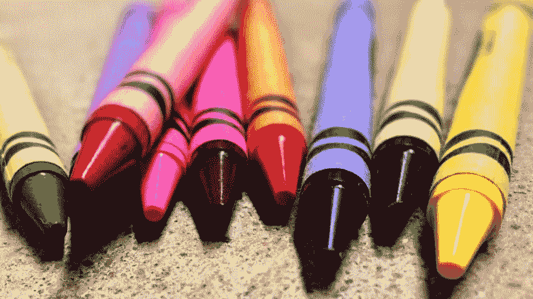

# 比特币和区块链的超级简单指南

> 原文：<https://dev.to/jordanirabor/a-super-simple-way-to-understand-bitcoin-and-the-blockchain-cg6>

如果让孩子们为自己发明货币，他们会怎么做？

想象你回到了幼儿园，这就是当时的情况；每个孩子可能拥有一支或多支蜡笔，或者根本没有。拿着蜡笔的孩子们可以把它们分发出去，以换取同等价值的其他物品。

[T2】](https://res.cloudinary.com/practicaldev/image/fetch/s--PPCC5d2D--/c_limit%2Cf_auto%2Cfl_progressive%2Cq_auto%2Cw_880/https://cdn.pixabay.com/photo/2015/08/08/01/11/crayons-879973_960_720.jpg)

在操场上，一些孩子用蜡笔换了一支钢笔，另一些换了一把尺子或一块橡皮。更常见的是，孩子们用蜡笔换钱。这真的取决于交易时达成的协议。不过有一点是不变的。一支蜡笔是一种资产。

对于要发生的交易(“例如，假设约翰尼想给彼得三支蜡笔”)，约翰尼和彼得将一起去老师那里并通知她，以便她将它记录在中央登记簿中。朱丽叶小姐(老师)记录了所有的交易，以防止学生们将来的麻烦。

在约翰尼和彼得的交易过程中，朱丽叶小姐确保约翰尼确实有三支蜡笔要给彼得。她立即核实了这一点，更新了中央登记册，说约翰尼少了三支蜡笔，彼得多了三支。

虽然朱丽叶小姐做得很好，但她并不总是准确的；有时她很难集中注意力，因为她总是忙于处理学校的工作。偶尔，她不写交易蜡笔的正确数量。

有一天，在教学时间之后，一群十五个聪明的孩子对朱丽叶小姐的记录过程(由于明显的缺陷和缺乏速度)皱起了眉头，他们决定制作自己的蜡笔交易系统(是的，因为蜡笔非常重要)。

这些学生(包括约翰尼和彼得)想出了一个在彼此之间交易蜡笔的方法，没有任何中介(朱丽叶小姐)控制交易流程。

这是他们的想法:

> 每当两个孩子想要交易蜡笔时，他们必须通知小组中的每个人(简单地尖叫引起注意就行了)。小组中的其他孩子会很快确认学生 A 有足够的蜡笔给学生 b。
> 
> 验证完成后，每个孩子都将在`his/her`自己的分类账中记录下来(没有中央分类账，但每个孩子都有单独的分类账),转校将获得批准。这样，交易将总是安全和准确的。
> 
> 最后，对于学生谁做的工作，验证蜡笔交易是有效的；整个小组的父母(显然父母是首先给孩子买蜡笔的人)将联合发给他们一些蜡笔作为对他们努力的奖励。

这其实是个好主意，想想吧。这个新设计的系统结构消除了对中介的需求。交易将非常安全，因为每个孩子都有自己的分类账，每当有新的交易发生时都会更新。最棒的是，那些孜孜不倦地在账簿上核实和盖章的孩子将会得到更多蜡笔的奖励！

如果这样的系统存在于现实生活中，而不是交易实际的货币，对吗？你猜怎么着？它已经存在，它被称为区块链技术。

我们开始时的幼儿园故事只是一个类比，为了帮助我们理解比特币和区块链，我们不需要深入研究技术细节，让我们一个一个地分解它:

蜡笔对于区块链来说就像比特币一样——比特币是一种数字货币单位(还有其他几种数字货币)。

中间人(朱丽叶小姐)代表银行、政府和会计师等机构。在现实生活中，我们多年来一直信任这些第三方来为我们协调交易，但它们显然存在缺陷，而且不太安全(如果有人能够侵入银行的中央系统，文件可能会被破坏)。

核实两个小组成员之间交易的孩子类似于区块链的矿工；它们对系统非常重要。

矿工是比特币非常安全的原因。他们不断使用计算机每秒进行数千(或数百万或更少，视情况而定)复杂的数学运算，以确保分类账总是正确的。这样，单个矿工或一群矿工就不可能为了自己的利益而欺骗系统；整件事不合情理！

要使一项交易获得批准，系统中的所有分类账必须相符，而且矿工们必须就数学结果达成一致。

我们已经看到，为了奖励验证交易的孩子们的努力，他们得到了新的蜡笔。类似的事情发生在区块链；每当一名矿工能够解决数学问题(使用计算机)并验证交易时，其他矿工都要确认他的工作是正确的，然后他们才会将其记录到总账中。然后，他/她会获得一定数量的比特币作为奖励。

当一名矿工收到比特币作为辛勤工作的奖励时，新的比特币就会被引入区块链。

加密货币范式为人类提供了无尽的可能性，只有未来会告诉我们它是什么。

随着时间的推移，越来越多的人发现比特币的概念很有趣，以下是一些原因:

> 比特币稀缺。
> 比特币是可分的。
> 比特币经久耐用。
> 比特币可以储存。
> 比特币是可携带的。
> 比特币是可以转让的。
> 比特币很难伪造。

多年来，这些品质、关注度和安全性已经转化为比特币价值的增加。虽然有些人认为比特币和区块链技术会让世界变得更好，但其他人认为整个概念毫无价值。你怎么想呢?