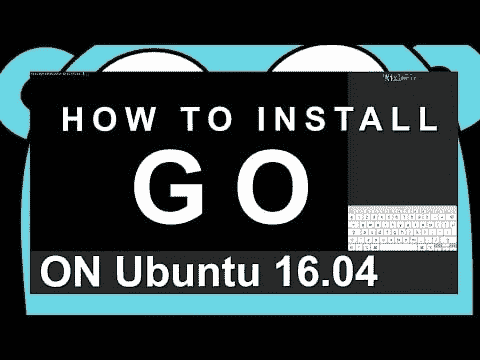
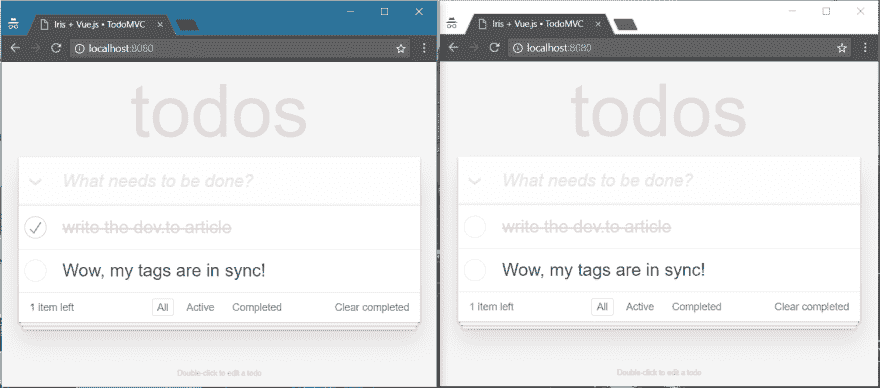

# 使用 Iris 和 Vue.js 的 Todo MVC 应用程序

> 原文：<https://dev.to/kataras/a-todo-mvc-application-using-iris-and-vuejs-1hn9>

Vue.js 是一个使用 javascript 构建 web 应用的前端框架。它有一个非常快的虚拟 DOM 渲染器。

Iris 是一个后端框架，用于使用 Go 编程语言构建 web 应用程序(免责声明:作者在此)。这是目前最快、最有特色的 web 框架之一。我们想用这个来提供我们的“待办事项服务”。

## 工具

编程语言对我们来说只是工具，但我们需要一种安全、快速且“跨平台”的编程语言来为我们的服务提供动力。

[Go](https://golang.org) 是一种[快速发展的](https://www.tiobe.com/tiobe-index/)开源编程语言，旨在构建简单、快速、可靠的软件。看看[这里](https://github.com/golang/go/wiki/GoUsers)哪些伟大的公司使用 Go 来加强他们的服务。

### 安装 Go 编程语言

关于下载和安装 Go 的详细信息可以在[这里](https://golang.org/dl/)找到。

[T2】](https://youtu.be/9x-pG3lvLi0)

> 也许是 [Windows](https://www.youtube.com/watch?v=WT5mTznJBS0) 或 [Mac OS X](https://www.youtube.com/watch?v=5qI8z_lB5Lw) 用户？
> 
> 这篇文章不包含对语言本身的介绍，如果你是一个新手，我建议你把这篇文章收藏起来，[学习](https://github.com/golang/go/wiki/Learn)这门语言的基础知识，以后再回来。

## 从属关系

过去，已经有很多文章引导开发人员不要使用 web 框架，因为它们是无用的和“糟糕的”。我必须告诉你，没有这样的事情，它总是取决于你将要使用的(web)框架。在生产环境中，我们没有时间或经验来编写我们想在应用程序中使用的所有代码，如果我们可以，我们能肯定我们比其他人做得更好、更安全吗？简而言之:**好的框架对任何开发者、公司或初创公司都是有用的工具，而“坏的”框架显然是浪费时间。**

您只需要两个依赖项:

1.  Iris Web 框架，用于我们的服务器端需求。可以在这里找到，最新 v12。
2.  Vue.js，用于我们的客户端需求。从[这里](https://vuejs.org/)下载，最新 v2。

> 如果您已经安装了 Go，那么只需执行`go get github.com/kataras/iris/v12@latest`来安装 Iris Web 框架。

## 开始

如果我们都在同一个页面上，是时候学习如何创建一个易于部署和扩展的实时 todo 应用程序了！

我们将使用一个 vue.js todo 应用程序，它使用浏览器的本地存储，没有任何用户指定的功能，如浏览器标签之间的实时同步，您可以在 vue 的 [docs](https://vuejs.org/v2/examples/todomvc.html) 中找到原始版本。

假设您知道%GOPATH%是如何工作的，在%GOPATH%/src 目录中创建一个空文件夹，即“vuejs-todo-mvc ”,在那里您将创建这些文件:

*   web/public/js/app.js
*   web/public/index.html
*   todo/item.go
*   todo/service.go
*   web/controllers/todo _ controller . go
*   网页/主页. go

*阅读源代码中的注释，它们可能会很有帮助*

### 客户端(vue.js)

```
/* file: vuejs-todo-mvc/web/public/js/app.js */
// Full spec-compliant TodoMVC with Iris
// and hash-based routing in ~200 effective lines of JavaScript.

var ws;

((async () => {
  const events = {
    todos: {
      saved: function (ns, msg) {
        app.todos = msg.unmarshal()
        // or make a new http fetch
        // fetchTodos(function (items) {
        //   app.todos = msg.unmarshal()
        // });
      }
    }
  };

  const conn = await neffos.dial("ws://localhost:8080/todos/sync", events);
  ws = await conn.connect("todos");
})()).catch(console.error);

function fetchTodos(onComplete) {
  axios.get("/todos").then(response => {
    if (response.data === null) {
      return;
    }

    onComplete(response.data);
  });
}

var todoStorage = {
  fetch: function () {
    var todos = [];
    fetchTodos(function (items) {
      for (var i = 0; i < items.length; i++) {
        todos.push(items[i]);
      }
    });
    return todos;
  },
  save: function (todos) {
    axios.post("/todos", JSON.stringify(todos)).then(response => {
      if (!response.data.success) {
        window.alert("saving had a failure");
        return;
      }
      // console.log("send: save");
      ws.emit("save")
    });
  }
}

// visibility filters
var filters = {
  all: function (todos) {
    return todos
  },
  active: function (todos) {
    return todos.filter(function (todo) {
      return !todo.completed
    })
  },
  completed: function (todos) {
    return todos.filter(function (todo) {
      return todo.completed
    })
  }
}

// app Vue instance
var app = new Vue({
  // app initial state
  data: {
    todos: todoStorage.fetch(),
    newTodo: '',
    editedTodo: null,
    visibility: 'all'
  },

  // we will not use the "watch" as it works with the fields like "hasChanges"
  // and callbacks to make it true but let's keep things very simple as it's just a small getting started. 
  // // watch todos change for persistence
  // watch: {
  //   todos: {
  //     handler: function (todos) {
  //       if (app.hasChanges) {
  //         todoStorage.save(todos);
  //         app.hasChanges = false;
  //       }

  //     },
  //     deep: true
  //   }
  // },

  // computed properties
  // http://vuejs.org/guide/computed.html
  computed: {
    filteredTodos: function () {
      return filters[this.visibility](this.todos)
    },
    remaining: function () {
      return filters.active(this.todos).length
    },
    allDone: {
      get: function () {
        return this.remaining === 0
      },
      set: function (value) {
        this.todos.forEach(function (todo) {
          todo.completed = value
        })
        this.notifyChange();
      }
    }
  },

  filters: {
    pluralize: function (n) {
      return n === 1 ? 'item' : 'items'
    }
  },

  // methods that implement data logic.
  // note there's no DOM manipulation here at all.
  methods: {
    notifyChange: function () {
      todoStorage.save(this.todos)
    },
    addTodo: function () {
      var value = this.newTodo && this.newTodo.trim()
      if (!value) {
        return
      }
      this.todos.push({
        id: this.todos.length + 1, // just for the client-side.
        title: value,
        completed: false
      })
      this.newTodo = ''
      this.notifyChange();
    },

    completeTodo: function (todo) {
      if (todo.completed) {
        todo.completed = false;
      } else {
        todo.completed = true;
      }
      this.notifyChange();
    },
    removeTodo: function (todo) {
      this.todos.splice(this.todos.indexOf(todo), 1)
      this.notifyChange();
    },

    editTodo: function (todo) {
      this.beforeEditCache = todo.title
      this.editedTodo = todo
    },

    doneEdit: function (todo) {
      if (!this.editedTodo) {
        return
      }
      this.editedTodo = null
      todo.title = todo.title.trim();
      if (!todo.title) {
        this.removeTodo(todo);
      }
      this.notifyChange();
    },

    cancelEdit: function (todo) {
      this.editedTodo = null
      todo.title = this.beforeEditCache
    },

    removeCompleted: function () {
      this.todos = filters.active(this.todos);
      this.notifyChange();
    }
  },

  // a custom directive to wait for the DOM to be updated
  // before focusing on the input field.
  // http://vuejs.org/guide/custom-directive.html
  directives: {
    'todo-focus': function (el, binding) {
      if (binding.value) {
        el.focus()
      }
    }
  }
})

// handle routing
function onHashChange() {
  var visibility = window.location.hash.replace(/#\/?/, '')
  if (filters[visibility]) {
    app.visibility = visibility
  } else {
    window.location.hash = ''
    app.visibility = 'all'
  }
}

window.addEventListener('hashchange', onHashChange)
onHashChange()

// mount
app.$mount('.todoapp'); 
```

Enter fullscreen mode Exit fullscreen mode

让我们添加我们的视图，静态 html。

```
<!-- file: vuejs-todo-mvc/web/public/index.html -->
<!doctype html>
<html data-framework="vue">

<head>
  <meta charset="utf-8">
  Iris + Vue.js • TodoMVC
  <link rel="stylesheet" href="https://unpkg.com/todomvc-app-css@2.0.4/index.css">
  <!-- this needs to be loaded before guide's inline scripts -->
  <script src="https://vuejs.org/js/vue.js"></script>
  <!-- $http -->
  <script src="https://unpkg.com/axios/dist/axios.min.js"></script>
  <!-- -->
  <script src="https://unpkg.com/director@1.2.8/build/director.js"></script>
  <script src="https://cdn.jsdelivr.net/npm/neffos.js@latest/dist/neffos.min.js"></script>

  <style>
    [v-cloak] {
      display: none;
    }
  </style>
</head>

<body>
  <section class="todoapp">
    <header class="header">
      <h1>todos</h1>
      <input class="new-todo" autofocus autocomplete="off" placeholder="What needs to be done?" v-model="newTodo"
        @keyup.enter="addTodo">
    </header>
    <section class="main" v-show="todos.length" v-cloak>
      <input class="toggle-all" type="checkbox" v-model="allDone">
      <ul class="todo-list">
        <li v-for="todo in filteredTodos" class="todo" :key="todo.id"
          :class="{ completed: todo.completed, editing: todo == editedTodo }">
          <div class="view">
            <!-- v-model="todo.completed" -->
            <input class="toggle" type="checkbox" @click="completeTodo(todo)">
            <label @dblclick="editTodo(todo)">{{ todo.title }}</label>
            <button class="destroy" @click="removeTodo(todo)"></button>
          </div>
          <input class="edit" type="text" v-model="todo.title" v-todo-focus="todo == editedTodo" @blur="doneEdit(todo)"
            @keyup.enter="doneEdit(todo)" @keyup.esc="cancelEdit(todo)">
        </li>
      </ul>
    </section>
    <footer class="footer" v-show="todos.length" v-cloak>
      <span class="todo-count">
        <strong>{{ remaining }}</strong> {{ remaining | pluralize }} left
      </span>
      <ul class="filters">
        <li>
          <a href="#/all" :class="{ selected: visibility == 'all' }">All</a>
        </li>
        <li>
          <a href="#/active" :class="{ selected: visibility == 'active' }">Active</a>
        </li>
        <li>
          <a href="#/completed" :class="{ selected: visibility == 'completed' }">Completed</a>
        </li>
      </ul>
      <button class="clear-completed" @click="removeCompleted" v-show="todos.length > remaining">
        Clear completed
      </button>
    </footer>
  </section>
  <footer class="info">
    <p>Double-click to edit a todo</p>
  </footer>

  <script src="/js/app.js"></script>
</body>

</html> 
```

Enter fullscreen mode Exit fullscreen mode

### 服务器端(iris)

我们的视图模型。

```
// file: vuejs-todo-mvc/todo/item.go
package todo

type Item struct {
    SessionID string `json:"-"`
    ID        int64  `json:"id,omitempty"`
    Title     string `json:"title"`
    Completed bool   `json:"completed"`
} 
```

Enter fullscreen mode Exit fullscreen mode

我们的服务。

```
// file: vuejs-todo-mvc/todo/service.go
package todo

import (
    "sync"
)

type Service interface {
    Get(owner string) []Item
    Save(owner string, newItems []Item) error
}

type MemoryService struct {
    // key = session id, value the list of todo items that this session id has.
    items map[string][]Item
    // protected by locker for concurrent access.
    mu sync.RWMutex
}

func NewMemoryService() *MemoryService {
    return &MemoryService{
        items: make(map[string][]Item, 0),
    }
}

func (s *MemoryService) Get(sessionOwner string) []Item {
    s.mu.RLock()
    items := s.items[sessionOwner]
    s.mu.RUnlock()

    return items
}

func (s *MemoryService) Save(sessionOwner string, newItems []Item) error {
    var prevID int64
    for i := range newItems {
        if newItems[i].ID == 0 {
            newItems[i].ID = prevID
            prevID++
        }
    }

    s.mu.Lock()
    s.items[sessionOwner] = newItems
    s.mu.Unlock()
    return nil
} 
```

Enter fullscreen mode Exit fullscreen mode

我们将在这里使用 iris web 框架的一些 MVC 功能，但是你也可以用标准 API 做同样的事情。

```
// file: vuejs-todo-mvc/web/controllers/todo_controller.go
package controllers

import (
    "vuejs-todo-mvc/todo"

    "github.com/kataras/iris/v12"
    "github.com/kataras/iris/v12/mvc"
    "github.com/kataras/iris/v12/sessions"
    "github.com/kataras/iris/v12/websocket"
)

// TodoController is our TODO app's web controller.
type TodoController struct {
    Service todo.Service

    Session *sessions.Session

    NS *websocket.NSConn
}

// BeforeActivation called once before the server ran, and before
// the routes and dependencies binded.
// You can bind custom things to the controller, add new methods, add middleware,
// add dependencies to the struct or the method(s) and more.
func (c *TodoController) BeforeActivation(b mvc.BeforeActivation) {
    // this could be binded to a controller's function input argument
    // if any, or struct field if any:
    b.Dependencies().Add(func(ctx iris.Context) (items []todo.Item) {
        ctx.ReadJSON(&items)
        return
    })
}

// Get handles the GET: /todos route.
func (c *TodoController) Get() []todo.Item {
    return c.Service.Get(c.Session.ID())
}

// PostItemResponse the response data that will be returned as json
// after a post save action of all todo items.
type PostItemResponse struct {
    Success bool `json:"success"`
}

var emptyResponse = PostItemResponse{Success: false}

// Post handles the POST: /todos route.
func (c *TodoController) Post(newItems []todo.Item) PostItemResponse {
    if err := c.Service.Save(c.Session.ID(), newItems); err != nil {
        return emptyResponse
    }

    return PostItemResponse{Success: true}
}

func (c *TodoController) Save(msg websocket.Message) error {
    id := c.Session.ID()
    c.NS.Conn.Server().Broadcast(nil, websocket.Message{
        Namespace: msg.Namespace,
        Event:     "saved",
        To:        id,
        Body:      websocket.Marshal(c.Service.Get(id)),
    })

    return nil
} 
```

Enter fullscreen mode Exit fullscreen mode

最后是我们的主应用程序的端点。

```
// file: web/main.go
package main

import (
    "strings"

    "vuejs-todo-mvc/todo"
    "vuejs-todo-mvc/web/controllers"

    "github.com/kataras/iris/v12"
    "github.com/kataras/iris/v12/mvc"
    "github.com/kataras/iris/v12/sessions"
    "github.com/kataras/iris/v12/websocket"
)

func main() {
    app := iris.New()

    // serve our app in public, public folder
    // contains the client-side vue.js application,
    // no need for any server-side template here,
    // actually if you're going to just use vue without any
    // back-end services, you can just stop afer this line and start the server.
    app.HandleDir("/", "./public")

    // configure the http sessions.
    sess := sessions.New(sessions.Config{
        Cookie: "iris_session",
    })

    // create a sub router and register the http controllers.
    todosRouter := app.Party("/todos")

    // create our mvc application targeted to /todos relative sub path.
    todosApp := mvc.New(todosRouter)

    // any dependencies bindings here...
    todosApp.Register(
        todo.NewMemoryService(),
        sess.Start,
    )

    todosController := new(controllers.TodoController)
    // controllers registration here...
    todosApp.Handle(todosController)

    // Create a sub mvc app for websocket controller.
    // Inherit the parent's dependencies.
    todosWebsocketApp := todosApp.Party("/sync")
    todosWebsocketApp.HandleWebsocket(todosController).
        SetNamespace("todos").
        SetEventMatcher(func(methodName string) (string, bool) {
            return strings.ToLower(methodName), true
        })

    websocketServer := websocket.New(websocket.DefaultGorillaUpgrader, todosWebsocketApp)
    idGenerator := func(ctx iris.Context) string {
        id := sess.Start(ctx).ID()
        return id
    }
    todosWebsocketApp.Router.Get("/", websocket.Handler(websocketServer, idGenerator))

    // start the web server at http://localhost:8080
    app.Run(iris.Addr(":8080"))
} 
```

Enter fullscreen mode Exit fullscreen mode

通过从当前路径(% GOPATH %/src/% your _ folder %/web/)执行`go run main.go`来运行您刚刚创建的 Iris web 服务器(如果您使用的是 [go 模块](https://blog.golang.org/using-go-modules)，则运行任意位置)。

```
$ go run main.go
Now listening on: http://0.0.0.0:8080
Application Started. Press CTRL+C to shut down.
_ 
```

Enter fullscreen mode Exit fullscreen mode

在:`http://localhost:8080`打开一个或多个浏览器标签，尽情享受吧！

[T2】](https://res.cloudinary.com/practicaldev/image/fetch/s--1VA2UYGY--/c_limit%2Cf_auto%2Cfl_progressive%2Cq_auto%2Cw_880/https://github.com/kataras/iris/raw/master/_examples/tutorial/vuejs-todo-mvc/screen.png)

### 下载源代码

整个项目，你在本文看到的所有文件都位于:[https://github . com/kataras/iris/tree/master/_ examples/tutorial/vue js-todo-MVC](https://github.com/kataras/iris/tree/master/_examples/tutorial/vuejs-todo-mvc)

## 再次感谢

新年快乐，再次感谢您的耐心:)不要犹豫，张贴任何问题，并提供反馈(我非常积极的开发，因此你会在这里听到！)

不要忘记查看我的媒体简介和 twitter，我也在那里发布了一些(有用的)东西:)

*   [https://medium.com/@kataras](https://medium.com/@kataras)
*   [https://twitter.com/MakisMaropoulos](https://twitter.com/MakisMaropoulos)

## 参考文献

[https://vuejs.org/v2/examples/todomvc.html](https://vuejs.org/v2/examples/todomvc.html)(使用浏览器的本地存储)

[https://github.com/kataras/iris/tree/v12/_examples/mvc](https://github.com/kataras/iris/tree/v12/_examples/mvc)(MVC 范例和特性概述库)