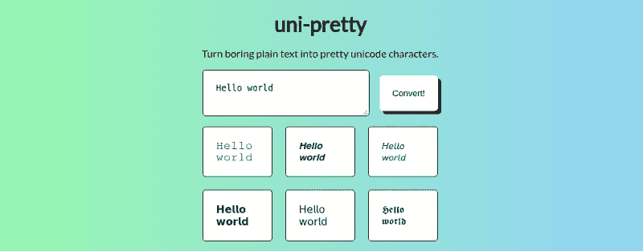

# 一种 unicode 替换密码算法

> 原文：<https://dev.to/victoria/a-unicode-substitution-cipher-algorithm-59gm>

完全透明:我偶尔会在 Twitter 上浪费时间。*(喘息！震惊！我在 Twitter 上浪费时间的方式之一就是在我的个人资料中用不同的 unicode 字符“字体”写我的名字，𝖑𝖎𝖐𝖊 𝖙𝖍𝖎𝖘 𝖔𝖓𝖊.我之前是这样做的，在谷歌上搜索不同的 unicode 字符，然后一个一个地复制并粘贴到我的 Twitter 个人资料的“名称”字段中。因为这种浪费时间的方法有点浪费时间，所以我决定(以真正程序员的方式)写一个工具，帮助我在浪费时间的同时节省一些时间。*

我把这个工具命名为 uni-pretty。它可以让你在一个字段中输入任何字符，然后将它们转换成也代表字母的 unicode 字符，给你提供覆盖网站 CSS 的花哨“字体”，就像在你的 Twitter 个人资料中一样。(不好意思，互联网。)

[T2】](https://res.cloudinary.com/practicaldev/image/fetch/s--re72opOU--/c_limit%2Cf_auto%2Cfl_progressive%2Cq_auto%2Cw_880/https://thepracticaldev.s3.amazonaws.com/i/pts4e0sdzi2zvvpx393f.png)

当我将 unicode 字符复制粘贴到数据结构中时，该工具的第一次简单迭代持续了大约 20 分钟。这种在 JavaScript 文件中存储字符的方法称为硬编码，充满了问题。除了必须存储每种字体风格的每个字符之外，它的构建非常辛苦，很难更新，而且更多的代码意味着它容易出现更多可能的错误。

幸运的是，使用 unicode 意味着有一种方法可以避免存储所有字体字符的麻烦:unicode 数字是连续的。更重要的是，unicode 中可以用作字体的特殊字符(意味着字母表中的大多数或所有字母都有匹配的字符)总是按以下顺序排列:大写字母 a-z，小写字母 A-Z。

比如上面花哨的 unicode，小写字母“L”字符有 unicode 编号`U+1D591`和 HTML 代码`&#120209;`。序列中的下一个字母，小写字母“M”，有 unicode 编码`U+1D592`和 HTML 编码`&#120210;`。请注意这些代码中的数字是如何递增 1 的。

这有什么关系？由于每个特殊字符都可以由一个数字引用，并且我们知道序列的顺序总是相同的(大写 a-z，小写 A-Z)，所以我们只需知道其字体序列的第一个数字(大写“A”)，就可以生成任何字符。如果这让你想起什么，你可以借我的解码密码。

在密码学中，凯撒密码(或移位密码)是一种简单的加密方法，它利用一个字符替换另一个字符来对消息进行编码。这通常是使用字母表和 shift“键”来完成的，shift“键”会告诉您用哪个字母来替换原来的字母。例如，如果我试图对单词“cat”进行右移 3 的编码，它看起来会像这样:

```
c a t
f d w 
```

Enter fullscreen mode Exit fullscreen mode

根据这个概念，将我们的纯文本字母编码为 unicode“字体”是一个简单的过程。我们只需要一个数组来引用我们的纯文本字母，以及我们的 unicode 大写字母“A”表示的第一个索引。由于一些 unicode 数字还包括字母(这是连续的，但不必要的复杂)，并且由于目的是用 HTML 显示页面，我们将使用 HTML 代码数字`&#120172;`，为了简洁起见，去掉了多余的位。

```
var plain = ['A', 'B', 'C', 'D', 'E', 'F', 'G', 'H', 'I', 'J', 'K', 'L', 'M', 'N', 'O', 'P', 'Q', 'R', 'S', 'T', 'U', 'V', 'W', 'X', 'Y', 'Z', 'a', 'b', 'c', 'd', 'e', 'f', 'g', 'h', 'i', 'j', 'k', 'l', 'm', 'n', 'o', 'p', 'q', 'r', 's', 't', 'u', 'v', 'w', 'x', 'y', 'z'];

var fancyA = 120172; 
```

Enter fullscreen mode Exit fullscreen mode

因为我们知道花式 unicode 的字母序列与我们的纯文本数组相同，所以任何字母都可以通过使用它在纯文本数组中的索引作为花式大写字母“A”的偏移量来找到。比如花式 unicode 中的大写“B”就是大写的“A”数，`120172`加上 B 的索引，就是`1` : `120173`。

这是我们的转换函数:

```
function convert(string) {
    // Create a variable to store our converted letters
    let converted = [];
    // Break string into substrings (letters)
    let arr = string.split('');
    // Search plain array for indexes of letters
    arr.forEach(element => {
        let i = plain.indexOf(element);
        // If the letter isn't a letter (not found in the plain array)
        if (i == -1) {
            // Return as a whitespace
            converted.push('  ');
        } else {
            // Get relevant character from fancy number + index
            let unicode = fancyA + i;
            // Return as HTML code
            converted.push('&#' + unicode + ';');
        }

    });
    // Print the converted letters as a string
    console.log(converted.join(''));
} 
```

Enter fullscreen mode Exit fullscreen mode

这种编码方法的一个简单的可能性是需要背离我最初的目的，即创建原始字符串的人类可读的表示。如果目的是生成一个密码，只要索引的字符不是大写字母“a”的表示，就可以用任何 unicode 索引代替`fancyA`来实现。

下面是用一个简化的纯文本数组和一个非字母表示的 unicode 键设置的相同代码:

```
var plain = ['a', 'b', 'c', 'd', 'e', 'f', 'g', 'h', 'i', 'j', 'k', 'l', 'm', 'n', 'o', 'p', 'q', 'r', 's', 't', 'u', 'v', 'w', 'x', 'y', 'z'];

var key = 9016; 
```

Enter fullscreen mode Exit fullscreen mode

一旦你知道了编码的秘密，你可以想象用这种方法产生的密码的解码会相对简单。您只需要从编码字符的 HTML 代码号中减去这个键，然后在剩余的索引中找到相关的纯文本字母。

好了，今天就到这里。一定要喝掉你的阿华田，我们下周一 5:45 在这里见！

哦，还有...⍔⍠⍟⍘⍣⍒⍥⍦⍝⍒⍥⍚⍠⍟⍤ ⍒⍟⍕ ⍨⍖⍝⍔⍠⍞⍖ ⍥⍠ ⍥⍙⍖ ⍔⍣⍪⍡⍥⍚⍔ ⍦⍟⍚⍔⍠⍕⍖ ⍤⍖⍔⍣⍖⍥ ⍤⍠⍔⍚⍖⍥⍪

:)