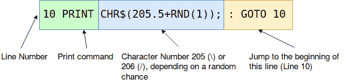
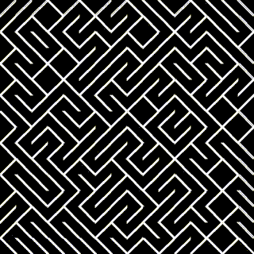

# 一行代码中包含 10 个打印内容

> 原文：<https://dev.to/burningion/a-universe-in-one-line-of-code-with-10-print-2d1>

# 10 用 Pygame 在 Python 3 中打印

10 PRINT 是一本探索单行代码神奇力量的新书。

这一行代码运行在 1982 年的 Commodore 64 上。它给了我们一个最早的例子，展示了计算机创造整个世界的能力。

只有一句咒语:

```
10 PRINT CHR$(205.5+RND(1)); : GOTO 10 
```

Enter fullscreen mode Exit fullscreen mode

我们无畏的用户可以看到整个宇宙展现在他们面前。

这种新可能性的魔力是编程如此令人兴奋的一个很好的例子。只用一行代码，我们就可以看到一个完整的世界，随机地自我构建。我们用眼睛看到道路，想象新的地方。

## 了解 10 个印刷体如何构建一个宇宙

[T2】](https://res.cloudinary.com/practicaldev/image/fetch/s--izBzEpUM--/c_limit%2Cf_auto%2Cfl_progressive%2Cq_auto%2Cw_880/https://thepracticaldev.s3.amazonaws.com/i/k4u5miyjhqxc19q8dy0o.png)

10 PRINT 是用 [Basic 编程语言](https://en.wikipedia.org/wiki/BASIC)写的。这意味着它有一些怪癖，从我们的现代语言中回顾它。

首先，Basic 只是你输入程序的原始终端。每输入一个，你就写了一组特定的命令，可以线性地执行。

首先我们有行号，用在最后无限重复代码行。大多数现代编程语言都没有内置`GOTO`的概念，因为我们试图从行号中抽象出来，抽象成更明确的模块和带有名称的函数。

接下来，我们使用`CHR$`函数，并将数字`205.5` +一个在`0`和`1`之间的随机值传递给它。平台上的所有数字都是浮点值，并向下取整。因此，这意味着我们的代码将生成字符 205 ( `\`)或 206 ( `/`)。

这样，我们可以无限循环，生成一个正斜杠或反斜杠。

## 用 Python 3 和 Pygame 重写 10 PRINT

不幸的是，用 Python 和 Pygame 编写 10 个 PRINT 实际上并不可行。

生成线条的代码很简单，但是设置绘图窗口占用了大部分代码。

```
import pygame

import random

# set our screen's width and height screenWidth, screenHeight = (800, 800)

pygame.init()

pygame.display.set_caption("10 PRINT in Pygame")
screen = pygame.display.set_mode((screenWidth, screenHeight))

running = True

white = (255, 255, 255)
black = (0, 0, 0)

# size of square, in pixels square = 20

def drawScreen():
    screen.fill(black)
    # Python version of 10 PRINT happens here
    for x in range(0, screenWidth, square):
        for y in range(0, screenHeight, square):
            if random.random() > 0.5:
                pygame.draw.line(screen, white, (x, y), (x + square, y + square))
            else:
                pygame.draw.line(screen, white, (x, y + square), (x + square, y))

while running:
    key = pygame.key.get_pressed()
    # only draw if user presses spacebar
    if key[pygame.K_SPACE]:
        drawScreen()
    # quit if user presses q
    if key[pygame.K_q]:
        exit()
    for event in pygame.event.get():
        if event.type == pygame.QUIT:
            running = False
    # this updates the display
    pygame.display.flip() 
```

Enter fullscreen mode Exit fullscreen mode

我们程序中 drawing 10 PRINT 的真正工作来自下面几行:

```
 for x in range(0, screenWidth, square):
        for y in range(0, screenHeight, square):
            if random.random() > 0.5:
                pygame.draw.line(screen, white, (x, y), (x + square, y + square))
            else:
                pygame.draw.line(screen, white, (x, y + square), (x + square, y)) 
```

Enter fullscreen mode Exit fullscreen mode

我们使用屏幕上 x 和 y 坐标中正方形的大小来表示范围。如果`square`大小设置为 20，`x`和`y`将一直是`0,20,40,60,80...`到我们的`screenHeight`和`screenWidth`。

接下来，我们使用`random.random()`函数生成一个介于 0 和 1 之间的数字。如果这个数字大于 0.5，我们就画一条正方形大小的对角线，从底部到右上角(/)。

如果`random.random()`的数字小于 0.5，我们画一条从正方形的左上角到右下角的对角线()。

这样，我们在 Python 3 中实现了自己的迷宫效果，但没有永远滚动。

## 编码挑战:制作 10 张打印动画

[T2】](https://res.cloudinary.com/practicaldev/image/fetch/s--UC2Ndg9C--/c_limit%2Cf_auto%2Cfl_progressive%2Cq_66%2Cw_880/https://thepracticaldev.s3.amazonaws.com/i/7vlwot1wnhnkvmxz9sk1.gif)

如果我们想让我们的 10 个打印动画化，我们需要从一组静态的线点开始操作，而不是每次按空格键都创建新的线点。

类似这样的事情可能会起作用:

```
for x in range(0, screenWidth, square):
    for y in range(0, screenHeight, square):
        if random.random() > 0.5:           
            lines.append([x, y, x + square, y + square])  
        else:
            lines.append([x, y + square, x + square, y]) 
```

Enter fullscreen mode Exit fullscreen mode

这样，我们就有了一组可以使用循环访问和操作的线点。

尝试对 10 PRINT 进行自己的更改，以制作一种新的动画。如果卡住了，可以在 [Github](https://github.com/burningion/10-print-python-pygame) 上查看一下用来制作上面 gif 的代码。

## 何去何从

上面的代码为您操作自己对 10 PRINT 的解释提供了一个起点。如果你卡住了，可以随意查看 Github 库来弄清楚如何自己制作动画。

请注意，代码目前会为每一步向磁盘写入一个图像，因此如果不想保存图像，您需要注释掉该行。

请随意在 Twitter 或 Instagram 上分享你的图片，标签为#10PRINT。我很想看看你还能做什么。

关于 10 PRINT 的其他参考资料，请查看 YouTube 频道 [The Coding Train](https://www.youtube.com/watch?v=bEyTZ5ZZxZs) 对 Processing.js 中完成的 10 PRINT 的解释。

最后，如果你喜欢这篇文章，并希望看到更多类似的文章，注册我的时事通讯，或者在[用 Python 制作艺术](https://www.makeartwithpython.com/)上[创建一个账户](https://www.makeartwithpython.com/signup)来免费获得我的书的前三章。