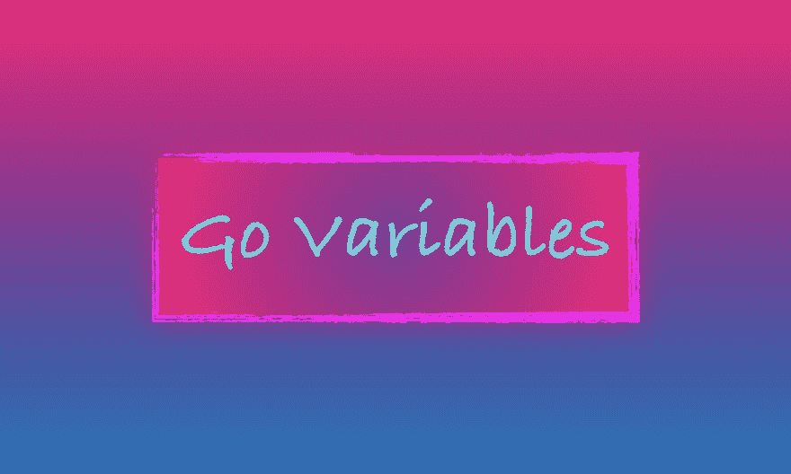

# 一个可视化的如何指导去变量

> 原文：<https://dev.to/inancx/a-visual-how-to-guide-to-go-variables-3p9>

[T2】](https://blog.learngoprogramming.com/learn-go-lang-variables-visual-tutorial-and-ebook-9a061d29babe)

嗨！

🔥[我发表了一个新帖子](https://blog.learngoprogramming.com/learn-go-lang-variables-visual-tutorial-and-ebook-9a061d29babe)！

**在我说的帖子里:**

*   Go 声明语法之美
*   围棋中的变量是什么？
*   为什么我们需要变量？
*   如何声明一个 Go 变量？
*   零值
*   长变量声明
*   短变量声明
*   分组多变量声明
*   多重短变量声明
*   如何覆盖变量内部的数据？
*   变量是如何存储的？
*   从其他包中访问变量

也请把你对这篇文章的看法发给我。

→ [点击阅读文章](https://blog.learngoprogramming.com/learn-go-lang-variables-visual-tutorial-and-ebook-9a061d29babe)。