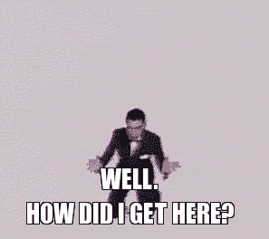
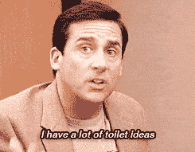
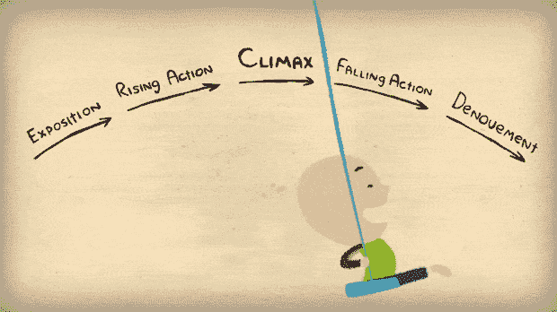

# 一个作家走进设计工作室……当你加入 UX 团队时，你需要成功的 6 个特质

> 原文：<https://dev.to/sarahmsmart/a-writer-walks-into-a-design-studio-6-traits-you-need-to-succeed-when-you-join-a-ux-team>

我的职业生涯很奇怪。我在密州大学获得了新闻学学士学位(辅修:音乐史)，我想把这个学位变成为滚石乐队、T2 唱片公司等等做报道。LOL @ me 因为我是 2007 年冬天毕业的，所以我如饥似渴地接受了摆在我办公桌上的第一份全职工作:在现在的 Horoscope.com 做编辑助理。在接下来的大约 10 年里，我…

*   为一所盈利性大学编辑在线课程文本
*   为 EMS 工作人员维护一个新闻和评论网站
*   为小众博客写满脏话的文章
*   试图成为推特上的名人

换句话说，我想找一个精通英语的人。不知何故，我将这种随机的经历运用到了我目前在 UX 一家知名公司的写作工作中。我对过去的一年半感到无比兴奋。然而，自我怀疑往往会悄然而至:

[T2】](https://res.cloudinary.com/practicaldev/image/fetch/s--VRlHJgk6--/c_limit%2Cf_auto%2Cfl_progressive%2Cq_66%2Cw_880/https://cdn-images-1.medium.com/max/800/1%2A_P3CN2cDJc1IMMGnndiUYQ.gif)

在做这份工作之前，我对用户体验毫无经验，我开始思考必须有一个共同的思路，一套完整的特征、能力和技能，来帮助一个人在这样的角色中取得成功。你有这种能力吗？我有吗？让我们找出答案。

### 创造力

[T2】](https://res.cloudinary.com/practicaldev/image/fetch/s--hm-xXXTv--/c_limit%2Cf_auto%2Cfl_progressive%2Cq_66%2Cw_880/https://cdn-images-1.medium.com/max/800/1%2ABnaplzR3E93izwxuC7V1uA.gif)

有点容易，对吧？如果你是一台创意生成机器，那很好，但在 UX，你需要的创造力实际上是足智多谋和独创性的混合。当你看到一个问题和三种可能的解决方法时，你是放大给你的选项并提炼，还是后退一步，假装你是一个顾客？你的大脑会产生第四种解决方案，第五种吗？有时间试试吧。令人上瘾。还要记住，头脑风暴中没有坏主意。当你写作时，记下或键入你脑海中出现的每一件事——不要删除它——即使是“我在做什么？在为一个标题想出 50 个点子后，你可能会惊讶地发现一两个可行的选择。如果可能的话，在第二天之前不要编辑这些东西。

### 豁达

我知道，我知道，这是很难放弃的诱惑，以解决你所有的错误和错别字的时刻，并图表每一句话，你看到，感谢我们的六年级英语老师。每个人都喜欢成为同位语、并列连词和从属连词以及牛津逗号([don’t @ me](https://twitter.com/sarahmsmart))的专家。把你们的肛门保留能力打包，扔出窗外。在 UX，如果你能恰当地给标题加标点符号，那就太棒了，但最重要的是用户是否理解其中的信息。

### 感同身受

[T2】](https://res.cloudinary.com/practicaldev/image/fetch/s--Eg9St8kh--/c_limit%2Cf_auto%2Cfl_progressive%2Cq_66%2Cw_880/https://cdn-images-1.medium.com/max/800/1%2AOmyHaE-ECSA4_VjwC7mwrg.gif)

这让我们想到了一个核心技能，UX 思想领袖中的一个主要流行词——什么是共情，如何培养它，以及我们是否太在乎它。让我们在个人生活中思考一下这个概念。假设你的朋友正在抱怨在工作中感觉不被重视。你感觉到你肚子里的火，你的心曾经在哪里。你曾经有过这样的经历，想知道为什么不称职的同事得到了晋升，得到了不应得的赞扬，日程安排适应了他们的日常义务，而你却被期望每天在椅子上呆上整整八个小时。钥匙？你很清楚这种感觉。这就是同理心，你拥有它，即使你还没有和一个浏览你的 UI 的用户交谈过。

### 设计思维

[T2】](https://res.cloudinary.com/practicaldev/image/fetch/s--SgHIs7Ju--/c_limit%2Cf_auto%2Cfl_progressive%2Cq_auto%2Cw_880/https://cdn-images-1.medium.com/max/800/0%2AeCTG10w7WYafwpsm.)

好消息:同理心开启了你的说服能力。现在您知道了用户需要什么才能到达流程的末尾。对 CTA、阶梯流或间隙模态一无所知？反正你可以像设计师一样思考。你不必是一个阴谋论者。你所要做的就是给你的用户画一张地图…打个比方，考虑到我唯一能画的就是马。当你在那些设计对话中，你理解内容能解决和不能解决的问题。像你 20 年前写的学期论文一样，把你的用户的旅程组织成开始、中间和结束。特别是在内容第一的方法中，你甚至不需要尝试就可以通知交互和视觉设计！

### 身体精神

[T2】](https://res.cloudinary.com/practicaldev/image/fetch/s--vH84jcjD--/c_limit%2Cf_auto%2Cfl_progressive%2Cq_66%2Cw_880/https://cdn-images-1.medium.com/max/800/1%2AXN1v3B8p0i6rxlSzDGBS3Q.gif)

我讨厌说“团队精神”，所以我用了法语。你会想和你团队中的人相处融洽——设计师、产品经理和其他作家。在与用户交流时，没有人是孤独的，所以当你想出概念时，一起去做。即使你讨厌学校里的团体项目和独立女性。当你每天早上准备好的时候，和别人一起玩会很有趣。良好的用户体验并不存在于真空中，所有的部分都需要结合在一起，这样用户才不会从缝隙中溜走。此外，科学可能会说，与你的队友一起头脑风暴和即兴表演会增进幸福感。

### 热爱写作

[T2】](https://res.cloudinary.com/practicaldev/image/fetch/s--BvSBw-PT--/c_limit%2Cf_auto%2Cfl_progressive%2Cq_66%2Cw_880/https://cdn-images-1.medium.com/max/800/1%2AxD8XXp8bV8dKFQ3wNpM4HQ.gif)

这感觉像是天赐的，但我偶尔会遇到一个 UX 作家，他只是有点陷入其中。“他们会说，这是一份工作。对此我(在脑海中)回应道:“再找一个。毫无疑问，你可以拥有以上特质，但是如果你不喜欢你正在做的事情，你就不会想把它们应用到你的工作中。当你找到一个完美的短语，转化率增加了 32%或其他什么的时候，你不会感到有回报。你的日常生活可能会被会议、产品路线图和[无用的反馈](https://medium.com/microbiz-design/the-7-types-of-feedback-that-content-designers-receive-and-what-they-really-mean-40a6da06280d#.wtl4td67j)所困扰，但是如果你喜欢把一个句子组织起来，那么内容设计就很适合你。

其他的都可以学。如果你愿意，设计师、内容伙伴、产品经理和你的其他同事会很乐意教你。但是我相信这些是你在 UX 开始写作生涯所需要的基础。不过，我所有的这些都是基于我自己的观察和深入的自我反省。请留言告诉我我错过了什么。