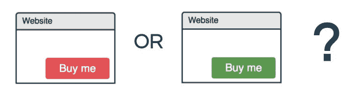
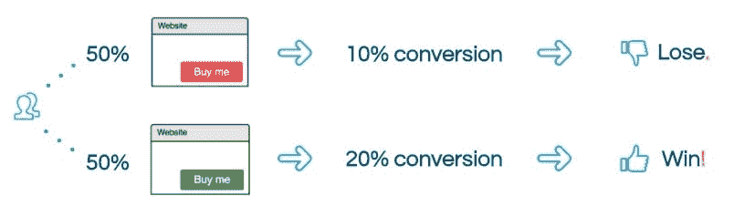
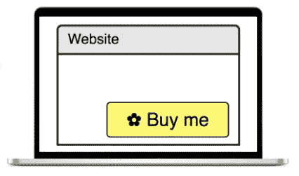
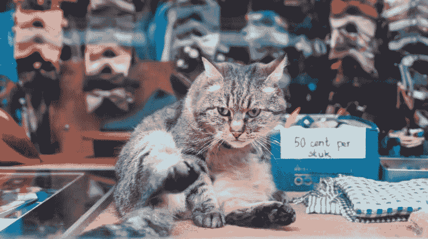

# A/B 测试:简介

> 原文：<https://dev.to/ice_lenor/ab-testing-introduction-3jpd>

*这篇文章首先发表在我的网站[smartpuffin.com](http://smartpuffin.com/ab-testing-basics/)上。*
*它是根据我(有史以来第一！)关于 A/B 测试的会议讨论-查看幻灯片。*

# 到底什么是 A/B 测试？

假设你有一个卖花的网页，里面有一个红色的 **【购买】** 按钮。

现在让我们想象你的新设计师告诉你:嘿， **绿色** 纽扣是卖花行业的新潮流。比起红色，人们更喜欢绿色，红色咄咄逼人，绿色柔和，有说服力。绿色按钮在页面上会更明显。让我们把它变成绿色的。

[T2】](https://res.cloudinary.com/practicaldev/image/fetch/s--ExdPBZQm--/c_limit%2Cf_auto%2Cfl_progressive%2Cq_auto%2Cw_880/https://thepracticaldev.s3.amazonaws.com/i/ql5p4vvknwrzmtbqkolt.jpg)

但是你*喜欢*的红色按钮。你认为红色是世界上最好的颜色。它非常明亮，直截了当，它突然出现，叫你为你的另一半买些花。

问题是:你们两个是如何达成一致的？

你是否足够信任你的设计师，让他们做这种冒险的改变？如果你是对的，红色按钮更好呢？如果他们是对的，而你错过了一个机会呢？

## 让用户来决定！

使用 A/B 测试方法，您不必争论哪个按钮是最好的按钮。您只需让用户来决定！

在这种情况下，你可以建立一个 **A/B 测试**，也称为**实验**。

把它想象成一场体育比赛。你让按钮竞争你的用户。哪个按钮是*最漂亮的*？用户隐含地“投票”哪个按钮？

你让 50%的访客看到你最喜欢的红色按钮，*亮如玫瑰*🌹。

而另外 50%的人会看到绿色的按钮，*温柔得像一片叶子*🍃。

T3】A/B 测试流程

你设置好这个，然后观察一会儿。你记录有多少人访问了你的网页，有多少人买了你的花，这样你就可以比较。

过一会儿你就会看到结果。比方说， **10%** 看到红色按钮的人，买了一束花。而在这些看到绿色的人中， **20%** 买了。

很明显，绿色的是这里的赢家！耶！走向绿色！

## “最好”是什么意思？

让我们一步步来看看你在那里做了什么。

第一，你说“*哪个按钮最好”。*“最好”是什么意思？

以卖花为例，你想看看有多少人来到你的网站。有些人可能看了一眼就走了，但其他人会买束花。

大家 vs 买家的比例叫做“**转化”。**这是一个**指标**作为一个企业主，你可能想用它来了解新按钮的颜色是好是坏。

### 使用什么指标有意义？

转换是一个例子，但是 A/B 测试对其他事情有用吗？

当然是了。

这完全取决于*你的企业希望你的客户做什么*。如果您希望收集电子邮件以便稍后发送给您的客户，那么提交的电子邮件数量将是最佳指标。如果你需要人登录，那么登录人数。如果你想让他们上传照片，就用这个。你需要做的任何事情，你可以测量，你可以使用 A/B 测试。

这里有一些**业务指标**你可以考虑:

*   转换
*   点击率
*   登录信息
*   注册
*   跳出率
*   提交的内容(照片、文章、产品评论)。

### 我可以使用哪些额外的指标？

为了更好地了解客户在你的网站或应用中的行为，你可以使用一些额外的指标。

尽你所能记录和测量一切！

然后你可以分析这些数据，看到一些有趣的东西。例如，如果你注意到那些比其他人更多向下滚动页面的人，最终会更频繁地买花。太好了！下一次，当更改页面上的某些内容时，您会希望观察它如何影响这种行为。如果变化很糟糕，人们不会经常向下滚动，而是马上关闭页面——你知道为什么。现在你可以开始思考了:我的改变是如何阻止人们看我漂亮的花单向下滚动的。

以下是您可以用来更好地理解**行为**的一些指标:

*   用户点击/悬停/与您的元素交互
*   用户点击了不同的元素——检查你的新元素是否吸引了用户太多的注意力
*   用户在页面上花费的时间
*   向下滚动
*   浏览了一下名单
*   填充了一个字段
*   选择了一个项目；或者选择几个项目。

这些指标不是*业务*指标——这意味着最终你的业务并不太关心用户点击的确切位置。您希望查看这些指标来更好地了解您的客户，最终目的是推动您的*业务*指标。

## 建立一个假设

但是你当初为什么要换按钮呢？最有可能的是，你心中有一个很好的理由，比如行业的最新趋势，让按钮与设计的其余部分保持一致，让它更明显或不那么咄咄逼人？这被称为**假设**。

一个假设可以只有一句话，也可以长得多。无论如何，大体结构类似于此:

> 如果我实现 X，
> 
> 用户会做 Y，
> 
> 这很好，因为 z。

因此，我们对花店中的按钮的假设可能是这样的:

> 如果我把按钮涂成绿色，而不是红色，
> 
> 用户将更容易找到按钮并更多地点击它，
> 
> 这对我的生意有好处，因为他们会买更多的花。

我将为本文尝试另一个假设:

> 如果我在文章中加入一只猫，
> 
> 读者会说 AAAaaw，
> 
> 这很好，因为他们会记得我的文章。

 *左边的猫右边的猫？请说 AAaww。*

## 如果成功的话

当新颜色比另一种颜色更好的时候，我们称之为“T1 成功”*。(注意，我在这里说的是“*更好*”——记住，它的意思是“你的业务指标更好”。)*

对，所以你改变了按钮的颜色，看到新的颜色比另一种颜色更好。下一步是什么？

1.  首先，你**庆祝**你的成就！给你的团队带去巧克力或披萨，祝贺他们，他们做得很好，值得表扬。
2.  **还有哪里可以套用** **同样的做法** **？** 你要开始思考什么*其他*红色按钮你要涂成绿色。现在你有很强的理由这么做，对吗？
3.  **继续**正题。你可能会开始想:既然我的客户对这种更柔和的按钮颜色反应如此强烈，这一定是一个非常重要的按钮。也许还有另一种颜色，我可以在同一个地方试试**。黄色怎么样？或许上面还有一个小花图标？**

## 万一失败了

现在，我们来谈谈失败的原因。当新颜色在您的业务指标上表现相同或比*差*时，我们称之为“**失败**”。

不要担心！这一切都没有白费。你对你的顾客了如指掌。分析你得到的结果，并从中学习。假设你尝试了蓝色——顾客讨厌它，花的销量下降了。嗯，那很不幸，但是让我们保持乐观，利用这个机会学习。下次当你在同一页面的某个地方添加一个新按钮时，你就不会再使用它了。

不要放弃！你刚刚了解了你的客户:既然他们对这个按钮颜色反应如此强烈，这一定是一个非常重要的按钮，我们可以改变它。不如我们用它试试别的东西？如果他们喜欢现在的颜色...把它做大怎么样？

如果他们一点反应都没有，那么，你就学会了不要再在这里浪费时间。继续在别的东西上做实验。

## 学习是最重要的事情

只是提醒你有多重要:*学习是最重要的*。

这是为什么呢？

你永远不知道你的实验是否会成功。如果你确实知道，你就不会费心去做实验了。您可以毫不费力地实现您的功能。(这没有错，许多企业都是这样做的，这完全取决于您的领域和您的客户需求。)

但是既然你决定进行实验，你就不知道结果。

无论结果如何，你都了解了你的顾客。他们不喜欢红色按钮？太好了，下次你不会再把另一个按钮涂成红色了。你只是为了一些失去的购买的价格而学习了这个重要的东西，但现在你被告知，以后不会再失去任何购买。

从长远来看，你会非常重视对客户的了解。

## 重复

在这两种情况下，不管成功与否，你都在学习和重复。尽可能多地从你收集的所有指标中学习，并应用你的新知识:尽可能以最好的方式重复你的实验。

试几次。如果你有几次不成功的尝试，你会很确定没有什么可抓的，然后转移到另一个想法。但是尝试一次就放弃还为时过早。

所以，我打算再次*重复*我的猫实验。

[T2】](https://res.cloudinary.com/practicaldev/image/fetch/s--I6G2a3sv--/c_limit%2Cf_auto%2Cfl_progressive%2Cq_auto%2Cw_880/https://thepracticaldev.s3.amazonaws.com/i/fmokcmn25oyymhts9w7e.jpg)

# 成功实验的 5 个步骤

那么，让我们再来回顾一下整个过程。

1.  首先，你建立一个**假设**。“如果我把按钮涂成绿色，我的客户会更频繁地购买我的产品，因为绿色按钮更显眼”。
2.  然后，你选择将要使用的**指标**。转换、登录次数、注册等。
3.  之后，你**实施**实验**运行**它。
4.  然后，你**分析**结果。成功？太好了，我会把这个应用到其他地方。失败？太好了，我刚知道。
5.  和**重复**。

# 什么时候不运行 A/B 测试？

查看[这篇文章](https://dev.to/ice_lenor/when-not-to-ab-test-4cc7)以了解哪些特性最好在不进行 A/B 测试的情况下实现。