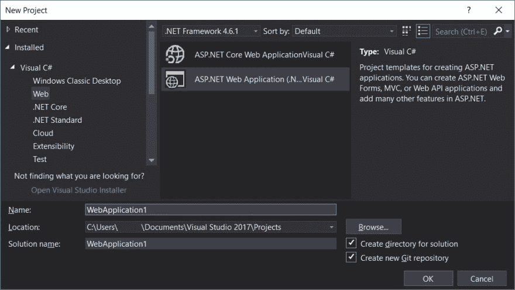
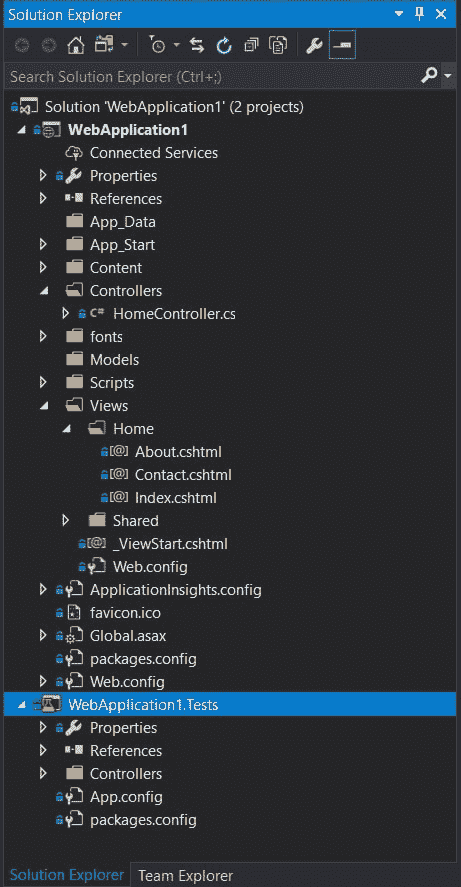
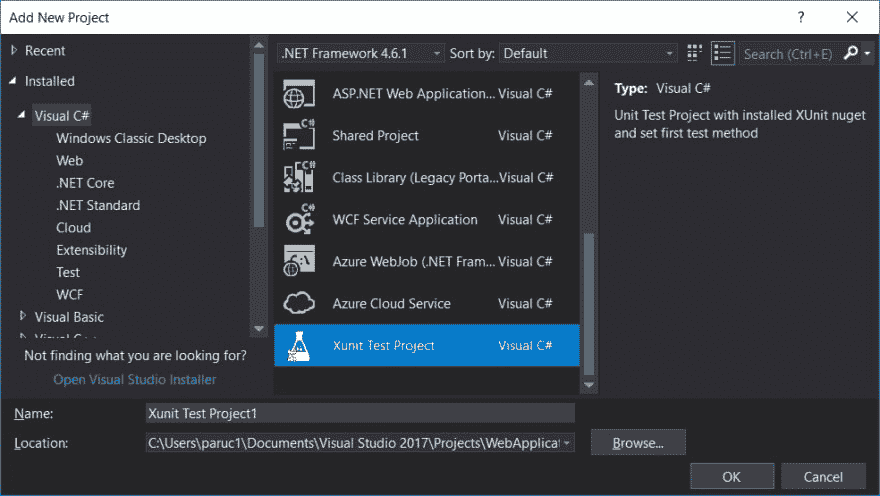
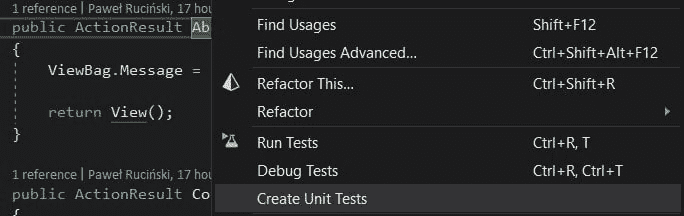
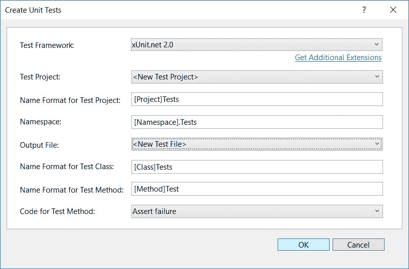
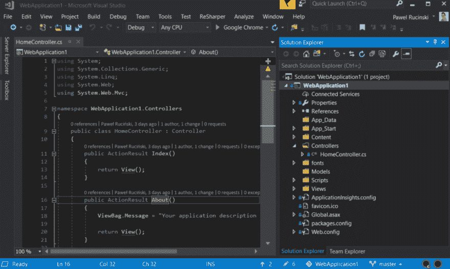

# 加速您的测试创建

> 原文：<https://dev.to/meanin/accelerate-your-test-creation-1a1>

我想高效地编码。我总是试图使用 TDD 方法。一段时间以来，我一直在想，在开发过程中，什么占据了我大部分时间。我想改进我的日常工作，多关心编码本身，少关心配置解决方案、项目、类等等。

# 简介

我知道脚手架的力量，但是说真的，你多久发布一次全新的解决方案？比如说，在创建 web 解决方案时，你必须决定它应该只是一个 API 还是/和一个前端解决方案，对吗？
[](https://res.cloudinary.com/practicaldev/image/fetch/s--o-2fa0zg--/c_limit%2Cf_auto%2Cfl_progressive%2Cq_auto%2Cw_880/https://thepracticaldev.s3.amazonaws.com/i/mwk7e205ym41ho8h3oie.jpg) 
一段时间后，有一个不错的设置方案。带有创建的 HomeController、相关视图等。你有一些工作要做，而不是从头开始写。
[T8】](https://res.cloudinary.com/practicaldev/image/fetch/s--_lc8vSZn--/c_limit%2Cf_auto%2Cfl_progressive%2Cq_auto%2Cw_880/https://thepracticaldev.s3.amazonaws.com/i/t1hv55w15gdlodfke94f.jpg)

但是在解决方案的生命周期中，这种情况只会发生一次。另一方面，你需要多长时间写一次新的库？如果你在实践 TDD，还有一个关联的测试项目。

所以我在想，有没有什么方法可以将这种功能应用到测试项目的创建中呢？因为每次创建类库的时候，我也创建了一个测试项目。我每天都在使用 XUnit，所以我把重点放在了我的小发明上。

# 第一次尝试

我做了一些研究，想知道是否有任何选择。搭建是 Visual Studio 2013 中引入的一项众所周知的功能。创建定制的脚手架项目并不困难。有一种方法可以从现有的项目、文件、代码中提取出来。按照这种方式，我为 Visual Studio 创建了第一个模板。我拿了 vs15 和 vs17。你可以在这里找到我的作品。它并不先进，但它满足了我的基本要求。为了专业，我为此制作了一个图标和一个安装程序。它创建一个预安装了 XUnit nuget 的项目，或者创建一个带有强制测试方法布局的新类。
T3T5】

它产生了如下所示的测试布局:

```
using Xunit;

namespace Xunit_Test_Project1
{
    public class Tests
    {
        [Fact]
        public void Method_When_Should()
        {
            // arrange

            // act

            // assert

        }
    }
} 
```

Enter fullscreen mode Exit fullscreen mode

我还创建了一个用于创建测试方法的代码片段——在键入`testmethod`之后，工作与上面相同。使用 R#机制也有可能做到这一点。

# 反馈

第二天早上，充满了春天的喜悦，我去了办公室，想和同事们分享我的小副业。第一个和我分享这个消息的人让我回到了现实。已经创建了解决方案，提供了我需要的一切。

我的同事给我看了 NUnit。测试生成器。你知道吗？他在以前的公司和 in 一起工作。玩了一段时间后，我同意它非常有用，这是我真正需要的。我的本性没有放弃，并试图在这个 Nunit.TestGenerator 中寻找漏洞。为什么？因为它用的是 NUnit 而不是我喜欢的 XUnit。于是我开始用 Xunit 挖掘任何等价的东西。

[T2】](https://res.cloudinary.com/practicaldev/image/fetch/s--W508hIfw--/c_limit%2Cf_auto%2Cfl_progressive%2Cq_auto%2Cw_880/https://thepracticaldev.s3.amazonaws.com/i/hlev5zoiamht0h3t40lf.jpg)

不幸的是，`Extension and Updates`上下文菜单中没有这些选项。

# 第二次尝试

牢记这一点，几天来我一直在寻找类似的解决方案。我找到了 [XUnit。TestGenerator](https://marketplace.visualstudio.com/items?itemName=YowkoTsai.xUnitnetTestGenerator) 上线，作者- YowkoTsai。它不能通过 VS 获得，但是你可以下载一个安装程序。

它是这样工作的——在右击一个方法名后，显示一个菜单，其中有一个测试部分。没有这个附加，只有`Run tests`和`Debug tests`选项。当你安装它的时候，你也可以找到`Create unit tests`选项。
[](https://res.cloudinary.com/practicaldev/image/fetch/s--AL6c6MUm--/c_limit%2Cf_auto%2Cfl_progressive%2Cq_auto%2Cw_880/https://thepracticaldev.s3.amazonaws.com/i/v1jj151lo5gf03qmsxrc.jpg) 
它会打开一个新的对话窗口，您可以通过点击它来配置您的整个新项目和/或类。
[](https://res.cloudinary.com/practicaldev/image/fetch/s--owtdg1VY--/c_limit%2Cf_auto%2Cfl_progressive%2Cq_auto%2Cw_880/https://thepracticaldev.s3.amazonaws.com/i/lmewc3lw0ekq4t1fd51q.jpg)

你认为旅程已经结束了吗？不不。

我在 github 上也找到了。叉开了。在第一周，我没有碰它，但在那之后，我坐下来，试图执行我的一些测试规则。

*   测试项目命名约定:`.Test`和`.IntegrationTests`
*   测试方法命名约定:`Method_When_Should`
*   测试方法布局(如上)
*   当然是 XUnit！

我从最简单的开始，测试布局。这是一个领域的简单变化。构建、安装并运行。至少我可以定制一些东西。我意识到其他点是不可能的，因为缺少文档，因为 github 上只有很少的存储库，等等。即使我想以适当的方式做到这一点，也要花很多时间进行测试、构建等等。现在我想知道微软是否最终会给我们一个机会来完全定制这样的工具。毕竟我的结局是这样的(缓慢加载):
[](https://res.cloudinary.com/practicaldev/image/fetch/s--wSIlMBDM--/c_limit%2Cf_auto%2Cfl_progressive%2Cq_66%2Cw_880/https://thepracticaldev.s3.amazonaws.com/i/381pbt525eiavg7an8k1.gif)

# 总结

我将使用我的定制测试生成器。此外，我还想说服我的同事也使用它。我喜欢在日常工作中使用共享标准。有用吗？我会从中受益吗？

我希望时间会证明。

* * *

你对这个脚手架的总体感觉如何？你有最喜欢的创建测试的工具吗？你能帮我进一步推动这个定制吗？

请和我分享你的经历。