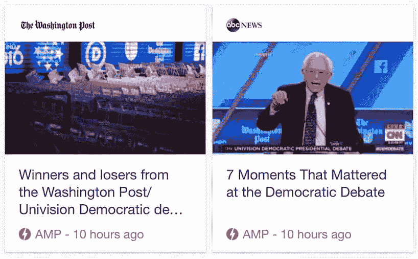

# 加速移动页面

> 原文：<https://dev.to/ben/accelerated-mobile-pages>

回到 10 月，[谷歌推出了加速移动页面](https://googleblog.blogspot.com/2015/10/introducing-accelerated-mobile-pages.html)。这是一个依赖于 AMP HTML 的开源项目，AMP HTML 是一个建立在现有网络技术基础上的框架，旨在规范和服务更快的移动网页。该项目由谷歌牵头，与 Twitter、Linkedin 和 Wordpress 等其他几家大型互联网公司合作，旨在成为一个开放标准。这个想法是，通过引入一些基本的约束，谷歌和其他公司可以缓存网页并即时提供服务，类似于脸书的[即时文章](https://instantarticles.fb.com/)，但更加开放，这将在 4 月 12 日脸书的 F8 会议上对所有开发者开放。

[T2】](https://res.cloudinary.com/practicaldev/image/fetch/s--Nip3FvnR--/c_limit%2Cf_auto%2Cfl_progressive%2Cq_auto%2Cw_880/http://i.imgur.com/NWXpBe3.png)

*谷歌 AMP 搜索结果*

你我中愤世嫉俗的开发人员可能会将这类事情视为我们需要赶上的另一个标准，但不能保证 Google 或其他任何人会长期使用它。但是谷歌已经有了主要的新闻出版物，当我搜索新闻相关的查询时，我已经看到它出现了。因为肯定有许多技术上不入流的新闻机构，这可能是小商店超越它们获得更多搜索曝光的好机会。

要使用 AMP，您需要创建第二个内容源，类似于 RSS 提要，并从主文章中引用它。

```
<link rel="amphtml" href="http://thepracticaldev.com/amp/accelerated-mobile-pages"> 
```

AMP 页面基本上是第一个页面的向下版本，带有一些样板文件，例如:

```
<!doctype html>
<html ⚡>
  <head>
    <meta charset="utf-8">
    <link rel="canonical" href="hello-world.html" >
    <meta name="viewport" content="width=device-width,minimum-scale=1,initial-scale=1">
    <style amp-boilerplate>body{-webkit-animation:-amp-start 8s steps(1,end) 0s 1 normal both;-moz-animation:-amp-start 8s steps(1,end) 0s 1 normal both;-ms-animation:-amp-start 8s steps(1,end) 0s 1 normal both;animation:-amp-start 8s steps(1,end) 0s 1 normal both}@-webkit-keyframes -amp-start{from{visibility:hidden}to{visibility:visible}}@-moz-keyframes -amp-start{from{visibility:hidden}to{visibility:visible}}@-ms-keyframes -amp-start{from{visibility:hidden}to{visibility:visible}}@-o-keyframes -amp-start{from{visibility:hidden}to{visibility:visible}}@keyframes -amp-start{from{visibility:hidden}to{visibility:visible}}</style><noscript><style amp-boilerplate>body{-webkit-animation:none;-moz-animation:none;-ms-animation:none;animation:none}</style></noscript>
    <script async src="https://cdn.ampproject.org/v0.js"></script>
  </head>
 <body>
     Hello World!
  </body>
</html>
```

是的，代码中有一个表情符号。如果你不喜欢时髦的编程，那就避开它😜。

如果你已经有了一个简单的设计，对你的实现有了一个很好的处理，并且通过服务器和渐进式改进来服务页面，那么实现加速的移动页面并不是一件困难的事情。因为这是为基于内容的网页设计的，而不是复杂的应用程序，我希望这就是你所做的。我确信许多新闻机构没有一个组织良好的代码库，但从长远来看，AMP 会奖励那些组织良好的代码库。

由于实际开发人员通过 [@ThePracticalDev](http://twitter.com/thepracticaldev) 大量使用 Twitter 进行内容分发，我会很高兴看到 Twitter 立即提供 AMP 页面的缓存版本，但还不清楚 Twitter 的长期计划是什么。到目前为止，他们的参与形式是通过 AMP 协议为 tweets 的快速显示提供支持。