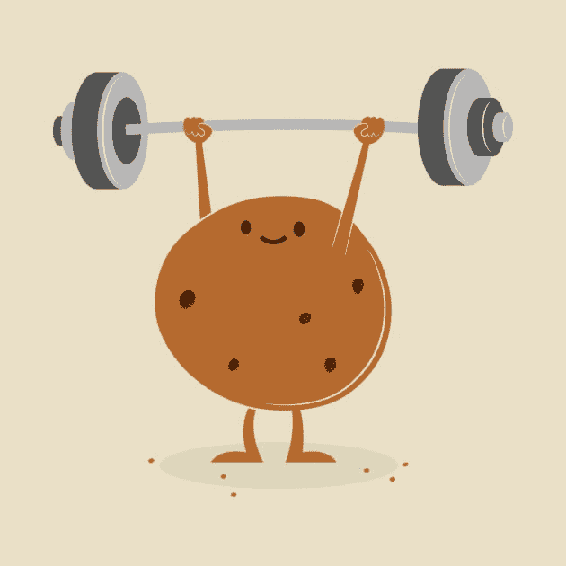

# 加速的 Vim 验证

> 原文：<https://dev.to/rpalo/accelerated-vim-provement-9j3>

我目前正在练习和学习使用 Vim 作为一个编辑器。在通过坐下来做一些教程来快速学习它的几次令人遗憾的尝试之后，我已经知道，对我来说，掌握 Vim 的道路将由缓慢而稳定的练习组成，一次学习和征服一件事，让 Vim 哲学在我的过程中渗透。

[T2】](https://res.cloudinary.com/practicaldev/image/fetch/s--9tcRvCDa--/c_limit%2Cf_auto%2Cfl_progressive%2Cq_66%2Cw_880/https://assertnotmagic.com/img/slow-and-steady.gif)

学会减轻自己的压力，快速学习并继续下一件事是困难的，但我为此感到高兴。它把打嗝、小挫折和不得不第无数次谷歌同一件事的失望变成了一次奇怪的放松和愉快的旅程。不再是*“我真笨，我居然永远记不住怎么删一个字”*，而是变成了，*“哦 Vim，你这个小流氓，你又骗到我了。我们将看到谁笑到最后。”*

[T2】](https://res.cloudinary.com/practicaldev/image/fetch/s--jeKfn7n6--/c_limit%2Cf_auto%2Cfl_progressive%2Cq_66%2Cw_880/https://assertnotmagic.com/img/oh-you.gif)

我确实想到了一件能让我加快进度的事情，我想我可以分享一下。

## 取下辅助轮

学习 Vim 时，您首先要学习的事情之一是如何使用`h, j, k, l`键而不是箭头键来移动。理论上来说，这样效率更高，还能让你的手保持理想的打字姿势。我不认为使用箭头键会使你成为坏人，但是使用这些键而不是箭头键还有一个额外的好处:

> 您可以像使用 Vim 中的任何其他运动/命令键一样使用`h, j, k, and l`进行移动。

箭头键有点像拐杖，因为如果您愿意，您可以忽略使 Vim 特别有用的所有命令和键，坚持只使用箭头键并一直保持插入模式。如果这就是你使用 Vim 的方式，你实际上只是在使用一个令人讨厌的版本 [Nano](https://www.nano-editor.org/) 。

> Nano 的所有功能，加上不断忘记自己处于正常模式并试图开始输入的乐趣，结果只是让光标在整个屏幕上做疯狂的事情。

如果你喜欢这样，我没意见。你做你的。如果你正试图打破这个习惯，把你的大脑转换成 Vim 的做事方式(也许是通过 Vimception？)，然后我发现实际上**完全扔掉拐杖**并关闭箭头键是非常有用的。

将这几行添加到您的`.vimrc`文件中。

```
nnoremap <Up> <Nop>
nnoremap <Down> <Nop>
nnoremap <Left> <Nop>
nnoremap <Rigth> <Nop> 
```

Enter fullscreen mode Exit fullscreen mode

将一个键映射到`<Nop>`(或无操作，或无操作)会导致它什么也不做。

## 但是为什么呢？

这实际上是很常见的建议，但大多数文章只会告诉你，这是为了帮助你更舒适地使用`h, j, k, l`。这在我看来很愚蠢，因为...如果我已经很擅长使用箭头键了，为什么我还要学习一套新的键来做同样的事情呢？我要说的好处不是我对`h, j, k, l`更舒服了，而是我*很快就厌倦了按这些键的*。没有了箭头键可以依靠，但是有了提高效率的愿望，我有了更大的动力去学习像`w, e, $, 0, G, gg`和其他人那样的键！

> 你不会把辅助轮从自行车上取下，这样你就可以说你没有使用辅助轮——同时继续慢慢骑。你把自行车的辅助轮卸下来，这样你就能很快了解到，当你骑得更快时，实际上要容易得多。

## 硬模式启用

这工作得很好，但是仍然有进入插入模式并使用箭头键的诱惑，这违背了整个目的。为了避免这种情况，您也可以在插入模式下禁用箭头，方法是在您的`.vimrc` :
中添加以下内容

```
inoremap <Up> <Nop>
inoremap <Down> <Nop>
inoremap <Left> <Nop>
inoremap <Right> <Nop> 
```

Enter fullscreen mode Exit fullscreen mode

这会让你的生活有时令人沮丧。“但我只想挪过去两个字！我不想退出插入模式，移过去，然后重新进入！”

### 坚韧。饼干。

[T2】](https://res.cloudinary.com/practicaldev/image/fetch/s--iA85PAUy--/c_limit%2Cf_auto%2Cfl_progressive%2Cq_auto%2Cw_880/https://assertnotmagic.com/img/tough-cookie.jpg)

坚持下去！会有回报的。我只做了一周，就看到了巨大的进步。

## 奖金

为了获得额外的鼓励，将上面所有的`<Nop>`替换成这个:

```
:echo 'STAHP.'<CR> 
```

Enter fullscreen mode Exit fullscreen mode

## 总结起来

如果你有任何 Vim 专业建议，请告诉我。Vim 是一个相当受欢迎的教程主题，每个人都有很多关于它的观点，但是我总是在寻找很酷的资源、书籍、指南、游戏、练习方法等等。我知道有很多人有很多知识要分享，所以分享吧！

* * *

*原帖 [`assert_not magic?`](https://assertnotmagic.com)*