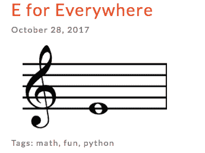
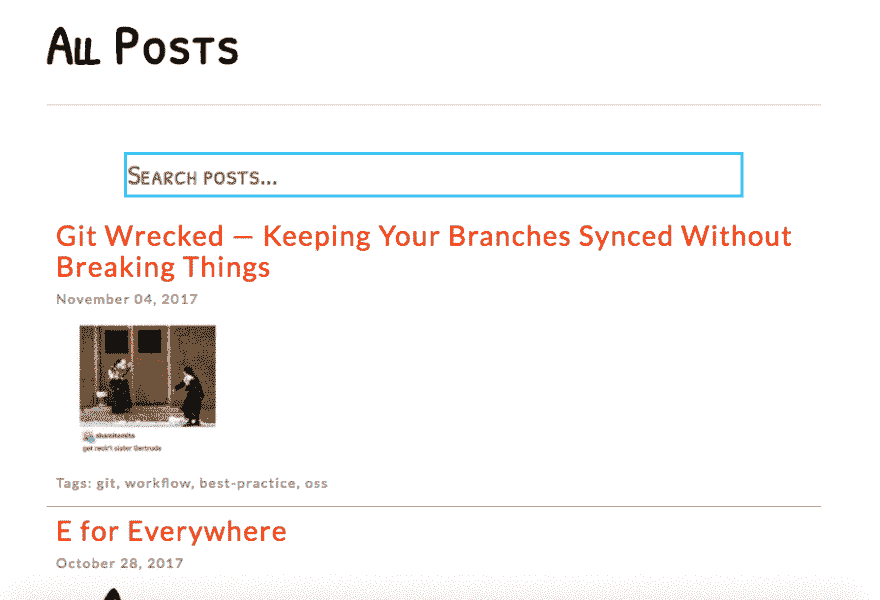
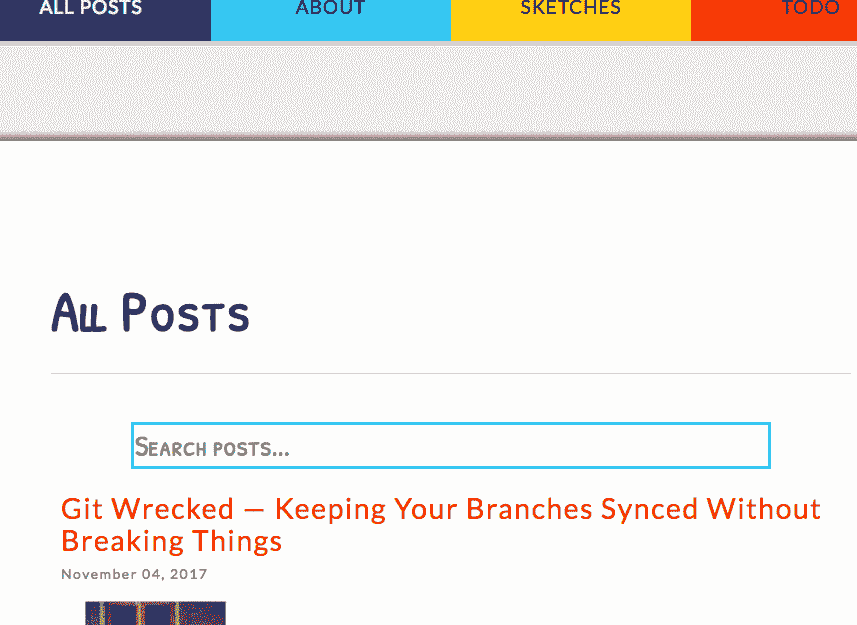

# 使用 Vue 将搜索添加到您的静态站点

> 原文：<https://dev.to/rpalo/add-search-to-your-static-site-with-vue-4bl>

在我的博客的最后一次更新中，我做了一些改变，但其中最主要的是我在我的帖子列表中添加了一个搜索栏，以帮助人们找到他们感兴趣的话题。我看了几个解决方案，但是因为我已经对 Vue 有点熟悉了，所以我决定用那个。所以让我们开始吧！

## 目标

这个项目的目标是从一个静态站点开始，由某个静态站点生成器(在我的例子中是 Jekyll)生成。我将展示相关的 HTML，这将是我们的起点。然后，我们将向 Posts 页面添加搜索功能，添加一个输入，当输入时，将过滤页面上的结果，但不刷新页面。我们的目标是相对简单地完成这项工作。JavaScript 不是我的原生生态系统，我想尽量避免使用构建工具所需的复杂性、设置和磁盘空间。我的博客的所有代码都是开源的(只要源代码在 GitHub 上是公开的，任何人都可以看到)，所以如果你想跟进或提前作弊并看到最终的代码，你可以[查看回购](https://github.com/rpalo/personal-blog)。可能还需要一些润色，但这不是我们现在要讨论的。

## 0。起点

这是我们开始时的情况。您可以假设主布局在`_layouts/page.html`中，这里的所有内容只是为帖子页面提供内容。

```
---
layout: page
title: All Posts
permalink: /posts/
description: A list of all of my blog posts
---

<!-- posts.html -->

<ul>
    
        <li class="post">
            
        </li>
    
</ul> 
```

您可以看到这里没有什么特别的东西:一个无序列表是通过使用流动语法遍历所有帖子生成的。它包括每个帖子的一个片段。这里是`_includes/post.html`。

```
<!-- _includes/post.html -->

<a class="post-title" href="{{ include.post.url }}">{{ include.post.title }}</a><br>
<small>{{ include.post.date | date: "%B %d, %Y" }}</small>


    


<small>Tags: 

    {{ tag }} 

</small> 
```

我以类似组件的方式发布了我的帖子。这个代码片段获取一个`post`对象，使用它的标题、url、创建日期、封面图片(如果有的话)，最后是它的标签列表，构建一个列表。它最终看起来像这样:

[T2】](https://res.cloudinary.com/practicaldev/image/fetch/s--uluARCDt--/c_limit%2Cf_auto%2Cfl_progressive%2Cq_auto%2Cw_880/https://assertnotmagic.com/img/search-post.png)

这就是我们的出发点。接下来，我们将添加我们的依赖关系。

## 1。添加 Vue

添加 Vue 真的只有一步之遥。如果你谷歌一下 Vue CDN，你会发现这个:`https://cdn.jsdelivr.net/npm/vue`。让我们把这个添加到我们的`posts.html`页面的底部，就这样！

```
---
layout: page
title: All Posts
permalink: /posts/
description: A list of all of my blog posts
---

<!-- posts.html -->

<ul>
    
        <li class="post">
            
        </li>
    
</ul>
<script src="https://cdn.jsdelivr.net/npm/vue"></script> 
```

## 2。获取文章数据

如果我们要让 Vue 显示我们的帖子，我们必须在 Vue 可以看到的地方有一个帖子列表(比如用 JavaScript)。有几种方法可以做到这一点。我们可以生成一个 JSON 文件并用 JavaScript 读取它，我们可以将它直接生成到`script`标签中的 JavaScript 变量中，或者我们可以将它生成到文件中的变量中。可能有更多的方法，我把它放入自己的 JavaScript 文件中。请记住，这个文件是在 Jekyll 构建时生成的，所以源代码不会非常漂亮，我们需要三重 YAML 标题行来告诉 Jekyll 构建它。

```
---
---
// js/posts_data.js

const posts = [
  
    {
      title: "{{ post.title | escape }}",
      url: "{{ site.baseurl }}{{ post.url }}",
      cover: "/img/{{ post.cover_image }}",
      tags: "{{ post.tags | join: ', ' }}",
      date: "{{ post.date | date: '%B %d, %Y' }}",
      description: "{{ post.description | strip_html | strip_newlines | escape }}"
    } ,
  
]; 
```

我们已经创建了一个变量来保存我们的文章列表和所有相关信息。我不确定是否真的有必要在逗号周围添加`unless`部分，但是该部分使得除了列表中的最后一个，每个帖子后面都有一个逗号。如果您使用另一个带有不同模板语言的静态站点生成器，这个文件会有所不同。让我们将该脚本添加到脚本标记中。

```
---
layout: page
title: All Posts
permalink: /posts/
description: A list of all of my blog posts
---

<!-- posts.html -->

<ul>
    
        <li class="post">
            
        </li>
    
</ul>
<script src="https://cdn.jsdelivr.net/npm/vue"></script>
<script src="/js/posts_data.js"></script> 
```

现在我们准备好了有趣的部分。

## 3。构建搜索/结果页面

是时候设置我们的 HTML 了。将`posts.html`的内容替换为:

```
---
layout: page
title: All Posts
permalink: /posts/
description: A list of all of my blog posts
---
<div id="app">

  <div class="search-wrapper">
    <input class="search" type="text" name="search" v-model="search" placeholder="Search posts...">
  </div>

  <div class="results-wrapper">
    <div class="post" v-for="post in filteredPosts">
      <a class="post-title" v-bind:href="post.url">{{ post.title }}</a><br>
      <small>{{ post.date }}</small>

      

      <small>Tags: {{ post.tags }}</small>
    </div>
  </div>

</div>

<script src="https://cdn.jsdelivr.net/npm/vue"></script>
<script src="/js/posts_data.js"></script> 
```

根据你的模板设置，你可能不得不将`#app` div 包装在[的某种“原始”标签](https://shopify.github.io/liquid/tags/raw/)中，因为 Vue 碰巧使用了与 Jekyll 相同的模板括号。我们创建一个`div`元素来保存我们的应用程序。里面存放着我们的搜索输入框和结果。结果`div`的内容看起来应该很熟悉，因为它们是从我们的旧`_includes/post.html`移植过来的。我想介绍一些与 Vue 相关的内容。

`<input ... v-model="search">`:`v-model`指令是在 Vue 中设置双向绑定的一种方式。当我们编写应用程序组件时，我们将有一个`search`变量可用。每当 JavaScript 中的搜索变量更新时，输入就会更新，反之亦然。

这个指令告诉 Vue 遍历我们的帖子，并在每个帖子中重复 HTML。

`<a ... v-bind:href="post.title">`:`v-bind`指令用于将 HTML 属性直接附加到 JavaScript 变量，因为 Vue 模板括号在 HTML 属性中不起作用。你会看到我们在``做同样的事情。

否则，我们只是引用我们在`posts_data.js`中提供给`posts`的属性！快好了！

## 4。创建应用程序组件

是时候来点 Vue JavaScript 了。创建一个名为`js/posts.js`的文件。

```
const app = new Vue({
  el: '#app',
  data: {
    search: '',
    post_list: posts
  },
  computed: {
    filteredPosts() {
      return this.post_list.filter( post => {
        return `${post.tags}  ${post.title}`.toLowerCase().includes(this.search.toLowerCase());
      });
    }
  }
}); 
```

我们来谈谈这里有什么:

`el: '#app'`:我们告诉 Vue 把这个组件放在`<div id="app">`中

`data`:这里我们创建两个变量——`search`是我们在`posts.html`中使用`v-model`指令时看到的一个变量。注意，我们给它一个空字符串的初始初始值。如果我们在这里放置任何东西，当页面加载时，这些文字就会出现在我们的搜索框中。

`filteredPosts()` : Vue 使用`computed`来描述需要根据变量不断重新计算的数据。计算函数是只读的。我们用它来显示标题或标签与搜索框中的文本相匹配的文章列表。每当搜索框发生变化，`filteredPosts`就会被重新计算。由于我们在 Vue HTML 中引用了`filteredPosts`，任何时候`filteredPosts`被重新计算，屏幕上的帖子都会被重新评估，并根据需要重新绘制。

最后要做的一件事是将这个脚本添加到我们的`posts.html`中。

```
// ...

<script src="https://cdn.jsdelivr.net/npm/vue"></script>
<script src="/js/posts_data.js"></script>
<script src="/js/posts.js"></script> 
```

就是这样！我们完了！

[T2】](https://res.cloudinary.com/practicaldev/image/fetch/s--DjfvdEFz--/c_limit%2Cf_auto%2Cfl_progressive%2Cq_66%2Cw_880/https://assertnotmagic.com/img/search-final.gif)

## 5。额外的 JavaScript

作为额外的奖励，我在我的`posts.js` :
的结尾加上了这几行

```
document.querySelector('.search').addEventListener('focus', function () {
  window.scroll({
    top: this.offsetTop - 100,
    left: 0,
    behavior: 'smooth'
  });
}); 
```

每当有人点击搜索框(或在手机上触摸它)，它就会将搜索栏提升到屏幕顶部，这样就可以更容易地看到可用帖子的变化。

[T2】](https://res.cloudinary.com/practicaldev/image/fetch/s--ZVEqT8rz--/c_limit%2Cf_auto%2Cfl_progressive%2Cq_66%2Cw_880/https://assertnotmagic.com/img/search-shwoop-top.gif)

## 总结起来

仅此而已！几处文件修改，不到 100 行代码，没有构建工具或`node_modules`，我们的网站——嗯，目前只是我的网站——看起来很时髦。现在你的也可以了！让我知道进展如何，或者你是否遇到了问题，或者我是否有办法改进我的设置。感谢阅读！

* * *

*原帖 [`assert_not magic?`](https://assertnotmagic.com/2017/11/11/static-site-search-with-vue/)*