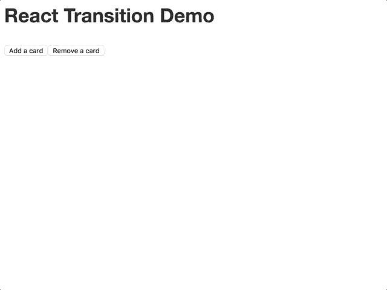
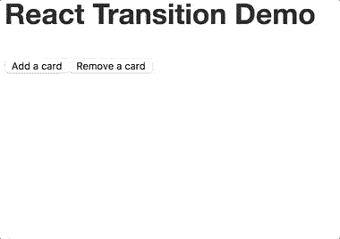

# 使用 React 过渡组向 React 应用程序添加动画

> 原文：<https://dev.to/underdogio/adding-animations-to-your-react-app-with-react-transition-group>

将[功能动画](https://www.smashingmagazine.com/2017/01/how-functional-animation-helps-improve-user-experience/)添加到你的应用中是增强用户体验的好方法。当正确使用时，动画可以帮助引导用户注意你的应用程序的某些部分，帮助重新加强界面内的关系，并防止[变化盲目性](https://en.wikipedia.org/wiki/Change_blindness)。

可以改善用户体验的动画的一个例子是，当一个项目被添加到列表中时，它在该项目中渐隐。该动画的步骤可能如下所示:

1.  呈现新项目。
2.  为动画准备物品。在这种情况下，将其不透明度设置为`0`。
3.  在一段时间内将元素的不透明度从`0`过渡到`1`。

对于移除项目:

1.  标记要移除的项目。
2.  在一段时间内将元素的不透明度从`1`过渡到`0`。
3.  转换完成后，移除该元素。

管理所有这些状态会变得很麻烦，所以让我们试着找一个能为我们处理这些的库。进入[反应过渡组](https://github.com/reactjs/react-transition-group/tree/867cc33d79791d7d880092031adcf4cc378ce23e)。

React 转换组包含一组组件，用于管理一段时间内组件安装和卸载的状态。它并没有规定我们的组件在安装或卸载时的行为，那是由我们自己决定的。这种极简主义让我们可以灵活地定义我们想要的动画。

在这篇文章中，我们将添加过渡动画到卡片板上，在卡片被添加到板上和从板上移除时制作动画。

这是最终的结果:

[T2】](https://res.cloudinary.com/practicaldev/image/fetch/s--RVCHo-rp--/c_limit%2Cf_auto%2Cfl_progressive%2Cq_66%2Cw_880/https://thepracticaldev.s3.amazonaws.com/i/kasojw34xb5u4552i7lk.gif)

你可以在这里看到动画[的现场演示。](https://restlessbit.github.io/react-transition-demo/index.html)

## 先决条件

你应该对[反应](https://facebook.github.io/react/)和 [CSS 转场](https://developer.mozilla.org/en-US/docs/Web/CSS/CSS_Transitions/Using_CSS_transitions)有一个基本的了解。

### 使用的包

1.  [反应 v15.6.1](https://github.com/facebook/react/tree/v15.6.1)
2.  [react-dom v15.6.1](https://github.com/facebook/react/tree/v15.6.1)
3.  [反应-过渡-组 2.0.2](https://github.com/reactjs/react-transition-group/tree/v2.0.2)

## 开始设置

在我们可以添加动画到我们的应用程序之前，我们需要一个应用程序来制作动画！

我们将要创建的应用程序相当简单，因为它只包含 3 个组件:

1.  `<Card />`
    *   将在存在和不存在时进行动画处理的组件。
2.  `<Board />`
    *   呈现一个`<Card/>`项目列表。
3.  `<Application />`
    *   我们的应用程序的根。管理要在`<Board />`中呈现的卡片的状态，并包含用于添加和移除卡片的按钮。

以下是这些组件的源代码:

### `<Card/>`

```
function Card ({children, onRemove}) {
  return (
    <div className="card">
      {children}
      <button onClick={onRemove}>Remove</button>
    </div>
  )
} 
```

Enter fullscreen mode Exit fullscreen mode

### `<Board />`

```
function Board ({children}) {
  return (
    <ul className="board">
      {children}
    </ul>
  )
} 
```

Enter fullscreen mode Exit fullscreen mode

### `<Application/>`

```
class Application extends React.Component {
  constructor (props) {
    super(props)

    this.state = {
      cards: []
    }

    this.addCard = this.addCard.bind(this)
    this.removeCard = this.removeCard.bind(this)
    this.removeLastCard = this.removeLastCard.bind(this)
  }

  render () {
    const {cards} = this.state

    return (
      <main className="container">
        <h1>React Transition Demo</h1>
        <button onClick={this.addCard}>Add a card</button>
        <button onClick={this.removeLastCard}>Remove a card</button>
        <Board>
          {
            cards.map(card => {
              return (
                <li className="board__item" key={card.id}>
                  <Card onRemove={() => {
                    this.removeCard(card.id)
                  }}>{card.content}</Card>
                </li>
              )
            })
          }
        </Board>
      </main>
    )
  }

  addCard () {
    const {cards} = this.state
    const id = cards.length + 1
    const newCard = {
      id,
      content: `Card ${id}`
    }
    this.setState({
      cards: cards.concat([newCard])
    })
  }

  removeCard (id) {
    const {cards} = this.state
    this.setState({
      cards: cards.filter(card => card.id !== id)
    })
  }

  removeLastCard () {
    const {cards} = this.state
    this.setState({
      cards: cards.slice(0, -1)
    })
  }
} 
```

Enter fullscreen mode Exit fullscreen mode

你可以从 GitHub 获得这些组件[的样式。](https://github.com/restlessbit/react-transition-demo/blob/master/styles.css)

如果你运行这个应用程序，你将能够添加和删除卡(令人兴奋的东西！).但是卡片突然出现又突然消失的方式在视觉上并不吸引人。让我们通过添加过渡动画来解决这个问题。

## 添加动画

我们想让添加和删除卡感觉无缝。我们可以通过在添加和删除卡片时淡化和滑动卡片来实现，就像这样:

[T2】](https://res.cloudinary.com/practicaldev/image/fetch/s--n-qBfcfM--/c_limit%2Cf_auto%2Cfl_progressive%2Cq_66%2Cw_880/https://thepracticaldev.s3.amazonaws.com/i/raviwyzxqre7a04pjrtx.gif)

但是在我们制作卡片过渡动画之前，我们需要一种方法来跟踪卡片从我们的`<Board />`中添加和移除时的状态，并在卡片进入和退出时运行适当的动画。

一旦卡被添加到列表中，卡进入动画就应该运行。当卡片从列表中移除时，卡片退出动画应该运行，但是卡片应该保留在 DOM 中，直到动画结束。动画完成后，卡片应该从 DOM 中移除。

这听起来工作量很大。因此，与其自己实现这个功能，不如让我们使用 React Transition Group 提供的`<TransitionGroup />`组件。

### 使用`<TransitionGroup />`

`<TransitionGroup />`应该包含在要制作动画的元素列表中。所以让我们把`<Application />`的渲染方法中的`<Board />`组件换成`<TransitionGroup />`。

默认情况下，`<TransitionGroup />`会将其子元素列表包装在一个`<span />`中，但是我们可以通过设置`component`属性:
来让它将我们的卡片包装在一个`<Board />`中

```
import TransitionGroup from 'react-transition-group/TransitionGroup'

// ...

<TransitionGroup component={Board}>
  {
    cards.map(card => {
      return (
    <li className="board__item" key={card.id}>
      <Card onRemove={() => {
        this.removeCard(card.id)
          }}>{card.content}</Card>
    </li>
      )
    })
  }
</TransitionGroup>

// ... 
```

Enter fullscreen mode Exit fullscreen mode

但是如果你运行应用程序并开始添加卡片，你会注意到卡片仍然像以前一样出现又消失。这是因为我们还没有定义我们的卡在被添加或移除时应该如何表现。为了做到这一点，我们需要将我们的每张卡片包装在一个`<Transition />`组件中。

### 使用`<Transition />`

React Transition Group 中的`<Transition />`组件允许我们定义一个组件在被呈现或者将要从 DOM 中移除时应该如何表现。

添加或删除组件的状态通过`in` prop 处理。这个属性是一个`boolean`值，指示组件是否应该显示。值`true`意味着组件应该被显示，`false`意味着组件应该被隐藏。

`in`的值由`<TransitionGroup />`提供，当添加组件时，该值将设置为`true`，当移除组件时，该值将设置为`false`。

`in`道具值的变化将在一段时间内触发一系列状态变化。这些状态变化允许我们通过在转换状态变化时对组件应用不同的样式来制作组件的动画。

我们将创建一个`<FadeAndSlideTransition />`组件，它可以在组件被安装和卸载时应用一个转换动画。

下面是该组件的代码:

```
import Transition from 'react-transition-group/Transition'

// <FadeAndSlideTransition /> is a component that wraps children in 
// a <Transition /> component. 
// 'children' is the element to be animated.
// 'duration' is the duration of the animation in milliseconds.
// The `in` prop will be provided by <TransitionGroup />. 
function FadeAndSlideTransition ({children, duration, in: inProp}) {
  // Styles to set on children which are necessary in order
  // for the animation to work.
  const defaultStyle = {
    // Transition "opacity" and "transform" CSS properties.
    // Set duration of the transition to the duration of the animation.
    transition: `${duration}ms ease-in`,
    transitionProperty: 'opacity, transform'
  }

  // Styles that will be applied to children as the status
  // of the transition changes. Each key of the
  // 'transitionStyles' object matches the name of a 
  // 'status' provided by <Transition />. 
  const transitionStyles = {
    // Start with component invisible and shifted up by 10%
    entering: {
      opacity: 0,
      transform: 'translateY(-10%)'
    },
    // Transition to component being visible and having its position reset. 
    entered: {
      opacity: 1,
      transform: 'translateY(0)'
    },
    // Fade element out and slide it back up on exit.
    exiting: {
      opacity: 0,
      transform: 'translateY(-10%)'
    }
  }

  // Wrap child node in <Transition />.
  return (
    <Transition in={inProp} timeout={{
      // Set 'enter' timeout to '0' so that enter animation
      // will start immediately.
      enter: 0,

      // Set 'exit' timeout to 'duration' so that the 'exited'
      // status won't be applied until animation completes.
      exit: duration
    }}>
      {
        // Children is a function that receives the current
        // status of the animation.
        (status) => {
          // Don't render anything if component has 'exited'.
          if (status === 'exited') {
            return null
          }

          // Apply different styles to children based
          // on the current value of 'status'. 
          const currentStyles = transitionStyles[status]
          return React.cloneElement(children, {
            style: Object.assign({}, defaultStyle, currentStyles)
          })
        }
      }
    </Transition>
  )
} 
```

Enter fullscreen mode Exit fullscreen mode

我们可以通过将每个`<Card />`包装在一个`<FadeAndSlideTransition />`组件:
中，将渐变和滑动过渡应用到我们的卡片上

```
// render method of <Application />
<TransitionGroup component={Board}>
  {
    cards.map(card => {
      return (
        <FadeAndSlideTransition duration={150} key={card.id}>
          <li className="board__item">
            <Card onRemove={() => {
              this.removeCard(card.id)
            }}>{card.content}</Card>
          </li>
        </FadeAndSlideTransition>
      )
    })
  }
</TransitionGroup> 
```

Enter fullscreen mode Exit fullscreen mode

如果你现在重新运行应用程序，你会看到一个漂亮的动画会应用到卡片上，当它们被添加到棋盘上或者从棋盘上移除的时候。

下面是这一切是如何运作的分解。

每当添加卡时:

1.  `<TransitionGroup />`将呈现一个新的`<FadeAndSlideTransition />`组件，该组件将呈现一个包含在`<Transition />`中的`<Card />`。

2.  每个`<Card />`立即有其`transition`样式集，这将导致`opacity`和`transform`样式在它们被改变时被动画化。

3.  `<FadeAndSlideTransition />`的`in`属性被设置为`true`，导致`<Transition />`组件的`children`函数被调用，状态为`entering`。然后来自`transitionStyles.entering`的样式被应用到`<Card />`。

4.  因为输入动画的超时被设置为`0`，`children`将被立即再次调用，状态为`entered`。这将更新`<Card />`的`opacity`和`transform`样式，从而触发 CSS 转换。

每当移除卡时:

1.  `<TransitionGroup />`会将渲染卡片的`<FadeAndSlideTransition />`组件的`in`道具设置为`false`。
2.  `<Transition />`组件的`children`函数将以`exiting`状态被调用。`exiting`样式被应用到`<Card />`上，使其淡出并向上滑动。
3.  一旦动画的`duration`过去，`children`被调用，状态为`exited`。我们返回`null`是为了从 DOM 中移除`<Card />`。

应用内嵌样式只是创建动画的一种方式。你也可以使用`<Transition />` `children`函数中的`status`变量来应用一个 CSS 类:

```
<Transition in={inProp} timeout={{
  enter: 0,
  exit: duration
  }}>
    {
      (status) => {
        // Don't render anything if component has "exited".
        if (status === 'exited') {
          return null
        }

        return <Card className={`fade fade-${status}`} />
      }
   }
</Transition> 
```

Enter fullscreen mode Exit fullscreen mode

然后为每个状态创建一个 CSS 类:

```
.fade {
  transition: ease-in 0.15s;
  transition-property: opacity, transform;
}

.fade-entering {
  opacity: 0
  transform: translateY(-10%);
} 
```

Enter fullscreen mode Exit fullscreen mode

因为`<Transition />`只管理我们动画的状态，我们可以自由地以我们认为合适的方式实现我们的动画。希望这两个例子足以让你开始制作自己的动画。

如果您想查看包含一些代码的工作示例，您可以在 GitHub 上查看这个示例[的源代码。](https://github.com/restlessbit/react-transition-demo)

如果你想了解更多关于 React Transition Group 的信息，请查看 GitHub repo 和 T2 文档。