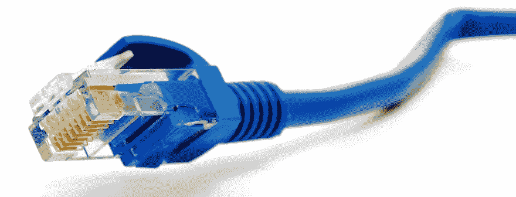

# 增加互联网连接弹性

> 原文：<https://dev.to/funkysi1701/adding-internet-connection-resiliency-o1a>

我被要求调查给我们的一个办公室增加一个故障转移互联网连接。

目前，这个办公室通过无线链路与我们的总部相连。不幸的是，我们最近遇到了一些性能不佳的连接，现在已经得到纠正，但像所有技术一样，它有可能在未来以某种方式失败，并因此导致业务损失。

## 互联网连接

这是我首先考虑的问题之一。我需要一个可靠的互联网连接，有很多选择可以考虑，让我们来看看几个。

[T2】](https://res.cloudinary.com/practicaldev/image/fetch/s--2MydZ8OM--/c_limit%2Cf_auto%2Cfl_progressive%2Cq_auto%2Cw_880/https://storageaccountblog9f5d.blob.core.windows.net/blazor/wp-content/uploads/2015/08/14091d1357164106-internet-connection-drops-every-couple-minutes-cable-sxchu-internet1.jpg%3Fresize%3D660%252C252%26ssl%3D1)

ADSL 连接这是大多数家庭都有的标准互联网连接，你可以获得大约 20Mb/s 的下载，但每月只能上传 2Mb/s，价格相当低。速度取决于地区、质量和离交换站的距离，一些农村地区的速度比这低得多。因为这个连接是办公室用的，我想要我能负担得起的最好的连接，所以如果我能避免的话，我宁愿不选择这个连接。

FTTC(光纤到机柜)这就是 ISP 通常所说的超高速宽带。安装在您的 exchange 机柜上的电缆已升级为光纤电缆，传输速度更快(例如 40Mb/s 下载和 10Mb/s 上传)。这是我的理想选择，但是 BT Openreach 负责将该国升级到这些电缆，他们对此反应不是很快。几年前调查此事时，FTTC 几乎已经到了我们的办公室，但当我今天调查时，似乎没有任何进展。FTTC 和 ADSL 都需要一根电话线接入办公室才能运行。

**租用线路**这是您的 ISP 连接到您办公室的专用线路，为您提供更快的连接(上传和下载速度相同)，但这非常昂贵。我们的总部有这个，因为这里是我们的服务器所在地，更快的速度有利于整个公司。我们不想对每个分支机构都这样做，因为成本太高。

从租用线路引出可以将租用线路分支或引出到我们的第二个办公室。这将是一条在两个位置而不是一个位置端接的租用线路。然而，由于所涉及的距离，我不认为这将是可能的，在我的情况下，可能最终成本高达第二租用线。

ISP 以及我需要决定由谁来提供的连接类型。有数百家互联网服务提供商，但我喜欢使用声誉良好的互联网服务提供商，或者我过去使用过并且很满意的互联网服务提供商。我不会为我的所有连接都选择一个 ISP，因为我喜欢在那个 ISP 遇到问题的时候有一些连接继续工作。我推荐的 ISP 有 YDS、Eclipse 和 PlusNet

当我在谈论互联网连接时，政府一直在提供一项计划，向企业提供升级到超高速连接(FTTC 或租用线路)的资金。更多信息可以在你的议会网站上找到，如果你在约克有办公室，请查看这里了解更多细节。我们有 3000 元的安装费用，所以如果你有资格的话，值得调查。

## VPN 连接

办公室需要访问的资源远不止互联网。这个特殊的办公室需要访问我们的电子邮件和数据库服务器，这是最低要求。访问远程办公室网络资源的一种方式是通过 VPN(虚拟专用网络)连接。所以我下一步考虑的是如何在我们的办公室之间建立 VPN 链接。

**软件** Windows Server 包含 RRAS(路由和远程访问服务)，您可以使用它来配置 VPN 连接。需要注意的一件重要事情是，服务器至少需要两个网络连接，一个在具有公共 IP 的互联网上，一个在内部网络上。

**硬件**更昂贵的路由器通常具有允许 VPN 连接配置的设置。

这两种方法我过去都用过。RRAS 是一个痛苦的工作，但随着新版本的 windows server 的发展，所以可能没有我记忆中的那么糟糕。使用路由器做 VPN 引入了它自己的一系列问题，并且不能保证避免 RRAS，您可能仍然需要它来验证您的路由器提供的 VPN。

## 多重连接处理

互联网连接以两种方式提供，主要方式是通过无线链接，第二种方式是通过上述选项之一。

有许多选项来处理多个连接，我是否希望对两个连接进行负载平衡并一直使用它们，我是否希望仅在第一个连接失败时故障切换到第二个连接，或者我是否希望这是一个手动过程，或者在出现问题时切换到备用网络。

如您所见，在我为这个办公室增加弹性之前，有许多不同的技术需要考虑，我甚至还没有开始考虑是否需要额外的服务器。