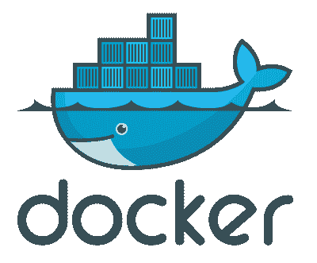

# Docker 的冒险:与容器和主机的 uid 冲突

> 原文：<https://dev.to/ophasnoname/adventure-with-docker-conflicts-with-uids-of-the-container-and-the-host>

[T2】](https://res.cloudinary.com/practicaldev/image/fetch/s--_DqH5rQg--/c_limit%2Cf_auto%2Cfl_progressive%2Cq_auto%2Cw_880/https://thepracticaldev.s3.amazonaws.com/i/x7mlchotxqm2um8tx09c.png)

有那么几天，你会处理一些你从未预料到的问题。
[我们](https://zenner-iot.com)的目标是在我们的 Docker-Swarm 中运营一个[弹性搜索集群](https://www.elastic.co/products/elasticsearch)。一段时间后，发现了一个完成的映像，这使这成为可能(有问题的是发现了其他节点，只是作为一个提示)。

为了确保 ElasticSearch 集群中的所有容器拥有不同 Docker Swarm 节点上的所有数据，我们使用 [GlusterFS](https://www.gluster.org/) 作为分布式文件系统。

整个构造运行得非常好，直到我们注意到:嘿，NTP 没有在我们的服务器上运行。Ok 很快被扔进 Ansible Playbook 并在主机上运行。嘭！弹性研究报告:我不再喜欢你了，伙计…

现在，当然，你想知道这里发生了什么？主机显示，现在 ElasticSearch 的所有文件都属于用户“systemd-timesync”..呃？当然，第一个猜测是有些破旧的 GlusterFS。

实际误差原则上不是误差。如果将主机卷添加到容器中，容器中的所有文件都是在用户在容器中运行的情况下创建的。通常许多容器以 root 用户身份运行，这不会引起任何问题，但是 5.x 版以后的 ElasticSearch 不会以 root 用户身份运行…

现在游戏中的机会来了，ElasticSearch 的图像是基于 Alpine 的，这里用户从 UID 100 开始，不幸的是，正是我们的小朋友“systemd-timesync”用户现在使用的 UID。

不幸的是，我们没有一个真正好的解决方案，但作为一个变通办法，Dockerfile 被改变了，我们给 ElasticSearch 用户分配了一个 UID 1200+。现在文件是用这个 UID 创建的。

如果你找到一个更聪明的解决方案，我期待着一个评论，如果你更喜欢德语的这篇文章，你可以在[极客酒吧](https://geekpub.de/)找到它。