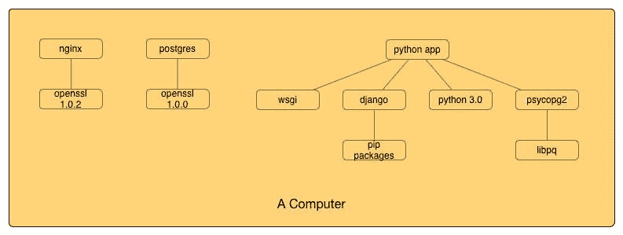
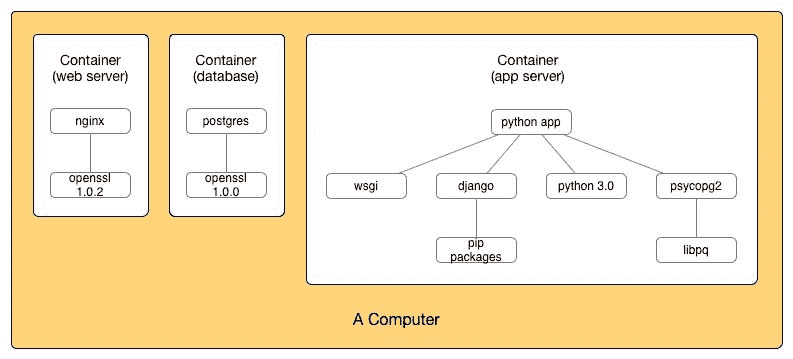
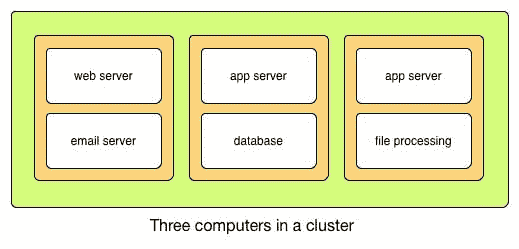
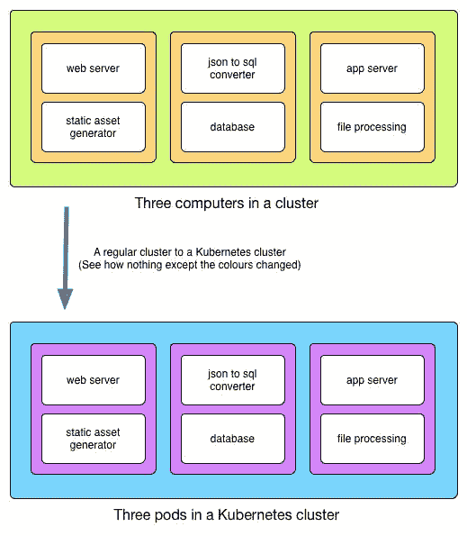
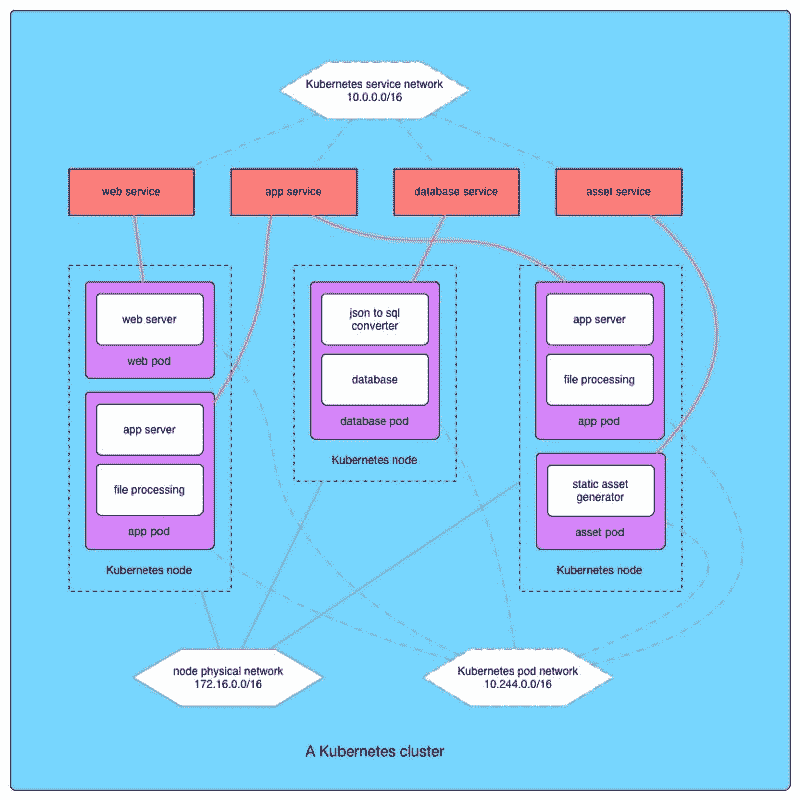

# 容器和 Kubernetes 简介

> 原文：<https://dev.to/hasurahq/an-introduction-to-containers-and-kubernetes-d8>

### 关于容器和 Kubernetes 基础概念的初级读本，以及它们如何为应用程序开发提供新的模式。

## 容器是新流程

起初有了计算机。计算机启动时，运行一个名为 init 的程序。然后，init 程序运行所需的所有其他程序:服务器、终端和窗口管理器。init 可以做几件有趣的事情，比如在引导时启动一个程序，以固定的时间间隔运行一个程序，并确保它已经运行的程序没有失败和崩溃，然后它会重新启动它们。正在运行的程序可以看到计算机上的一切:其他正在运行的程序、所有文件和网络。

<figure> 

<figcaption>多个进程在一台计算机上一起运行。所有进程都可以自由地相互交互，并与公共资源交互。</figcaption>

</figure>

因为它给程序员提供了一个更简单的模型来通过划分事物来进行推理，所以开发了创建名称空间的工具。在一个命名空间中运行的程序或进程只能看到同一命名空间中的其他进程。如果他们查找文件，他们只能看到分配给该命名空间的那部分硬盘。从安全的角度来看，一个命名空间中的受损进程只能影响该命名空间。

像 Docker 和 Rkt 这样的工具就是为了系统地使用这些特性而开发的。这些工具提供了将名称空间打包成容器的优势，这样就可以很容易地将它移动到另一台计算机上，因为它是独立的，所以知道它将继续以完全相同的方式运行。事实上，人们通常很容易想到像微型计算机这样完全独立运行的容器。因为这些新工具非常容易使用，所以它们已经成为一种非常流行的构建软件的方式。

容器是新的过程。

<figure> 

<figcaption>容器中的流程。在这里，一个进程只能与同一个容器中的其他进程和资源进行交互。</figcaption>

</figure>

## 规模:一个好问题

一台计算机的资源是有限的，它只能同时处理这么多的数据和运行这么多的程序。处理增加的负载(如更多用户或更大的数据集)的一个简单方法是垂直扩展或向计算机添加更多处理能力和内存，但这很快就会变得非常昂贵，并且可以走的距离是有限的。另一种方法是通过添加更多计算机来进行水平扩展。这些计算机现在形成了一个集群。

应用程序需要以不同的方式构建，以便在集群上运行良好。例如，如果我们确保相同程序的两个副本可以在不需要访问另一个程序的数据的情况下运行，那么我们就可以放心地在多台计算机上运行相同程序的多个副本，并且知道不会发生任何不好的事情。

<figure> 

<figcaption>水平缩放。在这个集群中，三台计算机分别运行两个容器。app server 容器有两个实例来处理更大的负载。</figcaption>

</figure>

尽管容器本身并没有给我们提供任何额外的工具来构建分布式应用程序，但是在这个抽象层次上进行思考可以更容易地为集群构建应用程序。容器模型鼓励这样的假设

*   可能有多个副本在运行(为并发性而构建)，
*   容器可以在集群中的任何一台计算机上动态地启动和停止(最好是无状态的、短暂的)
*   计算机或进程可能在任何时候出现故障或不可用，但整个系统仍应保持工作(为故障和恢复而构建)。

群集中有如此多的计算机需要管理，我们面临着一些额外的挑战。

*   首先，我们需要管理计算机上的资源，如处理和存储。这意味着我们必须在不同的计算机上有效地分配和调度消耗它们的进程。
*   我们还需要亲缘关系或方法来一起运行相关的过程，以便有效地共享资源；和反亲缘关系，以确保竞争相同资源的进程不在同一台计算机上运行。
*   例如，如果我们希望运行应用服务器进程的两个副本来处理两倍数量的请求，我们会希望这些进程在集群中的不同计算机上运行。
*   由于到处都有许多进程在运行，我们需要一种方法来发现所有这些进程并与之通信。如果我们知道某个进程运行的计算机的 ip 地址，我们就可以与它进行通信。

一台计算机只有一个 ip 地址。对于多台计算机，我们需要维护一个进程到 ip 地址的映射，比如在像 etcd 这样的分布式数据库中。当一个进程在计算机上启动时，我们将这些信息添加到数据库中。如果该过程失败或者计算机停机，我们还需要从数据库中删除该条目。

程序员已经非常擅长编写在一台计算机上运行的应用程序。理想情况下，我们想要做的是拥有一个工具，它可以将集群中的所有计算机像一台大型计算机一样呈现给程序员。

CoreOS 上的 Fleet 是朝着这个方向迈出的一步，它基本上是将一台计算机上的 init 进程扩展为整个集群的 init 进程。

谷歌推出的 Kubernetes 项目让我们更接近我们想要的拥有一台巨型计算机的模式。

## Kubernetes:豆荚是新的计算机

Kubernetes 做的第一件事是拿走你的计算机，给你一台巨型计算机作为 Kubernetes 集群。

Kubernetes pod 指定了一组要运行的 Docker 或 Rkt 容器。

现在，我们不再与集群中不同计算机上运行的不同进程进行交互，而是可以看到 Kubernetes 集群中不同 pods 上运行的不同进程。

<figure>

<figcaption>Kubernetes 集群围绕豆荚或容器组构建模型。这些 pod 基于资源和亲缘关系约束被动态地分配给底层节点。</figcaption>

</figure>

之前，我们考虑在同一台计算机上一起运行哪些进程。现在，我们可以考虑围绕哪些流程组构建哪些 podspods 成为一种建模应用程序功能单元的好方法。我们甚至可以直接放入社区构建的 pod，让它立即工作，例如用于日志记录和监控。

pod 中的所有进程都运行在同一台计算机上，这就像一个挂载的磁盘一样解决了资源共享问题。在后台，Kubernetes 将 pod 分配给不同的计算机或 Kubernetes 节点。我们可以设置发生这种情况的标准，如资源约束以及与其他单元和节点的关系。

计算机是资源、一些处理、内存、磁盘和网络接口的集合。就像计算机一样，pod 也可以从底层池中分配一定数量的资源。它还接收自己的网络接口和 pod 虚拟网络上的 ip 地址。

豆荚是新的电脑。

如果我们需要扩展特定的功能，我们只需在集群上运行 pod 的更多副本。当硬件受限时，我们只需向群集中添加更多计算或存储资源。通过将资源与创建时要执行的功能分离，调度程序可以确保尽可能高效地使用所有可用的计算资源。

Kubernetes 复制控制器负责确保同一 pod 的一定数量的副本始终在运行。像分布式 init 一样，如果一个 pod 出现故障；因为其中的一个过程失败，因为 pod 依赖关系失败，或者因为它所在的节点关闭；Kubernetes 检测到它，并在一个可用节点上调出另一个副本。

Kubernetes 服务跟踪集群中某一类型的所有 pod。例如，我们可以有一个应用服务器服务来跟踪集群中的所有应用服务器。服务形成了一个非常方便的抽象；我们的应用程序可以快速找到特定类型的所有功能单元，并将工作分配给它们。

<figure> 

<figcaption>全图。窗格是动态分配给节点的。每种 pod 的服务都支持发现和负载平衡。pod 和服务的虚拟网络。</figcaption>

</figure>

Kubernetes 是一个在集群上管理和调度流程的框架，也是一个新的心智模型，通过 pods 中的流程分组和服务支持的发现来构建应用程序。

## 满圆而前路茫茫

管理一台计算机已经是一个难题。管理一大群相互交流的人要复杂得多。感谢那些制作 Docker 和 Kubernetes 等令人难以置信的工具的好人，我们现在有了像容器这样的简单模型，以及让计算机集群像单台计算机一样运行的工具。构建大规模应用从未如此简单。

容器和集群管理工具也影响了人们构建应用程序的方式。他们创造了新的模式和抽象，其含义仍在探索中。例如，使用容器来构建可重用的应用程序组件和库会很有趣。在 [Hasura](https://hasura.io/) ，我们正在为数据库、搜索、用户管理和文件管理等构建组件，以便通过组装这些组件并将其捆绑在一起，可以快速构建应用程序。

总的来说，我们在创建更简单的模型方面走得更远。事实是，今天所有的软件都是关于运行代码和执行功能的。在这方面，我们所构建的一切都是为了管理这些功能:对它们进行分组，运行它们的多个副本，定位它们并与之对话，以及处理故障。推而广之，也许有一天我们会看到这样一个系统，我们只指定函数，而系统实际上负责所有其他的事情。那太好了。

使用 Hasura 平台在几分钟内将后端 API 添加到您的应用程序中。这里带它转一圈: [https://hasura.io](https://hasura.io)