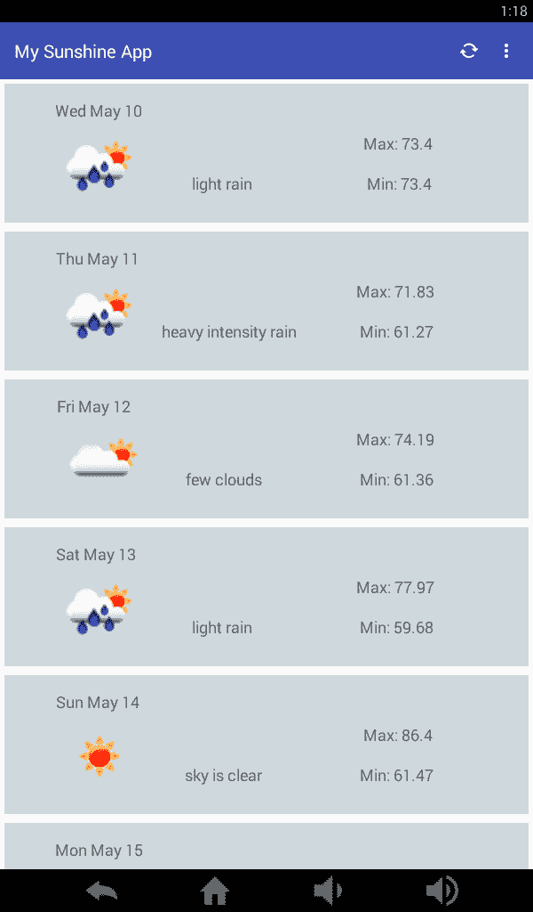

# Android 数据绑定

> 原文：<https://dev.to/subbramanil/android-data-binding>

# 安卓数据绑定

在这一系列的博客中，我将记下我从学习“ [Android 基础:数据绑定](https://app.pluralsight.com/library/courses/android-data-binding/)”课程和其他网络资源的心得。

> **免责声明:**这些是我在“PluralSight”课程中的笔记，我无意复制受版权保护的内容。

## 传统方法

有多少 android 开发人员厌倦了编写如下代码，

```
View view = inflater.inflate(R.layout.network_config_layout, parent, false);
EditText ipEditTxtView = (EditText) view.findViewById(R.id.nw_config_ip_address_value);
ipEditTxtView.setText(nwConfig.getIpAddress());

Button saveNWConfigBtn = (Button) view.findViewById(R.id.save_nw_config);
saveNWConfigBtn.setOnClickListener(this); 
```

基本上，传统视图绑定的步骤是，

1.  膨胀 XML
2.  从 XML 中找到所需的元素
3.  将其赋给一个局部/成员变量
4.  从数据中获取价值
5.  分配值或分配事件侦听器

上面的数据绑定过程没有任何错误，但是一段时间后人们会厌倦编写这些代码。

> 如果有人好奇，在 **Android Studio** 中有一个著名的 *live 模板*可以编写从视图中找到元素的行。
> 
> 1.  输入`fbc`
> 2.  按 **Command + Space** (Mac)或 **Ctrl + Space** (Windows)
> 3.  Android Studio 将自动完成该行，如`() findViewById(R.id.);`

## 查看绑定库

作者提供了许多视图绑定库的替代方案。

1.  机器人绑定
2.  [黄油刀](https://github.com/JakeWharton/butterknife)
3.  [机器人注释](https://androidannotations.org)

我以前用过 ButterKnife，我发现它非常容易使用。我不想进入这些库的实现细节，因为这个博客的目的是关于谷歌的 *Android 数据绑定*库。

## 数据绑定库流程

这里涉及的步骤是，

1.  从布局创建绑定类
2.  检索数据
3.  将数据绑定到视图

万能的 *gradle 插件*帮助从视图创建绑定类。

1.  分析布局文件
2.  创建绑定类文件
3.  在类文件中创建绑定方法

> **注意:**使用最新版本的 Android Studio，并确保从 SDK Manager 下载 Android 支持库。
> 
> 写这篇博客的时候，我正在使用 2017 年 4 月 1 日发布的 Android Studio 2.3.1，并且已经下载了所有的支持库。

为了这个课程，我重新使用了我的一个旧项目，从[**Android Nano Degree**](https://www.udacity.com/course/android-developer-nanodegree-by-google--nd801)。这个应用程序是一个简单的天气应用程序，显示给定位置和温度单位的一周天气预报。我使用*回收器视图*显示一周的天气预报， *AsyncTask* 向 [OpenWeatherMap API](https://openweathermap.org) 和 [Picasso](http://square.github.io/picasso/) 图像加载库发出服务请求，以加载天气图标。

可以在这里找到截图:
[](https://res.cloudinary.com/practicaldev/image/fetch/s--vlMiPTg2--/c_limit%2Cf_auto%2Cfl_progressive%2Cq_auto%2Cw_880/https://s3-us-west-2.amazonaws.com/my-blogresources/weather_app_screenshot.png)

> 有用链接:[安卓数据绑定](https://developer.android.com/topic/libraries/data-binding/index.html)

Google 简化了将数据绑定支持集成到 Android 应用程序中。在 app level *build.gradle* 文件中，我添加了一个块来启用数据绑定。

```
android {
    ...
    ...
    dataBinding {
            enabled = true
    }
} 
```

现在，应用程序已经准备好进行一些“数据绑定”了。接下来，我在回收器视图中更新了天气项目的布局文件，如下所示。

1.  用`<layout>`和`</layout>`标签封闭现有布局。
2.  创建了一个带有一个`<variable>`的`<data>`元素来保存该行的天气数据。

```
<?xml version="1.0" encoding="utf-8"?>
<layout>

    <data>

        <variable
            name="dataBindingItem"
            type="com.udacity.learning.mysunshineapp.model.WeatherData" />
    </data>

    <android.support.constraint.ConstraintLayout xmlns:android="http://schemas.android.com/apk/res/android"
        xmlns:app="http://schemas.android.com/apk/res-auto"
        android:id="@+id/list_item_card"
        android:layout_width="match_parent"
        android:layout_height="wrap_content"
        android:layout_margin="@dimen/margin_5dp"
        android:background="@color/cardview_background"
        android:padding="@dimen/_10dp">

        <TextView
            android:id="@+id/list_item_date_textview"
            android:layout_width="wrap_content"
            android:layout_height="wrap_content"
            android:minHeight="?android:attr/listPreferredItemHeight"
            android:text="@{dataBindingItem.dt}"
            android:textSize="18sp"
            app:layout_constraintBottom_toBottomOf="parent"
            app:layout_constraintHorizontal_bias="0.10"
            app:layout_constraintLeft_toLeftOf="parent"
            app:layout_constraintRight_toRightOf="parent"
            app:layout_constraintTop_toTopOf="parent"
            app:layout_constraintVertical_bias="0.1" />

        <ImageView
            android:id="@+id/list_item_weather_imageview"
            android:layout_width="100dp"
            android:layout_height="100dp"
            app:imageUrl="@{dataBindingItem.weatherIconURL}"
            app:layout_constraintBottom_toBottomOf="parent"
            app:layout_constraintHorizontal_bias="0.10"
            app:layout_constraintLeft_toLeftOf="parent"
            app:layout_constraintRight_toRightOf="parent"
            app:layout_constraintTop_toTopOf="@id/list_item_date_textview"
            app:layout_constraintVertical_bias="0.90" />

        <TextView
            android:id="@+id/list_item_weather_desc_textview"
            android:layout_width="wrap_content"
            android:layout_height="wrap_content"
            android:text="@{dataBindingItem.weather.get(0).description}"
            android:textSize="18sp"
            app:layout_constraintBottom_toBottomOf="parent"
            app:layout_constraintHorizontal_bias="0.40"
            app:layout_constraintLeft_toLeftOf="parent"
            app:layout_constraintRight_toRightOf="parent"
            app:layout_constraintTop_toBottomOf="@+id/list_item_date_textview"
            app:layout_constraintTop_toTopOf="parent"
            app:layout_constraintVertical_bias="0.80" />

        <TextView
            android:id="@+id/list_item_max_temp_textview"
            android:layout_width="wrap_content"
            android:layout_height="wrap_content"
            android:text="@{dataBindingItem.temp.max}"
            android:textSize="18sp"
            app:layout_constraintBottom_toBottomOf="parent"
            app:layout_constraintHorizontal_bias="0.80"
            app:layout_constraintLeft_toLeftOf="parent"
            app:layout_constraintRight_toRightOf="parent"
            app:layout_constraintTop_toTopOf="parent"
            app:layout_constraintVertical_bias="0.40" />

        <TextView
            android:id="@+id/list_item_min_temp_textview"
            android:layout_width="wrap_content"
            android:layout_height="wrap_content"
            android:text="@{dataBindingItem.temp.min}"
            android:textSize="18sp"
            app:layout_constraintBottom_toBottomOf="parent"
            app:layout_constraintHorizontal_bias="0.80"
            app:layout_constraintLeft_toLeftOf="parent"
            app:layout_constraintRight_toRightOf="parent"
            app:layout_constraintTop_toBottomOf="@+id/list_item_max_temp_textview"
            app:layout_constraintTop_toTopOf="parent"
            app:layout_constraintVertical_bias="0.80" />

    </android.support.constraint.ConstraintLayout>
</layout> 
```

`variable`的`name`属性用于将数据称为`android:text="@{dataBindingItem.dt}"`。数据绑定库寻找，

1.  名为 *'getDt()'* 的公共方法返回一个字符串
2.  名为 *'dt()'* 的公共方法返回一个字符串
3.  字符串类型的名为*‘dt’*的公共成员变量

将数据与文本字段相关联。

类型引用 POJO 数据模型类`WeatherData`如下。

```
public class WeatherData extends BaseObservable implements Parcelable {

    @Bindable
    private String dt;
    @Bindable
    private String pressure;
    @Bindable
    private String humidity;
    @Bindable
    private String speed;
    @Bindable
    private String clouds;
    @Bindable
    private TemperatureData temp;
    @Bindable
    private ArrayList<WeatherDesc> weather;
    @Bindable
    private String weatherIconURL;

    ....
} 
```

请注意，这些变量用`@Bindable`注释进行了注释。并且`WeatherData`类有针对*私有*变量的公共 getters 和 setters。

> 注意:看看 xml 文件中数据绑定支持的强大功能。例如，在这一行`android:text="@{dataBindingItem.weather.get(0).description}"`中，我可以访问天气列表的首次描述。

下一步是更新我用于*回收视图*的*适配器*，如下所示。

1.  更新相关联的*取景框*

```
class ForecastViewHolder extends RecyclerView.ViewHolder {
    private final ViewDataBinding itemBinding;

    ForecastViewHolder(ViewDataBinding binding) {
        super(binding.getRoot());
        this.itemBinding = binding;
    }

    void bind(WeatherData data) {
        itemBinding.setVariable(BR.dataBindingItem, data);
    }
} 
```

1.  更新回收器适配器的 *onCreateViewHolder* 和 *onBindViewHolder* 方法

```
public class ForecastDataAdapter extends RecyclerView.Adapter<ForecastDataAdapter.ForecastViewHolder> {

    ...

    @Override
    public ForecastViewHolder onCreateViewHolder(ViewGroup parent, int viewType) {
        ViewDataBinding mForecastItemBinding = DataBindingUtil.inflate(inflater, R.layout.list_item_forecast_constraint, parent, false);
        return new ForecastViewHolder(mForecastItemBinding);
    }

    @Override
    public void onBindViewHolder(ForecastViewHolder holder, int position) {
        WeatherData data = weatherData.get(position);
        holder.bind(data);
    }

    ...
} 
```

这里有几点需要注意:

1.  `private final ViewDataBinding itemBinding;`中的*视图数据绑定*

```
- ViewDataBinding is the base class for generated data binding classes 
```

1.  *BR`itemBinding.setVariable(BR.dataBindingItem, data);`中的*是什么

```
- BR is BindingResource that is generated by Gradle as similar to *R* classes in android. 
```

1.  *中的*是什么

```
- *DataBindingUtil* is a Utility class that data binding support adds to help with inflating the view and create binding class. This line inflates the view and also binds the view. 
```

> **注意:**创建绑定类有几种方法，(使用活动，片段等。,).

当我试着运行这个应用程序时，我遇到了一些关于、`private TemperatureData temp`和`private ArrayList<WeatherDesc> weather`的编译问题，而且它没有创建`BR`文件。有一段时间，我不明白错误，并试图清理项目。我希望这样可以解决问题并创建绑定资源文件。然而，在正确地阅读了错误并查看了错误文件后，我意识到，`TemperatureData`和`WeatherDesc`类也需要适合数据绑定。我修改了这些类，如下所示，

```
public class TemperatureData extends BaseObservable {

    @Bindable
    private String day;
    @Bindable
    private String night;
    @Bindable
    private String morn;
    @Bindable
    private String eve;
    @Bindable
    private String max;
    @Bindable
    private String min;

    ...
} 
```

在做了上面的修改后，我可以运行这个应用程序而不会崩溃。

在从[这里](https://android.jlelse.eu/loading-images-with-data-binding-and-picasso-555dad683fdc)的文章之后，我用`Picasso`加载图片后做了一些改动，这样解释起来更好。我不想在这里邀功或重复努力。

这是一个简单的实现，我还在学习。我希望写更多，可能就像一系列关于数据绑定的博客，因为我学习和尝试不同的东西。