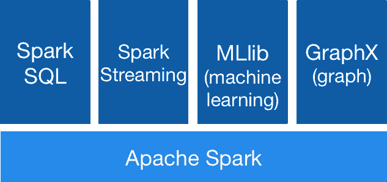
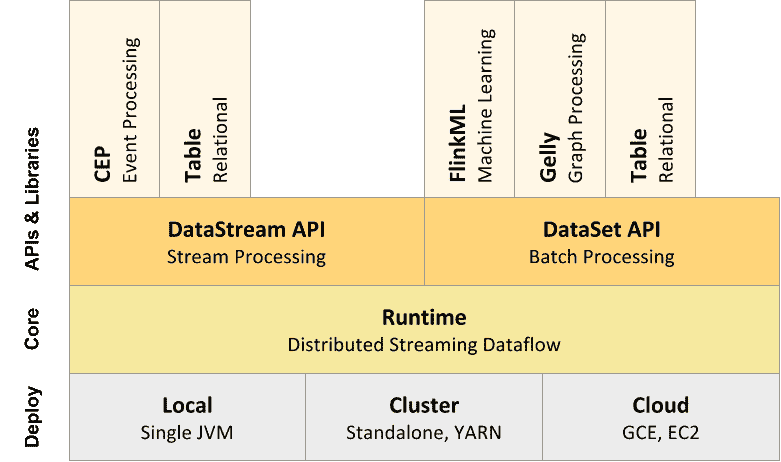

# 阿帕奇火花 vs 阿帕奇弗林克

> 原文：<https://dev.to/mushketyk/apache-spark-vs-apache-flink-co9>

如果你看一下[这张图片](http://mattturck.com/wp-content/uploads/2017/05/Matt-Turck-FirstMark-2017-Big-Data-Landscape.png)和一系列大数据工具，你会发现这个领域所有可能的利基市场都已经被占据了。面对如此激烈的竞争，想出一项突破性的技术应该是非常困难的。

Apache Flink 的创建者对此有不同的想法。它始于一个名为[平流层](http://stratosphere.eu/)的研究项目。平流层是分叉的，这个分叉就是我们所知道的阿帕奇弗林克。2014 年，它被接受为 Apache 孵化器项目，仅仅几个月后，它就成为了 Apache 的顶级项目。在撰写本文时，该项目已经有将近 12000 个提交和 300 多个贡献者。

为什么会有这么多关注？这是因为 Apache Flink 被称为新一代大数据处理框架，并有足够的创新来取代 Apache Spark，成为批处理和流处理的新的事实上的工具。

该不该换阿帕奇 Flink？你应该暂时继续使用 Apache Spark 吗？还是阿帕奇 Flink 只是一个新的噱头？这篇文章将试图给你这些和其他问题的答案。

# 阿帕奇火花是旧闻

除非你在过去几年里一直生活在岩石下，否则你一定听说过 Apache Spark。看起来每一个进行数据处理的现代系统都在以某种方式使用 Apache Spark。

[T2】](https://res.cloudinary.com/practicaldev/image/fetch/s--5Aptt5Qc--/c_limit%2Cf_auto%2Cfl_progressive%2Cq_auto%2Cw_880/https://spark.apache.oimg/spark-stack.png)

在很长一段时间里，Spark 是这一领域最新、最棒的工具。与前代产品相比，它提供了一些令人印象深刻的功能，例如:

*   令人印象深刻的速度——如果在磁盘上处理数据，它比 Hadoop 快 10 倍，如果在内存中处理数据，它比 Hadoop 快 100 倍。
*   更简单的有向无环图模型 Spark 允许定义可以实现复杂数据处理算法的任务图，而不是使用僵化的 MapReduce 框架来定义数据处理作业
*   流处理——随着物联网等新技术的出现，仅仅处理大量数据是不够的。现在我们需要实时处理大量的数据。这就是为什么 Apache Spark 引入了流处理，允许处理潜在的无限数据流。
*   丰富的库集——除了其核心特性之外，Apache Spark 还为机器学习、图形处理和执行 SQL 查询提供了强大的库。

为了更好地了解如何使用 Apache Spark 编写应用程序，让我们来看看如何实现一个简单的字数统计应用程序，该应用程序可以统计每个单词在文本文档中的使用次数:

```
// Read file val file = sc.textFile("file/path")
val wordCount = file
  // Extract words from every line
  .flatMap(line => line.split(" "))
  // Convert words to pairs
  .map(word => (word, 1))
  // Count how many times each word was used
  .reduceByKey(_ + _) 
```

如果你了解 Scala，这段代码应该看起来很简单，类似于处理常规集合。首先，我们从位于“文件/路径”的文件中读取一系列行。该文件可以是本地文件，也可以是 HDFS 或 S3 的文件。

然后每一行都被拆分成一个单词列表，使用的是简单地用空格符号拆分一个字符串的`flatMap`方法。然后，为了实现单词计数，我们使用`map`方法将每个单词转换成一对，其中该对的第一个元素是输入文本中的一个单词，第二个元素只是一个数字 1。

然后，最后一步简单地计算每个单词被使用的次数，方法是将同一单词所有配对的数字相加。

Apache Spark 似乎是一个很棒的多功能工具。但是 Apache Flink 带来了什么呢？

# 新出炉的小子

乍一看，似乎没有太多不同。架构图看起来非常相似:

[T2】](https://res.cloudinary.com/practicaldev/image/fetch/s--eDznINO4--/c_limit%2Cf_auto%2Cfl_progressive%2Cq_auto%2Cw_880/https://ci.apache.org/projects/flink/flink-docs-release-1.0/fig/stack.png)

如果您看一下 Apache Flink 字数统计应用程序的代码示例，您会发现几乎没有区别:

```
val file = env.readTextFile("file/path")
val counts = file
  .flatMap(line => line.split(" "))
  .map(word => (word, 1))
  .groupBy(0)
  .sum(1) 
```

几个值得注意的区别是，在这种情况下我们需要使用`readTextFile`方法而不是`textFile`方法，并且我们需要使用一对方法:`groupBy`和`sum`而不是`reduceByKey`。

那么，有什么大惊小怪的呢？Apache Flink 可能在外观上没有任何明显的差异，但它绝对有足够的创新，成为下一代数据处理工具。以下只是其中的一部分:

*   实现实际的流处理——当您在 Apache Spark 中处理一个流时，它会将其视为许多小批量问题，因此流处理是一个特例。相反，Apache Flink 将批处理作为一种特殊处理，不使用微批处理。
*   更好地支持循环和迭代处理——Flink 提供了一些额外的操作，允许在您的流应用程序和需要对批处理数据执行多次迭代的算法中实现循环。
*   定制内存管理——Apache Flink 是一个 Java 应用程序，但它并不完全依赖于 JVM 垃圾收集器。它实现了自定义内存管理器，以字节数组的形式存储要处理的数据。这可以减少垃圾收集器的负载并提高性能。你可以在这篇[博客文章](https://flink.apache.org/news/2015/05/11/Juggling-with-Bits-and-Bytes.html)中读到。
*   更低的延迟和更高的吞吐量——第三方进行的多项测试[表明](https://jobs.zalando.com/tech/blog/apache-showdown-flink-vs.-spark/?gh_src=4n3gxh1)Apache Flink 比其竞争对手具有更低的延迟和更高的吞吐量。
*   强大的 windows 操作符——当你需要处理一个数据流时，在大多数情况下，你需要将一个函数应用于流中的有限元素组。例如，您可能需要计算您的应用程序在每五分钟的时间间隔内收到了多少点击，或者您可能想要知道在每十分钟的时间间隔内 Twitter 上最受欢迎的 tweet 是什么。虽然 Spark 支持其中一些用例，但 Apache Flink 为流处理提供了一组更强大的操作符。
*   实现轻量级分布式快照——这允许 Apache Flink 在流处理中提供低开销和一次性处理保证，而不像 Spark 那样使用微批处理。

# 选择什么

那么，你正在做一个新项目，你需要为它挑选一个软件？应该用什么？火花？弗林克？

当然，这里没有对错之分。如果你需要做复杂的流处理，那么我会推荐使用 Apache Flink。它对流处理有更好的支持，并且有一些显著的改进。

如果您不需要最前沿的流处理特性，并且希望保持安全，那么坚持使用 Apache Spark 可能会更好。这是一个更成熟的项目，它有更大的用户群、更多的培训材料和更多的第三方库。但是请记住，Apache Flink 正在缩小这一差距。随着 Apache Flink 成为一个更加成熟的项目，越来越多的项目选择了它。

另一方面，如果你喜欢尝试最新的技术，你肯定需要试试 Apache Flink。

这是否意味着 Apache Spark 已经过时，几年后我们都将使用 Apache Flink？答案可能会让你大吃一惊。虽然 Flink 有一些令人印象深刻的功能，但 Spark 并没有一成不变。例如，随着 project [Tungsten](https://databricks.com/blog/2015/04/28/project-tungsten-bringing-spark-closer-to-bare-metal.html) 的发布，Apache Spark 在 2015 年引入了自定义内存管理，从那以后，它一直在添加由 Apache Flink 首先引入的功能。获胜者还没有决定。

# 更多信息

在接下来的博客文章中，我将写更多关于如何使用 Apache Flink 进行批处理和流处理的内容，敬请关注！

如果你想了解更多关于 Apache Flink 的知识，可以看看我的 Pluralsight 课程，在这个课程中我会更详细地介绍 Apache Flink:[了解 Apache Flink](http://bit.ly/understanding-flink) 。下面是本课程的[短片预告](http://bit.ly/understanding-flink-preview)。

这篇文章最初发表在[酿造代码](https://brewing.codes/2017/09/25/flink-vs-spark/)博客上。