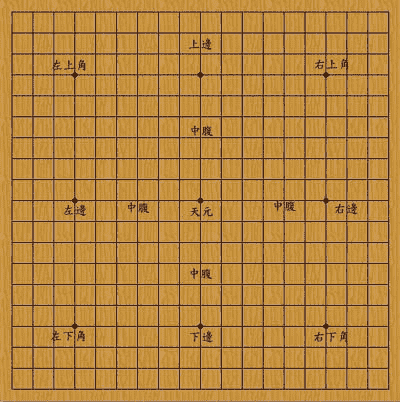

# 电脑比人脑快吗？

> 原文：<https://dev.to/andrewlucker/are-computers-faster-than-the-human-brain>

嗯，这取决于你测量的是什么…

那里[去过](https://www.scientificamerican.com/article/computers-vs-brains/) [许多](http://bgr.com/2016/02/27/power-of-the-human-brain-vs-super-computer/) [尝试](https://www.forbes.com/sites/quora/2016/03/02/how-powerful-is-the-human-brain-compared-to-a-computer/#658e7d86628e)去量化到底是大脑还是机器更快的问题，然而结果是风马牛不相及的。要真正交流差异，需要有一些我们可以比较的共性。有几种方法可以测试处理速度，让我们开始吧。

首先，我们可以看看对人类不公平的东西:算术。一个好的五年级学生应该能够以每秒钟一个答案的速度回答加减乘法表。一台 1GHz 的电脑，就像你的旧手机一样，每秒可以处理十亿次。所以很明显意识算术不是我们的强项。

然而，让我们把这个数字翻过来:在我们的潜意识视觉皮层中，我们的大脑每秒钟进行多少次操作？如果你想象一个 3D 图形并旋转、缩放或变换它，你会发现这并不难，而且这一切都是实时发生的。人类想象力的图形处理单元仍然让高端计算机 GPU 自惭形秽。这很奇怪，在视觉皮层的每个叶上只有[~ 1 . 4 亿个神经元](https://en.wikipedia.org/wiki/Visual_cortex)，然而在最新的处理器上有超过[300 亿个晶体管](https://en.wikipedia.org/wiki/Transistor_count)。显然，我们的大脑在这种处理上更有效率，但是不关注软件而比较硬件公平吗？

因此，我们看到，人类实际上是在过时的硬件上运行，但我们在这方面更有效率。另一方面，今天的计算机是很糟糕的机器，但是软件/硬件的组合效率很低，速度很慢。结果是，在我们已经适应的领域，人类仍然拥有显著的处理优势。对于其他游戏来说，我们不是天生的，我们是对手。对于所有具有历史意义的确定性游戏来说，人类玩游戏的熟练程度要比现代人工智能低几个数量级。

[T2】](https://res.cloudinary.com/practicaldev/image/fetch/s--DU8fGb8s--/c_limit%2Cf_auto%2Cfl_progressive%2Cq_auto%2Cw_880/https://cdn-images-1.medium.com/max/400/1%2A0A72T-1-CFRhDE5I-8pmPQ.png)